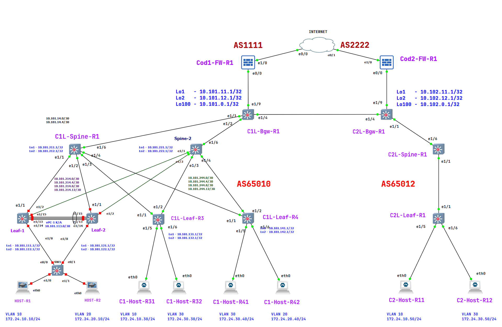

# Project

## VxLAN, Inter-site Routing

(Механошин Алексей и Подлеснов Александр)

---

Схема подключения опорной сети осталась прежняя, как в LAB-3 на IS-IS протоколе,
но добавлен второй сайт и пара файрволов с каждой стороны.



Лифы Leaf-1/2 и C1L-Leaf-R4 выключены, для экономии ресурсов, - на них ранее были отработаны техники vPC и локального route-leaking

<details>
 <summary>План адрессного пространства</summary>

Общая сеть для всех ЦОД-ов (для трех): ```10.100.0.0/14```

- (Диапазон хостов 10.100.0.1 - 10.103.255.254 )

1) Сеть 10.100.0.0/16 Оставим в резерве.
2) Для первого ЦОД-а суммарное: ```10.101.0.0/16``` ( 10.101.0.1 - 10.101.255.254 )
3) Для второго ЦОД-а суммарное: ```10.102.0.0/16``` ( 10.102.0.1 - 10.102.255.254 )

Таким образом план нумерации будет следуюший

IP = 10.10**D**.**S**xy.**M**zz

Где:

- D = номер ЦОД-а
- S = номер leaf/spine (**1** - leaf, **2**- spine)
- Mzz - значения по порядку

В ```x``` третьего октета кодируем номер Leaf или Spine

- с **1** по **5**
- 0 - для Border Leaf

В ```y``` третьего октета кодируем:

- 1 - Loopback 1 для UNDERLAY
- 2 - Loopback 2 для OVERLAY
- 3 - резерв, напрмер дял vPC keep-alive
- 4 - p2p линк
- 5 - сервисы

Loopack-s:

- ```10.101.111.1/32``` - ЦОД-1, Leaf-1,  Loopack - 1
- ```10.101.112.1/32``` - ЦОД-1, Leaf-1,  Loopack - 2
- ```10.101.121.1/32``` - ЦОД-1, Leaf-2,  Loopack - 1
- ```10.101.122.1/32``` - ЦОД-1, Leaf-2,  Loopack - 2
- ```10.101.131.1/32``` - ЦОД-1, Leaf-3,  Loopack - 1
- ```10.101.132.1/32``` - ЦОД-1, Leaf-3,  Loopack - 2
- ```10.101.141.1/32``` - ЦОД-1, Leaf-4,  Loopack - 1
- ```10.101.142.1/32``` - ЦОД-1, Leaf-4,  Loopack - 2
- ```10.101.211.1/32``` - ЦОД-1, Spine-1, Loopack - 1
- ```10.101.212.1/32``` - ЦОД-1, Spine-1, Loopack - 2
- ```10.101.221.1/32``` - ЦОД-1, Spine-2, Loopack - 1
- ```10.101.222.1/32``` - ЦОД-1, Spine-2, Loopack - 2

Border Leaf Loopacks:

- ```10.101.11.1``` - ЦОД-1, BRD-Leaf-1 Loopack-1
- ```10.101.12.1``` - ЦОД-1, BRD-Leaf-1 Loopack-2
- ```10.101.21.1``` - ЦОД-1, BRD-Leaf-2 Loopack-1
- ```10.101.22.1``` - ЦОД-1, BRD-Leaf-2 Loopack-2

Примеры сетей для vPC:

- ```10.101.113.0/30``` - vPC ЦОД-1, Leaf-1 to Leaf-2 (10.101.113.1 - 10.101.113.2)
- ```10.101.133.0/30``` - vPC ЦОД-1, Leaf-3 to Leaf-4 (10.101.133.1 - 10.101.133.2)

Cети P2P пиров, как и нумерация в октете идёт со стороны Spine:

- ```10.101.214.0/30``` - сеть в ЦОД-1, Spine-1 до Leaf-1 (10.101.214.1  - 10.101.214.2)
- ```10.101.214.4/30``` - сеть в ЦОД-1, Spine-1 до Leaf-2 (10.101.214.5  - 10.101.214.6)
- ```10.101.214.8/30``` - сеть в ЦОД-1, Spine-1 до Leaf-3 (10.101.214.9  - 10.101.214.10)
- ```10.101.214.12/30```- сеть в ЦОД-1, Spine-1 до Leaf-4 (10.101.214.13 - 10.101.214.14)
- ```10.101.224.0/30``` - сеть в ЦОД-1, Spine-2 до Leaf-1 (10.101.224.1  - 10.101.224.2)
- ```10.101.224.4/30``` - сеть в ЦОД-1, Spine-2 до Leaf-2 (10.101.224.5  - 10.101.224.6)
- ```10.101.224.8/30``` - сеть в ЦОД-1, Spine-2 до Leaf-3 (10.101.224.9  - 10.101.224.10)
- ```10.101.224.12/30```- сеть в ЦОД-1, Spine-2 до Leaf-4 (10.101.224.13 - 10.101.224.14)

Или в обратную сторону:

- ```10.101.214.0/30``` - сеть в ЦОД-1, Leaf-1 до Spine-1
- ```10.101.224.0/30``` - сеть в ЦОД-1, Leaf-1 до Spine-2
- ```10.101.214.4/30``` - сеть в ЦОД-1, Leaf-2 до Spine-1
- ```10.101.224.4/30``` - сеть в ЦОД-1, Leaf-2 до Spine-2
- ```10.101.214.8/30``` - сеть в ЦОД-1, Leaf-3 до Spine-1
- ```10.101.224.8/30``` - сеть в ЦОД-1, Leaf-3 до Spine-2
- ```10.101.214.12/30```- сеть в ЦОД-1, Leaf-4 до Spine-1
- ```10.101.224.12/30```- сеть в ЦОД-1, Leaf-4 до Spine-2

---
Сети BRD Leaf-Spine:

- ```10.101.14.0/30```  - сеть в ЦОД-1, Spine-1 до BRD-Leaf-1 (10.101.14.1 - 10.101.14.2)
- ```10.101.14.4/30```  - сеть в ЦОД-1, Spine-1 до BRD-Leaf-2 (10.101.14.5 - 10.101.14.6)
- ```10.101.24.0/30```  - сеть в ЦОД-1, Spine-2 до BRD-Leaf-1 (10.101.24.1 - 10.101.24.2)
- ```10.101.24.4/30```  - сеть в ЦОД-1, Spine-2 до BRD-Leaf-2 (10.101.24.5 - 10.101.24.6)

IP установлены следующим образом

Leaf-R1# sh ip int br

```text
Interface            IP Address
Lo1                  10.101.111.1
Lo2                  10.101.112.1
Eth1/1               10.101.214.2
Eth1/2               10.101.224.2
Eth1/15              10.101.113.1
```

Leaf-R2# sh ip int br

```text
Interface            IP Address
Lo1                  10.101.121.1
Lo2                  10.101.122.1
Eth1/1               10.101.214.6
Eth1/2               10.101.224.6
Eth1/15              10.101.113.2
```

Leaf-R3# sh ip int br

```text
Interface            IP Address
Lo1                  10.101.131.1
Lo2                  10.101.132.1
Eth1/1               10.101.214.10
Eth1/2               10.101.224.10
Eth1/15              10.101.133.1
```

Leaf-R4# sh ip int br

```text
Interface            IP Address
Lo1                  10.101.141.1
Lo2                  10.101.142.1
Eth1/1               10.101.214.14
Eth1/2               10.101.224.14
Eth1/15              10.101.133.2
```

Spine-R1# sh ip int br

```text
Interface            IP Address
Lo1                  10.101.211.1
Lo2                  10.101.212.1
Eth1/1               10.101.214.1
Eth1/2               10.101.214.5
Eth1/3               10.101.214.9
Eth1/4               10.101.214.13
Eth1/6               10.101.14.1
Eth1/7               10.101.14.5
```

Spine-R2# sh ip int br

```text
Interface            IP Address
Lo1                  10.101.221.1
Lo2                  10.101.222.1
Eth1/1               10.101.224.1
Eth1/2               10.101.224.5
Eth1/3               10.101.224.9
Eth1/4               10.101.224.13
Eth1/6               10.101.24.1
Eth1/7               10.101.24.5
```

BRF-Leaf-R1# sh ip int br

```text
Interface            IP Address
Lo1                  10.101.11.1
Lo2                  10.101.12.1
Eth1/1               10.101.14.2
Eth1/2               10.101.24.2
```

BRD-Leaf-R2# sh ip int br

```text
Interface            IP Address
Lo1                  10.101.21.1
Lo2                  10.101.22.1
Eth1/1               10.101.14.6
Eth1/2               10.101.24.6
```

</details>

Основные понятия:

1. Netwotk Virtualization Overlay (NVO) - оверлейная сеть
2. VXLAN Tunnel End Point (VTEP) - само устройство которое занимается инкапсуляцией/декапсуляцией VxLAN фреймов
3. Network Virtualization Edge (NVE) - туннельный интерфейс инкапсуляцией/декапсуляцией VxLAN фреймов.
 Можно сравнить в транком до сотальных VTEP-ов, или как GRE туннель.
4. Virtual Network Identifier (VNI) - метка VxLAN инкапсуляции, определяющая Layer-2 домен в оверлейной сети.
 Должна быть одинакова на всех VTEP-ах куда нам необходимо соеденить наш L2 домен.
5. MAC-VRF - воспринимаем как EVPN-instanc, как VLAN примапленный к NVI и учавствующий в VxLAN инкапсуляции/декапсуляции.
 (Можно представить типа как "L2-роутинг" между VTEP-ами).
 В Общем сколько у нас будет VLAN-ов с VNI - столько у нас будет и MAC-VRF-ов,
 поскольку у каждого MAC-VRF будет свой Route-Target (RT) и свой Route Destingisher (RD) - типа L2-VRF такие.
6. IP-VRF - Обычный L3 VRF, который и собирает в себе MAC-VRF-ы

---

### Проект: Модернизация ядра сети ЦОД с переходом на VXLAN

Задачи:

1. Разместите двух "клиентов" в разных VRF в рамках одной фабрики.
2. Настроите маршрутизацию между клиентами через внешнее устройство (граничный роутер\фаерволл\etc)


---

Полные настройки коммутаторов:

<details>
<summary>Leaf-1</summary>

```text
Leaf-R1# sh run


!Command: show running-config
!Running configuration last done at: Thu Jan 30 13:35:36 2025
!Time: Thu Jan 30 16:21:07 2025

version 9.3(8) Bios:version  
hostname Leaf-R1
vdc Leaf-R1 id 1
  limit-resource vlan minimum 16 maximum 4094
  limit-resource vrf minimum 2 maximum 4096
  limit-resource port-channel minimum 0 maximum 511
  limit-resource u4route-mem minimum 248 maximum 248
  limit-resource u6route-mem minimum 96 maximum 96
  limit-resource m4route-mem minimum 58 maximum 58
  limit-resource m6route-mem minimum 8 maximum 8

cfs eth distribute
nv overlay evpn
feature bgp
feature isis
feature fabric forwarding
feature interface-vlan
feature vn-segment-vlan-based
feature lacp
feature vpc
feature bfd
clock timezone PRM 5 0
feature nv overlay

no password strength-check
username admin password 5 $5$HIMIJM$qT5AXQEfCx.kdpdUF8dRHjlsjyL3TdgR9BhmK9uAYx7  role network-admin
no ip domain-lookup
copp profile strict
snmp-server user admin auth md5 0153448F0CDEAA7AC3D8A6E1207E29746751 priv 204F64F031BBA129B39DABB42F633F6C6872 localizedV2key engineID 128:0:0:9:3:12:159:0:0:27:1
rmon event 1 log trap public description FATAL(1) owner PMON@FATAL
rmon event 2 log trap public description CRITICAL(2) owner PMON@CRITICAL
rmon event 3 log trap public description ERROR(3) owner PMON@ERROR
rmon event 4 log trap public description WARNING(4) owner PMON@WARNING
rmon event 5 log trap public description INFORMATION(5) owner PMON@INFO

fabric forwarding anycast-gateway-mac 0001.0001.0001
vlan 1,10,20,1010
vlan 10
  name EndPoint-1
  vn-segment 10000010
vlan 20
  vn-segment 10000020
vlan 1010
  vn-segment 51010

spanning-tree vlan 1-3967 priority 4096
key chain ISIS
  key 1
    key-string 7 070c285f4d064b0916100a
vrf context LABA
  vni 51010
  rd auto
  address-family ipv4 unicast
    route-target both auto
    route-target both auto evpn
vrf context VRF_VPC-KEEPALIVE
  address-family ipv4 unicast
vrf context management
hardware access-list tcam region racl 256
hardware access-list tcam region e-racl 0
hardware access-list tcam region arp-ether 256
vpc domain 1
  peer-switch
  role priority 1000
  peer-keepalive destination 10.101.113.2 source 10.101.113.1 vrf VRF_VPC-KEEPALIVE
  auto-recovery
  ip arp synchronize


interface Vlan1

interface Vlan10
  no shutdown
  vrf member LABA
  ip address 172.24.10.1/24
  fabric forwarding mode anycast-gateway

interface Vlan20
  no shutdown
  vrf member LABA
  ip address 172.24.20.1/24
  fabric forwarding mode anycast-gateway

interface Vlan1010
  no shutdown
  vrf member LABA
  ip forward

interface port-channel15
  description *** SW-1 ***
  switchport mode trunk
  switchport access vlan 10
  switchport trunk allowed vlan 10,20
  speed 1000
  vpc 15

interface port-channel100
  description *** VPC PEER LINKS ***
  switchport mode trunk
  spanning-tree port type network
  vpc peer-link

interface nve1
  no shutdown
  host-reachability protocol bgp
  source-interface loopback2
  member vni 51010 associate-vrf
  member vni 10000010
    ingress-replication protocol bgp
  member vni 10000020
    ingress-replication protocol bgp

interface Ethernet1/1
  description to_spine_1
  no switchport
  bfd interval 999 min_rx 999 multiplier 3
  bfd authentication Keyed-SHA1 key-id 1 hex-key 636973636F326C616261
  no ip redirects
  ip address 10.101.214.2/30
  no ipv6 redirects
  isis metric 100 level-1
  isis metric 100 level-2
  isis network point-to-point
  ip router isis UNDERLAY
  no isis passive-interface level-1-2
  isis bfd disable
  no shutdown

interface Ethernet1/2
  description to_spine_2
  no switchport
  no ip redirects
  ip address 10.101.224.2/30
  no ipv6 redirects
  isis metric 100 level-1
  isis metric 100 level-2
  isis network point-to-point
  ip router isis UNDERLAY
  no isis passive-interface level-1-2
  no shutdown

interface Ethernet1/3
  shutdown

interface Ethernet1/4
  shutdown

interface Ethernet1/5
  shutdown

interface Ethernet1/6
  shutdown

interface Ethernet1/7
  shutdown

interface Ethernet1/8
  description *** SW-1 ***
  switchport mode trunk
  switchport access vlan 10
  switchport trunk allowed vlan 10,20
  speed 1000
  channel-group 15

interface Ethernet1/9
  shutdown

interface Ethernet1/10
  shutdown

interface Ethernet1/11
  shutdown

interface Ethernet1/12
  shutdown

interface Ethernet1/13
  description *** VPC PEER LINKS ***
  switchport mode trunk
  channel-group 100 mode active

interface Ethernet1/14
  description *** VPC PEER LINKS ***
  switchport mode trunk
  channel-group 100 mode active

interface Ethernet1/15
  description vPC K/A to_leaf-2
  no switchport
  vrf member VRF_VPC-KEEPALIVE
  ip address 10.101.113.1/30
  no shutdown

interface Ethernet1/16

interface Ethernet1/17

interface Ethernet1/18

interface Ethernet1/19

interface Ethernet1/20

interface Ethernet1/21

interface Ethernet1/22

interface Ethernet1/23

interface Ethernet1/24

interface Ethernet1/25

interface Ethernet1/26

interface Ethernet1/27

interface Ethernet1/28

interface Ethernet1/29

interface Ethernet1/30

interface Ethernet1/31

interface Ethernet1/32

interface Ethernet1/33

interface Ethernet1/34

interface Ethernet1/35

interface Ethernet1/36

interface Ethernet1/37

interface Ethernet1/38

interface Ethernet1/39

interface Ethernet1/40

interface Ethernet1/41

interface Ethernet1/42

interface Ethernet1/43

interface Ethernet1/44

interface Ethernet1/45

interface Ethernet1/46

interface Ethernet1/47

interface Ethernet1/48

interface Ethernet1/49

interface Ethernet1/50

interface Ethernet1/51

interface Ethernet1/52

interface Ethernet1/53

interface Ethernet1/54

interface Ethernet1/55

interface Ethernet1/56

interface Ethernet1/57

interface Ethernet1/58

interface Ethernet1/59

interface Ethernet1/60

interface Ethernet1/61

interface Ethernet1/62

interface Ethernet1/63

interface Ethernet1/64

interface mgmt0
  vrf member management

interface loopback1
  description # Router ID
  ip address 10.101.111.1/32
  ip router isis UNDERLAY

interface loopback2
  description # VTEP-ID
  ip address 10.101.112.1/32
  ip address 10.101.112.2/32 secondary
  ip router isis UNDERLAY
icam monitor scale

cli alias name wr copy run start
cli alias name c conf term
cli alias name sir show ip route
cli alias name cef show forwarding ipv4 
cli alias name adj show ip adj
cli alias name srr sh run | sec router
cli alias name hi sh cli history unformatted 
line console
  exec-timeout 0
  terminal length 48
  terminal width  186
line vty
boot nxos bootflash:/nxos.9.3.8.bin sup-1
router isis UNDERLAY
  net 49.0001.0101.0111.1001.00
  is-type level-1
  log-adjacency-changes
  authentication-type md5 level-1
  authentication-type md5 level-2
  authentication key-chain ISIS level-1
  authentication key-chain ISIS level-2
  address-family ipv4 unicast
    maximum-paths 2
    router-id loopback1
  passive-interface default level-1-2
router bgp 65010
  router-id 10.101.112.1
  template peer SPINES
    remote-as 65010
    update-source loopback2
    address-family l2vpn evpn
      send-community
      send-community extended
  neighbor 10.101.212.1
    inherit peer SPINES
    description Spine-1
  neighbor 10.101.222.1
    inherit peer SPINES
    description Spine-2
  vrf DEMO
    address-family ipv4 unicast
      redistribute direct route-map RM_PERMIT_IPv4
      redistribute hmm route-map RM_PERMIT_IPv4
  vrf LABA
    address-family ipv4 unicast
      redistribute direct route-map RM_PERMIT_IPv4
      redistribute hmm route-map RM_PERMIT_IPv4


Leaf-R1#
```

</details>

<details>
<summary>Leaf-2</summary>

```text
Leaf-R2# sh run

!Command: show running-config
!Running configuration last done at: Thu Jan 30 13:35:32 2025
!Time: Thu Jan 30 16:21:45 2025

version 9.3(8) Bios:version  
hostname Leaf-R2
vdc Leaf-R2 id 1
  limit-resource vlan minimum 16 maximum 4094
  limit-resource vrf minimum 2 maximum 4096
  limit-resource port-channel minimum 0 maximum 511
  limit-resource u4route-mem minimum 248 maximum 248
  limit-resource u6route-mem minimum 96 maximum 96
  limit-resource m4route-mem minimum 58 maximum 58
  limit-resource m6route-mem minimum 8 maximum 8

cfs eth distribute
nv overlay evpn
feature bgp
feature isis
feature fabric forwarding
feature interface-vlan
feature vn-segment-vlan-based
feature lacp
feature vpc
clock timezone PRM 5 0
feature nv overlay

no password strength-check
username admin password 5 $5$GILIBL$I50uIEZ2.Id5WPuEW2/kF2LnprBS1fD4bK7PLYdXCs4  role network-admin
no ip domain-lookup
copp profile strict
snmp-server user admin auth md5 042F0B626D2474725C91211D7B2226CDBDEA priv 040F77425611450B4490383F363A768CEBA9 localizedV2key engineID 128:0:0:9:3:12:22:0:0:27:1
rmon event 1 log trap public description FATAL(1) owner PMON@FATAL
rmon event 2 log trap public description CRITICAL(2) owner PMON@CRITICAL
rmon event 3 log trap public description ERROR(3) owner PMON@ERROR
rmon event 4 log trap public description WARNING(4) owner PMON@WARNING
rmon event 5 log trap public description INFORMATION(5) owner PMON@INFO

fabric forwarding anycast-gateway-mac 0001.0001.0001
vlan 1,10,20,1010
vlan 10
  name EndPoint-1
  vn-segment 10000010
vlan 20
  vn-segment 10000020
vlan 1010
  vn-segment 51010

spanning-tree vlan 1-3967 priority 4096
key chain ISIS
  key 1
    key-string 7 070c285f4d064b0916100a
vrf context LABA
  vni 51010
  rd auto
  address-family ipv4 unicast
    route-target both auto
    route-target both auto evpn
vrf context VRF_VPC-KEEPALIVE
  address-family ipv4 unicast
vrf context management
hardware access-list tcam region racl 256
hardware access-list tcam region e-racl 0
hardware access-list tcam region arp-ether 256
vpc domain 1
  peer-switch
  role priority 2000
  peer-keepalive destination 10.101.113.1 source 10.101.113.2 vrf VRF_VPC-KEEPALIVE
  auto-recovery
  ip arp synchronize


interface Vlan1

interface Vlan10
  no shutdown
  vrf member LABA
  ip address 172.24.10.1/24
  fabric forwarding mode anycast-gateway

interface Vlan20
  no shutdown
  vrf member LABA
  ip address 172.24.20.1/24
  fabric forwarding mode anycast-gateway

interface Vlan1010
  no shutdown
  vrf member LABA
  ip forward

interface port-channel15
  description *** SW-1 ***
  switchport mode trunk
  switchport trunk allowed vlan 10,20
  speed 1000
  vpc 15

interface port-channel100
  description *** VPC PEER LINKS ***
  switchport mode trunk
  spanning-tree port type network
  vpc peer-link

interface nve1
  no shutdown
  host-reachability protocol bgp
  source-interface loopback2
  member vni 51010 associate-vrf
  member vni 10000010
    ingress-replication protocol bgp
  member vni 10000020
    ingress-replication protocol bgp

interface Ethernet1/1
  description to_spine_1
  no switchport
  ip address 10.101.214.6/30
  isis metric 100 level-1
  isis metric 100 level-2
  isis network point-to-point
  ip router isis UNDERLAY
  no isis passive-interface level-1-2
  no shutdown

interface Ethernet1/2
  description to_spine_2
  no switchport
  ip address 10.101.224.6/30
  isis metric 100 level-1
  isis metric 100 level-2
  isis network point-to-point
  ip router isis UNDERLAY
  no isis passive-interface level-1-2
  no shutdown

interface Ethernet1/3
  shutdown

interface Ethernet1/4
  shutdown

interface Ethernet1/5

interface Ethernet1/6
  shutdown

interface Ethernet1/7
  shutdown

interface Ethernet1/8
  description *** SW-1 ***
  switchport mode trunk
  switchport trunk allowed vlan 10,20
  speed 1000
  channel-group 15

interface Ethernet1/9
  shutdown

interface Ethernet1/10

interface Ethernet1/11
  shutdown

interface Ethernet1/12
  shutdown

interface Ethernet1/13
  description *** VPC PEER LINKS ***
  switchport mode trunk
  channel-group 100 mode active

interface Ethernet1/14
  description *** VPC PEER LINKS ***
  switchport mode trunk
  channel-group 100 mode active

interface Ethernet1/15
  description vPC K/A to_leaf-1
  no switchport
  vrf member VRF_VPC-KEEPALIVE
  ip address 10.101.113.2/30
  no shutdown

interface Ethernet1/16

interface Ethernet1/17

interface Ethernet1/18

interface Ethernet1/19

interface Ethernet1/20

interface Ethernet1/21

interface Ethernet1/22

interface Ethernet1/23

interface Ethernet1/24

interface Ethernet1/25

interface Ethernet1/26

interface Ethernet1/27

interface Ethernet1/28

interface Ethernet1/29

interface Ethernet1/30

interface Ethernet1/31

interface Ethernet1/32

interface Ethernet1/33

interface Ethernet1/34

interface Ethernet1/35

interface Ethernet1/36

interface Ethernet1/37

interface Ethernet1/38

interface Ethernet1/39

interface Ethernet1/40

interface Ethernet1/41

interface Ethernet1/42

interface Ethernet1/43

interface Ethernet1/44

interface Ethernet1/45

interface Ethernet1/46

interface Ethernet1/47

interface Ethernet1/48

interface Ethernet1/49

interface Ethernet1/50

interface Ethernet1/51

interface Ethernet1/52

interface Ethernet1/53

interface Ethernet1/54

interface Ethernet1/55

interface Ethernet1/56

interface Ethernet1/57

interface Ethernet1/58

interface Ethernet1/59

interface Ethernet1/60

interface Ethernet1/61

interface Ethernet1/62

interface Ethernet1/63

interface Ethernet1/64

interface mgmt0
  vrf member management

interface loopback1
  description # Router ID
  ip address 10.101.121.1/32
  ip router isis UNDERLAY

interface loopback2
  description # VTEP-ID
  ip address 10.101.122.1/32
  ip address 10.101.112.2/32 secondary
  ip router isis UNDERLAY
icam monitor scale

cli alias name wr copy run start
cli alias name c conf term
cli alias name sir show ip route
cli alias name srr sh run | sec router
cli alias name hi sh cli history unformatted
line console
  exec-timeout 0
  terminal length 48
  terminal width  186
line vty
boot nxos bootflash:/nxos.9.3.8.bin sup-1
router isis UNDERLAY
  net 49.0001.0101.0112.1001.00
  log-adjacency-changes
  authentication-type md5 level-1
  authentication-type md5 level-2
  authentication key-chain ISIS level-1
  authentication key-chain ISIS level-2
  address-family ipv4 unicast
    maximum-paths 2
    router-id loopback1
  passive-interface default level-1-2
router bgp 65010
  router-id 10.101.122.1
  template peer SPINES
    remote-as 65010
    update-source loopback2
    address-family l2vpn evpn
      send-community
      send-community extended
  neighbor 10.101.212.1
    inherit peer SPINES
    description Spine-1
  neighbor 10.101.222.1
    inherit peer SPINES
    description Spine-2
  vrf DEMO
    address-family ipv4 unicast
      redistribute direct route-map RM_PERMIT_IPv4
      redistribute hmm route-map RM_PERMIT_IPv4
  vrf LABA
    address-family ipv4 unicast
      redistribute direct route-map RM_PERMIT_IPv4
      redistribute hmm route-map RM_PERMIT_IPv4


Leaf-R2# 
```

</details>

<details>
<summary>C1L-Leaf-R3</summary>

```text


```

</details>

<details>
<summary>C1L-Leaf-R4</summary>

```text

```

</details>

<details>
<summary>C1-Spine-R1</summary>

```text


```

</details>

<details>
<summary>Spine-2</summary>

```text

```

</details>

<details>
<summary>C1L-Bgw-R1</summary>

```text

```

</details>

<details>
<summary>Cod1-FW-R1</summary>

```text


```

</details>

<details>
<summary>Cod2-FW-R1</summary>

```text


```

</details>
