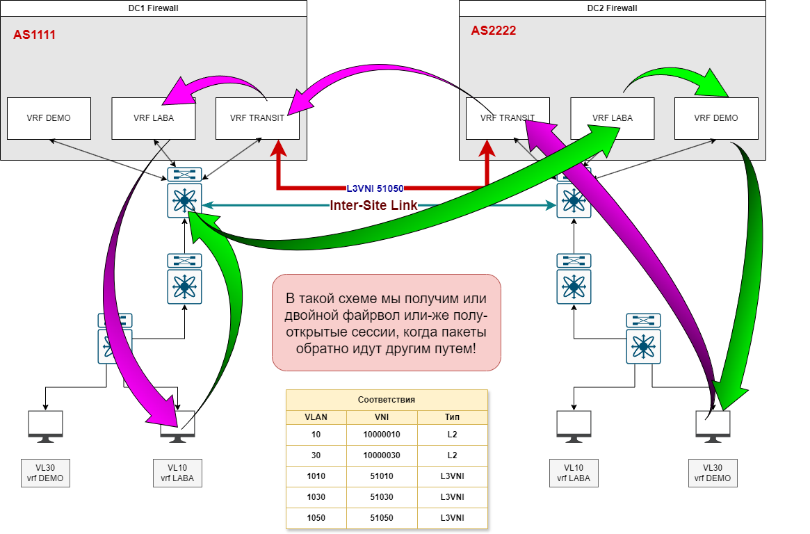
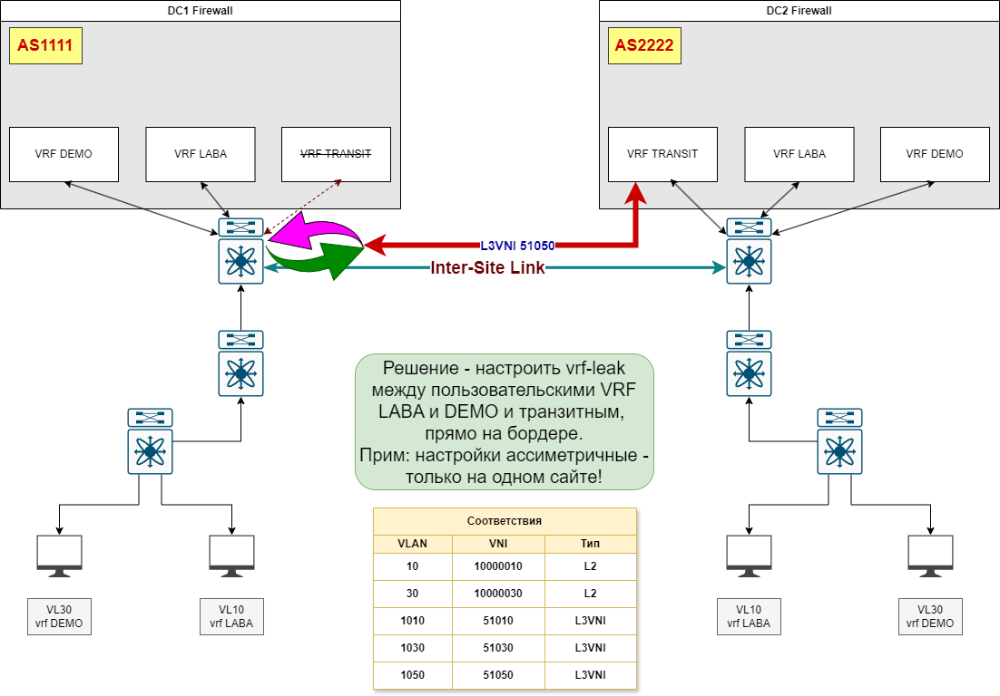
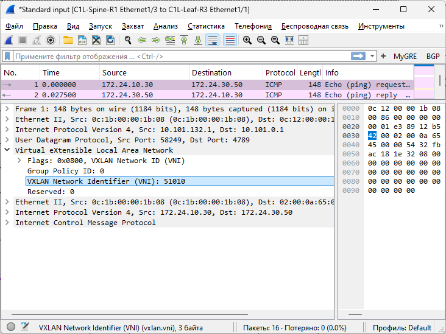
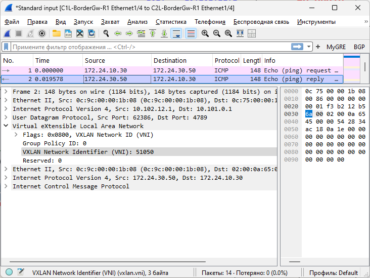
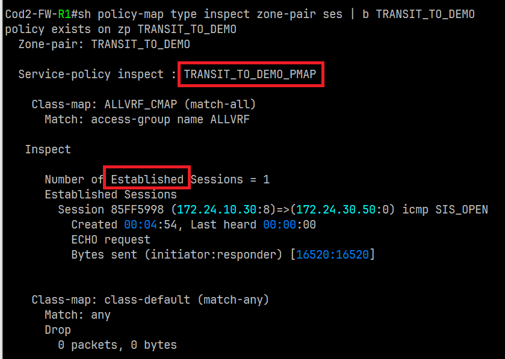
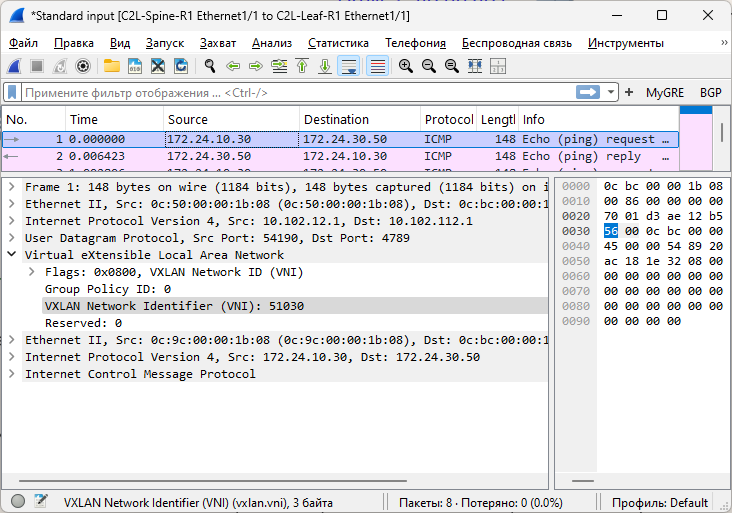
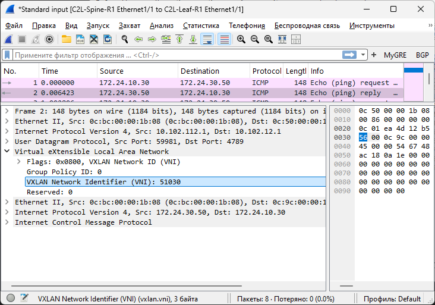
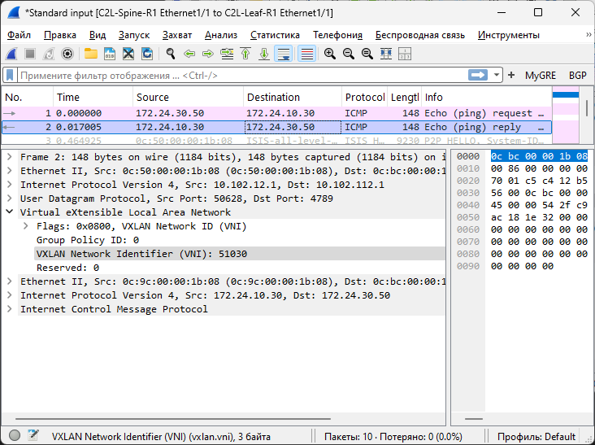
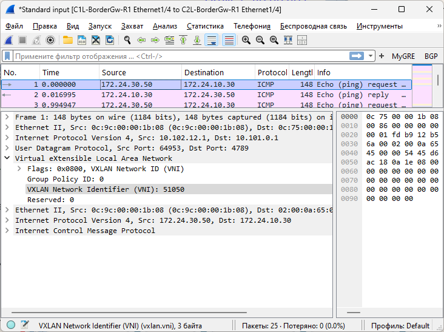
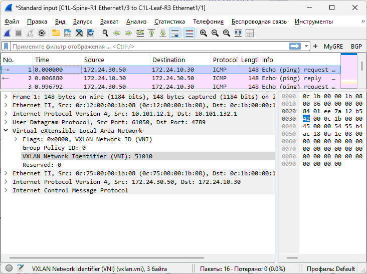

# Project

## VxLAN, Inter-site Routing

(Механошин Алексей и Подлеснов Александр)

---

Схема подключения опорной сети осталась прежняя, как в LAB-3 на IS-IS протоколе,
но добавлен второй сайт и пара файрволов с каждой стороны.


Лифы Leaf-1/2 и C1L-Leaf-R4 выключены, для экономии ресурсов, - на них ранее были отработаны техники [vPC](../lab-7/README.md) и локального [route-leaking](../lab-8/README.md).

<details>
 <summary>План адрессного пространства</summary>

Общая сеть для всех ЦОД-ов (для трех): ```10.100.0.0/14```

- (Диапазон хостов 10.100.0.1 - 10.103.255.254 )

1) Сеть 10.100.0.0/16 Оставим в резерве.
2) Для первого ЦОД-а суммарное: ```10.101.0.0/16``` ( 10.101.0.1 - 10.101.255.254 )
3) Для второго ЦОД-а суммарное: ```10.102.0.0/16``` ( 10.102.0.1 - 10.102.255.254 )

Таким образом план нумерации будет следуюший

IP = 10.10**D**.**S**xy.**M**zz

Где:

- D = номер ЦОД-а
- S = номер leaf/spine (**1** - leaf, **2**- spine)
- Mzz - значения по порядку

В ```x``` третьего октета кодируем номер Leaf или Spine

- с **1** по **5**
- 0 - для Border Leaf

В ```y``` третьего октета кодируем:

- 1 - Loopback 1 для UNDERLAY
- 2 - Loopback 2 для OVERLAY
- 3 - резерв, напрмер дял vPC keep-alive
- 4 - p2p линк
- 5 - сервисы

Loopack-s:

- ```10.101.111.1/32``` - ЦОД-1, Leaf-1,  Loopack - 1
- ```10.101.112.1/32``` - ЦОД-1, Leaf-1,  Loopack - 2
- ```10.101.121.1/32``` - ЦОД-1, Leaf-2,  Loopack - 1
- ```10.101.122.1/32``` - ЦОД-1, Leaf-2,  Loopack - 2
- ```10.101.131.1/32``` - ЦОД-1, Leaf-3,  Loopack - 1
- ```10.101.132.1/32``` - ЦОД-1, Leaf-3,  Loopack - 2
- ```10.101.141.1/32``` - ЦОД-1, Leaf-4,  Loopack - 1
- ```10.101.142.1/32``` - ЦОД-1, Leaf-4,  Loopack - 2
- ```10.101.211.1/32``` - ЦОД-1, Spine-1, Loopack - 1
- ```10.101.212.1/32``` - ЦОД-1, Spine-1, Loopack - 2
- ```10.101.221.1/32``` - ЦОД-1, Spine-2, Loopack - 1
- ```10.101.222.1/32``` - ЦОД-1, Spine-2, Loopack - 2

Border Leaf Loopacks:

- ```10.101.11.1``` - ЦОД-1, BRD-Leaf-1 Loopack-1
- ```10.101.12.1``` - ЦОД-1, BRD-Leaf-1 Loopack-2
- ```10.101.21.1``` - ЦОД-1, BRD-Leaf-2 Loopack-1
- ```10.101.22.1``` - ЦОД-1, BRD-Leaf-2 Loopack-2

Примеры сетей для vPC:

- ```10.101.113.0/30``` - vPC ЦОД-1, Leaf-1 to Leaf-2 (10.101.113.1 - 10.101.113.2)
- ```10.101.133.0/30``` - vPC ЦОД-1, Leaf-3 to Leaf-4 (10.101.133.1 - 10.101.133.2)

Cети P2P пиров, как и нумерация в октете идёт со стороны Spine:

- ```10.101.214.0/30``` - сеть в ЦОД-1, Spine-1 до Leaf-1 (10.101.214.1  - 10.101.214.2)
- ```10.101.214.4/30``` - сеть в ЦОД-1, Spine-1 до Leaf-2 (10.101.214.5  - 10.101.214.6)
- ```10.101.214.8/30``` - сеть в ЦОД-1, Spine-1 до Leaf-3 (10.101.214.9  - 10.101.214.10)
- ```10.101.214.12/30```- сеть в ЦОД-1, Spine-1 до Leaf-4 (10.101.214.13 - 10.101.214.14)
- ```10.101.224.0/30``` - сеть в ЦОД-1, Spine-2 до Leaf-1 (10.101.224.1  - 10.101.224.2)
- ```10.101.224.4/30``` - сеть в ЦОД-1, Spine-2 до Leaf-2 (10.101.224.5  - 10.101.224.6)
- ```10.101.224.8/30``` - сеть в ЦОД-1, Spine-2 до Leaf-3 (10.101.224.9  - 10.101.224.10)
- ```10.101.224.12/30```- сеть в ЦОД-1, Spine-2 до Leaf-4 (10.101.224.13 - 10.101.224.14)

Или в обратную сторону:

- ```10.101.214.0/30``` - сеть в ЦОД-1, Leaf-1 до Spine-1
- ```10.101.224.0/30``` - сеть в ЦОД-1, Leaf-1 до Spine-2
- ```10.101.214.4/30``` - сеть в ЦОД-1, Leaf-2 до Spine-1
- ```10.101.224.4/30``` - сеть в ЦОД-1, Leaf-2 до Spine-2
- ```10.101.214.8/30``` - сеть в ЦОД-1, Leaf-3 до Spine-1
- ```10.101.224.8/30``` - сеть в ЦОД-1, Leaf-3 до Spine-2
- ```10.101.214.12/30```- сеть в ЦОД-1, Leaf-4 до Spine-1
- ```10.101.224.12/30```- сеть в ЦОД-1, Leaf-4 до Spine-2

---
Сети BRD Leaf-Spine:

- ```10.101.14.0/30```  - сеть в ЦОД-1, Spine-1 до BRD-Leaf-1 (10.101.14.1 - 10.101.14.2)
- ```10.101.14.4/30```  - сеть в ЦОД-1, Spine-1 до BRD-Leaf-2 (10.101.14.5 - 10.101.14.6)
- ```10.101.24.0/30```  - сеть в ЦОД-1, Spine-2 до BRD-Leaf-1 (10.101.24.1 - 10.101.24.2)
- ```10.101.24.4/30```  - сеть в ЦОД-1, Spine-2 до BRD-Leaf-2 (10.101.24.5 - 10.101.24.6)

IP установлены следующим образом

Leaf-R1# sh ip int br

```text
Interface            IP Address
Lo1                  10.101.111.1
Lo2                  10.101.112.1
Eth1/1               10.101.214.2
Eth1/2               10.101.224.2
Eth1/15              10.101.113.1
```

Leaf-R2# sh ip int br

```text
Interface            IP Address
Lo1                  10.101.121.1
Lo2                  10.101.122.1
Eth1/1               10.101.214.6
Eth1/2               10.101.224.6
Eth1/15              10.101.113.2
```

Leaf-R3# sh ip int br

```text
Interface            IP Address
Lo1                  10.101.131.1
Lo2                  10.101.132.1
Eth1/1               10.101.214.10
Eth1/2               10.101.224.10
Eth1/15              10.101.133.1
```

Leaf-R4# sh ip int br

```text
Interface            IP Address
Lo1                  10.101.141.1
Lo2                  10.101.142.1
Eth1/1               10.101.214.14
Eth1/2               10.101.224.14
Eth1/15              10.101.133.2
```

Spine-R1# sh ip int br

```text
Interface            IP Address
Lo1                  10.101.211.1
Lo2                  10.101.212.1
Eth1/1               10.101.214.1
Eth1/2               10.101.214.5
Eth1/3               10.101.214.9
Eth1/4               10.101.214.13
Eth1/6               10.101.14.1
Eth1/7               10.101.14.5
```

Spine-R2# sh ip int br

```text
Interface            IP Address
Lo1                  10.101.221.1
Lo2                  10.101.222.1
Eth1/1               10.101.224.1
Eth1/2               10.101.224.5
Eth1/3               10.101.224.9
Eth1/4               10.101.224.13
Eth1/6               10.101.24.1
Eth1/7               10.101.24.5
```

BRF-Leaf-R1# sh ip int br

```text
Interface            IP Address
Lo1                  10.101.11.1
Lo2                  10.101.12.1
Eth1/1               10.101.14.2
Eth1/2               10.101.24.2
```

BRD-Leaf-R2# sh ip int br

```text
Interface            IP Address
Lo1                  10.101.21.1
Lo2                  10.101.22.1
Eth1/1               10.101.14.6
Eth1/2               10.101.24.6
```

</details>

Основные понятия:

1. Netwotk Virtualization Overlay (NVO) - оверлейная сеть
2. VXLAN Tunnel End Point (VTEP) - само устройство которое занимается инкапсуляцией/декапсуляцией VxLAN фреймов
3. Network Virtualization Edge (NVE) - туннельный интерфейс инкапсуляцией/декапсуляцией VxLAN фреймов.
 Можно сравнить в транком до сотальных VTEP-ов, или как GRE туннель.
4. Virtual Network Identifier (VNI) - метка VxLAN инкапсуляции, определяющая Layer-2 домен в оверлейной сети.
 Должна быть одинакова на всех VTEP-ах куда нам необходимо соеденить наш L2 домен.
5. MAC-VRF - воспринимаем как EVPN-instanc, как VLAN примапленный к NVI и учавствующий в VxLAN инкапсуляции/декапсуляции.
 (Можно представить типа как "L2-роутинг" между VTEP-ами).
 В Общем сколько у нас будет VLAN-ов с VNI - столько у нас будет и MAC-VRF-ов,
 поскольку у каждого MAC-VRF будет свой Route-Target (RT) и свой Route Destingisher (RD) - типа L2-VRF такие.
6. IP-VRF - Обычный L3 VRF, который и собирает в себе MAC-VRF-ы

---

### Проект: Модернизация ядра сети ЦОД с переходом на VXLAN

Задачи:

1. Настроить рядом еще одну VxLAN фабрику, и настроить Multi-Site
2. Настроите маршрутизацию между клиентами через внешнее устройство (граничный роутер\фаерволл\etc) в своей  фабрике, - клиенты между серверами переходят между VRF-ами только в пределах одного сайта.

---

Настройка бордера, лифа и спайна, во втором сайте, ничем не отличается от первого.
Примечание: на всех VTEP-ах во втором сайте необходимо настроить такой-же как в первом `anycast-gateway-mac`

```text
fabric forwarding anycast-gateway-mac 0001.0001.0001
```

Далее настроим взаимодействие двух бордеров из каждого сайта.

Для этого необходимо:

1. Прописать команду глобальную на каждом бордере, который получит роль Border Gateway:
  `evpn multisite border-gateway xxx`, где `xxx` это уникальнй номер сайта.
2. Создать отдельный Loopack со своим уникадьным IP, для взаимодействия между сайтами.
3. Обеспечить доступность всех лупбэков одного бордера на втором.
4. На интерфейсе в сторону второго сайта необходимо прописать `evpn multisite dci-tracking`
5. И на бардере, на каждом интерфейсе в сторону своего спайна, - `evpn multisite fabric-tracking`

В ЦОД-1 (Внимание -это приводит к остоновке интерфейса NVE1!):

```text
C1L-Bgw-R1# conf t
C1L-Bgw-R1(config)# evpn multisite border-gateway 10
C1L-Bgw-R1(config)# 
C1L-Bgw-R1(config)# interface loopback100
C1L-Bgw-R1(config-if)# description Multi-Site VIP
C1L-Bgw-R1(config-if)# ip address 10.101.0.1/32
C1L-Bgw-R1(config-if)# ip router isis UNDERLAY
C1L-Bgw-R1(config-if)# exit
C1L-Bgw-R1(config)# 
C1L-Bgw-R1(config)# interface nve1
C1L-Bgw-R1(config-if-nve)# multisite border-gateway interface loopback100
C1L-Bgw-R1(config-if-nve)# exit
C1L-Bgw-R1(config)# 
```

В ЦОД-2 (Внимание -это приводит к остоновке интерфейса NVE1!):

```text
C2L-Bgw-R1# conf t
C2L-Bgw-R1(config)# evpn multisite border-gateway 20
C2L-Bgw-R1(config)# 
C2L-Bgw-R1(config)# interface loopback100
C2L-Bgw-R1(config-if)# description Multi-Site VIP
C2L-Bgw-R1(config-if)# ip address 10.102.0.1/32
C2L-Bgw-R1(config-if)# ip router isis UNDERLAY
C2L-Bgw-R1(config-if)# exit
C2L-Bgw-R1(config)# 
C2L-Bgw-R1(config)# interface nve1
C2L-Bgw-R1(config-if-nve)# multisite border-gateway interface loopback100
C2L-Bgw-R1(config-if-nve)# exit
C2L-Bgw-R1(config)# 
```

Настроим передачу Loopback-ков, для этого используем всё тот-же eBGP (на примере ЦОД-1):

```text
C1L-Bgw-R1(config)# interface Ethernet1/4
C1L-Bgw-R1(config-if)# description ** DCI Interface **
C1L-Bgw-R1(config-if)# no switchport
C1L-Bgw-R1(config-if)# mtu 9216
C1L-Bgw-R1(config-if)# speed 1000
C1L-Bgw-R1(config-if)# duplex full
C1L-Bgw-R1(config-if)# no ip redirects
C1L-Bgw-R1(config-if)# ip address 50.0.0.1/29
C1L-Bgw-R1(config-if)# ipv6 address use-link-local-only
C1L-Bgw-R1(config-if)# no ipv6 redirects
C1L-Bgw-R1(config-if)# isis shutdown
C1L-Bgw-R1(config-if)# evpn multisite dci-tracking
C1L-Bgw-R1(config-if)# no shutdown
C1L-Bgw-R1(config-if)# exit
C1L-Bgw-R1(config)# 
C1L-Bgw-R1(config)# router bgp 65010
C1L-Bgw-R1(config-router)# address-family ipv4 unicast
C1L-Bgw-R1(config-router-af)# network 10.101.0.1/32
C1L-Bgw-R1(config-router-af)# network 10.101.11.1/32
C1L-Bgw-R1(config-router-af)# network 10.101.12.1/32
C1L-Bgw-R1(config-router-af)# exit
C1L-Bgw-R1(config-router)# neighbor 50.0.0.3
C1L-Bgw-R1(config-router-neighbor)# remote-as 65012
C1L-Bgw-R1(config-router-neighbor)# description COD2-BorderLeaf-1
C1L-Bgw-R1(config-router-neighbor)# update-source Ethernet1/4
C1L-Bgw-R1(config-router-neighbor)# timers 7 21
C1L-Bgw-R1(config-router-neighbor)# address-family ipv4 unicast
C1L-Bgw-R1(config-router-neighbor-af)# exit
C1L-Bgw-R1(config-router-neighbor)# exit
C1L-Bgw-R1(config-router)# exit
C1L-Bgw-R1(config)# 
```

Проверяем что все верно настроено, - есть связность и IP лупбэков передаются:

```text
C1L-Bgw-R1# sh ip bgp summary | b Neighbor
Neighbor        V    AS    MsgRcvd    MsgSent   TblVer  InQ OutQ Up/Down  State/PfxRcd
50.0.0.3        4 65012      11539      11538       16    0    0 22:25:33 3         
C1L-Bgw-R1# 
C1L-Bgw-R1# sh ip bgp neighbors 50.0.0.3 advertised-routes | b Network
   Network            Next Hop            Metric     LocPrf     Weight Path
*>l10.101.0.1/32      0.0.0.0                           100      32768 i
*>l10.101.11.1/32     0.0.0.0                           100      32768 i
*>l10.101.12.1/32     0.0.0.0                           100      32768 i

C1L-Bgw-R1# 
```

Если всё успешно, то настроим уже сам Multi-Site, который нам будет передавать в качестве пятого типа свои маршруты, но видить мы будет только соседний бордер и будем строить свои туннели именно до него, таким образом мы будем полностью изолированы от соседнего сайта(ов).

```text
C1L-Bgw-R1(config)# 
C1L-Bgw-R1(config)# router bgp 65010
C1L-Bgw-R1(config-router)# neighbor 10.102.0.1
C1L-Bgw-R1(config-router-neighbor)# remote-as 65012
C1L-Bgw-R1(config-router-neighbor)# description COD2-VTEP-BL1
C1L-Bgw-R1(config-router-neighbor)# update-source loopback100
C1L-Bgw-R1(config-router-neighbor)# disable-connected-check
C1L-Bgw-R1(config-router-neighbor)# peer-type fabric-external
C1L-Bgw-R1(config-router-neighbor)# address-family l2vpn evpn
C1L-Bgw-R1(config-router-neighbor-af)# send-community
C1L-Bgw-R1(config-router-neighbor-af)# send-community extended
C1L-Bgw-R1(config-router-neighbor-af)# rewrite-evpn-rt-asn
C1L-Bgw-R1(config-router-neighbor-af)# exit
C1L-Bgw-R1(config-router-neighbor)# exit
C1L-Bgw-R1(config-router)# exit
C1L-Bgw-R1(config)#
```

Примечание: здесь добавлены два ключевые конструкции `peer-type fabric-external` и `rewrite-evpn-rt-asn`
 указывающие что это именно внешнее соединение и что в EVPN нам необходимо перезаписывать Route-Target на своё.

Проверим что всё подключилось:

```text
C1L-Bgw-R1(config)# sh bgp l2vpn evpn summary | i 10.102.0.1

10.102.0.1      4 65012       1478       1373      836    0    0 04:41:49 24        
10.102.0.1      E 65012 24         7          3          0          14        
C1L-Bgw-R1(config)# 
```

И прверим например маршруты Type-2 которые мы от него получили:

```text
C1L-Bgw-R1(config)# sh bgp l2vpn evpn neighbors 10.102.0.1 routes | b Network  | i e\[2

*>e[2]:[0]:[0]:[48]:[0cdf.fd27.0000]:[0]:[0.0.0.0]/216
*>e[2]:[0]:[0]:[48]:[0cdf.fd27.0000]:[32]:[172.24.10.50]/272
*>e[2]:[0]:[0]:[48]:[0cfc.729d.0000]:[0]:[0.0.0.0]/216
*>e[2]:[0]:[0]:[48]:[0cfc.729d.0000]:[32]:[172.24.30.50]/272
*>e[2]:[0]:[0]:[48]:[0c9c.0000.1b08]:[0]:[0.0.0.0]/216
*>e[2]:[0]:[0]:[48]:[0cdf.fd27.0000]:[0]:[0.0.0.0]/216
*>e[2]:[0]:[0]:[48]:[0cdf.fd27.0000]:[32]:[172.24.10.50]/272
*>e[2]:[0]:[0]:[48]:[0c9c.0000.1b08]:[0]:[0.0.0.0]/216
*>e[2]:[0]:[0]:[48]:[0c9c.0000.1b08]:[0]:[0.0.0.0]/216
*>e[2]:[0]:[0]:[48]:[0cfc.729d.0000]:[0]:[0.0.0.0]/216
*>e[2]:[0]:[0]:[48]:[0cfc.729d.0000]:[32]:[172.24.30.50]/272
*>e[2]:[0]:[0]:[48]:[0c9c.0000.1b08]:[0]:[0.0.0.0]/216
*>e[2]:[0]:[0]:[48]:[0c9c.0000.1b08]:[0]:[0.0.0.0]/216
*>e[2]:[0]:[0]:[48]:[0c9c.0000.1b08]:[0]:[0.0.0.0]/216
*>e[2]:[0]:[0]:[48]:[0cfc.729d.0000]:[32]:[172.24.30.50]/272
*>e[2]:[0]:[0]:[48]:[0cdf.fd27.0000]:[32]:[172.24.10.50]/272
C1L-Bgw-R1(config)#
```

На этом настройка межсайтового взаимодействия закончена, но при подключении аналогичного файрвола во втором сайте наш ждет неприятный сюрприз, - при потытке пропинговать пропинговать хост котороый находится в другом сайте  и в другом VRF, на будут полуоткрые сесси на фарйволе, поскольку пакеты идут **обратно другим** путем:


Это связано с тем для клиента обратный путь приходит из соседнего сайта в виде префикса `/24`, в своем L3VNI, которую соседний файрвол аннонсирует, как мы и настраивали ранее в 8-й лабе.

Первым шагом была предпринята попытка создать отдельный L3VNI для передачи `/32` префиксов полученных в файрволе от хостов, и передачи егоо в свой отдельный VRF, но столкнулся с рядом проблем:

1. 
2. 

Решение было найдено в виде асихроной настройки inter-vrf (выполняется на наиболлее нагруженном сайте в плане файрволинга) которая выполняет две функции:

1. Анонсирует, на обычном лифе, префиксы в транзитную VRF
2. Получает `внешние` IP c `/32` префиксом, с соседнего сайта.

Таким образом удалось добится что меж-VRF трафик который относится к соседнему сайту, на нем-же и орабатывается, при чём в зависимости кто ициатор пакеты, они буду проходить разные пары зон.



Вот так выглядит ликинг:

```text
C1L-Leaf-R3# sh run
...
vrf context DEMO
  vni 51030
  rd auto
  address-family ipv4 unicast
    route-target both auto
    route-target both auto evpn
    route-target import 50:11
    route-target import 50:11 evpn
    route-target export 101:51030
    route-target export 101:51030 evpn
vrf context LABA
  vni 51010
  rd auto
  address-family ipv4 unicast
    route-target both auto
    route-target both auto evpn
    route-target import 50:11
    route-target import 50:11 evpn
    route-target export 101:51010
    route-target export 101:51010 evpn
vrf context TRANSIT
  vni 51050
  rd auto
  address-family ipv4 unicast
    route-target import 101:51010
    route-target import 101:51010 evpn
    route-target import 101:51030
    route-target import 101:51030 evpn
    route-target import 50:11
    route-target import 50:11 evpn
    route-target export 50:11
    route-target export 50:11 evpn
```

Т.е. мы экспортируем из vrf LABA локальные префиксы, в vrf TRANSIT, а забираем из него-же по RT `50:11`
При этом маршруты с RT `50:11` получены следующим путем, - на бордере этого-же сайта при получении маршрутов в vrf TRANSIT:

```text
C1L-Bgw-R1(config)# sh run
...
vrf context DEMO
  vni 51030
  rd auto
  address-family ipv4 unicast
    route-target both auto
    route-target both auto evpn
    route-target export 101:30
    route-target export 101:30 evpn
vrf context LABA
  vni 51010
  rd auto
  address-family ipv4 unicast
    route-target both auto
    route-target both auto evpn
    route-target export 101:10
    route-target export 101:10 evpn
vrf context TRANSIT
  vni 51050
  rd auto
  address-family ipv4 unicast
    route-target both auto
    route-target both auto evpn
    route-target import 101:51010
    route-target import 101:51010 evpn
    route-target import 101:51030
    route-target import 101:51030 evpn
    route-target export 50:11
    route-target export 50:11 evpn
vrf context VRF_VPC_KEEPALIVE
```

#### Вот что у нас так получилось

Если мы пингуем из ЦОД-1, с хоста которые находится в vrf LABA, хост во втором ЦОД-е, но который находится в vrf DEMO:

Внутри сайта ЦОД-1, - отправка:

Внутри сайта ЦОД-1, - получаем:


Вот тут уже видно что оправлем в `транзите`, а получаем в `лабе`

Далее, между -сайтов, отправка:


Получение:


Мы все так-же отпрвляем в `транзите`, а получаем в `лабе`.

Теперь посмотрим как видит файрвол:



Вот тут сразу видно где происходит переход из `транзита` в `демо` где уже и нахрдится нужный нам хост, а наличии признака в ZBF `Established` говорит нам о том что пакеты идут обратно через него же.

Файрвол во втором сайте:



Обратно:



Как мы видим тут без сюрпризов, все идет в предедах своего `vrf DEMO`

А вот если инициатор уже тот-же хост что выше, то трафик идет по другому пути, он пожож, да не совсем:

От лифа:


Обратно:



Залетает сразу в файрвол:


Хотя тут очень странно показывает довольно на мой взляд.

Между бордерами бежит в разнобой:

В сторону ЦОД-1 в vrf `LABA`



Обратно в vrf `TRANSIT`:


И до лифа от борера в первом ЦОД-е все так-же:



Обратно:


Проект не без не недостатков, но рабочий.

---

Полные настройки коммутаторов:

<details>
<summary>Leaf-1</summary>

```text
Leaf-R1# sh run


!Command: show running-config
!Running configuration last done at: Thu Jan 30 13:35:36 2025
!Time: Thu Jan 30 16:21:07 2025

version 9.3(8) Bios:version  
hostname Leaf-R1
vdc Leaf-R1 id 1
  limit-resource vlan minimum 16 maximum 4094
  limit-resource vrf minimum 2 maximum 4096
  limit-resource port-channel minimum 0 maximum 511
  limit-resource u4route-mem minimum 248 maximum 248
  limit-resource u6route-mem minimum 96 maximum 96
  limit-resource m4route-mem minimum 58 maximum 58
  limit-resource m6route-mem minimum 8 maximum 8

cfs eth distribute
nv overlay evpn
feature bgp
feature isis
feature fabric forwarding
feature interface-vlan
feature vn-segment-vlan-based
feature lacp
feature vpc
feature bfd
clock timezone PRM 5 0
feature nv overlay

no password strength-check
username admin password 5 $5$HIMIJM$qT5AXQEfCx.kdpdUF8dRHjlsjyL3TdgR9BhmK9uAYx7  role network-admin
no ip domain-lookup
copp profile strict
snmp-server user admin auth md5 0153448F0CDEAA7AC3D8A6E1207E29746751 priv 204F64F031BBA129B39DABB42F633F6C6872 localizedV2key engineID 128:0:0:9:3:12:159:0:0:27:1
rmon event 1 log trap public description FATAL(1) owner PMON@FATAL
rmon event 2 log trap public description CRITICAL(2) owner PMON@CRITICAL
rmon event 3 log trap public description ERROR(3) owner PMON@ERROR
rmon event 4 log trap public description WARNING(4) owner PMON@WARNING
rmon event 5 log trap public description INFORMATION(5) owner PMON@INFO

fabric forwarding anycast-gateway-mac 0001.0001.0001
vlan 1,10,20,1010
vlan 10
  name EndPoint-1
  vn-segment 10000010
vlan 20
  vn-segment 10000020
vlan 1010
  vn-segment 51010

spanning-tree vlan 1-3967 priority 4096
key chain ISIS
  key 1
    key-string 7 070c285f4d064b0916100a
vrf context LABA
  vni 51010
  rd auto
  address-family ipv4 unicast
    route-target both auto
    route-target both auto evpn
vrf context VRF_VPC-KEEPALIVE
  address-family ipv4 unicast
vrf context management
hardware access-list tcam region racl 256
hardware access-list tcam region e-racl 0
hardware access-list tcam region arp-ether 256
vpc domain 1
  peer-switch
  role priority 1000
  peer-keepalive destination 10.101.113.2 source 10.101.113.1 vrf VRF_VPC-KEEPALIVE
  auto-recovery
  ip arp synchronize


interface Vlan1

interface Vlan10
  no shutdown
  vrf member LABA
  ip address 172.24.10.1/24
  fabric forwarding mode anycast-gateway

interface Vlan20
  no shutdown
  vrf member LABA
  ip address 172.24.20.1/24
  fabric forwarding mode anycast-gateway

interface Vlan1010
  no shutdown
  vrf member LABA
  ip forward

interface port-channel15
  description *** SW-1 ***
  switchport mode trunk
  switchport access vlan 10
  switchport trunk allowed vlan 10,20
  speed 1000
  vpc 15

interface port-channel100
  description *** VPC PEER LINKS ***
  switchport mode trunk
  spanning-tree port type network
  vpc peer-link

interface nve1
  no shutdown
  host-reachability protocol bgp
  source-interface loopback2
  member vni 51010 associate-vrf
  member vni 10000010
    ingress-replication protocol bgp
  member vni 10000020
    ingress-replication protocol bgp

interface Ethernet1/1
  description to_spine_1
  no switchport
  bfd interval 999 min_rx 999 multiplier 3
  bfd authentication Keyed-SHA1 key-id 1 hex-key 636973636F326C616261
  no ip redirects
  ip address 10.101.214.2/30
  no ipv6 redirects
  isis metric 100 level-1
  isis metric 100 level-2
  isis network point-to-point
  ip router isis UNDERLAY
  no isis passive-interface level-1-2
  isis bfd disable
  no shutdown

interface Ethernet1/2
  description to_spine_2
  no switchport
  no ip redirects
  ip address 10.101.224.2/30
  no ipv6 redirects
  isis metric 100 level-1
  isis metric 100 level-2
  isis network point-to-point
  ip router isis UNDERLAY
  no isis passive-interface level-1-2
  no shutdown

interface Ethernet1/3
  shutdown

interface Ethernet1/4
  shutdown

interface Ethernet1/5
  shutdown

interface Ethernet1/6
  shutdown

interface Ethernet1/7
  shutdown

interface Ethernet1/8
  description *** SW-1 ***
  switchport mode trunk
  switchport access vlan 10
  switchport trunk allowed vlan 10,20
  speed 1000
  channel-group 15

interface Ethernet1/9
  shutdown

interface Ethernet1/10
  shutdown

interface Ethernet1/11
  shutdown

interface Ethernet1/12
  shutdown

interface Ethernet1/13
  description *** VPC PEER LINKS ***
  switchport mode trunk
  channel-group 100 mode active

interface Ethernet1/14
  description *** VPC PEER LINKS ***
  switchport mode trunk
  channel-group 100 mode active

interface Ethernet1/15
  description vPC K/A to_leaf-2
  no switchport
  vrf member VRF_VPC-KEEPALIVE
  ip address 10.101.113.1/30
  no shutdown

interface Ethernet1/16

interface Ethernet1/17

interface Ethernet1/18

interface Ethernet1/19

interface Ethernet1/20

interface Ethernet1/21

interface Ethernet1/22

interface Ethernet1/23

interface Ethernet1/24

interface Ethernet1/25

interface Ethernet1/26

interface Ethernet1/27

interface Ethernet1/28

interface Ethernet1/29

interface Ethernet1/30

interface Ethernet1/31

interface Ethernet1/32

interface Ethernet1/33

interface Ethernet1/34

interface Ethernet1/35

interface Ethernet1/36

interface Ethernet1/37

interface Ethernet1/38

interface Ethernet1/39

interface Ethernet1/40

interface Ethernet1/41

interface Ethernet1/42

interface Ethernet1/43

interface Ethernet1/44

interface Ethernet1/45

interface Ethernet1/46

interface Ethernet1/47

interface Ethernet1/48

interface Ethernet1/49

interface Ethernet1/50

interface Ethernet1/51

interface Ethernet1/52

interface Ethernet1/53

interface Ethernet1/54

interface Ethernet1/55

interface Ethernet1/56

interface Ethernet1/57

interface Ethernet1/58

interface Ethernet1/59

interface Ethernet1/60

interface Ethernet1/61

interface Ethernet1/62

interface Ethernet1/63

interface Ethernet1/64

interface mgmt0
  vrf member management

interface loopback1
  description # Router ID
  ip address 10.101.111.1/32
  ip router isis UNDERLAY

interface loopback2
  description # VTEP-ID
  ip address 10.101.112.1/32
  ip address 10.101.112.2/32 secondary
  ip router isis UNDERLAY
icam monitor scale

cli alias name wr copy run start
cli alias name c conf term
cli alias name sir show ip route
cli alias name cef show forwarding ipv4 
cli alias name adj show ip adj
cli alias name srr sh run | sec router
cli alias name hi sh cli history unformatted 
line console
  exec-timeout 0
  terminal length 48
  terminal width  186
line vty
boot nxos bootflash:/nxos.9.3.8.bin sup-1
router isis UNDERLAY
  net 49.0001.0101.0111.1001.00
  is-type level-1
  log-adjacency-changes
  authentication-type md5 level-1
  authentication-type md5 level-2
  authentication key-chain ISIS level-1
  authentication key-chain ISIS level-2
  address-family ipv4 unicast
    maximum-paths 2
    router-id loopback1
  passive-interface default level-1-2
router bgp 65010
  router-id 10.101.112.1
  template peer SPINES
    remote-as 65010
    update-source loopback2
    address-family l2vpn evpn
      send-community
      send-community extended
  neighbor 10.101.212.1
    inherit peer SPINES
    description Spine-1
  neighbor 10.101.222.1
    inherit peer SPINES
    description Spine-2
  vrf DEMO
    address-family ipv4 unicast
      redistribute direct route-map RM_PERMIT_IPv4
      redistribute hmm route-map RM_PERMIT_IPv4
  vrf LABA
    address-family ipv4 unicast
      redistribute direct route-map RM_PERMIT_IPv4
      redistribute hmm route-map RM_PERMIT_IPv4


Leaf-R1#
```

</details>

<details>
<summary>Leaf-2</summary>

```text
Leaf-R2# sh run

!Command: show running-config
!Running configuration last done at: Thu Jan 30 13:35:32 2025
!Time: Thu Jan 30 16:21:45 2025

version 9.3(8) Bios:version  
hostname Leaf-R2
vdc Leaf-R2 id 1
  limit-resource vlan minimum 16 maximum 4094
  limit-resource vrf minimum 2 maximum 4096
  limit-resource port-channel minimum 0 maximum 511
  limit-resource u4route-mem minimum 248 maximum 248
  limit-resource u6route-mem minimum 96 maximum 96
  limit-resource m4route-mem minimum 58 maximum 58
  limit-resource m6route-mem minimum 8 maximum 8

cfs eth distribute
nv overlay evpn
feature bgp
feature isis
feature fabric forwarding
feature interface-vlan
feature vn-segment-vlan-based
feature lacp
feature vpc
clock timezone PRM 5 0
feature nv overlay

no password strength-check
username admin password 5 $5$GILIBL$I50uIEZ2.Id5WPuEW2/kF2LnprBS1fD4bK7PLYdXCs4  role network-admin
no ip domain-lookup
copp profile strict
snmp-server user admin auth md5 042F0B626D2474725C91211D7B2226CDBDEA priv 040F77425611450B4490383F363A768CEBA9 localizedV2key engineID 128:0:0:9:3:12:22:0:0:27:1
rmon event 1 log trap public description FATAL(1) owner PMON@FATAL
rmon event 2 log trap public description CRITICAL(2) owner PMON@CRITICAL
rmon event 3 log trap public description ERROR(3) owner PMON@ERROR
rmon event 4 log trap public description WARNING(4) owner PMON@WARNING
rmon event 5 log trap public description INFORMATION(5) owner PMON@INFO

fabric forwarding anycast-gateway-mac 0001.0001.0001
vlan 1,10,20,1010
vlan 10
  name EndPoint-1
  vn-segment 10000010
vlan 20
  vn-segment 10000020
vlan 1010
  vn-segment 51010

spanning-tree vlan 1-3967 priority 4096
key chain ISIS
  key 1
    key-string 7 070c285f4d064b0916100a
vrf context LABA
  vni 51010
  rd auto
  address-family ipv4 unicast
    route-target both auto
    route-target both auto evpn
vrf context VRF_VPC-KEEPALIVE
  address-family ipv4 unicast
vrf context management
hardware access-list tcam region racl 256
hardware access-list tcam region e-racl 0
hardware access-list tcam region arp-ether 256
vpc domain 1
  peer-switch
  role priority 2000
  peer-keepalive destination 10.101.113.1 source 10.101.113.2 vrf VRF_VPC-KEEPALIVE
  auto-recovery
  ip arp synchronize


interface Vlan1

interface Vlan10
  no shutdown
  vrf member LABA
  ip address 172.24.10.1/24
  fabric forwarding mode anycast-gateway

interface Vlan20
  no shutdown
  vrf member LABA
  ip address 172.24.20.1/24
  fabric forwarding mode anycast-gateway

interface Vlan1010
  no shutdown
  vrf member LABA
  ip forward

interface port-channel15
  description *** SW-1 ***
  switchport mode trunk
  switchport trunk allowed vlan 10,20
  speed 1000
  vpc 15

interface port-channel100
  description *** VPC PEER LINKS ***
  switchport mode trunk
  spanning-tree port type network
  vpc peer-link

interface nve1
  no shutdown
  host-reachability protocol bgp
  source-interface loopback2
  member vni 51010 associate-vrf
  member vni 10000010
    ingress-replication protocol bgp
  member vni 10000020
    ingress-replication protocol bgp

interface Ethernet1/1
  description to_spine_1
  no switchport
  ip address 10.101.214.6/30
  isis metric 100 level-1
  isis metric 100 level-2
  isis network point-to-point
  ip router isis UNDERLAY
  no isis passive-interface level-1-2
  no shutdown

interface Ethernet1/2
  description to_spine_2
  no switchport
  ip address 10.101.224.6/30
  isis metric 100 level-1
  isis metric 100 level-2
  isis network point-to-point
  ip router isis UNDERLAY
  no isis passive-interface level-1-2
  no shutdown

interface Ethernet1/3
  shutdown

interface Ethernet1/4
  shutdown

interface Ethernet1/5

interface Ethernet1/6
  shutdown

interface Ethernet1/7
  shutdown

interface Ethernet1/8
  description *** SW-1 ***
  switchport mode trunk
  switchport trunk allowed vlan 10,20
  speed 1000
  channel-group 15

interface Ethernet1/9
  shutdown

interface Ethernet1/10

interface Ethernet1/11
  shutdown

interface Ethernet1/12
  shutdown

interface Ethernet1/13
  description *** VPC PEER LINKS ***
  switchport mode trunk
  channel-group 100 mode active

interface Ethernet1/14
  description *** VPC PEER LINKS ***
  switchport mode trunk
  channel-group 100 mode active

interface Ethernet1/15
  description vPC K/A to_leaf-1
  no switchport
  vrf member VRF_VPC-KEEPALIVE
  ip address 10.101.113.2/30
  no shutdown

interface Ethernet1/16

interface Ethernet1/17

interface Ethernet1/18

interface Ethernet1/19

interface Ethernet1/20

interface Ethernet1/21

interface Ethernet1/22

interface Ethernet1/23

interface Ethernet1/24

interface Ethernet1/25

interface Ethernet1/26

interface Ethernet1/27

interface Ethernet1/28

interface Ethernet1/29

interface Ethernet1/30

interface Ethernet1/31

interface Ethernet1/32

interface Ethernet1/33

interface Ethernet1/34

interface Ethernet1/35

interface Ethernet1/36

interface Ethernet1/37

interface Ethernet1/38

interface Ethernet1/39

interface Ethernet1/40

interface Ethernet1/41

interface Ethernet1/42

interface Ethernet1/43

interface Ethernet1/44

interface Ethernet1/45

interface Ethernet1/46

interface Ethernet1/47

interface Ethernet1/48

interface Ethernet1/49

interface Ethernet1/50

interface Ethernet1/51

interface Ethernet1/52

interface Ethernet1/53

interface Ethernet1/54

interface Ethernet1/55

interface Ethernet1/56

interface Ethernet1/57

interface Ethernet1/58

interface Ethernet1/59

interface Ethernet1/60

interface Ethernet1/61

interface Ethernet1/62

interface Ethernet1/63

interface Ethernet1/64

interface mgmt0
  vrf member management

interface loopback1
  description # Router ID
  ip address 10.101.121.1/32
  ip router isis UNDERLAY

interface loopback2
  description # VTEP-ID
  ip address 10.101.122.1/32
  ip address 10.101.112.2/32 secondary
  ip router isis UNDERLAY
icam monitor scale

cli alias name wr copy run start
cli alias name c conf term
cli alias name sir show ip route
cli alias name srr sh run | sec router
cli alias name hi sh cli history unformatted
line console
  exec-timeout 0
  terminal length 48
  terminal width  186
line vty
boot nxos bootflash:/nxos.9.3.8.bin sup-1
router isis UNDERLAY
  net 49.0001.0101.0112.1001.00
  log-adjacency-changes
  authentication-type md5 level-1
  authentication-type md5 level-2
  authentication key-chain ISIS level-1
  authentication key-chain ISIS level-2
  address-family ipv4 unicast
    maximum-paths 2
    router-id loopback1
  passive-interface default level-1-2
router bgp 65010
  router-id 10.101.122.1
  template peer SPINES
    remote-as 65010
    update-source loopback2
    address-family l2vpn evpn
      send-community
      send-community extended
  neighbor 10.101.212.1
    inherit peer SPINES
    description Spine-1
  neighbor 10.101.222.1
    inherit peer SPINES
    description Spine-2
  vrf DEMO
    address-family ipv4 unicast
      redistribute direct route-map RM_PERMIT_IPv4
      redistribute hmm route-map RM_PERMIT_IPv4
  vrf LABA
    address-family ipv4 unicast
      redistribute direct route-map RM_PERMIT_IPv4
      redistribute hmm route-map RM_PERMIT_IPv4


Leaf-R2# 
```

</details>

<details>
<summary>C1L-Leaf-R3</summary>

```text
C1L-Leaf-R3# sh run

!Command: show running-config
!Running configuration last done at: Fri Feb 14 13:54:22 2025
!Time: Fri Feb 14 14:07:38 2025

version 10.3(5) Bios:version  
hostname C1L-Leaf-R3
vdc C1L-Leaf-R3 id 1
  limit-resource vlan minimum 16 maximum 4094
  limit-resource vrf minimum 2 maximum 4096
  limit-resource port-channel minimum 0 maximum 511
  limit-resource m4route-mem minimum 58 maximum 58
  limit-resource m6route-mem minimum 8 maximum 8

nv overlay evpn
feature bgp
feature isis
feature fabric forwarding
feature interface-vlan
feature vn-segment-vlan-based
clock timezone PRM 5 0
feature nv overlay

no password strength-check
username admin password 5 $5$EFMBDN$We92FsWMOLXgHCUT2J9tnpoOkdiXSr11UN2Ud.LleZ6  role network-admin
no ip domain-lookup
copp profile strict
snmp-server user admin network-admin auth md5 0163014720D0186F318BE2D3266B8E0CE068 priv aes-128 056F514B58B25A016FF897EF3077803BC53C localizedV2key
rmon event 1 log trap public description FATAL(1) owner PMON@FATAL
rmon event 2 log trap public description CRITICAL(2) owner PMON@CRITICAL
rmon event 3 log trap public description ERROR(3) owner PMON@ERROR
rmon event 4 log trap public description WARNING(4) owner PMON@WARNING
rmon event 5 log trap public description INFORMATION(5) owner PMON@INFO

fabric forwarding anycast-gateway-mac 0001.0001.0001
vlan 1,10,30,50,1010,1030,1050
vlan 10
  vn-segment 10000010
vlan 30
  vn-segment 10000030
vlan 50
  vn-segment 10000050
vlan 1010
  vn-segment 51010
vlan 1030
  vn-segment 51030
vlan 1050
  vn-segment 51050

ip prefix-list bgp_only_host description Allow only /32 prefixses
ip prefix-list bgp_only_host seq 10 permit 0.0.0.0/0 eq 32 
ip prefix-list only_32_prefix description Allow only client host ip as /32 prefix
ip prefix-list only_32_prefix seq 10 permit 0.0.0.0/0 eq 32 
ip as-path access-list BGP_ONLY_INTERNAL seq 1 permit "^$"
ip as-path access-list bgpAsRemote seq 10 deny "^$"
ip as-path access-list blockLocalFw seq 10 permit "^1111_"
ip as-path access-list only_extenal_as seq 10 permit "_2222$"
route-map RM_PERMIT_IPv4 permit 10
route-map bgpLocal deny 10
  match evpn route-type 5 
route-map bgpLocal permit 100
route-map only_32_prefix_external permit 10
  match as-path only_extenal_as 
  match ip address prefix-list only_32_prefix 
  set local-preference 200
route-map only_32_prefix_to_transit permit 10
  match ip address prefix-list only_32_prefix 
route-map servers_prefix32_to_transit permit 10
  match ip address prefix-list bgp_only_host 
route-map vrf_laba_to_vrf_transit permit 10
  match ip address prefix-list bgp_only_host 
key chain ISIS
  key 1
    key-string 7 070c285f4d064b0916100a
vrf context DEMO
  vni 51030
  rd auto
  address-family ipv4 unicast
    route-target both auto
    route-target both auto evpn
vrf context LABA
  vni 51010
  rd auto
  address-family ipv4 unicast
    route-target both auto
    route-target both auto evpn
    route-target import 50:11
    route-target import 50:11 evpn
    import map only_32_prefix_external
vrf context TRANSIT
  vni 51050
  rd auto
  address-family ipv4 unicast
    route-target both auto
    route-target both auto evpn
    route-target import 50:12
    route-target import 50:12 evpn
    route-target export 50:11
    route-target export 50:11 evpn
    import map only_32_prefix_to_transit
vrf context management
hardware profile tcam resource template LEAF_TCAM_CARVE ref-template nfe
  racl 256
  e-racl 0
  arp-ether 256
hardware profile tcam resource service-template LEAF_TCAM_CARVE


interface Vlan1

interface Vlan10
  description # Member vrf LABA #
  no shutdown
  vrf member LABA
  ip address 172.24.10.1/24
  ipv6 address use-link-local-only
  fabric forwarding mode anycast-gateway

interface Vlan30
  description # Member vrf DEMO #
  no shutdown
  vrf member DEMO
  ip address 172.24.30.1/24
  ipv6 address use-link-local-only
  fabric forwarding mode anycast-gateway

interface Vlan1010
  description * L3VNI VRF LABA *
  no shutdown
  mtu 9216
  vrf member LABA
  no ip redirects
  ip forward
  no ipv6 redirects

interface Vlan1030
  description * L3VNI VRF DEMO *
  no shutdown
  mtu 9216
  vrf member DEMO
  no ip redirects
  ip forward
  no ipv6 redirects

interface Vlan1050
  description L3VNI for vrf TRANSIT
  no shutdown
  mtu 9216
  vrf member TRANSIT
  no ip redirects
  ip forward
  no ipv6 redirects

interface nve1
  no shutdown
  host-reachability protocol bgp
  source-interface loopback2
  global suppress-arp
  global ingress-replication protocol bgp
  member vni 51010 associate-vrf
  member vni 51030 associate-vrf
  member vni 51050 associate-vrf
  member vni 10000010
  member vni 10000030
  member vni 10000050

interface Ethernet1/1
  description to_spine_1
  no switchport
  mtu 9216
  ip address 10.101.214.10/30
  ipv6 address use-link-local-only
  isis metric 100 level-1
  isis metric 100 level-2
  isis network point-to-point
  ip router isis UNDERLAY
  no isis passive-interface level-1-2
  no shutdown

interface Ethernet1/2
  description to_spine_2
  no switchport
  mtu 9216
  ip address 10.101.224.10/30
  ipv6 address use-link-local-only
  isis metric 100 level-1
  isis metric 100 level-2
  isis network point-to-point
  ip router isis UNDERLAY
  no isis passive-interface level-1-2

interface Ethernet1/3
  shutdown

interface Ethernet1/4
  shutdown

interface Ethernet1/5
  description *** to_HOST-R3 ***
  switchport access vlan 10
  mtu 9216

interface Ethernet1/6
  description *** to_HOST-R31 ***
  switchport access vlan 30
  mtu 9216

interface Ethernet1/7
  shutdown

interface Ethernet1/8
  shutdown

interface Ethernet1/9
  shutdown

interface Ethernet1/10

interface Ethernet1/11

interface Ethernet1/12

interface Ethernet1/13

interface Ethernet1/14

interface Ethernet1/15

interface Ethernet1/16

interface Ethernet1/17

interface Ethernet1/18

interface Ethernet1/19

interface Ethernet1/20

interface Ethernet1/21

interface Ethernet1/22

interface Ethernet1/23

interface Ethernet1/24

interface Ethernet1/25

interface Ethernet1/26

interface Ethernet1/27

interface Ethernet1/28

interface Ethernet1/29

interface Ethernet1/30

interface Ethernet1/31

interface Ethernet1/32

interface Ethernet1/33

interface Ethernet1/34

interface Ethernet1/35

interface Ethernet1/36

interface Ethernet1/37

interface Ethernet1/38

interface Ethernet1/39

interface Ethernet1/40

interface Ethernet1/41

interface Ethernet1/42

interface Ethernet1/43

interface Ethernet1/44

interface Ethernet1/45

interface Ethernet1/46

interface Ethernet1/47

interface Ethernet1/48

interface Ethernet1/49

interface Ethernet1/50

interface Ethernet1/51

interface Ethernet1/52

interface Ethernet1/53

interface Ethernet1/54

interface Ethernet1/55

interface Ethernet1/56

interface Ethernet1/57

interface Ethernet1/58

interface Ethernet1/59

interface Ethernet1/60

interface Ethernet1/61

interface Ethernet1/62

interface Ethernet1/63

interface Ethernet1/64

interface mgmt0
  vrf member management

interface loopback1
  description # Router-ID
  ip address 10.101.131.1/32
  ip router isis UNDERLAY

interface loopback2
  description # VTEP-ID
  ip address 10.101.132.1/32
  ip router isis UNDERLAY

interface loopback50
  description Test for vrf TRANSIT
  vrf member TRANSIT
  ip address 101.102.4.4/32
cli alias name wr copy run start
cli alias name c conf term
cli alias name sir show ip route
cli alias name srr sh run | sec router
cli alias name hi sh cli history unformatted
cli alias name snd sh nve interface nve1 detail
line console
  exec-timeout 0
  terminal length 40
  terminal width  168
line vty
boot nxos bootflash:/nxos64-cs-lite.10.3.5.M.bin 
router isis UNDERLAY
  net 49.0001.0101.0113.1001.00
  log-adjacency-changes
  authentication-type md5 level-1
  authentication-type md5 level-2
  authentication key-chain ISIS level-1
  authentication key-chain ISIS level-2
  address-family ipv4 unicast
    maximum-paths 2
    router-id loopback1
  passive-interface default level-1-2
router bgp 65010
  router-id 10.101.132.1
  address-family l2vpn evpn
  template peer SPINES
    remote-as 65010
    update-source loopback2
    address-family l2vpn evpn
      send-community
      send-community extended
      filter-list BGP_ONLY_INTERNAL out
  neighbor 10.101.212.1
    inherit peer SPINES
    description Spne-1
  neighbor 10.101.222.1
    inherit peer SPINES
    description Spne-2
  vrf DEMO
    address-family ipv4 unicast
      redistribute hmm route-map RM_PERMIT_IPv4
      redistribute direct route-map RM_PERMIT_IPv4
  vrf LABA
    address-family ipv4 unicast
      redistribute hmm route-map RM_PERMIT_IPv4
      redistribute direct route-map RM_PERMIT_IPv4
  vrf TRANSIT
    address-family ipv4 unicast
      redistribute hmm route-map RM_PERMIT_IPv4
      redistribute direct route-map RM_PERMIT_IPv4


C1L-Leaf-R3#
```

</details>

<details>
<summary>C1L-Leaf-R4</summary>

```text
C1L-Leaf-R4# sh run

!Command: show running-config
!Running configuration last done at: Wed Feb 12 12:13:32 2025
!Time: Wed Feb 12 12:15:31 2025

version 10.3(5) Bios:version  
hostname C1L-Leaf-R4
vdc C1L-Leaf-R4 id 1
  limit-resource vlan minimum 16 maximum 4094
  limit-resource vrf minimum 2 maximum 4096
  limit-resource port-channel minimum 0 maximum 511
  limit-resource m4route-mem minimum 58 maximum 58
  limit-resource m6route-mem minimum 8 maximum 8

nv overlay evpn
feature bgp
feature isis
feature fabric forwarding
feature interface-vlan
feature vn-segment-vlan-based
clock timezone PRM 5 0
feature nv overlay

no password strength-check
username admin password 5 $5$JGMABK$RuHHAeGd1j32iikpx9kQ4.4vErTVyalymK1j3eng4LB  role network-admin
no ip domain-lookup
copp profile strict
snmp-server user admin network-admin auth md5 364A85B9A0B5A177B1E0FD3158035A3C02B9 priv aes-128 52068AB6F0A9FF60B5EA80774F553F7404AD localizedV2key
rmon event 1 log trap public description FATAL(1) owner PMON@FATAL
rmon event 2 log trap public description CRITICAL(2) owner PMON@CRITICAL
rmon event 3 log trap public description ERROR(3) owner PMON@ERROR
rmon event 4 log trap public description WARNING(4) owner PMON@WARNING
rmon event 5 log trap public description INFORMATION(5) owner PMON@INFO

fabric forwarding anycast-gateway-mac 0001.0001.0001
vlan 1,10,20,30,1010,1030
vlan 10
  vn-segment 10000010
vlan 20
  vn-segment 10000020
vlan 30
  vn-segment 10000030
vlan 1010
  vn-segment 51010
vlan 1030
  vn-segment 51030

route-map RM_PERMIT_IPv4 permit 10
key chain ISIS
  key 1
    key-string 7 070c285f4d064b0916100a
vrf context DEMO
  vni 51030
  rd auto
  address-family ipv4 unicast
    route-target both auto
    route-target both auto evpn
    route-target import 65010:51010
    route-target import 65010:51010 evpn
    route-target export 65010:51030
    route-target export 65010:51030 evpn
vrf context LABA
  vni 51010
  rd auto
  address-family ipv4 unicast
    route-target both auto
    route-target both auto evpn
    route-target import 65010:51030
    route-target import 65010:51030 evpn
    route-target export 65010:51010
    route-target export 65010:51010 evpn
vrf context management
hardware profile tcam resource template LEAF_TCAM_CARVE ref-template nfe
  racl 256
  e-racl 0
  arp-ether 256
hardware profile tcam resource service-template LEAF_TCAM_CARVE


interface Vlan1

interface Vlan20
  description # Member vrf LABA #
  no shutdown
  vrf member LABA
  no ip redirects
  ip address 172.24.20.1/24
  ipv6 address use-link-local-only
  no ipv6 redirects
  fabric forwarding mode anycast-gateway

interface Vlan30
  description # Member vrf DEMO #
  no shutdown
  mtu 9000
  vrf member DEMO
  no ip redirects
  ip address 172.24.30.1/24
  ipv6 address use-link-local-only
  no ipv6 redirects
  fabric forwarding mode anycast-gateway

interface Vlan1010
  no shutdown
  mtu 9000
  vrf member LABA
  no ip redirects
  ip forward
  ipv6 forward

interface Vlan1030
  no shutdown
  mtu 9000
  vrf member DEMO
  no ip redirects
  ip forward
  ipv6 forward

interface nve1
  no shutdown
  host-reachability protocol bgp
  source-interface loopback2
  global suppress-arp
  global ingress-replication protocol bgp
  member vni 51010 associate-vrf
  member vni 51030 associate-vrf
  member vni 10000020
  member vni 10000030

interface Ethernet1/1
  description to_spine_1
  no switchport
  mtu 9216
  speed 1000
  duplex full
  ip address 10.101.214.14/30
  isis metric 100 level-1
  isis metric 100 level-2
  isis network point-to-point
  ip router isis UNDERLAY
  no isis passive-interface level-1-2
  no shutdown

interface Ethernet1/2
  description to_spine_2
  no switchport
  mtu 9216
  speed 1000
  duplex full
  ip address 10.101.224.14/30
  isis metric 100 level-1
  isis metric 100 level-2
  isis network point-to-point
  ip router isis UNDERLAY
  no isis passive-interface level-1-2
  no shutdown

interface Ethernet1/3
  shutdown

interface Ethernet1/4
  shutdown

interface Ethernet1/5
  description *** to_HOST-R4 ***
  switchport access vlan 30
  speed 1000
  duplex full

interface Ethernet1/6
  description *** to_HOST-R5 ***
  switchport access vlan 20
  speed 1000
  duplex full

interface Ethernet1/7
  shutdown

interface Ethernet1/8
  shutdown

interface Ethernet1/9
  shutdown

interface Ethernet1/10

interface Ethernet1/11

interface Ethernet1/12

interface Ethernet1/13

interface Ethernet1/14

interface Ethernet1/15

interface Ethernet1/16

interface Ethernet1/17

interface Ethernet1/18

interface Ethernet1/19

interface Ethernet1/20

interface Ethernet1/21

interface Ethernet1/22

interface Ethernet1/23

interface Ethernet1/24

interface Ethernet1/25

interface Ethernet1/26

interface Ethernet1/27

interface Ethernet1/28

interface Ethernet1/29

interface Ethernet1/30

interface Ethernet1/31

interface Ethernet1/32

interface Ethernet1/33

interface Ethernet1/34

interface Ethernet1/35

interface Ethernet1/36

interface Ethernet1/37

interface Ethernet1/38

interface Ethernet1/39

interface Ethernet1/40

interface Ethernet1/41

interface Ethernet1/42

interface Ethernet1/43

interface Ethernet1/44

interface Ethernet1/45

interface Ethernet1/46

interface Ethernet1/47

interface Ethernet1/48

interface Ethernet1/49

interface Ethernet1/50

interface Ethernet1/51

interface Ethernet1/52

interface Ethernet1/53

interface Ethernet1/54

interface Ethernet1/55

interface Ethernet1/56

interface Ethernet1/57

interface Ethernet1/58

interface Ethernet1/59

interface Ethernet1/60

interface Ethernet1/61

interface Ethernet1/62

interface Ethernet1/63

interface Ethernet1/64

interface mgmt0
  vrf member management

interface loopback1
  description # Router-ID
  ip address 10.101.141.1/32
  ip router isis UNDERLAY

interface loopback2
  description # VTEP-ID
  ip address 10.101.142.1/32
  ip router isis UNDERLAY
cli alias name wr copy run start
cli alias name c conf term
cli alias name sir show ip route
cli alias name srr sh run | sec router
cli alias name hi sh cli history unformatted
cli alias name snd sh nve interface nve1 detail
line console
  exec-timeout 0
  terminal length 40
  terminal width  168
line vty
boot nxos bootflash:/nxos64-cs-lite.10.3.5.M.bin 
router isis UNDERLAY
  net 49.0001.0101.0114.1001.00
  log-adjacency-changes
  authentication-type md5 level-1
  authentication-type md5 level-2
  authentication key-chain ISIS level-1
  authentication key-chain ISIS level-2
  address-family ipv4 unicast
    maximum-paths 2
    router-id loopback1
  passive-interface default level-1-2
router bgp 65010
  router-id 10.101.142.1
  template peer SPINES
    remote-as 65010
    update-source loopback2
    address-family l2vpn evpn
      send-community
      send-community extended
  neighbor 10.101.212.1
    inherit peer SPINES
    description Spne-1
  neighbor 10.101.222.1
    inherit peer SPINES
    description Spne-2
  vrf DEMO
    address-family ipv4 unicast
      redistribute hmm route-map RM_PERMIT_IPv4
      redistribute direct route-map RM_PERMIT_IPv4
  vrf LABA
    address-family ipv4 unicast
      redistribute hmm route-map RM_PERMIT_IPv4
      redistribute direct route-map RM_PERMIT_IPv4


C1L-Leaf-R4#  
```

</details>

<details>
<summary>C1-Spine-R1</summary>

```text
C1-Spine-R1# sh run

!Command: show running-config
!Running configuration last done at: Tue Feb 11 17:49:49 2025
!Time: Wed Feb 12 13:10:31 2025

version 10.3(5) Bios:version  
hostname C1-Spine-R1
vdc C1-Spine-R1 id 1
  limit-resource vlan minimum 16 maximum 4094
  limit-resource vrf minimum 2 maximum 4096
  limit-resource port-channel minimum 0 maximum 511
  limit-resource m4route-mem minimum 58 maximum 58
  limit-resource m6route-mem minimum 8 maximum 8

nv overlay evpn
feature bgp
feature isis
feature bfd
clock timezone PRM 5 0

no password strength-check
username admin password 5 $5$LAOEGA$hiBhTT3SLzWq9yoiBuJPbW/HvMvygJrKPDY6NWtW2N/  role network-admin
no ip domain-lookup
copp profile strict
snmp-server user admin network-admin auth md5 214521A46CD7307B0CA5A4828C8C3A1E4167 priv aes-128 366F0A8F4FAC7B2B49F4F080DE8F6F4D1733 localizedV2key
rmon event 1 log trap public description FATAL(1) owner PMON@FATAL
rmon event 2 log trap public description CRITICAL(2) owner PMON@CRITICAL
rmon event 3 log trap public description ERROR(3) owner PMON@ERROR
rmon event 4 log trap public description WARNING(4) owner PMON@WARNING
rmon event 5 log trap public description INFORMATION(5) owner PMON@INFO

ipv6 switch-packets lla
vlan 1

key chain ISIS
  key 1
    key-string 7 070c285f4d064b0916100a
vrf context management


interface Ethernet1/1
  description to_leaf_1
  no cdp enable
  no switchport
  mtu 9216
  bfd interval 999 min_rx 999 multiplier 3
  bfd authentication Keyed-SHA1 key-id 1 hex-key 636973636F326C616261
  no ip redirects
  ip address 10.101.214.1/30
  no ipv6 redirects
  isis metric 100 level-1
  isis metric 100 level-2
  isis network point-to-point
  ip router isis UNDERLAY
  no isis passive-interface level-1-2
  isis bfd disable

interface Ethernet1/2
  description to_leaf_2
  no switchport
  mtu 9216
  ip address 10.101.214.5/30
  isis metric 100 level-1
  isis metric 100 level-2
  isis network point-to-point
  ip router isis UNDERLAY
  no isis passive-interface level-1-2

interface Ethernet1/3
  description to_leaf_3
  no switchport
  mtu 9216
  ip address 10.101.214.9/30
  isis metric 100 level-1
  isis metric 100 level-2
  isis network point-to-point
  ip router isis UNDERLAY
  no isis passive-interface level-1-2
  no shutdown

interface Ethernet1/4
  description to_leaf_4
  no switchport
  mtu 9216
  ip address 10.101.214.13/30
  isis metric 100 level-1
  isis metric 100 level-2
  isis network point-to-point
  ip router isis UNDERLAY
  no isis passive-interface level-1-2
  no shutdown

interface Ethernet1/5
  shutdown

interface Ethernet1/6
  description to_brdleaf-1
  no switchport
  mtu 9216
  ip address 10.101.14.1/30
  isis network point-to-point
  ip router isis UNDERLAY
  no isis passive-interface level-1-2
  no shutdown

interface Ethernet1/7

interface Ethernet1/8

interface Ethernet1/9

interface Ethernet1/10

interface Ethernet1/11

interface Ethernet1/12

interface Ethernet1/13

interface Ethernet1/14

interface Ethernet1/15

interface Ethernet1/16

interface Ethernet1/17

interface Ethernet1/18

interface Ethernet1/19

interface Ethernet1/20

interface Ethernet1/21

interface Ethernet1/22

interface Ethernet1/23

interface Ethernet1/24

interface Ethernet1/25

interface Ethernet1/26

interface Ethernet1/27

interface Ethernet1/28

interface Ethernet1/29

interface Ethernet1/30

interface Ethernet1/31

interface Ethernet1/32

interface Ethernet1/33

interface Ethernet1/34

interface Ethernet1/35

interface Ethernet1/36

interface Ethernet1/37

interface Ethernet1/38

interface Ethernet1/39

interface Ethernet1/40

interface Ethernet1/41

interface Ethernet1/42

interface Ethernet1/43

interface Ethernet1/44

interface Ethernet1/45

interface Ethernet1/46

interface Ethernet1/47

interface Ethernet1/48

interface Ethernet1/49

interface Ethernet1/50

interface Ethernet1/51

interface Ethernet1/52

interface Ethernet1/53

interface Ethernet1/54

interface Ethernet1/55

interface Ethernet1/56

interface Ethernet1/57

interface Ethernet1/58

interface Ethernet1/59

interface Ethernet1/60

interface Ethernet1/61

interface Ethernet1/62

interface Ethernet1/63

interface Ethernet1/64

interface mgmt0
  vrf member management

interface loopback1
  description # Router ID
  ip address 10.101.211.1/32
  ip router isis UNDERLAY

interface loopback2
  description # VTEP-ID
  ip address 10.101.212.1/32
  ip router isis UNDERLAY
cli alias name wr copy run start
cli alias name c conf term
cli alias name sir show ip route
cli alias name cef show forwarding ipv4 
cli alias name adj show ip adj
cli alias name hash show routing hash
cli alias name fadj show forwarding adjacency
cli alias name srr sh run | sec router
line console
  exec-timeout 0
  terminal length 40
  terminal width  168
line vty
boot nxos bootflash:/nxos64-cs-lite.10.3.5.M.bin 
router isis UNDERLAY
  net 49.0001.0101.0121.1001.00
  set-overload-bit on-startup 20
  log-adjacency-changes
  authentication-type md5 level-1
  authentication-type md5 level-2
  authentication key-chain ISIS level-1
  authentication key-chain ISIS level-2
  address-family ipv4 unicast
    maximum-paths 2
    router-id loopback1
  passive-interface default level-1-2
router bgp 65010
  router-id 10.101.212.1
  template peer LEAFS
    remote-as 65010
    update-source loopback2
    address-family l2vpn evpn
      send-community
      send-community extended
      route-reflector-client
  neighbor 10.101.12.1
    inherit peer LEAFS
    description BRF-Leaf-R1
  neighbor 10.101.22.1
    inherit peer LEAFS
    description BRF-Leaf-R2
  neighbor 10.101.112.1
    inherit peer LEAFS
    description Leaf-1
  neighbor 10.101.122.1
    inherit peer LEAFS
    description Leaf-2
  neighbor 10.101.132.1
    inherit peer LEAFS
    description Leaf-3
  neighbor 10.101.142.1
    inherit peer LEAFS
    description Leaf-4


C1-Spine-R1# 
```

</details>

<details>
<summary>Spine-2</summary>

```text
Spine-R2# sh run

!Command: show running-config
!Running configuration last done at: Wed Feb 12 07:34:06 2025
!Time: Wed Feb 12 08:15:39 2025

version 9.3(8) Bios:version  
hostname Spine-R2
vdc Spine-R2 id 1
  limit-resource vlan minimum 16 maximum 4094
  limit-resource vrf minimum 2 maximum 4096
  limit-resource port-channel minimum 0 maximum 511
  limit-resource u4route-mem minimum 248 maximum 248
  limit-resource u6route-mem minimum 96 maximum 96
  limit-resource m4route-mem minimum 58 maximum 58
  limit-resource m6route-mem minimum 8 maximum 8

nv overlay evpn
feature bgp
feature isis

no password strength-check
username admin password 5 $5$PEIEFP$MPKQtVARlyYowD1AGfD7kttGnjbI5D92bO1H5HAKt4C  role network-admin
ip domain-lookup
copp profile strict
snmp-server user admin auth md5 1779710CBD3CD4D9906FA7637BD9A4AAC204 priv 4973727EC11CEFECA116BF6262FBE9B29245 localizedV2key engineID 128:0:0:9:3:12:251:0:0:27:1
rmon event 1 log trap public description FATAL(1) owner PMON@FATAL
rmon event 2 log trap public description CRITICAL(2) owner PMON@CRITICAL
rmon event 3 log trap public description ERROR(3) owner PMON@ERROR
rmon event 4 log trap public description WARNING(4) owner PMON@WARNING
rmon event 5 log trap public description INFORMATION(5) owner PMON@INFO

vlan 1

key chain ISIS
  key 1
    key-string 7 070c285f4d064b0916100a
vrf context management


interface Ethernet1/1
  description to_leaf_1
  no switchport
  mtu 9216
  ip address 10.101.224.1/30
  ipv6 address use-link-local-only
  isis metric 100 level-1
  isis metric 100 level-2
  isis network point-to-point
  ip router isis UNDERLAY
  no isis passive-interface level-1-2
  no shutdown

interface Ethernet1/2
  description to_leaf_2
  no switchport
  mtu 9216
  ip address 10.101.224.5/30
  ipv6 address use-link-local-only
  isis metric 100 level-1
  isis metric 100 level-2
  isis network point-to-point
  ip router isis UNDERLAY
  no isis passive-interface level-1-2
  no shutdown

interface Ethernet1/3
  description to_leaf_3
  no switchport
  mtu 9216
  ip address 10.101.224.9/30
  ipv6 address use-link-local-only
  isis metric 100 level-1
  isis metric 100 level-2
  isis network point-to-point
  ip router isis UNDERLAY
  no isis passive-interface level-1-2
  no shutdown

interface Ethernet1/4
  description to_leaf_4
  no switchport
  mtu 9216
  ip address 10.101.224.13/30
  ipv6 address use-link-local-only
  isis metric 100 level-1
  isis metric 100 level-2
  isis network point-to-point
  ip router isis UNDERLAY
  no isis passive-interface level-1-2
  no shutdown

interface Ethernet1/5
  shutdown

interface Ethernet1/6
  description to_brdleaf-1
  no switchport
  mtu 9216
  ip address 10.101.24.1/30
  ipv6 address use-link-local-only
  isis network point-to-point
  ip router isis UNDERLAY
  no isis passive-interface level-1-2
  no shutdown

interface Ethernet1/7
  description to_brdleaf-2
  no switchport
  mtu 9216
  ip address 10.101.24.5/30
  ipv6 address use-link-local-only
  isis network point-to-point
  ip router isis UNDERLAY
  no isis passive-interface level-1-2
  no shutdown

interface Ethernet1/8
  shutdown

interface Ethernet1/9
  shutdown

interface Ethernet1/10

interface Ethernet1/11

interface Ethernet1/12

interface Ethernet1/13

interface Ethernet1/14

interface Ethernet1/15

interface Ethernet1/16

interface Ethernet1/17

interface Ethernet1/18

interface Ethernet1/19

interface Ethernet1/20

interface Ethernet1/21

interface Ethernet1/22

interface Ethernet1/23

interface Ethernet1/24

interface Ethernet1/25

interface Ethernet1/26

interface Ethernet1/27

interface Ethernet1/28

interface Ethernet1/29

interface Ethernet1/30

interface Ethernet1/31

interface Ethernet1/32

interface Ethernet1/33

interface Ethernet1/34

interface Ethernet1/35

interface Ethernet1/36

interface Ethernet1/37

interface Ethernet1/38

interface Ethernet1/39

interface Ethernet1/40

interface Ethernet1/41

interface Ethernet1/42

interface Ethernet1/43

interface Ethernet1/44

interface Ethernet1/45

interface Ethernet1/46

interface Ethernet1/47

interface Ethernet1/48

interface Ethernet1/49

interface Ethernet1/50

interface Ethernet1/51

interface Ethernet1/52

interface Ethernet1/53

interface Ethernet1/54

interface Ethernet1/55

interface Ethernet1/56

interface Ethernet1/57

interface Ethernet1/58

interface Ethernet1/59

interface Ethernet1/60

interface Ethernet1/61

interface Ethernet1/62

interface Ethernet1/63

interface Ethernet1/64

interface mgmt0
  vrf member management

interface loopback1
  description # Router ID
  ip address 10.101.221.1/32
  ip router isis UNDERLAY

interface loopback2
  description # VTEP-ID
  ip address 10.101.222.1/32
  ip router isis UNDERLAY
icam monitor scale

cli alias name wr copy run start
cli alias name c conf term
cli alias name sir show ip route
cli alias name cef show forwarding ipv4 
cli alias name adj show ip adj
cli alias name hash show routing hash
cli alias name fadj show forwarding adjacency
cli alias name srr sh run | sec route
line console
  exec-timeout 0
  terminal length 48
  terminal width  186
line vty
boot nxos bootflash:/nxos.9.3.8.bin sup-1
router isis UNDERLAY
  net 49.0001.0101.0122.1001.00
  set-overload-bit on-startup 20
  log-adjacency-changes
  authentication-type md5 level-1
  authentication-type md5 level-2
  authentication key-chain ISIS level-1
  authentication key-chain ISIS level-2
  address-family ipv4 unicast
    maximum-paths 2
    router-id loopback1
  passive-interface default level-1-2
router bgp 65010
  router-id 10.101.222.1
  template peer LEAFS
    remote-as 65010
    update-source loopback2
    address-family l2vpn evpn
      send-community
      send-community extended
      route-reflector-client
  neighbor 10.101.12.1
    inherit peer LEAFS
    description BRF-Leaf-R1
  neighbor 10.101.112.1
    inherit peer LEAFS
    description Leaf-1
  neighbor 10.101.122.1
    inherit peer LEAFS
    description Leaf-2
  neighbor 10.101.132.1
    inherit peer LEAFS
    description Leaf-3
  neighbor 10.101.142.1
    inherit peer LEAFS
    description Leaf-4


Spine-R2# 
```

</details>

<details>
<summary>C1L-Bgw-R1</summary>

```text
C1L-Bgw-R1# sh run

!Command: show running-config
!Running configuration last done at: Fri Feb 14 13:56:39 2025
!Time: Fri Feb 14 14:09:12 2025

version 10.3(5) Bios:version  
hostname C1L-Bgw-R1
vdc C1L-Bgw-R1 id 1
  limit-resource vlan minimum 16 maximum 4094
  limit-resource vrf minimum 2 maximum 4096
  limit-resource port-channel minimum 0 maximum 511
  limit-resource m4route-mem minimum 58 maximum 58
  limit-resource m6route-mem minimum 8 maximum 8

nv overlay evpn
feature bgp
feature isis
feature fabric forwarding
feature interface-vlan
feature vn-segment-vlan-based
clock timezone PRM 5 0
feature nv overlay
evpn multisite border-gateway 10

no password strength-check
username admin password 5 $5$BIAEAI$g7S6cA17ouaeJumeRs1OUSymCDinqbRsX6Shhw6DVV2  role network-admin
no ip domain-lookup
copp profile strict
snmp-server user admin network-admin auth md5 0146D5CE237F6A176064AA13D475F4FCB483 priv aes-128 2170CC9D3ECFE4DBC3B275F247F9263C2B04 localizedV2key
rmon event 1 log trap public description FATAL(1) owner PMON@FATAL
rmon event 2 log trap public description CRITICAL(2) owner PMON@CRITICAL
rmon event 3 log trap public description ERROR(3) owner PMON@ERROR
rmon event 4 log trap public description WARNING(4) owner PMON@WARNING
rmon event 5 log trap public description INFORMATION(5) owner PMON@INFO

fabric forwarding anycast-gateway-mac 0001.0001.0001
vlan 1,10,20,30,50,60,1010,1030,1050,1060,1310,1330,1350
vlan 10
  vn-segment 10000010
vlan 20
  vn-segment 10000020
vlan 30
  vn-segment 10000030
vlan 50
  vn-segment 10000050
vlan 60
  vn-segment 10000060
vlan 1010
  vn-segment 51010
vlan 1030
  vn-segment 51030
vlan 1050
  vn-segment 51050
vlan 1060
  vn-segment 51060
vlan 1310
  name VL10TOROUTER
vlan 1330
  name VL30TOROUTER
vlan 1350
  name VL50TOROUTER

spanning-tree vlan 1-3967 priority 4096
ip prefix-list bgp_only_host seq 10 permit 0.0.0.0/0 eq 32 
ip prefix-list bgp_only_net seq 10 deny 0.0.0.0/0 eq 32 
ip prefix-list bgp_only_net seq 20 permit 0.0.0.0/0 le 31 
ip prefix-list only_32_prefix description Allow only client host ip as /32 prefix
ip prefix-list only_32_prefix seq 10 permit 0.0.0.0/0 eq 32 
ip prefix-list outbound-no-host description Allow only CIDR prefix send to router
ip prefix-list outbound-no-host seq 10 deny 0.0.0.0/0 eq 32 
ip prefix-list outbound-no-host seq 20 permit 0.0.0.0/0 le 32 
ip as-path access-list BGP_ONLY_INTERNAL seq 1 permit "^$"
ip as-path access-list bgp_trans_in seq 10 permit "_1111$"
ip as-path access-list bgp_trans_out seq 10 permit "_2222$"
route-map BGP_LOCAL_PREF permit 10
  set local-preference 100
route-map RM-BGP-DIRECT permit 10
route-map bgp_trans_pref permit 10
  set local-preference 50
route-map only_32_prefix_to_transit permit 10
  match ip address prefix-list only_32_prefix 
key chain ISIS
  key 1
    key-string 7 070c285f4d064b0916100a
    cryptographic-algorithm MD5
vrf context DEMO
  vni 51030
  rd auto
  address-family ipv4 unicast
    route-target both auto
    route-target both auto evpn
    route-target export 101:30
    route-target export 101:30 evpn
vrf context LABA
  vni 51010
  rd auto
  address-family ipv4 unicast
    route-target both auto
    route-target both auto evpn
vrf context TRANSIT
  vni 51050
  rd auto
  address-family ipv4 unicast
    route-target both auto
    route-target both auto evpn
    route-target import 101:10
    route-target import 101:10 evpn
    route-target import 101:30
    route-target import 101:30 evpn
    route-target import 50:12
    route-target import 50:12 evpn
    route-target export 50:11
    route-target export 50:11 evpn
    import map only_32_prefix_to_transit
vrf context VRF_VPC_KEEPALIVE
  address-family ipv4 unicast
vrf context management
hardware profile tcam resource template LEAF_TCAM_CARVE ref-template nfe
  racl 256
  e-racl 0
  arp-ether 256
hardware profile tcam resource service-template LEAF_TCAM_CARVE


interface Vlan1

interface Vlan50
  vrf member TRANSIT
  ip address 10.105.1.2/24

interface Vlan1010
  description L3VNI for vrf LABA
  no shutdown
  mtu 9216
  vrf member LABA
  ip forward
  ipv6 forward

interface Vlan1030
  description L3VNI for vrf DEMO
  no shutdown
  mtu 9216
  vrf member DEMO
  ip forward
  ipv6 forward

interface Vlan1050
  description L3VNI for vrf TRANSIT
  no shutdown
  mtu 9216
  vrf member TRANSIT
  ip forward
  ipv6 forward

interface Vlan1310
  description # VL10 to Router
  no shutdown
  vrf member LABA
  ip address 172.24.1.1/30

interface Vlan1330
  description # VL30 to Router
  no shutdown
  vrf member DEMO
  ip address 172.24.1.5/30

interface Vlan1350
  description # VL50 to Router
  no shutdown
  vrf member TRANSIT
  ip address 172.24.1.49/30

interface nve1
  no shutdown
  host-reachability protocol bgp
  source-interface loopback2
  global suppress-arp
  global ingress-replication protocol bgp
  multisite border-gateway interface loopback100
  member vni 51010 associate-vrf
  member vni 51030 associate-vrf
  member vni 51050 associate-vrf
  member vni 10000010
    multisite ingress-replication
  member vni 10000020
    multisite ingress-replication
  member vni 10000030
    multisite ingress-replication
  member vni 10000050
    multisite ingress-replication

interface Ethernet1/1
  description ** Fabric Internal to_Spine-R1 **
  no switchport
  mtu 9216
  speed 1000
  duplex full
  ip address 10.101.14.2/30
  ipv6 address use-link-local-only
  isis network point-to-point
  ip router isis UNDERLAY
  no isis passive-interface level-1-2
  no shutdown
  evpn multisite fabric-tracking

interface Ethernet1/2
  shutdown

interface Ethernet1/3
  shutdown

interface Ethernet1/4
  description ** DCI Interface **
  no switchport
  mtu 9216
  speed 1000
  duplex full
  no ip redirects
  ip address 50.0.0.1/29
  ipv6 address use-link-local-only
  no ipv6 redirects
  isis shutdown
  no shutdown
  evpn multisite dci-tracking

interface Ethernet1/5
  shutdown

interface Ethernet1/6
  shutdown

interface Ethernet1/7
  shutdown

interface Ethernet1/8
  shutdown

interface Ethernet1/9
  description to_wan
  switchport mode trunk
  switchport trunk allowed vlan 50,1310,1330,1350
  speed 1000
  duplex full

interface Ethernet1/10
  shutdown

interface Ethernet1/11
  shutdown

interface Ethernet1/12
  shutdown

interface Ethernet1/13
  shutdown

interface Ethernet1/14
  shutdown

interface Ethernet1/15
  shutdown

interface Ethernet1/16

interface Ethernet1/17

interface Ethernet1/18

interface Ethernet1/19

interface Ethernet1/20

interface Ethernet1/21

interface Ethernet1/22

interface Ethernet1/23

interface Ethernet1/24

interface Ethernet1/25

interface Ethernet1/26

interface Ethernet1/27

interface Ethernet1/28

interface Ethernet1/29

interface Ethernet1/30

interface Ethernet1/31

interface Ethernet1/32

interface Ethernet1/33

interface Ethernet1/34

interface Ethernet1/35

interface Ethernet1/36

interface Ethernet1/37

interface Ethernet1/38

interface Ethernet1/39

interface Ethernet1/40

interface Ethernet1/41

interface Ethernet1/42

interface Ethernet1/43

interface Ethernet1/44

interface Ethernet1/45

interface Ethernet1/46

interface Ethernet1/47

interface Ethernet1/48

interface Ethernet1/49

interface Ethernet1/50

interface Ethernet1/51

interface Ethernet1/52

interface Ethernet1/53

interface Ethernet1/54

interface Ethernet1/55

interface Ethernet1/56

interface Ethernet1/57

interface Ethernet1/58

interface Ethernet1/59

interface Ethernet1/60

interface Ethernet1/61

interface Ethernet1/62

interface Ethernet1/63

interface Ethernet1/64

interface mgmt0
  vrf member management

interface loopback1
  description # Router ID
  ip address 10.101.11.1/32
  ip router isis UNDERLAY

interface loopback2
  description # VTEP-ID
  ip address 10.101.12.1/32
  ip router isis UNDERLAY

interface loopback50
  description * VRF TRANSIT *
  vrf member TRANSIT
  ip address 10.101.8.8/32

interface loopback100
  description Multi-Site VIP
  ip address 10.101.0.1/32
  ip router isis UNDERLAY
cli alias name wr copy run start
cli alias name c conf term
cli alias name sir show ip route
cli alias name srr sh run | sec router
cli alias name stcam show hardware access-list tcam region 
cli alias name hi sh cli history unformatted
cli alias name snd sh nve interface nve1 detail
line console
  exec-timeout 0
  terminal length 40
  terminal width  168
line vty
boot nxos bootflash:/nxos64-cs-lite.10.3.5.M.bin 
router isis UNDERLAY
  net 49.0001.0101.0101.1001.00
  set-overload-bit on-startup 20
  log-adjacency-changes
  authentication-type md5 level-1
  authentication-type md5 level-2
  authentication key-chain ISIS level-1
  authentication key-chain ISIS level-2
  address-family ipv4 unicast
    maximum-paths 2
    router-id loopback1
  passive-interface default level-1-2
router bgp 65010
  router-id 10.101.12.1
  address-family ipv4 unicast
    network 10.101.0.1/32
    network 10.101.11.1/32
    network 10.101.12.1/32
  template peer Firewall
    remote-as 1111
    description Router as firewall
    timers 7 21
    address-family ipv4 unicast
      send-community
      send-community extended
    address-family l2vpn evpn
  template peer SPINES
    remote-as 65010
    update-source loopback2
    address-family l2vpn evpn
      send-community
      send-community extended
  neighbor 10.101.212.1
    inherit peer SPINES
    description Spine-1
  neighbor 10.101.222.1
    inherit peer SPINES
    description Spine-2
  neighbor 10.102.0.1
    remote-as 65012
    description COD2-VTEP-BL1
    update-source loopback100
    disable-connected-check
    peer-type fabric-external
    address-family l2vpn evpn
      send-community
      send-community extended
      rewrite-evpn-rt-asn
  neighbor 50.0.0.3
    remote-as 65012
    description COD2-BorderLeaf-1
    update-source Ethernet1/4
    timers 7 21
    address-family ipv4 unicast
  vrf DEMO
    router-id 172.24.1.5
    address-family ipv4 unicast
      redistribute hmm route-map RM-BGP-DIRECT
    neighbor 172.24.1.6
      inherit peer Firewall
      description COD-1-Router
      address-family ipv4 unicast
        prefix-list bgp_only_net in
        prefix-list bgp_only_net out
        filter-list BGP_ONLY_INTERNAL out
        route-map BGP_LOCAL_PREF in
  vrf LABA
    router-id 172.24.1.1
    address-family ipv4 unicast
      redistribute hmm route-map RM-BGP-DIRECT
    neighbor 172.24.1.2
      inherit peer Firewall
      description COD-1-Router
      address-family ipv4 unicast
        prefix-list bgp_only_net in
        no prefix-list bgp_only_net out
        filter-list BGP_ONLY_INTERNAL out
        route-map BGP_LOCAL_PREF in
  vrf TRANSIT
    router-id 172.24.1.49
    address-family ipv4 unicast
      redistribute direct route-map RM-BGP-DIRECT
    neighbor 172.24.1.50
      inherit peer Firewall
      address-family ipv4 unicast
        no allowas-in 3
        prefix-list bgp_only_host in
        no prefix-list bgp_only_net out
        filter-list bgp_trans_in in
        filter-list BGP_ONLY_INTERNAL out


C1L-Bgw-R1#
```

</details>

<details>
<summary>Cod1-FW-R1</summary>

```text
Cod1-FW-R1#sh run br
Building configuration...

Current configuration : 6087 bytes
!
! Last configuration change at 02:01:28 PRM Fri Feb 14 2025
!
version 15.7
service timestamps debug datetime msec
service timestamps log datetime msec
no service password-encryption
!
hostname Cod1-FW-R1
!
boot-start-marker
boot-end-marker
!
!
vrf definition TRANSIT
 !
 address-family ipv4
 exit-address-family
!
logging console errors
!
no aaa new-model
!
!
!
clock timezone PRM 5 0
mmi polling-interval 60
no mmi auto-configure
no mmi pvc
mmi snmp-timeout 180
!
!
!
!
!
no ip icmp rate-limit unreachable
!
!
!
!
!
!
!
!
!         
!


!
!
!
!
no ip domain lookup
ip cef
no ipv6 cef
!
multilink bundle-name authenticated
!
!
!
!
!
!
!
!
!
object-group network RFC1918 
 192.168.0.0 255.255.0.0
 172.16.0.0 255.240.0.0
 10.0.0.0 255.0.0.0
!
!
redundancy
!
no cdp log mismatch duplex
!
ip tcp synwait-time 5
!
class-map type inspect match-all ICMP
 match access-group name ICMP
class-map type inspect match-all TRACE
 match access-group name TRACE
class-map type inspect match-all ALLVRF_CMAP
 match access-group name ALLVRF
!
policy-map type inspect DEMO_TO_LABA
 class type inspect ALLVRF_CMAP
  inspect 
 class class-default
  drop log
policy-map type inspect DEMO_TO_LABA_PMAP
 class type inspect ALLVRF_CMAP
  inspect 
 class class-default
  drop log
policy-map type inspect LABA_TO_DEMO_PMAP
 class type inspect ALLVRF_CMAP
  inspect 
 class class-default
  drop log
policy-map type inspect TRANSIT_PMAP
 class type inspect ALLVRF_CMAP
  inspect 
 class class-default
  drop log
policy-map type inspect WAN_PMAP
 class type inspect ALLVRF_CMAP
  inspect 
 class class-default
  drop
policy-map type inspect LABA_TO_DEMO
 class type inspect ALLVRF_CMAP
  inspect 
 class class-default
  drop log
!
zone security LABA
 description For VRF LABA
zone security DEMO
 description For VRF DEMO
zone security TRANSIT
 description For VRF TRANSIT
zone security WAN
 description Internet
zone-pair security LABA_TO_DEMO source LABA destination DEMO
 service-policy type inspect LABA_TO_DEMO_PMAP
zone-pair security DEMO_TO_LABA source DEMO destination LABA
 service-policy type inspect DEMO_TO_LABA_PMAP
zone-pair security LABA_TO_TRANSIT source LABA destination TRANSIT
 service-policy type inspect TRANSIT_PMAP
zone-pair security DEMO_TO_TRANSIT source DEMO destination TRANSIT
 service-policy type inspect TRANSIT_PMAP
zone-pair security TRANSIT_TO_LABA source TRANSIT destination LABA
 service-policy type inspect TRANSIT_PMAP
zone-pair security TRANSIT_TO_DEMO source TRANSIT destination DEMO
 service-policy type inspect TRANSIT_PMAP
zone-pair security LABA_TO_WAN source LABA destination WAN
 service-policy type inspect WAN_PMAP
zone-pair security DEMO_TO_WAN source DEMO destination WAN
 service-policy type inspect WAN_PMAP
! 
!
!
!
!
!
!
!
!
!
!
!
!
interface Loopback1
 description Router-ID
 ip address 172.24.200.1 255.255.255.255
!
interface Ethernet0/0
 description # Trunk to BRD-Leafs
 no ip address
 duplex auto
!
interface Ethernet0/0.10
 encapsulation dot1Q 1310
 ip address 172.24.1.2 255.255.255.252
 no ip redirects
 zone-member security LABA
!
interface Ethernet0/0.30
 encapsulation dot1Q 1330
 ip address 172.24.1.6 255.255.255.252
 no ip redirects
 zone-member security DEMO
!
interface Ethernet0/0.50
 encapsulation dot1Q 1350
 ip address 172.24.1.50 255.255.255.252
 no ip redirects
 zone-member security TRANSIT
!
interface Ethernet0/1
 no ip address
 shutdown 
 duplex auto
!
interface Ethernet0/2
 no ip address
 shutdown
 duplex auto
!
interface Ethernet0/3
 no ip address
 shutdown
 duplex auto
!
interface Ethernet1/0
 description to_wan
 ip address 1.10.10.2 255.255.255.252
 zone-member security WAN
 duplex auto
!
interface Ethernet1/1
 no ip address
 shutdown
 duplex auto
!         
interface Ethernet1/2
 no ip address
 shutdown
 duplex auto
!
interface Ethernet1/3
 no ip address
 shutdown
 duplex auto
!
router bgp 1111
 bgp log-neighbor-changes
 neighbor 1.10.10.1 remote-as 1020
 neighbor 1.10.10.1 description FakeWAN
 neighbor 1.10.10.1 update-source Ethernet1/0
 neighbor 1.10.10.1 remove-private-as all replace-as
 neighbor 1.10.10.1 prefix-list bgp_only_default in
 neighbor 172.24.1.1 remote-as 65010
 neighbor 172.24.1.1 description BRD_Leaf_VRF_LABA
 neighbor 172.24.1.1 timers 7 21
 neighbor 172.24.1.1 send-community both
 neighbor 172.24.1.1 as-override
 neighbor 172.24.1.5 remote-as 65010
 neighbor 172.24.1.5 description BRD_Leaf_VRF_DEMO
 neighbor 172.24.1.5 timers 7 21
 neighbor 172.24.1.5 send-community both
 neighbor 172.24.1.5 as-override
 neighbor 172.24.1.49 remote-as 65010
 neighbor 172.24.1.49 description BRD_Leaf_VRF_TRANSIT
 neighbor 172.24.1.49 timers 7 21
 neighbor 172.24.1.49 send-community both
 neighbor 172.24.1.49 as-override
!
ip forward-protocol nd
!
ip bgp-community new-format
!
no ip http server
no ip http secure-server
!
ip access-list extended ALLVRF
 permit icmp any any
 permit ip object-group RFC1918 any
ip access-list extended ICMP
 permit icmp any any port-unreachable
 permit icmp any any ttl-exceeded
 permit icmp any any packet-too-big
ip access-list extended TRACE
 permit icmp any any port-unreachable
 permit icmp any any ttl-exceeded
!
!
ip prefix-list bgp_only_default seq 10 permit 0.0.0.0/0
ipv6 ioam timestamp
!
!
!
control-plane
!
!
!
!
!
!
!
alias subinterface sh do sh
alias interface sh do sh
alias configure sh do sh
alias exec c conf t
alias exec srr sh run br | s router
alias exec sre sh ip route eigrp | b Gateway
alias exec srb sh ip route bgp | b Gateway
alias exec sir show ip route
alias exec sb show run br
alias exec sib show ip int brief
alias exec sid show interface description
alias exec cl clear log
alias exec diff show archive config differences nvram:startup-config system:running-config
alias exec shipstat show ip tra | i fragm|reass|unreach
alias exec shp sh prot | e una|do
alias exec zz sh policy-map type inspect zone-pair 
alias exec zs sh policy-map type inspect zone-pair ses
!
line con 0
 exec-timeout 0 0
 privilege level 15
 logging synchronous
line aux 0
 exec-timeout 0 0
 privilege level 15
 logging synchronous
line vty 0 4
 login
 transport input ssh
!
!
end

Cod1-FW-R1#
```

---

</details>

<details>
<summary>Cod2-FW-R1</summary>

```text
Cod2-FW-R1#sh run br
Building configuration...

Current configuration : 6702 bytes
!
! Last configuration change at 01:17:41 PRM Fri Feb 14 2025
!
version 15.7
service timestamps debug datetime msec
service timestamps log datetime msec
no service password-encryption
!
hostname Cod2-FW-R1
!
boot-start-marker
boot-end-marker
!
!
logging console warnings
!
no aaa new-model
!
!
!
clock timezone PRM 5 0
mmi polling-interval 60
no mmi auto-configure
no mmi pvc
mmi snmp-timeout 180
!
!
!
!
!
no ip icmp rate-limit unreachable
!
!
!
!
!
!
!
!
!
!


!
!         
!
!
no ip domain lookup
ip cef
login on-success log
no ipv6 cef
!
multilink bundle-name authenticated
!
!
!
!
!
!
!
!
!
object-group network RFC1918 
 192.168.0.0 255.255.0.0
 172.16.0.0 255.240.0.0
 10.0.0.0 255.0.0.0
!
!         
redundancy
!
no cdp log mismatch duplex
!
ip tcp synwait-time 5
!
class-map type inspect match-all TRACE_CMAP
 match access-group name TRACE
class-map type inspect match-all ALLVRF_CMAP
 match access-group name ALLVRF
class-map type inspect match-all ICMP_TRACE_CMAP
 match access-group name ICMP-TRACE
!
policy-map type inspect DEMO_TO_TRANSIT_PMAP
 class type inspect ALLVRF_CMAP
  inspect 
 class class-default
  drop log
policy-map type inspect DEMO_TO_LABA_PMAP
 class type inspect ALLVRF_CMAP
  inspect 
 class class-default
  drop log
policy-map type inspect TRANSIT_TO_DEMO_PMAP
 class type inspect ALLVRF_CMAP
  inspect 
 class class-default
  drop log
policy-map type inspect LABA_TO_DEMO_PMAP
 class type inspect ALLVRF_CMAP
  inspect 
 class class-default
  drop log
policy-map type inspect DEMO_TRANSIT_PMAP
 class type inspect ALLVRF_CMAP
  inspect 
 class class-default
  drop log
policy-map type inspect WAN_PMAP
 class type inspect ALLVRF_CMAP
  inspect 
 class class-default
  drop
policy-map type inspect TRANSIT_TO_LABA_PMAP
 class type inspect ALLVRF_CMAP
  inspect 
 class class-default
  drop log
policy-map type inspect LABA_TRANSIT_PMAP
 class type inspect ALLVRF_CMAP
  inspect 
 class class-default
  drop log
!
zone security LABA
 description For VRF LABA
zone security DEMO
 description For VRF DEMO
zone security TRANSIT
 description For VRF TRANSIT
zone security WAN
 description Internet
zone-pair security LABA_TO_DEMO source LABA destination DEMO
 service-policy type inspect LABA_TO_DEMO_PMAP
zone-pair security DEMO_TO_LABA source DEMO destination LABA
 service-policy type inspect DEMO_TO_LABA_PMAP
zone-pair security LABA_TO_TRANSIT source LABA destination TRANSIT
 service-policy type inspect LABA_TRANSIT_PMAP
zone-pair security TRANSIT_TO_LABA source TRANSIT destination LABA
 service-policy type inspect TRANSIT_TO_LABA_PMAP
zone-pair security DEMO_TO_TRANSIT source DEMO destination TRANSIT
 service-policy type inspect DEMO_TRANSIT_PMAP
zone-pair security TRANSIT_TO_DEMO source TRANSIT destination DEMO
 service-policy type inspect TRANSIT_TO_DEMO_PMAP
zone-pair security LABA_TO_WAN source LABA destination WAN
 service-policy type inspect WAN_PMAP
zone-pair security DEMO_TO_WAN source DEMO destination WAN
 service-policy type inspect WAN_PMAP
! 
!
!
!
!
!
!
!
!
!
!
!
!
interface Loopback1
 description Router-ID
 ip address 172.24.200.1 255.255.255.255
!
interface Ethernet0/0
 description # Trunk to_BRF-Leaf-R1
 no ip address
 duplex auto
!
interface Ethernet0/0.10
 description * From vrf LABA *
 encapsulation dot1Q 1310
 ip address 172.24.2.2 255.255.255.252
 no ip redirects
 zone-member security LABA
 no ipv6 redirects
!
interface Ethernet0/0.30
 description * From vrf DEMO *
 encapsulation dot1Q 1330
 ip address 172.24.2.6 255.255.255.252
 no ip redirects
 zone-member security DEMO
 no ipv6 redirects
!
interface Ethernet0/0.50
 description * From vrf TRANSIT *
 encapsulation dot1Q 1350
 ip address 172.24.2.50 255.255.255.252
 no ip redirects
 zone-member security TRANSIT
 no ipv6 redirects
!
interface Ethernet0/0.60
 description * From vrf VAGON *
 encapsulation dot1Q 1360
 no ip redirects
 shutdown
 no ipv6 redirects
!
interface Ethernet0/1
 no ip address
 shutdown
 duplex auto
!
interface Ethernet0/2
 no ip address
 shutdown
 duplex auto
!
interface Ethernet0/3
 no ip address
 shutdown
 duplex auto
!
interface Ethernet1/0
 description to_WAN
 ip address 1.20.20.2 255.255.255.252
 zone-member security WAN
 duplex auto
!
interface Ethernet1/1
 no ip address
 shutdown
 duplex auto
!
interface Ethernet1/2
 no ip address
 shutdown
 duplex auto
!
interface Ethernet1/3
 no ip address
 shutdown
 duplex auto
!
router bgp 2222
 template peer-session Border
  remote-as 65012
  timers 7 21
 exit-peer-session
 !
 bgp log-neighbor-changes
 neighbor 1.20.20.1 remote-as 1020
 neighbor 1.20.20.1 description FakeWAN
 neighbor 1.20.20.1 update-source Ethernet1/0
 neighbor 1.20.20.1 remove-private-as all replace-as
 neighbor 1.20.20.1 prefix-list bgp_only_default in
 neighbor 172.24.2.1 remote-as 65012
 neighbor 172.24.2.1 timers 7 21
 neighbor 172.24.2.1 send-community both
 neighbor 172.24.2.1 as-override
 neighbor 172.24.2.5 remote-as 65012
 neighbor 172.24.2.5 timers 7 21
 neighbor 172.24.2.5 send-community both
 neighbor 172.24.2.5 as-override
 neighbor 172.24.2.49 remote-as 65012
 neighbor 172.24.2.49 timers 7 21
 neighbor 172.24.2.49 send-community both
 neighbor 172.24.2.49 as-override
!
ip forward-protocol nd
!
ip bgp-community new-format
!
no ip http server
no ip http secure-server
!
ip access-list extended ALLVRF
 permit icmp any any
 permit ip object-group RFC1918 any
ip access-list extended ICMP
 permit icmp any any port-unreachable
 permit icmp any any ttl-exceeded
 permit icmp any any packet-too-big
ip access-list extended ICMP-TRACE
 permit icmp any any port-unreachable
 permit icmp any any ttl-exceeded
 permit icmp any any packet-too-big
ip access-list extended TRACE
 permit icmp any any port-unreachable
 permit icmp any any ttl-exceeded
!
!
ip prefix-list bgp_only_default seq 10 permit 0.0.0.0/0
ipv6 ioam timestamp
!
!
!
control-plane
!
!
!
!
!
!
!
alias subinterface sh do sh
alias interface sh do sh
alias configure sh do sh
alias exec c conf t
alias exec srr sh run br | s router
alias exec sre sh ip route eigrp | b Gateway
alias exec srb sh ip route bgp | b Gateway
alias exec sir show ip route
alias exec sb show run br
alias exec sib show ip int brief
alias exec sid show interface description
alias exec cl clear log
alias exec diff show archive config differences nvram:startup-config system:running-config
alias exec shipstat show ip tra | i fragm|reass|unreach
alias exec shp sh prot | e una|do
alias exec zz sh policy-map type inspect zone-pair 
alias exec zs sh policy-map type inspect zone-pair ses
!
line con 0
 exec-timeout 0 0
 privilege level 15
 logging synchronous
line aux 0
 exec-timeout 0 0
 privilege level 15
 logging synchronous
line vty 0 4
 login
 transport input ssh
!
!
end

Cod2-FW-R1#
```

</details>

<details>
<summary>C2L-Bgw-R1</summary>

```text
C2L-Bgw-R1# sh run

!Command: show running-config
!Running configuration last done at: Fri Feb 14 12:41:31 2025
!Time: Fri Feb 14 14:13:46 2025

version 10.3(5) Bios:version  
hostname C2L-Bgw-R1
vdc C2L-Bgw-R1 id 1
  limit-resource vlan minimum 16 maximum 4094
  limit-resource vrf minimum 2 maximum 4096
  limit-resource port-channel minimum 0 maximum 511
  limit-resource m4route-mem minimum 58 maximum 58
  limit-resource m6route-mem minimum 8 maximum 8

nv overlay evpn
feature bgp
feature isis
feature fabric forwarding
feature interface-vlan
feature vn-segment-vlan-based
clock timezone PRM 5 0
feature nv overlay
evpn multisite border-gateway 20
  delay-restore time 135

no password strength-check
username admin password 5 $5$ODGHFH$Kg/NGXtZogYRnps7HZZBdOPjhwD6my440GqB/QoW1W3  role network-admin
no ip domain-lookup
copp profile strict
snmp-server user admin network-admin auth md5 174D5727B96F40F421A1BF68C59C57527C04 priv aes-128 21612075E53E208F478BA03AD2CE56037853 localizedV2key
rmon event 1 log trap public description FATAL(1) owner PMON@FATAL
rmon event 2 log trap public description CRITICAL(2) owner PMON@CRITICAL
rmon event 3 log trap public description ERROR(3) owner PMON@ERROR
rmon event 4 log trap public description WARNING(4) owner PMON@WARNING
rmon event 5 log trap public description INFORMATION(5) owner PMON@INFO

fabric forwarding anycast-gateway-mac 0001.0001.0001
vlan 1,10,20,30,50,60,1010,1030,1050,1310,1330,1350
vlan 10
  vn-segment 10000010
vlan 20
  vn-segment 10000020
vlan 30
  vn-segment 10000030
vlan 50
  vn-segment 10000050
vlan 60
  vn-segment 10000060
vlan 1010
  vn-segment 51010
vlan 1030
  vn-segment 51030
vlan 1050
  vn-segment 51050
vlan 1310
  name VL10TOROUTER
vlan 1330
  name VL30TOROUTER
vlan 1350
  name VL50TOROUTER

ip prefix-list bgp_only_host seq 10 permit 0.0.0.0/0 eq 32 
ip prefix-list bgp_only_net description Allow only CIDR prefix
ip prefix-list bgp_only_net seq 10 deny 0.0.0.0/0 eq 32 
ip prefix-list bgp_only_net seq 20 permit 0.0.0.0/0 le 31 
ip prefix-list outbound-no-host description Allow only CIDR prefix send to router
ip prefix-list outbound-no-host seq 10 deny 0.0.0.0/0 eq 32 
ip prefix-list outbound-no-host seq 20 permit 0.0.0.0/0 le 32 
ip as-path access-list BGP_ONLY_INTERNAL seq 1 permit "^$"
ip as-path access-list bgp_trans_in seq 10 permit "_2222$"
ip as-path access-list bgp_trans_out seq 10 permit "_1111$"
route-map BGP_LOCAL_PREF permit 10
  set local-preference 100
route-map BGP_NO_PREF permit 10
  set local-preference 50
route-map RM-BGP-DIRECT permit 10
key chain ISIS
  key 1
    key-string 7 072c0e681c
vrf context DEMO
  vni 51030
  rd auto
  address-family ipv4 unicast
    route-target both auto
    route-target both auto evpn
    route-target export 102:30
    route-target export 102:30 evpn
vrf context LABA
  vni 51010
  rd auto
  address-family ipv4 unicast
    route-target both auto
    route-target both auto evpn
    route-target export 102:10
    route-target export 102:10 evpn
vrf context TRANSIT
  vni 51050
  rd auto
  address-family ipv4 unicast
    route-target import 102:51010 evpn
    route-target import 102:51030 evpn
    route-target import 50:11
    route-target import 50:11 evpn
    route-target export 50:12
    route-target export 50:12 evpn
vrf context management
hardware profile tcam resource template LEAF_TCAM_CARVE ref-template nfe
  racl 256
  e-racl 0
  arp-ether 256
hardware profile tcam resource service-template LEAF_TCAM_CARVE


interface Vlan1

interface Vlan50
  vrf member TRANSIT
  ip address 10.105.1.2/24

interface Vlan1010
  description L3VNI for vrf LABA
  no shutdown
  mtu 9216
  vrf member LABA
  ip forward
  ipv6 forward

interface Vlan1030
  description L3VNI for vrf DEMO
  no shutdown
  mtu 9216
  vrf member DEMO
  ip forward
  ipv6 forward

interface Vlan1050
  description L3VNI for vrf TRANSIT
  no shutdown
  mtu 9216
  vrf member TRANSIT
  ip forward
  ipv6 forward

interface Vlan1310
  description Tranfer VL10 and VL20 to Router
  no shutdown
  mtu 9100
  vrf member LABA
  ip address 172.24.2.1/30
  ipv6 address use-link-local-only

interface Vlan1330
  description Tranfer VL30 to Router
  no shutdown
  mtu 9100
  vrf member DEMO
  ip address 172.24.2.5/30
  ipv6 address use-link-local-only

interface Vlan1350
  description # VL50 to Router
  no shutdown
  mtu 9100
  vrf member TRANSIT
  ip address 172.24.2.49/30
  ipv6 address use-link-local-only

interface nve1
  no shutdown
  host-reachability protocol bgp
  source-interface loopback2
  global suppress-arp
  global ingress-replication protocol bgp
  multisite border-gateway interface loopback100
  member vni 51010 associate-vrf
  member vni 51030 associate-vrf
  member vni 51050 associate-vrf
  member vni 10000010
    multisite ingress-replication
  member vni 10000020
    multisite ingress-replication
  member vni 10000030
    multisite ingress-replication
  member vni 10000050
    multisite ingress-replication

interface Ethernet1/1
  description **Fabric Internal to_COD-2_Spine-R1 **
  no switchport
  mtu 9216
  speed 1000
  duplex full
  ip address 10.102.14.2/30
  ipv6 address use-link-local-only
  isis network point-to-point
  ip router isis UNDERLAY
  no isis passive-interface level-1-2
  no shutdown
  evpn multisite fabric-tracking

interface Ethernet1/2
  shutdown

interface Ethernet1/3
  shutdown

interface Ethernet1/4
  description ** DCI Interface **
  no switchport
  mtu 9216
  speed 1000
  duplex full
  no ip redirects
  ip address 50.0.0.3/29
  ipv6 address use-link-local-only
  no ipv6 redirects
  isis shutdown
  no shutdown
  evpn multisite dci-tracking

interface Ethernet1/5
  shutdown

interface Ethernet1/6
  shutdown

interface Ethernet1/7
  shutdown

interface Ethernet1/8
  shutdown

interface Ethernet1/9
  description to_wan
  switchport mode trunk
  switchport trunk allowed vlan 1310,1330,1350
  speed 1000
  duplex full

interface Ethernet1/10

interface Ethernet1/11

interface Ethernet1/12

interface Ethernet1/13

interface Ethernet1/14

interface Ethernet1/15

interface Ethernet1/16

interface Ethernet1/17

interface Ethernet1/18

interface Ethernet1/19

interface Ethernet1/20

interface Ethernet1/21

interface Ethernet1/22

interface Ethernet1/23

interface Ethernet1/24

interface Ethernet1/25

interface Ethernet1/26

interface Ethernet1/27

interface Ethernet1/28

interface Ethernet1/29

interface Ethernet1/30

interface Ethernet1/31

interface Ethernet1/32

interface Ethernet1/33

interface Ethernet1/34

interface Ethernet1/35

interface Ethernet1/36

interface Ethernet1/37

interface Ethernet1/38

interface Ethernet1/39

interface Ethernet1/40

interface Ethernet1/41

interface Ethernet1/42

interface Ethernet1/43

interface Ethernet1/44

interface Ethernet1/45

interface Ethernet1/46

interface Ethernet1/47

interface Ethernet1/48

interface Ethernet1/49

interface Ethernet1/50

interface Ethernet1/51

interface Ethernet1/52

interface Ethernet1/53

interface Ethernet1/54

interface Ethernet1/55

interface Ethernet1/56

interface Ethernet1/57

interface Ethernet1/58

interface Ethernet1/59

interface Ethernet1/60

interface Ethernet1/61

interface Ethernet1/62

interface Ethernet1/63

interface Ethernet1/64

interface mgmt0
  vrf member management

interface loopback1
  description # Router ID
  ip address 10.102.11.1/32
  ip router isis UNDERLAY

interface loopback2
  description # VTEP-ID
  ip address 10.102.12.1/32
  ip router isis UNDERLAY

interface loopback50
  description test vrf TRANSIT
  vrf member TRANSIT
  ip address 10.102.8.10/32

interface loopback100
  description Multi-Site VIP
  ip address 10.102.0.1/32
  ip router isis UNDERLAY
cli alias name wr copy run start
cli alias name c conf term
cli alias name sir show ip route
cli alias name srr sh run | sec router
cli alias name hi sh cli history unformatted
cli alias name sfr show forwarding ipv4 route vrf all
cli alias name snd sh nve interface nve1 detail
line console
  exec-timeout 0
  terminal length 40
  terminal width  168
line vty
boot nxos bootflash:/nxos64-cs-lite.10.3.5.M.bin 
router isis UNDERLAY
  net 49.0002.0101.0201.1001.00
  log-adjacency-changes
  authentication-type md5 level-1
  authentication-type md5 level-2
  authentication key-chain ISIS level-1
  authentication key-chain ISIS level-2
  address-family ipv4 unicast
    maximum-paths 2
    router-id loopback1
  passive-interface default level-1-2
router bgp 65012
  router-id 10.102.12.1
  address-family ipv4 unicast
    network 10.102.0.1/32
    network 10.102.11.1/32
    network 10.102.12.1/32
  template peer Firewall
    remote-as 2222
    timers 7 21
    address-family ipv4 unicast
      send-community
      send-community extended
  template peer SPINES
    remote-as 65012
    update-source loopback2
    address-family l2vpn evpn
      send-community
      send-community extended
  neighbor 10.101.0.1
    remote-as 65010
    description COD1-VTEP-BL1
    update-source loopback100
    disable-connected-check
    peer-type fabric-external
    address-family l2vpn evpn
      send-community
      send-community extended
      rewrite-evpn-rt-asn
  neighbor 10.102.212.1
    inherit peer SPINES
    description COD2-Spine-1
  neighbor 50.0.0.1
    remote-as 65010
    description COD1-BorderLeaf-1
    update-source Ethernet1/4
    address-family ipv4 unicast
  vrf DEMO
    router-id 172.24.2.5
    address-family ipv4 unicast
      redistribute direct route-map RM-BGP-DIRECT
    neighbor 172.24.2.6
      inherit peer Firewall
      address-family ipv4 unicast
        prefix-list bgp_only_net in
        filter-list BGP_ONLY_INTERNAL out
        route-map BGP_LOCAL_PREF in
  vrf LABA
    router-id 172.24.2.1
    address-family ipv4 unicast
      redistribute direct route-map RM-BGP-DIRECT
    neighbor 172.24.2.2
      inherit peer Firewall
      address-family ipv4 unicast
        prefix-list bgp_only_net in
        filter-list BGP_ONLY_INTERNAL out
        route-map BGP_LOCAL_PREF in
  vrf TRANSIT
    router-id 172.24.2.49
    address-family ipv4 unicast
      redistribute hmm route-map RM-BGP-DIRECT
      redistribute direct route-map RM-BGP-DIRECT
    neighbor 172.24.2.50
      inherit peer Firewall
      address-family ipv4 unicast
        prefix-list bgp_only_host in
        filter-list bgp_trans_in in
        filter-list bgp_trans_out out


C2L-Bgw-R1#
```

</details>

<details>
<summary>C2L-Spine-R1</summary>

```text
C2L-Spine-R1# sh run

!Command: show running-config
!Running configuration last done at: Wed Feb 12 06:49:20 2025
!Time: Wed Feb 12 08:21:19 2025

version 10.3(5) Bios:version  
hostname C2L-Spine-R1
vdc C2L-Spine-R1 id 1
  limit-resource vlan minimum 16 maximum 4094
  limit-resource vrf minimum 2 maximum 4096
  limit-resource port-channel minimum 0 maximum 511
  limit-resource m4route-mem minimum 58 maximum 58
  limit-resource m6route-mem minimum 8 maximum 8

nv overlay evpn
feature bgp
feature isis

no password strength-check
username admin password 5 $5$GLGGOE$azMEKqHtVTx6FwM5HjG9F2zpPC1xhwdTYBNmT/uctk0  role network-admin
no ip domain-lookup
copp profile strict
snmp-server user admin network-admin auth md5 5321077D8DC311DDA9DF48B77338C3C393B3 priv aes-128 054F37427F089A0B6E4FCA38E0F256242B0B localizedV2key
rmon event 1 log trap public description FATAL(1) owner PMON@FATAL
rmon event 2 log trap public description CRITICAL(2) owner PMON@CRITICAL
rmon event 3 log trap public description ERROR(3) owner PMON@ERROR
rmon event 4 log trap public description WARNING(4) owner PMON@WARNING
rmon event 5 log trap public description INFORMATION(5) owner PMON@INFO

vlan 1

key chain ISIS
  key 1
    key-string 7 072c0e681c
vrf context management
hardware profile tcam resource template LEAF_TCAM_CARVE ref-template nfe
  racl 256
  e-racl 0
  arp-ether 256
hardware profile tcam resource service-template LEAF_TCAM_CARVE


interface Ethernet1/1
  description to_leaf_1
  no cdp enable
  no switchport
  mtu 9216
  speed 1000
  duplex full
  no ip redirects
  ip address 10.102.214.1/30
  ipv6 address use-link-local-only
  no ipv6 redirects
  isis metric 100 level-1
  isis metric 100 level-2
  isis network point-to-point
  ip router isis UNDERLAY
  no isis passive-interface level-1-2
  no shutdown

interface Ethernet1/2
  shutdown

interface Ethernet1/3
  shutdown

interface Ethernet1/4
  shutdown

interface Ethernet1/5
  shutdown

interface Ethernet1/6
  description to_brdleaf-1
  no switchport
  mtu 9216
  speed 1000
  duplex full
  ip address 10.102.14.1/30
  ipv6 address use-link-local-only
  isis network point-to-point
  ip router isis UNDERLAY
  no isis passive-interface level-1-2
  no shutdown

interface Ethernet1/7
  shutdown

interface Ethernet1/8
  shutdown

interface Ethernet1/9
  shutdown

interface Ethernet1/10

interface Ethernet1/11

interface Ethernet1/12

interface Ethernet1/13

interface Ethernet1/14

interface Ethernet1/15

interface Ethernet1/16

interface Ethernet1/17

interface Ethernet1/18

interface Ethernet1/19

interface Ethernet1/20

interface Ethernet1/21

interface Ethernet1/22

interface Ethernet1/23

interface Ethernet1/24

interface Ethernet1/25

interface Ethernet1/26

interface Ethernet1/27

interface Ethernet1/28

interface Ethernet1/29

interface Ethernet1/30

interface Ethernet1/31

interface Ethernet1/32

interface Ethernet1/33

interface Ethernet1/34

interface Ethernet1/35

interface Ethernet1/36

interface Ethernet1/37

interface Ethernet1/38

interface Ethernet1/39

interface Ethernet1/40

interface Ethernet1/41

interface Ethernet1/42

interface Ethernet1/43

interface Ethernet1/44

interface Ethernet1/45

interface Ethernet1/46

interface Ethernet1/47

interface Ethernet1/48

interface Ethernet1/49

interface Ethernet1/50

interface Ethernet1/51

interface Ethernet1/52

interface Ethernet1/53

interface Ethernet1/54

interface Ethernet1/55

interface Ethernet1/56

interface Ethernet1/57

interface Ethernet1/58

interface Ethernet1/59

interface Ethernet1/60

interface Ethernet1/61

interface Ethernet1/62

interface Ethernet1/63

interface Ethernet1/64

interface mgmt0
  vrf member management

interface loopback1
  description # Router ID
  ip address 10.102.211.1/32
  ip router isis UNDERLAY

interface loopback2
  description # VTEP-ID
  ip address 10.102.212.1/32
  ip router isis UNDERLAY
cli alias name wr copy run start
cli alias name c conf term
cli alias name sir show ip route
cli alias name cef show forwarding ipv4 
cli alias name adj show ip adj
cli alias name srr sh run | sec router
cli alias name hi sh cli history unformatted
line console
  exec-timeout 0
  terminal length 40
  terminal width  168
line vty
boot nxos bootflash:/nxos64-cs-lite.10.3.5.M.bin 
router isis UNDERLAY
  net 49.0002.0101.0221.1001.00
  set-overload-bit on-startup 20
  log-adjacency-changes
  authentication-type md5 level-1
  authentication-type md5 level-2
  authentication key-chain ISIS level-1
  authentication key-chain ISIS level-2
  address-family ipv4 unicast
    maximum-paths 2
    router-id loopback1
  passive-interface default level-1-2
router bgp 65012
  router-id 10.102.212.1
  log-neighbor-changes
  template peer LEAFS
    remote-as 65012
    update-source loopback2
    address-family l2vpn evpn
      send-community
      send-community extended
      route-reflector-client
  neighbor 10.102.12.1
    inherit peer LEAFS
    description COD2BRF-Leaf-R1
  neighbor 10.102.112.1
    inherit peer LEAFS
    description Leaf-1


C2L-Spine-R1#
```

</details>

<details>
<summary>C2L-Leaf-R1</summary>

```text
C2L-Leaf-R1# sh run

!Command: show running-config
!No configuration change since last restart
!Time: Fri Feb 14 14:54:18 2025

version 10.3(5) Bios:version  
hostname C2L-Leaf-R1
vdc C2L-Leaf-R1 id 1
  limit-resource vlan minimum 16 maximum 4094
  limit-resource vrf minimum 2 maximum 4096
  limit-resource port-channel minimum 0 maximum 511
  limit-resource m4route-mem minimum 58 maximum 58
  limit-resource m6route-mem minimum 8 maximum 8

nv overlay evpn
feature bgp
feature isis
feature fabric forwarding
feature interface-vlan
feature vn-segment-vlan-based
clock timezone PRM 5 0
feature nv overlay

no password strength-check
username admin password 5 $5$NALKEB$I3HmyZ0zic6d1wPwxXTT2ch.kWTqF0yEPPJFRo6q8R9  role network-admin
no ip domain-lookup
copp profile strict
snmp-server user admin network-admin auth md5 3756C3D79638F181A7BBE6F783E31DE93216 priv aes-128 4953DC999864B5D4F1B5B9FAD7C456FF6C0B localizedV2key
rmon event 1 log trap public description FATAL(1) owner PMON@FATAL
rmon event 2 log trap public description CRITICAL(2) owner PMON@CRITICAL
rmon event 3 log trap public description ERROR(3) owner PMON@ERROR
rmon event 4 log trap public description WARNING(4) owner PMON@WARNING
rmon event 5 log trap public description INFORMATION(5) owner PMON@INFO

fabric forwarding anycast-gateway-mac 0001.0001.0001
vlan 1,10,30,1010,1030,1050
vlan 10
  vn-segment 10000010
vlan 30
  vn-segment 10000030
vlan 1010
  vn-segment 51010
vlan 1030
  vn-segment 51030
vlan 1050
  vn-segment 51050

ip as-path access-list BGP_ONLY_INTERNAL seq 1 permit "^$"
ip as-path access-list blockLocalFw seq 10 permit "^2222_"
route-map RM_PERMIT_IPv4 permit 10
route-map SETCMNT permit 10
  set tag 21012 
  set extcommunity rt 22:22 additive 
route-map SETHMM permit 10
  set community 20:0 
route-map bgpLocal deny 10
  match interface vni51050 
  match evpn route-type 5 
route-map bgpLocal permit 100
route-map fabric-rmap-redist-subnet permit 10
route-map testme permit 10
key chain ISIS
  key 1
    key-string 7 072c0e681c
vrf context DEMO
  vni 51030
  rd auto
  address-family ipv4 unicast
    route-target both auto
    route-target both auto evpn
vrf context LABA
  vni 51010
  rd auto
  address-family ipv4 unicast
    route-target both auto
    route-target both auto evpn
vrf context TRANSIT
  vni 51050
  rd auto
  address-family ipv4 unicast
    route-target both auto
    route-target both auto evpn
    route-target export 50:12 evpn
vrf context management
hardware profile tcam resource template LEAF_TCAM_CARVE ref-template nfe
  racl 256
  e-racl 0
  arp-ether 256
hardware profile tcam resource service-template LEAF_TCAM_CARVE


interface Vlan1

interface Vlan10
  description # Member vrf LABA #
  no shutdown
  vrf member LABA
  no ip redirects
  ip address 172.24.10.1/24
  ipv6 address use-link-local-only
  no ipv6 redirects
  fabric forwarding mode anycast-gateway

interface Vlan30
  description # Member vrf DEMO #
  no shutdown
  vrf member DEMO
  no ip redirects
  ip address 172.24.30.1/24
  ipv6 address use-link-local-only
  no ipv6 redirects
  fabric forwarding mode anycast-gateway

interface Vlan1010
  description L3VNI for vrf LABA
  no shutdown
  mtu 9216
  vrf member LABA
  ip forward
  ipv6 forward

interface Vlan1030
  description L3VNI for vrf DEMO
  no shutdown
  mtu 9216
  vrf member DEMO
  ip forward
  ipv6 forward

interface Vlan1050
  description L3VNI for vrf TRANSIT
  no shutdown
  mtu 9216
  vrf member TRANSIT
  ip forward
  ipv6 forward

interface nve1
  no shutdown
  host-reachability protocol bgp
  source-interface loopback2
  member vni 51010 associate-vrf
  member vni 51030 associate-vrf
  member vni 51050 associate-vrf
  member vni 10000010
    suppress-arp
    ingress-replication protocol bgp
  member vni 10000030
    suppress-arp
    ingress-replication protocol bgp

interface Ethernet1/1
  description to_spine_1
  no switchport
  mtu 9216
  speed 1000
  duplex full
  no ip redirects
  ip address 10.102.214.2/30
  ipv6 address use-link-local-only
  no ipv6 redirects
  isis metric 100 level-1
  isis metric 100 level-2
  isis network point-to-point
  ip router isis UNDERLAY
  no isis passive-interface level-1
  no shutdown

interface Ethernet1/2
  shutdown

interface Ethernet1/3
  shutdown

interface Ethernet1/4
  shutdown

interface Ethernet1/5
  description to_COD2-HOST1
  switchport access vlan 10
  mtu 9216
  speed 1000
  duplex full

interface Ethernet1/6
  description to_COD2-HOST2
  switchport access vlan 30
  mtu 9216
  speed 1000
  duplex full

interface Ethernet1/7
  shutdown

interface Ethernet1/8
  shutdown

interface Ethernet1/9
  shutdown

interface Ethernet1/10

interface Ethernet1/11

interface Ethernet1/12

interface Ethernet1/13

interface Ethernet1/14

interface Ethernet1/15

interface Ethernet1/16

interface Ethernet1/17

interface Ethernet1/18

interface Ethernet1/19

interface Ethernet1/20

interface Ethernet1/21

interface Ethernet1/22

interface Ethernet1/23

interface Ethernet1/24

interface Ethernet1/25

interface Ethernet1/26

interface Ethernet1/27

interface Ethernet1/28

interface Ethernet1/29

interface Ethernet1/30

interface Ethernet1/31

interface Ethernet1/32

interface Ethernet1/33

interface Ethernet1/34

interface Ethernet1/35

interface Ethernet1/36

interface Ethernet1/37

interface Ethernet1/38

interface Ethernet1/39

interface Ethernet1/40

interface Ethernet1/41

interface Ethernet1/42

interface Ethernet1/43

interface Ethernet1/44

interface Ethernet1/45

interface Ethernet1/46

interface Ethernet1/47

interface Ethernet1/48

interface Ethernet1/49

interface Ethernet1/50

interface Ethernet1/51

interface Ethernet1/52

interface Ethernet1/53

interface Ethernet1/54

interface Ethernet1/55

interface Ethernet1/56

interface Ethernet1/57

interface Ethernet1/58

interface Ethernet1/59

interface Ethernet1/60

interface Ethernet1/61

interface Ethernet1/62

interface Ethernet1/63

interface Ethernet1/64

interface mgmt0
  vrf member management

interface loopback1
  description # Router ID
  ip address 10.102.111.1/32
  ip router isis UNDERLAY

interface loopback2
  description # VTEP-ID
  ip address 10.102.112.1/32
  ip router isis UNDERLAY
cli alias name wr copy run start
cli alias name c conf term
cli alias name sir show ip route
cli alias name srr sh run | sec router
cli alias name hi sh cli history unformatted
cli alias name snd sh nve interface nve1 detail
line console
  exec-timeout 0
  terminal length 40
  terminal width  168
line vty
boot nxos bootflash:/nxos64-cs-lite.10.3.5.M.bin 
router isis UNDERLAY
  net 49.0002.0101.0211.1001.00
  is-type level-1
  log-adjacency-changes
  authentication-type md5 level-1
  authentication-type md5 level-2
  authentication key-chain ISIS level-1
  authentication key-chain ISIS level-2
  address-family ipv4 unicast
    maximum-paths 2
    router-id loopback1
  passive-interface default level-1-2
router bgp 65012
  router-id 10.102.112.1
  log-neighbor-changes
  template peer SPINES
    remote-as 65012
    update-source loopback2
    address-family l2vpn evpn
      send-community
      send-community extended
      filter-list BGP_ONLY_INTERNAL out
  neighbor 10.102.212.1
    inherit peer SPINES
    description Spine-1
    address-family l2vpn evpn
      no route-map bgpLocal in
  vrf DEMO
    address-family ipv4 unicast
      redistribute hmm route-map RM_PERMIT_IPv4
      redistribute direct route-map RM_PERMIT_IPv4
  vrf LABA
    address-family ipv4 unicast
      redistribute hmm route-map RM_PERMIT_IPv4
      redistribute direct route-map SETCMNT


C2L-Leaf-R1#
```

</details>
