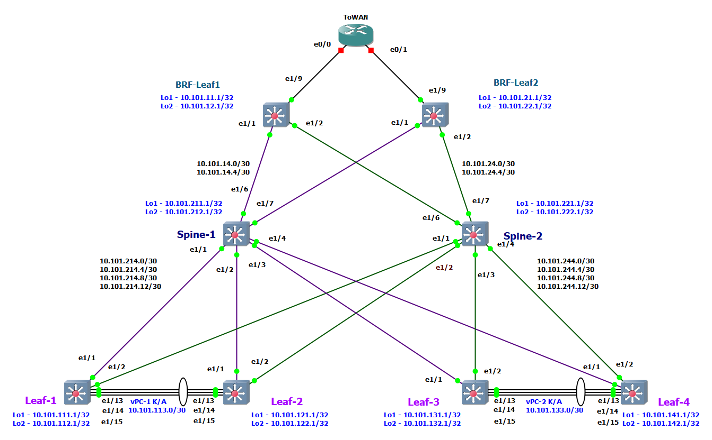
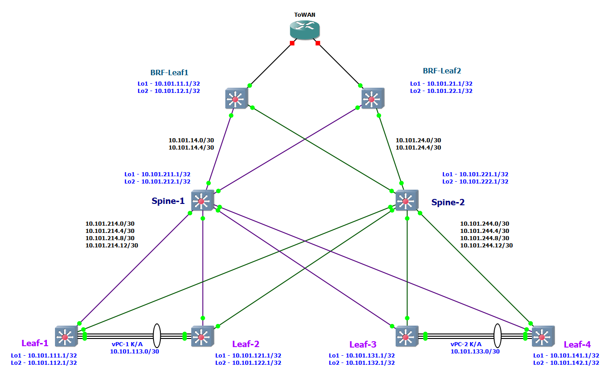

# LAB-1
(Механошин Алексей и Подлеснов Александр)

### Планирование адресного простраанства для ЦОД(а)ю

Общая сеть для всех ЦОД-ов (для трех): ```10.100.0.0/14```
 -  (Диапазон хостов 10.100.0.1 - 10.103.255.254 )

---


1) Сеть 10.100.0.0/16 Оставим в резерве.
2) Для первого ЦОД-а суммарное: ```10.101.0.0/16``` ( 10.101.0.1 - 10.101.255.254)
3) Для второго ЦОД-а суммарное: ```10.102.0.0/16``` (10.102.0.1 - 10.102.255.254)

### Таким образом план нумерации:

### IP = 10.10**D**.**S**xy.**M**zz

Где:
* D = номер ЦОД-а
* S = номер leaf/spine (**1** - leaf, **2**- spine)
* Mzz - значения по порядку 

В ```x``` третьего октета кодируем номер Leaf или Spine
* с **1** по **5**
* 0 - для Border Leaf

В ```y``` третьего октета кодируем:
* 1 - Loopback 1 для UNDERLAY 
* 2 - Loopback 2 для OVERLAY
* 3 - резерв, напрмер дял vPC keep-alive
* 4 - p2p линк
* 5 - сервисы

---
Loopack-s:

* ```10.101.111.1/32``` - ЦОД-1, Leaf-1,  Loopack - 1
* ```10.101.112.1/32``` - ЦОД-1, Leaf-1,  Loopack - 2
* ```10.101.121.1/32``` - ЦОД-1, Leaf-2,  Loopack - 1
* ```10.101.122.1/32``` - ЦОД-1, Leaf-2,  Loopack - 2
* ```10.101.131.1/32``` - ЦОД-1, Leaf-3,  Loopack - 1
* ```10.101.132.1/32``` - ЦОД-1, Leaf-3,  Loopack - 2
* ```10.101.141.1/32``` - ЦОД-1, Leaf-4,  Loopack - 1
* ```10.101.142.1/32``` - ЦОД-1, Leaf-4,  Loopack - 2
* ```10.101.211.1/32``` - ЦОД-1, Spine-1, Loopack - 1
* ```10.101.212.1/32``` - ЦОД-1, Spine-1, Loopack - 2
* ```10.101.221.1/32``` - ЦОД-1, Spine-2, Loopack - 1
* ```10.101.222.1/32``` - ЦОД-1, Spine-2, Loopack - 2

---
Border Leaf Loopacks:

* ```10.101.11.1``` - ЦОД-1, BRD-Leaf-1 Loopack-1
* ```10.101.12.1``` - ЦОД-1, BRD-Leaf-1 Loopack-2
* ```10.101.21.1``` - ЦОД-1, BRD-Leaf-2 Loopack-1
* ```10.101.22.1``` - ЦОД-1, BRD-Leaf-2 Loopack-2

---
Примеры сетей для vPC:

* ```10.101.113.0/30``` - vPC ЦОД-1, Leaf-1 to Leaf-2 (10.101.113.1 - 10.101.113.2)
* ```10.101.133.0/30``` - vPC ЦОД-1, Leaf-3 to Leaf-4 (10.101.133.1 - 10.101.133.2)

---
Cети P2P пиров, как и нумерация в октете идёт со стороны Spine:

* ```10.101.214.0/30``` - сеть в ЦОД-1, Spine-1 до Leaf-1 (10.101.214.1  - 10.101.214.2)
* ```10.101.214.4/30``` - сеть в ЦОД-1, Spine-1 до Leaf-2 (10.101.214.5  - 10.101.214.6)
* ```10.101.214.8/30``` - сеть в ЦОД-1, Spine-1 до Leaf-3 (10.101.214.9  - 10.101.214.10)
* ```10.101.214.12/30```- сеть в ЦОД-1, Spine-1 до Leaf-4 (10.101.214.13 - 10.101.214.14)
* ```10.101.224.0/30``` - сеть в ЦОД-1, Spine-2 до Leaf-1 (10.101.224.1  - 10.101.224.2)
* ```10.101.224.4/30``` - сеть в ЦОД-1, Spine-2 до Leaf-2 (10.101.224.5  - 10.101.224.6)
* ```10.101.224.8/30``` - сеть в ЦОД-1, Spine-2 до Leaf-3 (10.101.224.9  - 10.101.224.10)
* ```10.101.224.12/30```- сеть в ЦОД-1, Spine-2 до Leaf-4 (10.101.224.13 - 10.101.224.14)

Или в обратную сторону:
* ```10.101.214.0/30``` - сеть в ЦОД-1, Leaf-1 до Spine-1
* ```10.101.224.0/30``` - сеть в ЦОД-1, Leaf-1 до Spine-2
* ```10.101.214.4/30``` - сеть в ЦОД-1, Leaf-2 до Spine-1
* ```10.101.224.4/30``` - сеть в ЦОД-1, Leaf-2 до Spine-2
* ```10.101.214.8/30``` - сеть в ЦОД-1, Leaf-3 до Spine-1
* ```10.101.224.8/30``` - сеть в ЦОД-1, Leaf-3 до Spine-2
* ```10.101.214.12/30```- сеть в ЦОД-1, Leaf-4 до Spine-1
* ```10.101.224.12/30```- сеть в ЦОД-1, Leaf-4 до Spine-2

---
Сети BRD Leaf-Spine:
* ```10.101.14.0/30```  - сеть в ЦОД-1, Spine-1 до BRD-Leaf-1 (10.101.14.1 - 10.101.14.2)
* ```10.101.14.4/30```  - сеть в ЦОД-1, Spine-1 до BRD-Leaf-2 (10.101.14.5 - 10.101.14.6)
* ```10.101.24.0/30```  - сеть в ЦОД-1, Spine-2 до BRD-Leaf-1 (10.101.24.1 - 10.101.24.2)
* ```10.101.24.4/30```  - сеть в ЦОД-1, Spine-2 до BRD-Leaf-2 (10.101.24.5 - 10.101.24.6)

---

### IP установлены следующим образом:

Leaf-R1# sh ip int br
```
Interface            IP Address
Lo1                  10.101.111.1
Lo2                  10.101.112.1
Eth1/1               10.101.214.2
Eth1/2               10.101.224.2
Eth1/15              10.101.113.1
```

Leaf-R2# sh ip int br
```
Interface            IP Address
Lo1                  10.101.121.1
Lo2                  10.101.122.1
Eth1/1               10.101.214.6
Eth1/2               10.101.224.6
Eth1/15              10.101.113.2
```

Leaf-R3# sh ip int br
```
Interface            IP Address
Lo1                  10.101.131.1
Lo2                  10.101.132.1
Eth1/1               10.101.214.10
Eth1/2               10.101.224.10
Eth1/15              10.101.133.1
```

Leaf-R4# sh ip int br
```
Interface            IP Address
Lo1                  10.101.141.1
Lo2                  10.101.142.1
Eth1/1               10.101.214.14
Eth1/2               10.101.224.14
Eth1/15              10.101.133.2
```

Spine-R1# sh ip int br
```
Interface            IP Address
Lo1                  10.101.211.1
Lo2                  10.101.212.1
Eth1/1               10.101.214.1
Eth1/2               10.101.214.5
Eth1/3               10.101.214.9
Eth1/4               10.101.214.13
Eth1/6               10.101.14.1
Eth1/7               10.101.14.5
```

Spine-R2# sh ip int br
```
Interface            IP Address
Lo1                  10.101.221.1
Lo2                  10.101.222.1
Eth1/1               10.101.224.1
Eth1/2               10.101.224.5
Eth1/3               10.101.224.9
Eth1/4               10.101.224.13
Eth1/6               10.101.24.1
Eth1/7               10.101.24.5
```

BRF-Leaf-R1# sh ip int br
```
Interface            IP Address
Lo1                  10.101.11.1
Lo2                  10.101.12.1
Eth1/1               10.101.14.2
Eth1/2               10.101.24.2
```

BRD-Leaf-R2# sh ip int br
```
Interface            IP Address
Lo1                  10.101.21.1
Lo2                  10.101.22.1
Eth1/1               10.101.14.6
Eth1/2               10.101.24.6
```

---

Проверяем ping-ом со стороны **Spine-1**:
```
Spine-R1# ping 10.101.214.2 count 1
64 bytes from 10.101.214.2: icmp_seq=0 ttl=254 time=6.557 ms

Spine-R1# ping 10.101.214.6 count 1
64 bytes from 10.101.214.6: icmp_seq=0 ttl=254 time=7.713 ms

Spine-R1# ping 10.101.214.10 count 1
64 bytes from 10.101.214.10: icmp_seq=0 ttl=254 time=4.885 ms

Spine-R1# ping 10.101.214.14 count 1
64 bytes from 10.101.214.14: icmp_seq=0 ttl=254 time=5.437 ms

Spine-R1# ping 10.101.14.2 count 1
64 bytes from 10.101.14.2: icmp_seq=0 ttl=254 time=9.039 ms

Spine-R1# ping 10.101.14.6 count 1
64 bytes from 10.101.14.6: icmp_seq=0 ttl=254 time=9.829 ms
```

Проверяем ping-ом со стороны **Spine-2**:
```
Spine-R2# ping 10.101.224.1 count 1
64 bytes from 10.101.224.1: icmp_seq=0 ttl=255 time=3.019 ms

Spine-R2# ping 10.101.224.6 count 1
64 bytes from 10.101.224.6: icmp_seq=0 ttl=254 time=5.24 ms

Spine-R2# ping 10.101.224.10 count 1
64 bytes from 10.101.224.10: icmp_seq=0 ttl=254 time=6.429 ms

Spine-R2# ping 10.101.224.14 count 1
64 bytes from 10.101.224.14: icmp_seq=0 ttl=254 time=5.468 ms

Spine-R2# ping 10.101.24.2 count 1
64 bytes from 10.101.24.2: icmp_seq=0 ttl=254 time=8.096 ms

Spine-R2# ping 10.101.24.6 count 1
64 bytes from 10.101.24.6: icmp_seq=0 ttl=254 time=8.76 ms
```

Все проверки связности выполнены успешно.

### Выполнено в GNS3:




