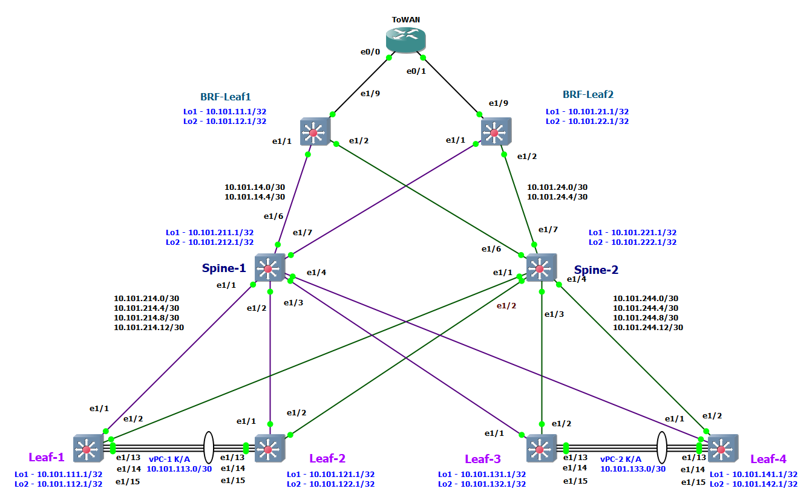

# Lab-2

## OSPF в UNDELAY сети

(Механошин Алексей и Подлеснов Александр)

---

Схема подключения осталась прежняя, как в LAB-1:



Как и план адрессного пространства.

<details>
Общая сеть для всех ЦОД-ов (для трех): ```10.100.0.0/14```

- (Диапазон хостов 10.100.0.1 - 10.103.255.254 )

1) Сеть 10.100.0.0/16 Оставим в резерве.
2) Для первого ЦОД-а суммарное: ```10.101.0.0/16``` ( 10.101.0.1 - 10.101.255.254)
3) Для второго ЦОД-а суммарное: ```10.102.0.0/16``` (10.102.0.1 - 10.102.255.254)

Таким образом план нумерации будет следуюший

IP = 10.10**D**.**S**xy.**M**zz

Где:

- D = номер ЦОД-а
- S = номер leaf/spine (**1** - leaf, **2**- spine)
- Mzz - значения по порядку

В ```x``` третьего октета кодируем номер Leaf или Spine

- с **1** по **5**
- 0 - для Border Leaf

В ```y``` третьего октета кодируем:

- 1 - Loopback 1 для UNDERLAY
- 2 - Loopback 2 для OVERLAY
- 3 - резерв, напрмер дял vPC keep-alive
- 4 - p2p линк
- 5 - сервисы

Loopack-s:

- ```10.101.111.1/32``` - ЦОД-1, Leaf-1,  Loopack - 1
- ```10.101.112.1/32``` - ЦОД-1, Leaf-1,  Loopack - 2
- ```10.101.121.1/32``` - ЦОД-1, Leaf-2,  Loopack - 1
- ```10.101.122.1/32``` - ЦОД-1, Leaf-2,  Loopack - 2
- ```10.101.131.1/32``` - ЦОД-1, Leaf-3,  Loopack - 1
- ```10.101.132.1/32``` - ЦОД-1, Leaf-3,  Loopack - 2
- ```10.101.141.1/32``` - ЦОД-1, Leaf-4,  Loopack - 1
- ```10.101.142.1/32``` - ЦОД-1, Leaf-4,  Loopack - 2
- ```10.101.211.1/32``` - ЦОД-1, Spine-1, Loopack - 1
- ```10.101.212.1/32``` - ЦОД-1, Spine-1, Loopack - 2
- ```10.101.221.1/32``` - ЦОД-1, Spine-2, Loopack - 1
- ```10.101.222.1/32``` - ЦОД-1, Spine-2, Loopack - 2

Border Leaf Loopacks:

- ```10.101.11.1``` - ЦОД-1, BRD-Leaf-1 Loopack-1
- ```10.101.12.1``` - ЦОД-1, BRD-Leaf-1 Loopack-2
- ```10.101.21.1``` - ЦОД-1, BRD-Leaf-2 Loopack-1
- ```10.101.22.1``` - ЦОД-1, BRD-Leaf-2 Loopack-2

Примеры сетей для vPC:

- ```10.101.113.0/30``` - vPC ЦОД-1, Leaf-1 to Leaf-2 (10.101.113.1 - 10.101.113.2)
- ```10.101.133.0/30``` - vPC ЦОД-1, Leaf-3 to Leaf-4 (10.101.133.1 - 10.101.133.2)

Cети P2P пиров, как и нумерация в октете идёт со стороны Spine:

- ```10.101.214.0/30``` - сеть в ЦОД-1, Spine-1 до Leaf-1 (10.101.214.1  - 10.101.214.2)
- ```10.101.214.4/30``` - сеть в ЦОД-1, Spine-1 до Leaf-2 (10.101.214.5  - 10.101.214.6)
- ```10.101.214.8/30``` - сеть в ЦОД-1, Spine-1 до Leaf-3 (10.101.214.9  - 10.101.214.10)
- ```10.101.214.12/30```- сеть в ЦОД-1, Spine-1 до Leaf-4 (10.101.214.13 - 10.101.214.14)
- ```10.101.224.0/30``` - сеть в ЦОД-1, Spine-2 до Leaf-1 (10.101.224.1  - 10.101.224.2)
- ```10.101.224.4/30``` - сеть в ЦОД-1, Spine-2 до Leaf-2 (10.101.224.5  - 10.101.224.6)
- ```10.101.224.8/30``` - сеть в ЦОД-1, Spine-2 до Leaf-3 (10.101.224.9  - 10.101.224.10)
- ```10.101.224.12/30```- сеть в ЦОД-1, Spine-2 до Leaf-4 (10.101.224.13 - 10.101.224.14)

Или в обратную сторону:

- ```10.101.214.0/30``` - сеть в ЦОД-1, Leaf-1 до Spine-1
- ```10.101.224.0/30``` - сеть в ЦОД-1, Leaf-1 до Spine-2
- ```10.101.214.4/30``` - сеть в ЦОД-1, Leaf-2 до Spine-1
- ```10.101.224.4/30``` - сеть в ЦОД-1, Leaf-2 до Spine-2
- ```10.101.214.8/30``` - сеть в ЦОД-1, Leaf-3 до Spine-1
- ```10.101.224.8/30``` - сеть в ЦОД-1, Leaf-3 до Spine-2
- ```10.101.214.12/30```- сеть в ЦОД-1, Leaf-4 до Spine-1
- ```10.101.224.12/30```- сеть в ЦОД-1, Leaf-4 до Spine-2

---
Сети BRD Leaf-Spine:

- ```10.101.14.0/30```  - сеть в ЦОД-1, Spine-1 до BRD-Leaf-1 (10.101.14.1 - 10.101.14.2)
- ```10.101.14.4/30```  - сеть в ЦОД-1, Spine-1 до BRD-Leaf-2 (10.101.14.5 - 10.101.14.6)
- ```10.101.24.0/30```  - сеть в ЦОД-1, Spine-2 до BRD-Leaf-1 (10.101.24.1 - 10.101.24.2)
- ```10.101.24.4/30```  - сеть в ЦОД-1, Spine-2 до BRD-Leaf-2 (10.101.24.5 - 10.101.24.6)

IP установлены следующим образом

Leaf-R1# sh ip int br

```text
Interface            IP Address
Lo1                  10.101.111.1
Lo2                  10.101.112.1
Eth1/1               10.101.214.2
Eth1/2               10.101.224.2
Eth1/15              10.101.113.1
```

Leaf-R2# sh ip int br

```text
Interface            IP Address
Lo1                  10.101.121.1
Lo2                  10.101.122.1
Eth1/1               10.101.214.6
Eth1/2               10.101.224.6
Eth1/15              10.101.113.2
```

Leaf-R3# sh ip int br

```text
Interface            IP Address
Lo1                  10.101.131.1
Lo2                  10.101.132.1
Eth1/1               10.101.214.10
Eth1/2               10.101.224.10
Eth1/15              10.101.133.1
```

Leaf-R4# sh ip int br

```text
Interface            IP Address
Lo1                  10.101.141.1
Lo2                  10.101.142.1
Eth1/1               10.101.214.14
Eth1/2               10.101.224.14
Eth1/15              10.101.133.2
```

Spine-R1# sh ip int br

```text
Interface            IP Address
Lo1                  10.101.211.1
Lo2                  10.101.212.1
Eth1/1               10.101.214.1
Eth1/2               10.101.214.5
Eth1/3               10.101.214.9
Eth1/4               10.101.214.13
Eth1/6               10.101.14.1
Eth1/7               10.101.14.5
```

Spine-R2# sh ip int br

```text
Interface            IP Address
Lo1                  10.101.221.1
Lo2                  10.101.222.1
Eth1/1               10.101.224.1
Eth1/2               10.101.224.5
Eth1/3               10.101.224.9
Eth1/4               10.101.224.13
Eth1/6               10.101.24.1
Eth1/7               10.101.24.5
```

BRF-Leaf-R1# sh ip int br

```text
Interface            IP Address
Lo1                  10.101.11.1
Lo2                  10.101.12.1
Eth1/1               10.101.14.2
Eth1/2               10.101.24.2
```

BRD-Leaf-R2# sh ip int br

```text
Interface            IP Address
Lo1                  10.101.21.1
Lo2                  10.101.22.1
Eth1/1               10.101.14.6
Eth1/2               10.101.24.6
```

<summary>
План адрессного пространства
<summary>
</details>


Прежде чем настраивать OSPF его необходимо его включить на всех устройствах в ЦОДе, - на примере Leaf-1, ибо настройки одинаковы дляя всех:

```
Leaf-R1# conf t
Enter configuration commands, one per line. End with CNTL/Z.
Leaf-R1(config)# feature ospf

```

Далее запускаем сам процес, прописываем на нем router-id совпадающий с IP Loopack1 и сразу прописываем что интерфейсы, кроме лупбэков, будут по умолчанию в пассивном режиме:

```
Leaf-R1(config)# router ospf UNDERLAY
Leaf-R1(config-router)# router-id 10.101.111.1
Leaf-R1(config-router)# passive-interface default
Leaf-R1(config-router)# exit
Leaf-R1(config)#
```

Сразу включим его на Loopack1:

```
Leaf-R1(config)# interface loopback1
Leaf-R1(config-if)# ip router ospf UNDERLAY area 0.0.0.0
Leaf-R1(config-if)# exit
Leaf-R1(config)# 
```

Далее на всех необходимых интерфейсах включаем ospf, выключив их из пассивности и указав область (area) и тип подключения ospf точка-точка:

```
Leaf-R1(config)# interface Ethernet1/1
Leaf-R1(config-if)# ip ospf network point-to-point
Leaf-R1(config-if)# ip router ospf UNDERLAY area 0.0.0.0
Leaf-R1(config-if)# no ip ospf passive-interface
Leaf-R1(config-if)# exit
Leaf-R1(config)# 
```

Настраиваем маршрутизатор, например мы хотим получать дефолтный маршрут с него.
Для наглядности назначим IP отличные от undelray сети.

```
ToWAN#conf t
Enter configuration commands, one per line.  End with CNTL/Z.
ToWAN(config)#interface Loopback1
ToWAN(config-if)#description Router-ID
ToWAN(config-if)#ip address 172.24.200.1 255.255.255.255
ToWAN(config-if)#exit
ToWAN(config)#
```

Запускаем OSPF, дефолт - интерфейсы в пассивном режиме.

```
ToWAN(config)#router ospf 10
ToWAN(config-router)#router-id 172.24.200.1
ToWAN(config-router)#passive-interface default
ToWAN(config-router)#no passive-interface Ethernet0/0
ToWAN(config-router)#no passive-interface Ethernet0/1
ToWAN(config-router)#exit
ToWAN(config)#
```

И настраиваем интерфейсы до Border-Leaf(s)

```
ToWAN(config)#interface Ethernet0/0
ToWAN(config-if)#ip address 172.24.1.2 255.255.255.252
ToWAN(config-if)#ip ospf network point-to-point
ToWAN(config-if)#ip ospf 10 area 0
ToWAN(config-if)#exit
ToWAN(config)#interface Ethernet0/1
ToWAN(config-if)#ip address 172.24.2.2 255.255.255.252
ToWAN(config-if)#ip ospf network point-to-point
ToWAN(config-if)#ip ospf 10 area 0
ToWAN(config-if)#exit
```

Добавим Loopack1 в ospf

```
ToWAN(config)#interface Loopback1
ToWAN(config-if)#ip ospf 10 area 0
ToWAN(config-if)#end
```

Проверяем соседство

```
ToWAN#sh ip ospf neighbor 

Neighbor ID     Pri   State           Dead Time   Address         Interface
10.101.21.1       0   FULL/  -        00:00:36    172.24.2.1      Ethernet0/1
10.101.11.1       0   FULL/  -        00:00:36    172.24.1.1      Ethernet0/0
ToWAN#
```

Для разнообразия добавим на маршрутизатор дефолтный маршрут и распространим его

```
ToWAN#conf t
Enter configuration commands, one per line.  End with CNTL/Z.
ToWAN(config)#ip route 0.0.0.0 0.0.0.0 Null0
ToWAN(config)#router ospf 10
ToWAN(config-router)#default-information originate
ToWAN(config-router)#exit
ToWAN(config)#exit
ToWAN#
```

Проверим соседство на Spine-1

```
Spine-R1# sh ip ospf neighbors 
 OSPF Process ID UNDERLAY VRF default
 Total number of neighbors: 6
 Neighbor ID     Pri State            Up Time  Address         Interface
 10.101.111.1      1 FULL/ -          3d08h    10.101.214.2    Eth1/1 
 10.101.121.1      1 FULL/ -          3d08h    10.101.214.6    Eth1/2 
 10.101.131.1      1 FULL/ -          3d08h    10.101.214.10   Eth1/3 
 10.101.141.1      1 FULL/ -          3d08h    10.101.214.14   Eth1/4 
 10.101.11.1       1 FULL/ -          3d05h    10.101.14.2     Eth1/6 
 10.101.21.1       1 FULL/ -          3d05h    10.101.14.6     Eth1/7 
Spine-R1# 
```

Проверим соседство на Spine-1

```
Spine-R2# sh ip ospf neighbors
 OSPF Process ID UNDERLAY VRF default
 Total number of neighbors: 6
 Neighbor ID     Pri State            Up Time  Address         Interface
 10.101.111.1      1 FULL/ -          3d07h    10.101.224.2    Eth1/1 
 10.101.121.1      1 FULL/ -          3d07h    10.101.224.6    Eth1/2 
 10.101.131.1      1 FULL/ -          3d07h    10.101.224.10   Eth1/3 
 10.101.141.1      1 FULL/ -          3d07h    10.101.224.14   Eth1/4 
 10.101.11.1       1 FULL/ -          3d05h    10.101.24.2     Eth1/6 
 10.101.21.1       1 FULL/ -          3d05h    10.101.24.6     Eth1/7 
Spine-R2# 
```

Проверим базу ospf на Leaf-1

```
Leaf-R1# sh ip ospf database 
        OSPF Router with ID (10.101.111.1) (Process ID UNDERLAY VRF default)

                Router Link States (Area 0.0.0.0)

Link ID         ADV Router      Age        Seq#       Checksum Link Count
10.101.11.1     10.101.11.1     42         0x800000e4 0x53aa   7   
10.101.21.1     10.101.21.1     35         0x800000ce 0x8360   7   
10.101.111.1    10.101.111.1    586        0x800000c5 0xed65   5   
10.101.121.1    10.101.121.1    593        0x800000c4 0x9b8a   5   
10.101.131.1    10.101.131.1    594        0x800000c2 0x09f0   5   
10.101.141.1    10.101.141.1    594        0x800000c3 0x705a   5   
10.101.211.1    10.101.211.1    1035       0x800000ad 0x949c   13  
10.101.221.1    10.101.221.1    1033       0x800000d6 0xc9a7   13  
172.24.200.1    172.24.200.1    36         0x800000a1 0x3730   5   

                Type-5 AS External Link States 

Link ID         ADV Router      Age        Seq#       Checksum Tag
0.0.0.0         172.24.200.1    43         0x80000004 0x8196    10

Leaf-R1# 

```

И маршруты которые нам добавил OSPF

```
Leaf-R1# sh ip route ospf-UNDERLAY 
IP Route Table for VRF "default"
'*' denotes best ucast next-hop
'**' denotes best mcast next-hop
'[x/y]' denotes [preference/metric]
'%<string>' in via output denotes VRF <string>

0.0.0.0/0, ubest/mbest: 2/0
    *via 10.101.214.1, Eth1/1, [110/1], 00:01:27, ospf-UNDERLAY, type-2, tag 10
    *via 10.101.224.1, Eth1/2, [110/1], 00:01:27, ospf-UNDERLAY, type-2, tag 10
10.101.11.1/32, ubest/mbest: 2/0
    *via 10.101.214.1, Eth1/1, [110/81], 3d06h, ospf-UNDERLAY, intra
    *via 10.101.224.1, Eth1/2, [110/81], 3d06h, ospf-UNDERLAY, intra
10.101.14.0/30, ubest/mbest: 1/0
    *via 10.101.214.1, Eth1/1, [110/80], 3d08h, ospf-UNDERLAY, intra
10.101.14.4/30, ubest/mbest: 1/0
    *via 10.101.214.1, Eth1/1, [110/80], 3d08h, ospf-UNDERLAY, intra
10.101.21.1/32, ubest/mbest: 2/0
    *via 10.101.214.1, Eth1/1, [110/81], 3d05h, ospf-UNDERLAY, intra
    *via 10.101.224.1, Eth1/2, [110/81], 3d05h, ospf-UNDERLAY, intra
10.101.24.0/30, ubest/mbest: 1/0
    *via 10.101.224.1, Eth1/2, [110/80], 3d07h, ospf-UNDERLAY, intra
10.101.24.4/30, ubest/mbest: 1/0
    *via 10.101.224.1, Eth1/2, [110/80], 3d07h, ospf-UNDERLAY, intra
10.101.121.1/32, ubest/mbest: 2/0
    *via 10.101.214.1, Eth1/1, [110/81], 3d08h, ospf-UNDERLAY, intra
    *via 10.101.224.1, Eth1/2, [110/81], 3d07h, ospf-UNDERLAY, intra
10.101.131.1/32, ubest/mbest: 2/0
    *via 10.101.214.1, Eth1/1, [110/81], 3d08h, ospf-UNDERLAY, intra
    *via 10.101.224.1, Eth1/2, [110/81], 3d07h, ospf-UNDERLAY, intra
10.101.141.1/32, ubest/mbest: 2/0
    *via 10.101.214.1, Eth1/1, [110/81], 3d08h, ospf-UNDERLAY, intra
    *via 10.101.224.1, Eth1/2, [110/81], 3d07h, ospf-UNDERLAY, intra
10.101.211.1/32, ubest/mbest: 1/0
    *via 10.101.214.1, Eth1/1, [110/41], 3d08h, ospf-UNDERLAY, intra
10.101.214.4/30, ubest/mbest: 1/0
    *via 10.101.214.1, Eth1/1, [110/80], 3d08h, ospf-UNDERLAY, intra
10.101.214.8/30, ubest/mbest: 1/0
    *via 10.101.214.1, Eth1/1, [110/80], 3d08h, ospf-UNDERLAY, intra
10.101.214.12/30, ubest/mbest: 1/0
    *via 10.101.214.1, Eth1/1, [110/80], 3d08h, ospf-UNDERLAY, intra
10.101.221.1/32, ubest/mbest: 1/0
    *via 10.101.224.1, Eth1/2, [110/41], 3d07h, ospf-UNDERLAY, intra
10.101.224.4/30, ubest/mbest: 1/0
    *via 10.101.224.1, Eth1/2, [110/80], 3d07h, ospf-UNDERLAY, intra
10.101.224.8/30, ubest/mbest: 1/0
    *via 10.101.224.1, Eth1/2, [110/80], 3d07h, ospf-UNDERLAY, intra
10.101.224.12/30, ubest/mbest: 1/0
    *via 10.101.224.1, Eth1/2, [110/80], 3d07h, ospf-UNDERLAY, intra
172.24.1.0/30, ubest/mbest: 2/0
    *via 10.101.214.1, Eth1/1, [110/120], 3d06h, ospf-UNDERLAY, intra
    *via 10.101.224.1, Eth1/2, [110/120], 3d06h, ospf-UNDERLAY, intra
172.24.2.0/30, ubest/mbest: 2/0
    *via 10.101.214.1, Eth1/1, [110/120], 3d05h, ospf-UNDERLAY, intra
    *via 10.101.224.1, Eth1/2, [110/120], 3d05h, ospf-UNDERLAY, intra
172.24.200.1/32, ubest/mbest: 2/0
    *via 10.101.214.1, Eth1/1, [110/121], 00:01:27, ospf-UNDERLAY, intra
    *via 10.101.224.1, Eth1/2, [110/121], 00:01:27, ospf-UNDERLAY, intra

Leaf-R1# 
```

Попробуем пропинговать Loopack на маршрутизаторе от IP локального Loopback

```
Leaf-R1# 
Leaf-R1# ping 172.24.200.1 source 10.101.111.1
PING 172.24.200.1 (172.24.200.1) from 10.101.111.1: 56 data bytes
64 bytes from 172.24.200.1: icmp_seq=0 ttl=252 time=22.898 ms
64 bytes from 172.24.200.1: icmp_seq=1 ttl=252 time=10.377 ms
64 bytes from 172.24.200.1: icmp_seq=2 ttl=252 time=13.001 ms
64 bytes from 172.24.200.1: icmp_seq=3 ttl=252 time=17.403 ms
64 bytes from 172.24.200.1: icmp_seq=4 ttl=252 time=13.901 ms

--- 172.24.200.1 ping statistics ---
5 packets transmitted, 5 packets received, 0.00% packet loss
round-trip min/avg/max = 10.377/15.515/22.898 ms
Leaf-R1# 
```

Так-же проверим что остальные Loopack в ЦОД-е у нас пингуются

```
"Leaf-2"
Leaf-R1# ping 10.101.121.1 source 10.101.111.1 count 1 
PING 10.101.121.1 (10.101.121.1) from 10.101.111.1: 56 data bytes
64 bytes from 10.101.121.1: icmp_seq=0 ttl=253 time=12.674 ms

"Leaf-3"
Leaf-R1# ping 10.101.131.1 source 10.101.111.1 count 1
PING 10.101.131.1 (10.101.131.1) from 10.101.111.1: 56 data bytes
64 bytes from 10.101.131.1: icmp_seq=0 ttl=253 time=14.483 ms

"Leaf-4"
Leaf-R1# ping 10.101.141.1 source 10.101.111.1 count 1
PING 10.101.141.1 (10.101.141.1) from 10.101.111.1: 56 data bytes
64 bytes from 10.101.141.1: icmp_seq=0 ttl=253 time=17.684 ms

"Spine-1"
Leaf-R1# ping 10.101.211.1 source 10.101.111.1 count 1
PING 10.101.211.1 (10.101.211.1) from 10.101.111.1: 56 data bytes
64 bytes from 10.101.211.1: icmp_seq=0 ttl=254 time=9.346 ms

"Spine-2"
Leaf-R1# ping 10.101.221.1 source 10.101.111.1 count 1
PING 10.101.221.1 (10.101.221.1) from 10.101.111.1: 56 data bytes
64 bytes from 10.101.221.1: icmp_seq=0 ttl=254 time=11.951 ms

"BRF-Leaf-R1"
Leaf-R1# ping 10.101.11.1 source 10.101.111.1 count 1
PING 10.101.11.1 (10.101.11.1) from 10.101.111.1: 56 data bytes
64 bytes from 10.101.11.1: icmp_seq=0 ttl=253 time=16.77 ms

"BRF-Leaf-R2"
Leaf-R1# ping 10.101.21.1 source 10.101.111.1 count 1
PING 10.101.21.1 (10.101.21.1) from 10.101.111.1: 56 data bytes
64 bytes from 10.101.21.1: icmp_seq=0 ttl=253 time=14.384 ms
Leaf-R1# 
```
Все Loopack-и доступны, связность установлена.

#### Настройки маршрутизаторов ####

<details>

```text
Leaf-R1# sh run

!Command: show running-config
!Running configuration last done at: Tue Nov 26 20:17:23 2024
!Time: Tue Nov 26 23:33:51 2024

version 9.3(8) Bios:version  
hostname Leaf-R1
vdc Leaf-R1 id 1
  limit-resource vlan minimum 16 maximum 4094
  limit-resource vrf minimum 2 maximum 4096
  limit-resource port-channel minimum 0 maximum 511
  limit-resource u4route-mem minimum 248 maximum 248
  limit-resource u6route-mem minimum 96 maximum 96
  limit-resource m4route-mem minimum 58 maximum 58
  limit-resource m6route-mem minimum 8 maximum 8

feature ospf
clock timezone PRM 5 0

no password strength-check
username admin password 5 $5$HIMIJM$qT5AXQEfCx.kdpdUF8dRHjlsjyL3TdgR9BhmK9uAYx7  role network-admin
no ip domain-lookup
copp profile strict
snmp-server user admin auth md5 0153448F0CDEAA7AC3D8A6E1207E29746751 priv 204F64F031BBA129B39DABB42F633F6C6872 localizedV2key engineID 128:0:0:9:3:12:159:0:0:27:1
rmon event 1 log trap public description FATAL(1) owner PMON@FATAL
rmon event 2 log trap public description CRITICAL(2) owner PMON@CRITICAL
rmon event 3 log trap public description ERROR(3) owner PMON@ERROR
rmon event 4 log trap public description WARNING(4) owner PMON@WARNING
rmon event 5 log trap public description INFORMATION(5) owner PMON@INFO

vlan 1

vrf context VRF_VPC-KEEPALIVE
  address-family ipv4 unicast
vrf context management
hardware access-list tcam region racl 256
hardware access-list tcam region vpc-convergence 256
hardware access-list tcam region arp-ether 256


interface Ethernet1/1
  description to_spine_1
  no switchport
  ip address 10.101.214.2/30
  ip ospf network point-to-point
  no ip ospf passive-interface
  ip router ospf UNDERLAY area 0.0.0.0
  no shutdown

interface Ethernet1/2
  description to_spine_2
  no switchport
  ip address 10.101.224.2/30
  ip ospf network point-to-point
  no ip ospf passive-interface
  ip router ospf UNDERLAY area 0.0.0.0
  no shutdown

interface Ethernet1/3
  shutdown

interface Ethernet1/4
  shutdown

interface Ethernet1/5
  shutdown

interface Ethernet1/6
  shutdown

interface Ethernet1/7
  shutdown

interface Ethernet1/8
  shutdown

interface Ethernet1/9
  shutdown

interface Ethernet1/10
  shutdown

interface Ethernet1/11
  shutdown

interface Ethernet1/12
  shutdown

interface Ethernet1/13
  shutdown

interface Ethernet1/14
  shutdown

interface Ethernet1/15
  description vPC K/A to_leaf-2
  no switchport
  vrf member VRF_VPC-KEEPALIVE
  ip address 10.101.113.1/30
  no shutdown

interface Ethernet1/16

interface Ethernet1/17

interface Ethernet1/18

interface Ethernet1/19

interface Ethernet1/20

interface Ethernet1/21

interface Ethernet1/22

interface Ethernet1/23

interface Ethernet1/24

interface Ethernet1/25

interface Ethernet1/26

interface Ethernet1/27

interface Ethernet1/28

interface Ethernet1/29

interface Ethernet1/30

interface Ethernet1/31

interface Ethernet1/32

interface Ethernet1/33

interface Ethernet1/34

interface Ethernet1/35

interface Ethernet1/36

interface Ethernet1/37

interface Ethernet1/38

interface Ethernet1/39

interface Ethernet1/40

interface Ethernet1/41

interface Ethernet1/42

interface Ethernet1/43

interface Ethernet1/44

interface Ethernet1/45

interface Ethernet1/46

interface Ethernet1/47

interface Ethernet1/48

interface Ethernet1/49

interface Ethernet1/50

interface Ethernet1/51

interface Ethernet1/52

interface Ethernet1/53

interface Ethernet1/54

interface Ethernet1/55

interface Ethernet1/56

interface Ethernet1/57

interface Ethernet1/58

interface Ethernet1/59

interface Ethernet1/60

interface Ethernet1/61

interface Ethernet1/62

interface Ethernet1/63

interface Ethernet1/64

interface mgmt0
  vrf member management

interface loopback1
  description # Router ID
  ip address 10.101.111.1/32
  ip router ospf UNDERLAY area 0.0.0.0

interface loopback2
  description # VTEP-ID
  ip address 10.101.112.1/32
icam monitor scale

cli alias name wr copy run start
cli alias name c conf term
cli alias name sir show ip route
cli alias name cef show forwarding ipv4 
cli alias name adj show ip adj
line console
  exec-timeout 0
  terminal length 48
  terminal width  186
line vty
boot nxos bootflash:/nxos.9.3.8.bin sup-1
router ospf UNDERLAY
  router-id 10.101.111.1
  passive-interface default


Leaf-R1#
```

<summary>
Leaf-1
<summary>
</details>

<details>

```
Leaf-R2# sh run

!Command: show running-config
!Running configuration last done at: Sat Nov 23 01:24:31 2024
!Time: Tue Nov 26 23:46:42 2024

version 9.3(8) Bios:version  
hostname Leaf-R2
vdc Leaf-R2 id 1
  limit-resource vlan minimum 16 maximum 4094
  limit-resource vrf minimum 2 maximum 4096
  limit-resource port-channel minimum 0 maximum 511
  limit-resource u4route-mem minimum 248 maximum 248
  limit-resource u6route-mem minimum 96 maximum 96
  limit-resource m4route-mem minimum 58 maximum 58
  limit-resource m6route-mem minimum 8 maximum 8

feature ospf
clock timezone PRM 5 0

no password strength-check
username admin password 5 $5$GILIBL$I50uIEZ2.Id5WPuEW2/kF2LnprBS1fD4bK7PLYdXCs4  role network-admin
no ip domain-lookup
copp profile strict
snmp-server user admin auth md5 042F0B626D2474725C91211D7B2226CDBDEA priv 040F77425611450B4490383F363A768CEBA9 localizedV2key engineID 128:0:0:9:3:12:22:0:0:27:1
rmon event 1 log trap public description FATAL(1) owner PMON@FATAL
rmon event 2 log trap public description CRITICAL(2) owner PMON@CRITICAL
rmon event 3 log trap public description ERROR(3) owner PMON@ERROR
rmon event 4 log trap public description WARNING(4) owner PMON@WARNING
rmon event 5 log trap public description INFORMATION(5) owner PMON@INFO

vlan 1

vrf context VRF_VPC-KEEPALIVE
  address-family ipv4 unicast
vrf context management
hardware access-list tcam region racl 256
hardware access-list tcam region vpc-convergence 256


interface Ethernet1/1
  description to_spine_1
  no switchport
  ip address 10.101.214.6/30
  ip ospf network point-to-point
  no ip ospf passive-interface
  ip router ospf UNDERLAY area 0.0.0.0
  no shutdown

interface Ethernet1/2
  description to_spine_2
  no switchport
  ip address 10.101.224.6/30
  ip ospf network point-to-point
  no ip ospf passive-interface
  ip router ospf UNDERLAY area 0.0.0.0
  no shutdown

interface Ethernet1/3
  shutdown

interface Ethernet1/4
  shutdown

interface Ethernet1/5
  shutdown

interface Ethernet1/6
  shutdown

interface Ethernet1/7
  shutdown

interface Ethernet1/8
  shutdown

interface Ethernet1/9
  shutdown

interface Ethernet1/10
  shutdown

interface Ethernet1/11
  shutdown

interface Ethernet1/12
  shutdown

interface Ethernet1/13
  description vPC Po1 to leaf-1
  shutdown

interface Ethernet1/14
  description vPC Po1 to leaf-1
  shutdown

interface Ethernet1/15
  description vPC K/A to_leaf-1
  no switchport
  vrf member VRF_VPC-KEEPALIVE
  ip address 10.101.113.2/30
  no shutdown

interface Ethernet1/16

interface Ethernet1/17

interface Ethernet1/18

interface Ethernet1/19

interface Ethernet1/20

interface Ethernet1/21

interface Ethernet1/22

interface Ethernet1/23

interface Ethernet1/24

interface Ethernet1/25

interface Ethernet1/26

interface Ethernet1/27

interface Ethernet1/28

interface Ethernet1/29

interface Ethernet1/30

interface Ethernet1/31

interface Ethernet1/32

interface Ethernet1/33

interface Ethernet1/34

interface Ethernet1/35

interface Ethernet1/36

interface Ethernet1/37

interface Ethernet1/38

interface Ethernet1/39

interface Ethernet1/40

interface Ethernet1/41

interface Ethernet1/42

interface Ethernet1/43

interface Ethernet1/44

interface Ethernet1/45

interface Ethernet1/46

interface Ethernet1/47

interface Ethernet1/48

interface Ethernet1/49

interface Ethernet1/50

interface Ethernet1/51

interface Ethernet1/52

interface Ethernet1/53

interface Ethernet1/54

interface Ethernet1/55

interface Ethernet1/56

interface Ethernet1/57

interface Ethernet1/58

interface Ethernet1/59

interface Ethernet1/60

interface Ethernet1/61

interface Ethernet1/62

interface Ethernet1/63

interface Ethernet1/64

interface mgmt0
  vrf member management

interface loopback1
  description # Router ID
  ip address 10.101.121.1/32
  ip router ospf UNDERLAY area 0.0.0.0

interface loopback2
  description # VTEP-ID
  ip address 10.101.122.1/32
icam monitor scale

cli alias name wr copy run start
cli alias name c conf term
cli alias name sir show ip route
line console
  exec-timeout 0
  terminal length 48
  terminal width  186
line vty
boot nxos bootflash:/nxos.9.3.8.bin sup-1
router ospf UNDERLAY
  router-id 10.101.121.1
  passive-interface default


Leaf-R2#
```

<summary>
Leaf-2
<summary>
</details>

<details>

```
Leaf-R3# sh run

!Command: show running-config
!Running configuration last done at: Sat Nov 23 01:28:15 2024
!Time: Tue Nov 26 23:46:46 2024

version 9.3(8) Bios:version  
hostname Leaf-R3
vdc Leaf-R3 id 1
  limit-resource vlan minimum 16 maximum 4094
  limit-resource vrf minimum 2 maximum 4096
  limit-resource port-channel minimum 0 maximum 511
  limit-resource u4route-mem minimum 248 maximum 248
  limit-resource u6route-mem minimum 96 maximum 96
  limit-resource m4route-mem minimum 58 maximum 58
  limit-resource m6route-mem minimum 8 maximum 8

feature ospf
clock timezone PRM 5 0

no password strength-check
username admin password 5 $5$MLCBMA$/FmotzYqQwdMEJQGtVLJtp3JkUAzX/Me2FliX2AYk38  role network-admin
ip domain-lookup
copp profile strict
snmp-server user admin auth md5 0071FC9DD80C21F0E05AEDD7D7A8ADA024A4 priv 3209C8E6BC345CF9ED32FE94D0BCAA9125B4 localizedV2key engineID 128:0:0:9:3:12:56:0:0:27:1
rmon event 1 log trap public description FATAL(1) owner PMON@FATAL
rmon event 2 log trap public description CRITICAL(2) owner PMON@CRITICAL
rmon event 3 log trap public description ERROR(3) owner PMON@ERROR
rmon event 4 log trap public description WARNING(4) owner PMON@WARNING
rmon event 5 log trap public description INFORMATION(5) owner PMON@INFO

vlan 1

vrf context VRF_VPC-KEEPALIVE
vrf context management

interface Ethernet1/1
  description to_spine_1
  no switchport
  ip address 10.101.214.10/30
  ip ospf network point-to-point
  no ip ospf passive-interface
  ip router ospf UNDERLAY area 0.0.0.0
  no shutdown

interface Ethernet1/2
  description to_spine_2
  no switchport
  ip address 10.101.224.10/30
  ip ospf network point-to-point
  no ip ospf passive-interface
  ip router ospf UNDERLAY area 0.0.0.0
  no shutdown

interface Ethernet1/3
  shutdown

interface Ethernet1/4
  shutdown

interface Ethernet1/5
  shutdown

interface Ethernet1/6
  shutdown

interface Ethernet1/7
  shutdown

interface Ethernet1/8
  shutdown

interface Ethernet1/9
  shutdown

interface Ethernet1/10
  shutdown

interface Ethernet1/11
  shutdown

interface Ethernet1/12
  shutdown

interface Ethernet1/13
  description vPC Po1 to_leaf-4
  shutdown

interface Ethernet1/14
  description vPC Po1 to_leaf-4
  shutdown

interface Ethernet1/15
  description vPC K/A to_leaf-4
  no switchport
  vrf member VRF_VPC-KEEPALIVE
  ip address 10.101.133.1/30
  no shutdown

interface Ethernet1/16

interface Ethernet1/17

interface Ethernet1/18

interface Ethernet1/19

interface Ethernet1/20

interface Ethernet1/21

interface Ethernet1/22

interface Ethernet1/23

interface Ethernet1/24

interface Ethernet1/25

interface Ethernet1/26

interface Ethernet1/27

interface Ethernet1/28

interface Ethernet1/29

interface Ethernet1/30

interface Ethernet1/31

interface Ethernet1/32

interface Ethernet1/33

interface Ethernet1/34

interface Ethernet1/35

interface Ethernet1/36

interface Ethernet1/37

interface Ethernet1/38

interface Ethernet1/39

interface Ethernet1/40

interface Ethernet1/41

interface Ethernet1/42

interface Ethernet1/43

interface Ethernet1/44

interface Ethernet1/45

interface Ethernet1/46

interface Ethernet1/47

interface Ethernet1/48

interface Ethernet1/49

interface Ethernet1/50

interface Ethernet1/51

interface Ethernet1/52

interface Ethernet1/53

interface Ethernet1/54

interface Ethernet1/55

interface Ethernet1/56

interface Ethernet1/57

interface Ethernet1/58

interface Ethernet1/59

interface Ethernet1/60

interface Ethernet1/61

interface Ethernet1/62

interface Ethernet1/63

interface Ethernet1/64

interface mgmt0
  vrf member management

interface loopback1
  description # Router-ID
  ip address 10.101.131.1/32
  ip router ospf UNDERLAY area 0.0.0.0

interface loopback2
  description # VTEP-ID
  ip address 10.101.132.1/32
icam monitor scale

cli alias name wr copy run start
cli alias name c conf term
cli alias name sir show ip route
line console
  exec-timeout 0
  terminal length 48
  terminal width  186
line vty
boot nxos bootflash:/nxos.9.3.8.bin sup-1
router ospf UNDERLAY
  router-id 10.101.131.1
  passive-interface default


Leaf-R3#
```

<summary>
Leaf-3
<summary>
</details>

<details>

```
Leaf-R4# sh run

!Command: show running-config
!Running configuration last done at: Sat Nov 23 01:52:01 2024
!Time: Tue Nov 26 23:47:39 2024

version 9.3(8) Bios:version  
hostname Leaf-R4
vdc Leaf-R4 id 1
  limit-resource vlan minimum 16 maximum 4094
  limit-resource vrf minimum 2 maximum 4096
  limit-resource port-channel minimum 0 maximum 511
  limit-resource u4route-mem minimum 248 maximum 248
  limit-resource u6route-mem minimum 96 maximum 96
  limit-resource m4route-mem minimum 58 maximum 58
  limit-resource m6route-mem minimum 8 maximum 8

feature ospf
clock timezone PRM 5 0

no password strength-check
username admin password 5 $5$BDBCEE$74zNdCRevQ.jaXtPvMgU3sqqUKyzxCYbO8iNikWmj9D  role network-admin
ip domain-lookup
copp profile strict
snmp-server user admin auth md5 494710BA78F370F1A7A09EC13507B82FC249 priv 1748459848CB1184D7D38CC22B7CFB659E0B localizedV2key engineID 128:0:0:9:3:12:37:0:0:27:1
rmon event 1 log trap public description FATAL(1) owner PMON@FATAL
rmon event 2 log trap public description CRITICAL(2) owner PMON@CRITICAL
rmon event 3 log trap public description ERROR(3) owner PMON@ERROR
rmon event 4 log trap public description WARNING(4) owner PMON@WARNING
rmon event 5 log trap public description INFORMATION(5) owner PMON@INFO

vlan 1

vrf context VRF_VPC-KEEPALIVE
vrf context management

interface Ethernet1/1
  description to_spine_1
  no switchport
  ip address 10.101.214.14/30
  ip ospf network point-to-point
  no ip ospf passive-interface
  ip router ospf UNDERLAY area 0.0.0.0
  no shutdown

interface Ethernet1/2
  description to_spine_2
  no switchport
  ip address 10.101.224.14/30
  ip ospf network point-to-point
  no ip ospf passive-interface
  ip router ospf UNDERLAY area 0.0.0.0
  no shutdown

interface Ethernet1/3
  shutdown

interface Ethernet1/4
  shutdown

interface Ethernet1/5
  shutdown

interface Ethernet1/6
  shutdown

interface Ethernet1/7
  shutdown

interface Ethernet1/8
  shutdown

interface Ethernet1/9
  shutdown

interface Ethernet1/10
  shutdown

interface Ethernet1/11
  shutdown

interface Ethernet1/12
  shutdown

interface Ethernet1/13
  description vPC Po1 to_leaf-3
  shutdown

interface Ethernet1/14
  description vPC Po1 to_leaf-3
  shutdown

interface Ethernet1/15
  description vPC K/A to_leaf-3
  no switchport
  vrf member VRF_VPC-KEEPALIVE
  ip address 10.101.133.2/30
  no shutdown

interface Ethernet1/16

interface Ethernet1/17

interface Ethernet1/18

interface Ethernet1/19

interface Ethernet1/20

interface Ethernet1/21

interface Ethernet1/22

interface Ethernet1/23

interface Ethernet1/24

interface Ethernet1/25

interface Ethernet1/26

interface Ethernet1/27

interface Ethernet1/28

interface Ethernet1/29

interface Ethernet1/30

interface Ethernet1/31

interface Ethernet1/32

interface Ethernet1/33

interface Ethernet1/34

interface Ethernet1/35

interface Ethernet1/36

interface Ethernet1/37

interface Ethernet1/38

interface Ethernet1/39

interface Ethernet1/40

interface Ethernet1/41

interface Ethernet1/42

interface Ethernet1/43

interface Ethernet1/44

interface Ethernet1/45

interface Ethernet1/46

interface Ethernet1/47

interface Ethernet1/48

interface Ethernet1/49

interface Ethernet1/50

interface Ethernet1/51

interface Ethernet1/52

interface Ethernet1/53

interface Ethernet1/54

interface Ethernet1/55

interface Ethernet1/56

interface Ethernet1/57

interface Ethernet1/58

interface Ethernet1/59

interface Ethernet1/60

interface Ethernet1/61

interface Ethernet1/62

interface Ethernet1/63

interface Ethernet1/64

interface mgmt0
  vrf member management

interface loopback1
  description # Router-ID
  ip address 10.101.141.1/32
  ip router ospf UNDERLAY area 0.0.0.0

interface loopback2
  description # VTEP-ID
  ip address 10.101.142.1/32
icam monitor scale

cli alias name wr copy run start
cli alias name c conf term
cli alias name sir show ip route
line console
  exec-timeout 0
  terminal length 48
  terminal width  186
line vty
boot nxos bootflash:/nxos.9.3.8.bin sup-1
router ospf UNDERLAY
  router-id 10.101.141.1
  passive-interface default


Leaf-R4#
```

<summary>
Leaf-4
<summary>
</details>

<details>

```
Spine-R1# sh run

!Command: show running-config
!Running configuration last done at: Tue Nov 26 23:07:47 2024
!Time: Tue Nov 26 23:50:13 2024

version 9.3(8) Bios:version  
hostname Spine-R1
vdc Spine-R1 id 1
  limit-resource vlan minimum 16 maximum 4094
  limit-resource vrf minimum 2 maximum 4096
  limit-resource port-channel minimum 0 maximum 511
  limit-resource u4route-mem minimum 248 maximum 248
  limit-resource u6route-mem minimum 96 maximum 96
  limit-resource m4route-mem minimum 58 maximum 58
  limit-resource m6route-mem minimum 8 maximum 8

feature ospf
clock timezone PRM 5 0

no password strength-check
username admin password 5 $5$OIECKA$eCLImHYIAUQ9wzeor80qlwAVQYm/.ZlN27uAmI7/1IB  role network-admin
no ip domain-lookup
copp profile strict
snmp-server user admin auth md5 055F766176D1E6DAD4EE126B80F38ACA8E66 priv 483F7A661AC389D78EE04856D6ACADB9EA76 localizedV2key engineID 128:0:0:9:3:12:216:0:0:27:1
rmon event 1 log trap public description FATAL(1) owner PMON@FATAL
rmon event 2 log trap public description CRITICAL(2) owner PMON@CRITICAL
rmon event 3 log trap public description ERROR(3) owner PMON@ERROR
rmon event 4 log trap public description WARNING(4) owner PMON@WARNING
rmon event 5 log trap public description INFORMATION(5) owner PMON@INFO

vlan 1

vrf context management

interface Ethernet1/1
  description to_leaf_1
  no switchport
  ip address 10.101.214.1/30
  ip ospf network point-to-point
  no ip ospf passive-interface
  ip router ospf UNDERLAY area 0.0.0.0
  no shutdown

interface Ethernet1/2
  description to_leaf_2
  no switchport
  ip address 10.101.214.5/30
  ip ospf network point-to-point
  no ip ospf passive-interface
  ip router ospf UNDERLAY area 0.0.0.0
  no shutdown

interface Ethernet1/3
  description to_leaf_3
  no switchport
  ip address 10.101.214.9/30
  ip ospf network point-to-point
  no ip ospf passive-interface
  ip router ospf UNDERLAY area 0.0.0.0
  no shutdown

interface Ethernet1/4
  description to_leaf_4
  no switchport
  ip address 10.101.214.13/30
  ip ospf network point-to-point
  no ip ospf passive-interface
  ip router ospf UNDERLAY area 0.0.0.0
  no shutdown

interface Ethernet1/5
  shutdown

interface Ethernet1/6
  description to_brdleaf-1
  no switchport
  ip address 10.101.14.1/30
  ip ospf network point-to-point
  no ip ospf passive-interface
  ip router ospf UNDERLAY area 0.0.0.0
  no shutdown

interface Ethernet1/7
  description to_brdleaf-2
  no switchport
  ip address 10.101.14.5/30
  ip ospf network point-to-point
  no ip ospf passive-interface
  ip router ospf UNDERLAY area 0.0.0.0
  no shutdown

interface Ethernet1/8
  shutdown

interface Ethernet1/9
  shutdown

interface Ethernet1/10

interface Ethernet1/11

interface Ethernet1/12

interface Ethernet1/13

interface Ethernet1/14

interface Ethernet1/15

interface Ethernet1/16

interface Ethernet1/17

interface Ethernet1/18

interface Ethernet1/19

interface Ethernet1/20

interface Ethernet1/21

interface Ethernet1/22

interface Ethernet1/23

interface Ethernet1/24

interface Ethernet1/25

interface Ethernet1/26

interface Ethernet1/27

interface Ethernet1/28

interface Ethernet1/29

interface Ethernet1/30

interface Ethernet1/31

interface Ethernet1/32

interface Ethernet1/33

interface Ethernet1/34

interface Ethernet1/35

interface Ethernet1/36

interface Ethernet1/37

interface Ethernet1/38

interface Ethernet1/39

interface Ethernet1/40

interface Ethernet1/41

interface Ethernet1/42

interface Ethernet1/43

interface Ethernet1/44

interface Ethernet1/45

interface Ethernet1/46

interface Ethernet1/47

interface Ethernet1/48

interface Ethernet1/49

interface Ethernet1/50

interface Ethernet1/51

interface Ethernet1/52

interface Ethernet1/53

interface Ethernet1/54

interface Ethernet1/55

interface Ethernet1/56

interface Ethernet1/57

interface Ethernet1/58

interface Ethernet1/59

interface Ethernet1/60

interface Ethernet1/61

interface Ethernet1/62

interface Ethernet1/63

interface Ethernet1/64

interface mgmt0
  vrf member management

interface loopback1
  description # Router ID
  ip address 10.101.211.1/32
  ip router ospf UNDERLAY area 0.0.0.0

interface loopback2
  description # VTEP-ID
  ip address 10.101.212.1/32
icam monitor scale

cli alias name wr copy run start
cli alias name c conf term
cli alias name sir show ip route
cli alias name cef show forwarding ipv4 
cli alias name adj show ip adj
cli alias name hash show routing hash
cli alias name fadj show forwarding adjacency
cli alias name srr show run | sec router
line console
  exec-timeout 0
  terminal length 48
  terminal width  186
line vty
boot nxos bootflash:/nxos.9.3.8.bin sup-1
router ospf UNDERLAY
  router-id 10.101.211.1
  maximum-paths 2
  passive-interface default


Spine-R1#
```

<summary>
Spine-1
<summary>
</details>

<details>

```
Spine-R2# sh run

!Command: show running-config
!Running configuration last done at: Tue Nov 26 18:08:23 2024
!Time: Tue Nov 26 18:51:42 2024

version 9.3(8) Bios:version  
hostname Spine-R2
vdc Spine-R2 id 1
  limit-resource vlan minimum 16 maximum 4094
  limit-resource vrf minimum 2 maximum 4096
  limit-resource port-channel minimum 0 maximum 511
  limit-resource u4route-mem minimum 248 maximum 248
  limit-resource u6route-mem minimum 96 maximum 96
  limit-resource m4route-mem minimum 58 maximum 58
  limit-resource m6route-mem minimum 8 maximum 8

feature ospf

no password strength-check
username admin password 5 $5$PEIEFP$MPKQtVARlyYowD1AGfD7kttGnjbI5D92bO1H5HAKt4C  role network-admin
ip domain-lookup
copp profile strict
snmp-server user admin auth md5 1779710CBD3CD4D9906FA7637BD9A4AAC204 priv 4973727EC11CEFECA116BF6262FBE9B29245 localizedV2key engineID 128:0:0:9:3:12:251:0:0:27:1
rmon event 1 log trap public description FATAL(1) owner PMON@FATAL
rmon event 2 log trap public description CRITICAL(2) owner PMON@CRITICAL
rmon event 3 log trap public description ERROR(3) owner PMON@ERROR
rmon event 4 log trap public description WARNING(4) owner PMON@WARNING
rmon event 5 log trap public description INFORMATION(5) owner PMON@INFO

vlan 1

vrf context management

interface Ethernet1/1
  description to_leaf_1
  no switchport
  ip address 10.101.224.1/30
  ip ospf network point-to-point
  no ip ospf passive-interface
  ip router ospf UNDERLAY area 0.0.0.0
  no shutdown

interface Ethernet1/2
  description to_leaf_2
  no switchport
  ip address 10.101.224.5/30
  ip ospf network point-to-point
  no ip ospf passive-interface
  ip router ospf UNDERLAY area 0.0.0.0
  no shutdown

interface Ethernet1/3
  description to_leaf_3
  no switchport
  ip address 10.101.224.9/30
  ip ospf network point-to-point
  no ip ospf passive-interface
  ip router ospf UNDERLAY area 0.0.0.0
  no shutdown

interface Ethernet1/4
  description to_leaf_4
  no switchport
  ip address 10.101.224.13/30
  ip ospf network point-to-point
  no ip ospf passive-interface
  ip router ospf UNDERLAY area 0.0.0.0
  no shutdown

interface Ethernet1/5
  shutdown

interface Ethernet1/6
  description to_brdleaf-1
  no switchport
  ip address 10.101.24.1/30
  ip ospf network point-to-point
  no ip ospf passive-interface
  ip router ospf UNDERLAY area 0.0.0.0
  no shutdown

interface Ethernet1/7
  description to_brdleaf-2
  no switchport
  ip address 10.101.24.5/30
  ip ospf network point-to-point
  no ip ospf passive-interface
  ip router ospf UNDERLAY area 0.0.0.0
  no shutdown

interface Ethernet1/8
  shutdown

interface Ethernet1/9
  shutdown

interface Ethernet1/10

interface Ethernet1/11

interface Ethernet1/12

interface Ethernet1/13

interface Ethernet1/14

interface Ethernet1/15

interface Ethernet1/16

interface Ethernet1/17

interface Ethernet1/18

interface Ethernet1/19

interface Ethernet1/20

interface Ethernet1/21

interface Ethernet1/22

interface Ethernet1/23

interface Ethernet1/24

interface Ethernet1/25

interface Ethernet1/26

interface Ethernet1/27

interface Ethernet1/28

interface Ethernet1/29

interface Ethernet1/30

interface Ethernet1/31

interface Ethernet1/32

interface Ethernet1/33

interface Ethernet1/34

interface Ethernet1/35

interface Ethernet1/36

interface Ethernet1/37

interface Ethernet1/38

interface Ethernet1/39

interface Ethernet1/40

interface Ethernet1/41

interface Ethernet1/42

interface Ethernet1/43

interface Ethernet1/44

interface Ethernet1/45

interface Ethernet1/46

interface Ethernet1/47

interface Ethernet1/48

interface Ethernet1/49

interface Ethernet1/50

interface Ethernet1/51

interface Ethernet1/52

interface Ethernet1/53

interface Ethernet1/54

interface Ethernet1/55

interface Ethernet1/56

interface Ethernet1/57

interface Ethernet1/58

interface Ethernet1/59

interface Ethernet1/60

interface Ethernet1/61

interface Ethernet1/62

interface Ethernet1/63

interface Ethernet1/64

interface mgmt0
  vrf member management

interface loopback1
  description # Router ID
  ip address 10.101.221.1/32
  ip router ospf UNDERLAY area 0.0.0.0

interface loopback2
  description # VTEP-ID
  ip address 10.101.222.1/32
icam monitor scale

cli alias name wr copy run start
cli alias name c conf term
cli alias name sir show ip route
line console
  exec-timeout 0
  terminal length 48
  terminal width  186
line vty
boot nxos bootflash:/nxos.9.3.8.bin sup-1
router ospf UNDERLAY
  router-id 10.101.221.1
  maximum-paths 2
  passive-interface default


Spine-R2#
```

<summary>
Spine-2
<summary>
</details>

<details>

```
BRF-Leaf-R1# sh run

!Command: show running-config
!No configuration change since last restart
!Time: Tue Nov 26 23:51:46 2024

version 9.3(8) Bios:version  
hostname BRF-Leaf-R1
vdc BRF-Leaf-R1 id 1
  limit-resource vlan minimum 16 maximum 4094
  limit-resource vrf minimum 2 maximum 4096
  limit-resource port-channel minimum 0 maximum 511
  limit-resource u4route-mem minimum 248 maximum 248
  limit-resource u6route-mem minimum 96 maximum 96
  limit-resource m4route-mem minimum 58 maximum 58
  limit-resource m6route-mem minimum 8 maximum 8

feature ospf
clock timezone PRM 5 0

no password strength-check
username admin password 5 $5$MIDGHI$2nFpqu8C1skfYJz.nfv1.xMRxcwGOkEBjf3WOrg50kB  role network-admin
no ip domain-lookup
copp profile strict
snmp-server user admin auth md5 3763E49E7388DDE1EE6ED8E11043B7613B48 priv 3239A4DB7EDE89AAAA62D4BD1817E56D6717 localizedV2key engineID 128:0:0:9:3:12:205:0:0:27:1
rmon event 1 log trap public description FATAL(1) owner PMON@FATAL
rmon event 2 log trap public description CRITICAL(2) owner PMON@CRITICAL
rmon event 3 log trap public description ERROR(3) owner PMON@ERROR
rmon event 4 log trap public description WARNING(4) owner PMON@WARNING
rmon event 5 log trap public description INFORMATION(5) owner PMON@INFO

vlan 1

vrf context management

interface Ethernet1/1
  description to_spine-1
  no switchport
  ip address 10.101.14.2/30
  ip ospf network point-to-point
  no ip ospf passive-interface
  ip router ospf UNDERLAY area 0.0.0.0
  no shutdown

interface Ethernet1/2
  description to_spine-2
  no switchport
  ip address 10.101.24.2/30
  ip ospf network point-to-point
  no ip ospf passive-interface
  ip router ospf UNDERLAY area 0.0.0.0
  no shutdown

interface Ethernet1/3
  shutdown

interface Ethernet1/4
  shutdown

interface Ethernet1/5
  description to_switch
  no switchport
  ip address 192.168.55.1/30
  no shutdown

interface Ethernet1/6
  shutdown

interface Ethernet1/7
  shutdown

interface Ethernet1/8
  shutdown

interface Ethernet1/9
  description to_wan
  no switchport
  speed 1000
  duplex full
  ip address 172.24.1.1/30
  ip ospf network point-to-point
  no ip ospf passive-interface
  ip router ospf UNDERLAY area 0.0.0.0
  no shutdown

interface Ethernet1/10

interface Ethernet1/11

interface Ethernet1/12

interface Ethernet1/13

interface Ethernet1/14

interface Ethernet1/15

interface Ethernet1/16

interface Ethernet1/17

interface Ethernet1/18

interface Ethernet1/19

interface Ethernet1/20

interface Ethernet1/21

interface Ethernet1/22

interface Ethernet1/23

interface Ethernet1/24

interface Ethernet1/25

interface Ethernet1/26

interface Ethernet1/27

interface Ethernet1/28

interface Ethernet1/29

interface Ethernet1/30

interface Ethernet1/31

interface Ethernet1/32

interface Ethernet1/33

interface Ethernet1/34

interface Ethernet1/35

interface Ethernet1/36

interface Ethernet1/37

interface Ethernet1/38

interface Ethernet1/39

interface Ethernet1/40

interface Ethernet1/41

interface Ethernet1/42

interface Ethernet1/43

interface Ethernet1/44

interface Ethernet1/45

interface Ethernet1/46

interface Ethernet1/47

interface Ethernet1/48

interface Ethernet1/49

interface Ethernet1/50

interface Ethernet1/51

interface Ethernet1/52

interface Ethernet1/53

interface Ethernet1/54

interface Ethernet1/55

interface Ethernet1/56

interface Ethernet1/57

interface Ethernet1/58

interface Ethernet1/59

interface Ethernet1/60

interface Ethernet1/61

interface Ethernet1/62

interface Ethernet1/63

interface Ethernet1/64

interface mgmt0
  vrf member management

interface loopback1
  description # Router ID
  ip address 10.101.11.1/32
  ip router ospf UNDERLAY area 0.0.0.0

interface loopback2
  description # VTEP-ID
  ip address 10.101.12.1/32
icam monitor scale

cli alias name wr copy run start
cli alias name c conf term
cli alias name sir show ip route
line console
  exec-timeout 0
  terminal length 48
  terminal width  186
line vty
boot nxos bootflash:/nxos.9.3.8.bin sup-1
router ospf UNDERLAY
  router-id 10.101.11.1
  passive-interface default


BRF-Leaf-R1#
```

<summary>
BRD-Leaf-1
<summary>
</details>

<details>

```
BRD-Leaf-R2# sh run

!Command: show running-config
!No configuration change since last restart
!Time: Tue Nov 26 23:53:05 2024

version 9.3(8) Bios:version  
hostname BRD-Leaf-R2
vdc BRD-Leaf-R2 id 1
  limit-resource vlan minimum 16 maximum 4094
  limit-resource vrf minimum 2 maximum 4096
  limit-resource port-channel minimum 0 maximum 511
  limit-resource u4route-mem minimum 248 maximum 248
  limit-resource u6route-mem minimum 96 maximum 96
  limit-resource m4route-mem minimum 58 maximum 58
  limit-resource m6route-mem minimum 8 maximum 8

feature ospf
clock timezone PRM 5 0

no password strength-check
username admin password 5 $5$ACNBEF$17/UC5AByWpXNbBSvnuvJloYBoV9atZRzW.oDYLwnr5  role network-admin
no ip domain-lookup
copp profile strict
snmp-server user admin auth md5 3752D36F5DECF4F5D19CE99D2745ADFDA765 priv 3756B50865C39086B7F9D2F641D5132E760C localizedV2key engineID 128:0:0:9:3:12:33:0:0:27:1
rmon event 1 log trap public description FATAL(1) owner PMON@FATAL
rmon event 2 log trap public description CRITICAL(2) owner PMON@CRITICAL
rmon event 3 log trap public description ERROR(3) owner PMON@ERROR
rmon event 4 log trap public description WARNING(4) owner PMON@WARNING
rmon event 5 log trap public description INFORMATION(5) owner PMON@INFO

vlan 1

vrf context management

interface Ethernet1/1
  description to_spine-1
  no switchport
  ip address 10.101.14.6/30
  ip ospf network point-to-point
  no ip ospf passive-interface
  ip router ospf UNDERLAY area 0.0.0.0
  no shutdown

interface Ethernet1/2
  description to_spine-2
  no switchport
  ip address 10.101.24.6/30
  ip ospf network point-to-point
  no ip ospf passive-interface
  ip router ospf UNDERLAY area 0.0.0.0
  no shutdown

interface Ethernet1/3
  shutdown

interface Ethernet1/4
  shutdown

interface Ethernet1/5
  shutdown

interface Ethernet1/6
  shutdown

interface Ethernet1/7
  shutdown

interface Ethernet1/8
  shutdown

interface Ethernet1/9
  description to_wan
  no switchport
  speed 1000
  duplex full
  ip address 172.24.2.1/30
  ip ospf network point-to-point
  no ip ospf passive-interface
  ip router ospf UNDERLAY area 0.0.0.0
  no shutdown

interface Ethernet1/10

interface Ethernet1/11

interface Ethernet1/12

interface Ethernet1/13

interface Ethernet1/14

interface Ethernet1/15

interface Ethernet1/16

interface Ethernet1/17

interface Ethernet1/18

interface Ethernet1/19

interface Ethernet1/20

interface Ethernet1/21

interface Ethernet1/22

interface Ethernet1/23

interface Ethernet1/24

interface Ethernet1/25

interface Ethernet1/26

interface Ethernet1/27

interface Ethernet1/28

interface Ethernet1/29

interface Ethernet1/30

interface Ethernet1/31

interface Ethernet1/32

interface Ethernet1/33

interface Ethernet1/34

interface Ethernet1/35

interface Ethernet1/36

interface Ethernet1/37

interface Ethernet1/38

interface Ethernet1/39

interface Ethernet1/40

interface Ethernet1/41

interface Ethernet1/42

interface Ethernet1/43

interface Ethernet1/44

interface Ethernet1/45

interface Ethernet1/46

interface Ethernet1/47

interface Ethernet1/48

interface Ethernet1/49

interface Ethernet1/50

interface Ethernet1/51

interface Ethernet1/52

interface Ethernet1/53

interface Ethernet1/54

interface Ethernet1/55

interface Ethernet1/56

interface Ethernet1/57

interface Ethernet1/58

interface Ethernet1/59

interface Ethernet1/60

interface Ethernet1/61

interface Ethernet1/62

interface Ethernet1/63

interface Ethernet1/64

interface mgmt0
  vrf member management

interface loopback1
  description # Router ID
  ip address 10.101.21.1/32
  ip router ospf UNDERLAY area 0.0.0.0

interface loopback2
  description # VTEP-ID
  ip address 10.101.22.1/32
icam monitor scale

cli alias name wr copy run start
cli alias name c conf term
cli alias name sir show ip route
line console
  exec-timeout 0
  terminal length 48
  terminal width  186
line vty
boot nxos bootflash:/nxos.9.3.8.bin sup-1
router ospf UNDERLAY
  router-id 10.101.21.1
  passive-interface default


BRD-Leaf-R2#
```

<summary>
BRD-Leaf-2
<summary>
</details>


<details>

```
ToWAN#sh run br
Building configuration...

Current configuration : 2016 bytes
!
version 17.12
service timestamps debug datetime msec
service timestamps log datetime msec
!
hostname ToWAN
!
boot-start-marker
boot-end-marker
!
!
logging console warnings
no aaa new-model
!
!
!
clock timezone PRM 5 0
no ip icmp rate-limit unreachable
!
!
!
!         
!
!
!
!
!
!
no ip domain lookup
ip cef
login on-success log
no ipv6 cef
!
!
!
!
!
!
!
!
multilink bundle-name authenticated
!
!
crypto pki trustpoint TP-self-signed-2043905
 enrollment selfsigned
 subject-name cn=IOS-Self-Signed-Certificate-2043905
 revocation-check none
 rsakeypair TP-self-signed-2043905
 hash sha256
!
!
crypto pki certificate chain TP-self-signed-2043905
 certificate self-signed 01
!
!
memory free low-watermark processor 55011
!
!
spanning-tree mode rapid-pvst
!
!
!
!
!
!
!
! 
!         
!
!
!
!
!
!
!
!
!
!
!
!
!
!
interface Loopback1
 description Router-ID
 ip address 172.24.200.1 255.255.255.255
 ip ospf 10 area 0
!
interface Ethernet0/0
 ip address 172.24.1.2 255.255.255.252
 ip ospf network point-to-point
 ip ospf 10 area 0
!
interface Ethernet0/1
 ip address 172.24.2.2 255.255.255.252
 ip ospf network point-to-point
 ip ospf 10 area 0
!
interface Ethernet0/2
 no ip address
 shutdown
!
interface Ethernet0/3
 no ip address
 shutdown
!
interface Ethernet1/0
 no ip address
 shutdown
!
interface Ethernet1/1
 ip address 192.168.100.2 255.255.255.252
 no ip redirects
 shutdown
!         
interface Ethernet1/2
 no ip address
 shutdown
!
interface Ethernet1/3
 no ip address
 shutdown
!
router ospf 10
 router-id 172.24.200.1
 passive-interface default
 no passive-interface Ethernet0/0
 no passive-interface Ethernet0/1
 default-information originate
!
ip forward-protocol nd
!
ip tcp synwait-time 5
!
ip http server
ip http secure-server
ip route 0.0.0.0 0.0.0.0 Null0
ip ssh bulk-mode 131072
!
!
!
!
!
control-plane
!
!
alias exec c conf t
!
line con 0
 exec-timeout 0 0
 privilege level 15
 logging synchronous
line aux 0
 exec-timeout 0 0
 privilege level 15
 logging synchronous
line vty 0 4
 login
 transport input ssh
!
!         
!
!
end

ToWAN#
```

<summary>
WAN Router
<summary>
</details>

