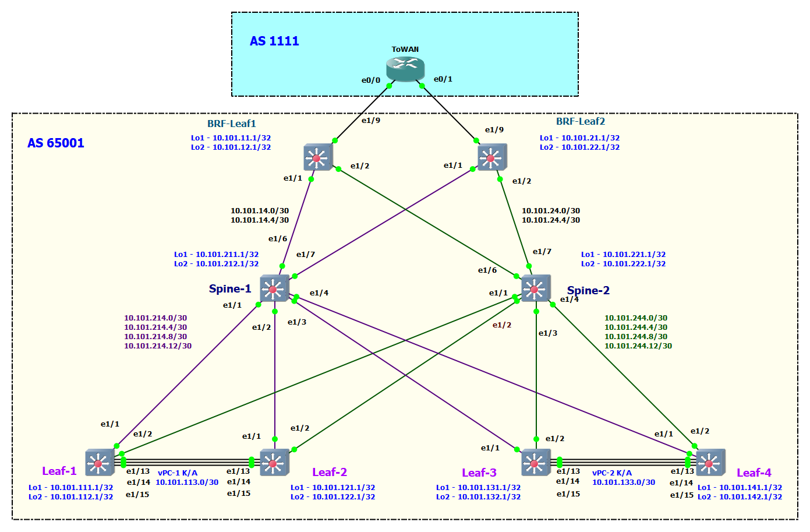

# Lab-4

## iBGP в UNDELAY сети

(Механошин Алексей и Подлеснов Александр)

---

Схема подключения осталась прежняя, как в LAB-2


Как и план адрессного пространства.

<details>
 <summary>План адрессного пространства</summary>

Общая сеть для всех ЦОД-ов (для трех): ```10.100.0.0/14```

- (Диапазон хостов 10.100.0.1 - 10.103.255.254 )

1) Сеть 10.100.0.0/16 Оставим в резерве.
2) Для первого ЦОД-а суммарное: ```10.101.0.0/16``` (10.101.0.1 - 10.101.255.254)
3) Для второго ЦОД-а суммарное: ```10.102.0.0/16``` (10.102.0.1 - 10.102.255.254)

Таким образом план нумерации будет следуюший

IP = 10.10**D**.**S**xy.**M**zz

Где:

- D = номер ЦОД-а
- S = номер leaf/spine (**1** - leaf, **2**- spine)
- Mzz - значения по порядку

В ```x``` третьего октета кодируем номер Leaf или Spine

- с **1** по **5**
- 0 - для Border Leaf

В ```y``` третьего октета кодируем:

- 1 - Loopback 1 для UNDERLAY
- 2 - Loopback 2 для OVERLAY
- 3 - резерв, напрмер дял vPC keep-alive
- 4 - p2p линк
- 5 - сервисы

Loopack-s:

- ```10.101.111.1/32``` - ЦОД-1, Leaf-1,  Loopack - 1
- ```10.101.112.1/32``` - ЦОД-1, Leaf-1,  Loopack - 2
- ```10.101.121.1/32``` - ЦОД-1, Leaf-2,  Loopack - 1
- ```10.101.122.1/32``` - ЦОД-1, Leaf-2,  Loopack - 2
- ```10.101.131.1/32``` - ЦОД-1, Leaf-3,  Loopack - 1
- ```10.101.132.1/32``` - ЦОД-1, Leaf-3,  Loopack - 2
- ```10.101.141.1/32``` - ЦОД-1, Leaf-4,  Loopack - 1
- ```10.101.142.1/32``` - ЦОД-1, Leaf-4,  Loopack - 2
- ```10.101.211.1/32``` - ЦОД-1, Spine-1, Loopack - 1
- ```10.101.212.1/32``` - ЦОД-1, Spine-1, Loopack - 2
- ```10.101.221.1/32``` - ЦОД-1, Spine-2, Loopack - 1
- ```10.101.222.1/32``` - ЦОД-1, Spine-2, Loopack - 2

Border Leaf Loopacks:

- ```10.101.11.1``` - ЦОД-1, BRD-Leaf-1 Loopack-1
- ```10.101.12.1``` - ЦОД-1, BRD-Leaf-1 Loopack-2
- ```10.101.21.1``` - ЦОД-1, BRD-Leaf-2 Loopack-1
- ```10.101.22.1``` - ЦОД-1, BRD-Leaf-2 Loopack-2

Примеры сетей для vPC:

- ```10.101.113.0/30``` - vPC ЦОД-1, Leaf-1 to Leaf-2 (10.101.113.1 - 10.101.113.2)
- ```10.101.133.0/30``` - vPC ЦОД-1, Leaf-3 to Leaf-4 (10.101.133.1 - 10.101.133.2)

Cети P2P пиров, как и нумерация в октете идёт со стороны Spine:

- ```10.101.214.0/30``` - сеть в ЦОД-1, Spine-1 до Leaf-1 (10.101.214.1  - 10.101.214.2)
- ```10.101.214.4/30``` - сеть в ЦОД-1, Spine-1 до Leaf-2 (10.101.214.5  - 10.101.214.6)
- ```10.101.214.8/30``` - сеть в ЦОД-1, Spine-1 до Leaf-3 (10.101.214.9  - 10.101.214.10)
- ```10.101.214.12/30```- сеть в ЦОД-1, Spine-1 до Leaf-4 (10.101.214.13 - 10.101.214.14)
- ```10.101.224.0/30``` - сеть в ЦОД-1, Spine-2 до Leaf-1 (10.101.224.1  - 10.101.224.2)
- ```10.101.224.4/30``` - сеть в ЦОД-1, Spine-2 до Leaf-2 (10.101.224.5  - 10.101.224.6)
- ```10.101.224.8/30``` - сеть в ЦОД-1, Spine-2 до Leaf-3 (10.101.224.9  - 10.101.224.10)
- ```10.101.224.12/30```- сеть в ЦОД-1, Spine-2 до Leaf-4 (10.101.224.13 - 10.101.224.14)

Или в обратную сторону:

- ```10.101.214.0/30``` - сеть в ЦОД-1, Leaf-1 до Spine-1
- ```10.101.224.0/30``` - сеть в ЦОД-1, Leaf-1 до Spine-2
- ```10.101.214.4/30``` - сеть в ЦОД-1, Leaf-2 до Spine-1
- ```10.101.224.4/30``` - сеть в ЦОД-1, Leaf-2 до Spine-2
- ```10.101.214.8/30``` - сеть в ЦОД-1, Leaf-3 до Spine-1
- ```10.101.224.8/30``` - сеть в ЦОД-1, Leaf-3 до Spine-2
- ```10.101.214.12/30```- сеть в ЦОД-1, Leaf-4 до Spine-1
- ```10.101.224.12/30```- сеть в ЦОД-1, Leaf-4 до Spine-2

---
Сети BRD Leaf-Spine:

- ```10.101.14.0/30```  - сеть в ЦОД-1, Spine-1 до BRD-Leaf-1 (10.101.14.1 - 10.101.14.2)
- ```10.101.14.4/30```  - сеть в ЦОД-1, Spine-1 до BRD-Leaf-2 (10.101.14.5 - 10.101.14.6)
- ```10.101.24.0/30```  - сеть в ЦОД-1, Spine-2 до BRD-Leaf-1 (10.101.24.1 - 10.101.24.2)
- ```10.101.24.4/30```  - сеть в ЦОД-1, Spine-2 до BRD-Leaf-2 (10.101.24.5 - 10.101.24.6)

IP установлены следующим образом

Leaf-R1# sh ip int br

```text
Interface            IP Address
Lo1                  10.101.111.1
Lo2                  10.101.112.1
Eth1/1               10.101.214.2
Eth1/2               10.101.224.2
Eth1/15              10.101.113.1
```

Leaf-R2# sh ip int br

```text
Interface            IP Address
Lo1                  10.101.121.1
Lo2                  10.101.122.1
Eth1/1               10.101.214.6
Eth1/2               10.101.224.6
Eth1/15              10.101.113.2
```

Leaf-R3# sh ip int br

```text
Interface            IP Address
Lo1                  10.101.131.1
Lo2                  10.101.132.1
Eth1/1               10.101.214.10
Eth1/2               10.101.224.10
Eth1/15              10.101.133.1
```

Leaf-R4# sh ip int br

```text
Interface            IP Address
Lo1                  10.101.141.1
Lo2                  10.101.142.1
Eth1/1               10.101.214.14
Eth1/2               10.101.224.14
Eth1/15              10.101.133.2
```

Spine-R1# sh ip int br

```text
Interface            IP Address
Lo1                  10.101.211.1
Lo2                  10.101.212.1
Eth1/1               10.101.214.1
Eth1/2               10.101.214.5
Eth1/3               10.101.214.9
Eth1/4               10.101.214.13
Eth1/6               10.101.14.1
Eth1/7               10.101.14.5
```

Spine-R2# sh ip int br

```text
Interface            IP Address
Lo1                  10.101.221.1
Lo2                  10.101.222.1
Eth1/1               10.101.224.1
Eth1/2               10.101.224.5
Eth1/3               10.101.224.9
Eth1/4               10.101.224.13
Eth1/6               10.101.24.1
Eth1/7               10.101.24.5
```

BRF-Leaf-R1# sh ip int br

```text
Interface            IP Address
Lo1                  10.101.11.1
Lo2                  10.101.12.1
Eth1/1               10.101.14.2
Eth1/2               10.101.24.2
```

BRD-Leaf-R2# sh ip int br

```text
Interface            IP Address
Lo1                  10.101.21.1
Lo2                  10.101.22.1
Eth1/1               10.101.14.6
Eth1/2               10.101.24.6
```

</details>

Особенности iBGP:

1. Все автономные системы имеют одинаковый номер AS но должны иметь свой уникальный router-id
2. Необходима полная связность всех коммутаторов друг с другом, или необходимо использовать Route Refletor(s)
3. Next-Hop не меняется при прохождении маршрута между роутерами/коммутаторами, поэтому на спайне будем анонсировать все маршруты до лифов.

Первым делом включаем необходимые фичи:

```text
feature bgp
```

Для визуального удобства составим таблицу идентификаторов по всем нашим устройствам:

| Устройство  | IP Loopback1  |
| ----------- | ------------- |
| Leaf-1      | 10.101.111.1  |
| Leaf-2      | 10.101.121.1  |
| Leaf-3      | 10.101.131.1  |
| Leaf-4      | 10.101.141.1  |
| Spine-1     | 10.101.211.1  |
| Spine-2     | 10.101.221.1  |
| Brd-Leaf-1  | 10.101.11.1   |
| Brd-Leaf-2  | 10.101.21.1   |
| ToWan       | 172.24.200.1  |

Дальнейшая настройка на коммутаторах в целом одинакова, за исключением  локального идентификатора 'router-id' и названия шаблонов.

```text
Leaf-R1# conf t
Enter configuration commands, one per line. End with CNTL/Z.
Leaf-R1(config)# router bgp  65001
Leaf-R1(config-router)# router-id 10.101.111.1
Leaf-R1(config-router)# log-neighbor-changes
```

Создадим шаблон который будет использоваться всеми нашими пирами.
Поскольку это у нас Leaf то шаблон назовем 'SPINES', для спайнов соотвественно будет 'LEAFS'

```text
Leaf-R1(config-router)# template peer SPINES
Leaf-R1(config-router-neighbor)# remote-as 65001
Leaf-R1(config-router-neighbor)# description Spine Template
Leaf-R1(config-router-neighbor)# timers 10 30
Leaf-R1(config-router-neighbor)# address-family ipv4 unicast
Leaf-R1(config-router-neighbor-af)# exit
Leaf-R1(config-router-neighbor)# exit
Leaf-R1(config-router)#
```

### Примечание: 'address-family ipv4 unicast' необходим для указания что мы используем для связи с пирами именно IPv4 - и это обязательная настройка

Далее прописываем сами пиры указав использовать наш шаблон:

```text
Leaf-R1(config-router)# 
Leaf-R1(config-router)# neighbor 10.101.214.1
Leaf-R1(config-router-neighbor)# inherit peer SPINES
Leaf-R1(config-router-neighbor)# description Spine-1
Leaf-R1(config-router-neighbor)# exit
Leaf-R1(config-router)# neighbor 10.101.224.1
Leaf-R1(config-router-neighbor)# inherit peer SPINES
Leaf-R1(config-router-neighbor)# description Spine-2
Leaf-R1(config-router-neighbor)# exit
Leaf-R1(config-router)# 
```

Так-же необходимо проанонсировать наш Loopack указав IP и маску, и указать что путей у нас будет два до всех остальных устройств (по количеству спайнов в данной сети)

```text
Leaf-R1(config-router)# address-family ipv4 unicast
Leaf-R1(config-router-af)# network 10.101.111.1/32
Leaf-R1(config-router-af)# maximum-paths ibgp 2
Leaf-R1(config-router-af)# exit
Leaf-R1(config-router)# end

```

Итоговая конфигурация iBGP на Leaf-1:

```text
router bgp 65001
  router-id 10.101.111.1
  log-neighbor-changes
  address-family ipv4 unicast
    network 10.101.111.1/32
    maximum-paths ibgp 2
  template peer SPINES
    remote-as 65001
    description Spine Template
    timers 10 30
    address-family ipv4 unicast
  neighbor 10.101.214.1
    inherit peer SPINES
    description Spine-1
  neighbor 10.101.224.1
    inherit peer SPINES
    description Spine-2
```

Для спайнов-же нам необходимо дополнително указать все connected сети до лифов,
 или можно их просто редистрибутить, а так-же указать что лифы будут роут-рефлекторами.

Первым делом в address-family а далее можно или указываем все сетки до всех лифов,
 или просто редистрибутим но необходим route-map но для него нужен prefix-list в котором будут опять-же эти сети:

```text
Spine-R1# c
Enter configuration commands, one per line. End with CNTL/Z.
Spine-R1(config)# ip prefix-list DIRECT_TO_BGP description Reditributed connected networks to BGP
Spine-R1(config)# ip prefix-list DIRECT_TO_BGP permit 10.101.14.0/30
Spine-R1(config)# ip prefix-list DIRECT_TO_BGP permit 10.101.14.4/30
Spine-R1(config)# ip prefix-list DIRECT_TO_BGP permit 10.101.214.0/30
Spine-R1(config)# ip prefix-list DIRECT_TO_BGP permit 10.101.214.4/30
Spine-R1(config)# ip prefix-list DIRECT_TO_BGP permit 10.101.214.8/30
Spine-R1(config)# ip prefix-list DIRECT_TO_BGP permit 10.101.214.12/30
Spine-R1(config)# 
Spine-R1(config)# route-map DIRECT_TO_BGP permit 10
Spine-R1(config-route-map)# match ip address prefix-list DIRECT_TO_BGP
Spine-R1(config-route-map)# exit
Spine-R1(config)# 
Spine-R1(config)# router bgp 65001
Spine-R1(config-router)# router-id 10.101.211.1
Spine-R1(config-router)# address-family ipv4 unicast
Spine-R1(config-router-af)# network 10.101.211.1/32
Spine-R1(config-router-af)# redistribute direct route-map DIRECT_TO_BGP
Spine-R1(config-router-af)# exit
Spine-R1(config-router)# 
```

Пропишем шаблон для лифов, указав что они клиенты роут-рефлектора:

```text
Spine-R1(config-router)# template peer LEAFS
Spine-R1(config-router-neighbor)# remote-as 65001
Spine-R1(config-router-neighbor)# description Leaf template
Spine-R1(config-router-neighbor)# timers 10 30
Spine-R1(config-router-neighbor)# address-family ipv4 unicast
Spine-R1(config-router-neighbor-af)# route-reflector-client
Spine-R1(config-router-neighbor-af)# exit
Spine-R1(config-router-neighbor)# exit
Spine-R1(config-router)# 
```

Далее прописываем наши пиры:

```text
Spine-R1(config-router)# neighbor 10.101.214.2
Spine-R1(config-router-neighbor)# inherit peer LEAFS
Spine-R1(config-router-neighbor)# description Leaf-1
Spine-R1(config-router-neighbor)# exit
Spine-R1(config-router)# 
...
```

На втором спайне пропишим сети до лифов просто сетями, остальное там аналогично первому спайну:

```text
Spine-R2# conf term
Enter configuration commands, one per line. End with CNTL/Z.
Spine-R2(config)# router bgp 65001
Spine-R2(config-router)# router-id 10.101.221.1
Spine-R2(config-router)# address-family ipv4 unicast
Spine-R2(config-router-af)# network 10.101.221.1/32
Spine-R2(config-router-af)# network 10.101.24.0/30
Spine-R2(config-router-af)# network 10.101.24.4/30
Spine-R2(config-router-af)# network 10.101.224.0/30
Spine-R2(config-router-af)# network 10.101.224.4/30
Spine-R2(config-router-af)# network 10.101.224.8/30
Spine-R2(config-router-af)# network 10.101.224.12/30
Spine-R2(config-router-af)#
...
```

Отдельно стоит сказатиь что роутер ToWAN мы в данной схеме подключаем как eBGP,
 и соответственно на бордер-лифах необходимо проанонсировать как /30 сеть до роутера,
 так и отдельно это подключение прописать.

1. Указываем как Loopack так и сеть до роутера:

   ```text
   router bgp 65001
     router-id 10.101.11.1
     log-neighbor-changes
     address-family ipv4 unicast
       network 10.101.11.1/32
       network 172.24.1.0/30
   ```

2. Отдельно пропишем пир:

   ```text
   BRF-Leaf-R1(config-router)# neighbor 172.24.1.2
   BRF-Leaf-R1(config-router-neighbor)# remote-as 1111
   BRF-Leaf-R1(config-router-neighbor)# description to_ToWAN
   BRF-Leaf-R1(config-router-neighbor)# timers 10 30
   BRF-Leaf-R1(config-router-neighbor)# address-family ipv4 unicast
   BRF-Leaf-R1(config-router-neighbor-af)# exit
   BRF-Leaf-R1(config-router-neighbor)# exit
   BRF-Leaf-R1(config-router)# 
   ```

На роутере ToWAN настройка тоже довольно тривиальна, единственное что дополнительно прописан `default-information originate` для передачи дефолтного маршрута в сторону 65001:

```text
ToWAN#sh run | sec router
router bgp 1111
 bgp router-id 172.24.200.1
 bgp log-neighbor-changes
 neighbor 172.24.1.1 remote-as 65001
 neighbor 172.24.2.1 remote-as 65001
 !
 address-family ipv4
  network 172.24.200.1 mask 255.255.255.255
  redistribute static
  neighbor 172.24.1.1 activate
  neighbor 172.24.2.1 activate
  maximum-paths 2
  default-information originate
 exit-address-family
ToWAN#
```

Примечание: `redistribute static` нам тут нужен для загрузки статики дефолта указанного как `ip route 0.0.0.0 0.0.0.0 Null0`

Сразу и проверим какой у нас маршрут до Loopack Leaf-1:

```text
ToWAN#sh ip route | b 10.101.111.1
B        10.101.111.1/32 [20/0] via 172.24.2.1, 02:07:33
                         [20/0] via 172.24.1.1, 02:07:33
```

Оба маршрута в сторону бордеров есть в таблице маршрутизации.

```text
ToWAN#ping 10.101.111.1 source lo1
Type escape sequence to abort.
Sending 5, 100-byte ICMP Echos to 10.101.111.1, timeout is 2 seconds:
Packet sent with a source address of 172.24.200.1 
!!!!!
Success rate is 100 percent (5/5), round-trip min/avg/max = 6/8/12 ms
ToWAN#
```

И пинги до него с нашего анонсированного Loopack тоже проходят.

<details>
<summary>Проверим что все пингуется</summary>

```text
ToWAN#ping 10.101.11.1 source Loopback 1 repeat 1
Type escape sequence to abort.
Sending 1, 100-byte ICMP Echos to 10.101.11.1, timeout is 2 seconds:
Packet sent with a source address of 172.24.200.1 
!
Success rate is 100 percent (1/1), round-trip min/avg/max = 6/6/6 ms

ToWAN#ping 10.101.21.1 source Loopback 1 repeat 1
Type escape sequence to abort.
Sending 1, 100-byte ICMP Echos to 10.101.21.1, timeout is 2 seconds:
Packet sent with a source address of 172.24.200.1 
!
Success rate is 100 percent (1/1), round-trip min/avg/max = 3/3/3 ms

ToWAN#ping 10.101.111.1 source Loopback 1 repeat 1
Type escape sequence to abort.
Sending 1, 100-byte ICMP Echos to 10.101.111.1, timeout is 2 seconds:
Packet sent with a source address of 172.24.200.1 
!
Success rate is 100 percent (1/1), round-trip min/avg/max = 12/12/12 ms

ToWAN#ping 10.101.121.1 source Loopback 1 repeat 1
Type escape sequence to abort.
Sending 1, 100-byte ICMP Echos to 10.101.121.1, timeout is 2 seconds:
Packet sent with a source address of 172.24.200.1 
!
Success rate is 100 percent (1/1), round-trip min/avg/max = 20/20/20 ms

ToWAN#ping 10.101.131.1 source Loopback 1 repeat 1
Type escape sequence to abort.
Sending 1, 100-byte ICMP Echos to 10.101.131.1, timeout is 2 seconds:
Packet sent with a source address of 172.24.200.1 
!
Success rate is 100 percent (1/1), round-trip min/avg/max = 13/13/13 ms

ToWAN#ping 10.101.141.1 source Loopback 1 repeat 1
Type escape sequence to abort.
Sending 1, 100-byte ICMP Echos to 10.101.141.1, timeout is 2 seconds:
Packet sent with a source address of 172.24.200.1 
!
Success rate is 100 percent (1/1), round-trip min/avg/max = 19/19/19 ms

ToWAN#ping 10.101.211.1 source Loopback 1 repeat 1
Type escape sequence to abort.
Sending 1, 100-byte ICMP Echos to 10.101.211.1, timeout is 2 seconds:
Packet sent with a source address of 172.24.200.1 
!
Success rate is 100 percent (1/1), round-trip min/avg/max = 10/10/10 ms

ToWAN#ping 10.101.221.1 source Loopback 1 repeat 1
Type escape sequence to abort.
Sending 1, 100-byte ICMP Echos to 10.101.221.1, timeout is 2 seconds:
Packet sent with a source address of 172.24.200.1 
!
Success rate is 100 percent (1/1), round-trip min/avg/max = 14/14/14 ms
ToWAN#
```

</details>

<details>
<summary>Итоговая таблица маршрутизации на Leaf-1</summary>

```text
Leaf-R1# sh ip route
IP Route Table for VRF "default"
'*' denotes best ucast next-hop
'**' denotes best mcast next-hop
'[x/y]' denotes [preference/metric]
'%<string>' in via output denotes VRF <string>

0.0.0.0/0, ubest/mbest: 1/0
    *via 172.24.1.2, [200/0], 00:03:15, bgp-65001, internal, tag 1111
10.101.11.1/32, ubest/mbest: 2/0
    *via 10.101.14.2, [200/0], 02:06:55, bgp-65001, internal, tag 65001
    *via 10.101.24.2, [200/0], 02:06:55, bgp-65001, internal, tag 65001
10.101.14.0/30, ubest/mbest: 1/0
    *via 10.101.214.1, [200/0], 02:07:05, bgp-65001, internal, tag 65001
10.101.14.4/30, ubest/mbest: 1/0
    *via 10.101.214.1, [200/0], 02:07:05, bgp-65001, internal, tag 65001
10.101.21.1/32, ubest/mbest: 2/0
    *via 10.101.14.6, [200/0], 02:06:55, bgp-65001, internal, tag 65001
    *via 10.101.24.6, [200/0], 02:06:55, bgp-65001, internal, tag 65001
10.101.24.0/30, ubest/mbest: 1/0
    *via 10.101.224.1, [200/0], 02:35:25, bgp-65001, internal, tag 65001
10.101.24.4/30, ubest/mbest: 1/0
    *via 10.101.224.1, [200/0], 02:35:25, bgp-65001, internal, tag 65001
10.101.111.1/32, ubest/mbest: 2/0, attached
    *via 10.101.111.1, Lo1, [0/0], 4w2d, local
    *via 10.101.111.1, Lo1, [0/0], 4w2d, direct
10.101.112.1/32, ubest/mbest: 2/0, attached
    *via 10.101.112.1, Lo2, [0/0], 4w2d, local
    *via 10.101.112.1, Lo2, [0/0], 4w2d, direct
10.101.121.1/32, ubest/mbest: 2/0
    *via 10.101.214.6, [200/0], 02:06:55, bgp-65001, internal, tag 65001
    *via 10.101.224.6, [200/0], 02:06:55, bgp-65001, internal, tag 65001
10.101.131.1/32, ubest/mbest: 2/0
    *via 10.101.214.10, [200/0], 02:06:55, bgp-65001, internal, tag 65001
    *via 10.101.224.10, [200/0], 02:06:55, bgp-65001, internal, tag 65001
10.101.141.1/32, ubest/mbest: 2/0
    *via 10.101.214.14, [200/0], 02:06:55, bgp-65001, internal, tag 65001
    *via 10.101.224.14, [200/0], 02:06:55, bgp-65001, internal, tag 65001
10.101.211.1/32, ubest/mbest: 1/0
    *via 10.101.214.1, [200/0], 02:07:05, bgp-65001, internal, tag 65001
10.101.214.0/30, ubest/mbest: 1/0, attached
    *via 10.101.214.2, Eth1/1, [0/0], 4w2d, direct
10.101.214.2/32, ubest/mbest: 1/0, attached
    *via 10.101.214.2, Eth1/1, [0/0], 4w2d, local
10.101.214.4/30, ubest/mbest: 1/0
    *via 10.101.214.1, [200/0], 02:07:05, bgp-65001, internal, tag 65001
10.101.214.8/30, ubest/mbest: 1/0
    *via 10.101.214.1, [200/0], 02:07:05, bgp-65001, internal, tag 65001
10.101.214.12/30, ubest/mbest: 1/0
    *via 10.101.214.1, [200/0], 02:07:05, bgp-65001, internal, tag 65001
10.101.221.1/32, ubest/mbest: 1/0
    *via 10.101.224.1, [200/0], 02:35:25, bgp-65001, internal, tag 65001
10.101.224.0/30, ubest/mbest: 1/0, attached
    *via 10.101.224.2, Eth1/2, [0/0], 4w2d, direct
10.101.224.2/32, ubest/mbest: 1/0, attached
    *via 10.101.224.2, Eth1/2, [0/0], 4w2d, local
10.101.224.4/30, ubest/mbest: 1/0
    *via 10.101.224.1, [200/0], 02:35:25, bgp-65001, internal, tag 65001
10.101.224.8/30, ubest/mbest: 1/0
    *via 10.101.224.1, [200/0], 02:35:25, bgp-65001, internal, tag 65001
10.101.224.12/30, ubest/mbest: 1/0
    *via 10.101.224.1, [200/0], 02:35:25, bgp-65001, internal, tag 65001
172.24.1.0/30, ubest/mbest: 2/0
    *via 10.101.14.2, [200/0], 02:06:55, bgp-65001, internal, tag 65001
    *via 10.101.24.2, [200/0], 02:06:55, bgp-65001, internal, tag 65001
172.24.2.0/30, ubest/mbest: 2/0
    *via 10.101.14.6, [200/0], 02:06:55, bgp-65001, internal, tag 65001
    *via 10.101.24.6, [200/0], 02:06:55, bgp-65001, internal, tag 65001
172.24.200.1/32, ubest/mbest: 1/0
    *via 172.24.1.2, [200/0], 02:07:08, bgp-65001, internal, tag 1111

Leaf-R1# 
```

</details>

Как мы можем видеть дефолтный маршрут так-же присутствует в таблице маршрутизации, и трассировка действительно работает:

```text
Leaf-R1# traceroute 1.1.1.1 source-interface lo1
traceroute to 1.1.1.1 (1.1.1.1) from 10.101.111.1 (10.101.111.1), 30 hops max, 40 byte packets
 1  10.101.224.1 (10.101.224.1) (AS 65001)  9.279 ms  4.484 ms  3.43 ms
 2  10.101.24.2 (10.101.24.2) (AS 65001)  11.037 ms  10.127 ms  7.602 ms
 3  172.24.1.2 (172.24.1.2) (AS 65001)  11.722 ms  11.418 ms  10.628 ms
 4  172.24.1.2 (172.24.1.2) (AS 65001)  17.918 ms !H  14.787 ms !H  14.518 ms !H
Leaf-R1# 
```

Напоследок проведем парочку пингов с Leaf-1:

```text
- До Спайна-1:
Leaf-R1# ping 10.101.211.1 source-interface lo1 count 1
PING 10.101.211.1 (10.101.211.1): 56 data bytes
64 bytes from 10.101.211.1: icmp_seq=0 ttl=254 time=5.962 ms

--- 10.101.211.1 ping statistics ---
1 packets transmitted, 1 packets received, 0.00% packet loss
round-trip min/avg/max = 5.962/5.961/5.962 ms

- До Лифа-2:
Leaf-R1# 
Leaf-R1# ping 10.101.121.1 source-interface lo1 count 1
PING 10.101.121.1 (10.101.121.1): 56 data bytes
64 bytes from 10.101.121.1: icmp_seq=0 ttl=253 time=13.887 ms

--- 10.101.121.1 ping statistics ---
1 packets transmitted, 1 packets received, 0.00% packet loss
round-trip min/avg/max = 13.887/13.887/13.887 ms

- До Бордера-1:
Leaf-R1# ping 10.101.11.1 source-interface lo1 count 1
PING 10.101.11.1 (10.101.11.1): 56 data bytes
64 bytes from 10.101.11.1: icmp_seq=0 ttl=253 time=9.662 ms

--- 10.101.11.1 ping statistics ---
1 packets transmitted, 1 packets received, 0.00% packet loss
round-trip min/avg/max = 9.662/9.662/9.662 ms
Leaf-R1# 
```

Полные настройки коммутаторов и роутера:

<details>
<summary>Leaf-1</summary>

```text
Leaf-R1# sh run
!Command: show running-config
!Running configuration last done at: Wed Jan 22 18:27:46 2025
!Time: Wed Jan 22 21:36:16 2025

version 9.3(8) Bios:version  
hostname Leaf-R1
vdc Leaf-R1 id 1
  limit-resource vlan minimum 16 maximum 4094
  limit-resource vrf minimum 2 maximum 4096
  limit-resource port-channel minimum 0 maximum 511
  limit-resource u4route-mem minimum 248 maximum 248
  limit-resource u6route-mem minimum 96 maximum 96
  limit-resource m4route-mem minimum 58 maximum 58
  limit-resource m6route-mem minimum 8 maximum 8

feature bgp
feature bfd
clock timezone PRM 5 0

no password strength-check
username admin password 5 $5$HIMIJM$qT5AXQEfCx.kdpdUF8dRHjlsjyL3TdgR9BhmK9uAYx7  role network-admin
no ip domain-lookup
copp profile strict
snmp-server user admin auth md5 0153448F0CDEAA7AC3D8A6E1207E29746751 priv 204F64F031BBA129B39DABB42F633F6C6872 localizedV2key engineID 128:0:0:9:3:12:159:0:0:27:1
rmon event 1 log trap public description FATAL(1) owner PMON@FATAL
rmon event 2 log trap public description CRITICAL(2) owner PMON@CRITICAL
rmon event 3 log trap public description ERROR(3) owner PMON@ERROR
rmon event 4 log trap public description WARNING(4) owner PMON@WARNING
rmon event 5 log trap public description INFORMATION(5) owner PMON@INFO

vlan 1

key chain ISIS
  key 1
    key-string 7 070c285f4d064b0916100a
vrf context VRF_VPC-KEEPALIVE
  address-family ipv4 unicast
vrf context management
hardware access-list tcam region racl 256
hardware access-list tcam region vpc-convergence 256
hardware access-list tcam region arp-ether 256


interface Ethernet1/1
  description to_spine_1
  no switchport
  bfd interval 999 min_rx 999 multiplier 3
  bfd authentication Keyed-SHA1 key-id 1 hex-key 636973636F326C616261
  no ip redirects
  ip address 10.101.214.2/30
  no ipv6 redirects
  no shutdown

interface Ethernet1/2
  description to_spine_2
  no switchport
  no ip redirects
  ip address 10.101.224.2/30
  no ipv6 redirects
  no shutdown

interface Ethernet1/3
  shutdown

interface Ethernet1/4
  shutdown

interface Ethernet1/5
  shutdown

interface Ethernet1/6
  shutdown

interface Ethernet1/7
  shutdown

interface Ethernet1/8
  shutdown

interface Ethernet1/9
  shutdown

interface Ethernet1/10
  shutdown

interface Ethernet1/11
  shutdown

interface Ethernet1/12
  shutdown

interface Ethernet1/13
  shutdown

interface Ethernet1/14
  shutdown

interface Ethernet1/15
  description vPC K/A to_leaf-2
  no switchport
  vrf member VRF_VPC-KEEPALIVE
  ip address 10.101.113.1/30
  no shutdown

interface Ethernet1/16

interface Ethernet1/17

interface Ethernet1/18

interface Ethernet1/19

interface Ethernet1/20

interface Ethernet1/21

interface Ethernet1/22

interface Ethernet1/23

interface Ethernet1/24

interface Ethernet1/25

interface Ethernet1/26

interface Ethernet1/27

interface Ethernet1/28

interface Ethernet1/29

interface Ethernet1/30

interface Ethernet1/31

interface Ethernet1/32

interface Ethernet1/33

interface Ethernet1/34

interface Ethernet1/35

interface Ethernet1/36

interface Ethernet1/37

interface Ethernet1/38

interface Ethernet1/39

interface Ethernet1/40

interface Ethernet1/41

interface Ethernet1/42

interface Ethernet1/43

interface Ethernet1/44

interface Ethernet1/45

interface Ethernet1/46

interface Ethernet1/47

interface Ethernet1/48

interface Ethernet1/49

interface Ethernet1/50

interface Ethernet1/51

interface Ethernet1/52

interface Ethernet1/53

interface Ethernet1/54

interface Ethernet1/55

interface Ethernet1/56

interface Ethernet1/57

interface Ethernet1/58

interface Ethernet1/59

interface Ethernet1/60

interface Ethernet1/61

interface Ethernet1/62

interface Ethernet1/63

interface Ethernet1/64

interface mgmt0
  vrf member management

interface loopback1
  description # Router ID
  ip address 10.101.111.1/32

interface loopback2
  description # VTEP-ID
  ip address 10.101.112.1/32
icam monitor scale

cli alias name wr copy run start
cli alias name c conf term
cli alias name sir show ip route
cli alias name cef show forwarding ipv4 
cli alias name adj show ip adj
cli alias name srr sh run | sec router
cli alias name bgp sh bgp ipv4 unicast summary 
line console
  exec-timeout 0
  terminal length 48
  terminal width  186
line vty
boot nxos bootflash:/nxos.9.3.8.bin sup-1
router bgp 65001
  router-id 10.101.111.1
  log-neighbor-changes
  address-family ipv4 unicast
    network 10.101.111.1/32
    maximum-paths ibgp 2
  template peer SPINES
    remote-as 65001
    description Spine Template
    timers 10 30
    address-family ipv4 unicast
  neighbor 10.101.214.1
    inherit peer SPINES
    description Spine-1
  neighbor 10.101.224.1
    inherit peer SPINES
    description Spine-2


Leaf-R1#
```

</details>

<details>
<summary>Leaf-2</summary>

```text
Leaf-R2# sh run
!Command: show running-config
!Running configuration last done at: Tue Jan 21 20:16:16 2025
!Time: Wed Jan 22 21:36:10 2025

version 9.3(8) Bios:version  
hostname Leaf-R2
vdc Leaf-R2 id 1
  limit-resource vlan minimum 16 maximum 4094
  limit-resource vrf minimum 2 maximum 4096
  limit-resource port-channel minimum 0 maximum 511
  limit-resource u4route-mem minimum 248 maximum 248
  limit-resource u6route-mem minimum 96 maximum 96
  limit-resource m4route-mem minimum 58 maximum 58
  limit-resource m6route-mem minimum 8 maximum 8

feature bgp
clock timezone PRM 5 0

no password strength-check
username admin password 5 $5$GILIBL$I50uIEZ2.Id5WPuEW2/kF2LnprBS1fD4bK7PLYdXCs4  role network-admin
no ip domain-lookup
copp profile strict
snmp-server user admin auth md5 042F0B626D2474725C91211D7B2226CDBDEA priv 040F77425611450B4490383F363A768CEBA9 localizedV2key engineID 128:0:0:9:3:12:22:0:0:27:1
rmon event 1 log trap public description FATAL(1) owner PMON@FATAL
rmon event 2 log trap public description CRITICAL(2) owner PMON@CRITICAL
rmon event 3 log trap public description ERROR(3) owner PMON@ERROR
rmon event 4 log trap public description WARNING(4) owner PMON@WARNING
rmon event 5 log trap public description INFORMATION(5) owner PMON@INFO

vlan 1

key chain ISIS
  key 1
    key-string 7 070c285f4d064b0916100a
vrf context VRF_VPC-KEEPALIVE
  address-family ipv4 unicast
vrf context management
hardware access-list tcam region racl 256
hardware access-list tcam region vpc-convergence 256


interface Ethernet1/1
  description to_spine_1
  no switchport
  ip address 10.101.214.6/30
  no shutdown

interface Ethernet1/2
  description to_spine_2
  no switchport
  ip address 10.101.224.6/30
  no shutdown

interface Ethernet1/3
  shutdown

interface Ethernet1/4
  shutdown

interface Ethernet1/5
  shutdown

interface Ethernet1/6
  shutdown

interface Ethernet1/7
  shutdown

interface Ethernet1/8
  shutdown

interface Ethernet1/9
  shutdown

interface Ethernet1/10
  shutdown

interface Ethernet1/11
  shutdown

interface Ethernet1/12
  shutdown

interface Ethernet1/13
  description vPC Po1 to leaf-1
  shutdown

interface Ethernet1/14
  description vPC Po1 to leaf-1
  shutdown

interface Ethernet1/15
  description vPC K/A to_leaf-1
  no switchport
  vrf member VRF_VPC-KEEPALIVE
  ip address 10.101.113.2/30
  no shutdown

interface Ethernet1/16

interface Ethernet1/17

interface Ethernet1/18

interface Ethernet1/19

interface Ethernet1/20

interface Ethernet1/21

interface Ethernet1/22

interface Ethernet1/23

interface Ethernet1/24

interface Ethernet1/25

interface Ethernet1/26

interface Ethernet1/27

interface Ethernet1/28

interface Ethernet1/29

interface Ethernet1/30

interface Ethernet1/31

interface Ethernet1/32

interface Ethernet1/33

interface Ethernet1/34

interface Ethernet1/35

interface Ethernet1/36

interface Ethernet1/37

interface Ethernet1/38

interface Ethernet1/39

interface Ethernet1/40

interface Ethernet1/41

interface Ethernet1/42

interface Ethernet1/43

interface Ethernet1/44

interface Ethernet1/45

interface Ethernet1/46

interface Ethernet1/47

interface Ethernet1/48

interface Ethernet1/49

interface Ethernet1/50

interface Ethernet1/51

interface Ethernet1/52

interface Ethernet1/53

interface Ethernet1/54

interface Ethernet1/55

interface Ethernet1/56

interface Ethernet1/57

interface Ethernet1/58

interface Ethernet1/59

interface Ethernet1/60

interface Ethernet1/61

interface Ethernet1/62

interface Ethernet1/63

interface Ethernet1/64

interface mgmt0
  vrf member management

interface loopback1
  description # Router ID
  ip address 10.101.121.1/32

interface loopback2
  description # VTEP-ID
  ip address 10.101.122.1/32
icam monitor scale

cli alias name wr copy run start
cli alias name c conf term
cli alias name sir show ip route
cli alias name srr sh run | sec router
cli alias name bgp sh bgp ipv4 unicast summary 
line console
  exec-timeout 0
  terminal length 48
  terminal width  186
line vty
boot nxos bootflash:/nxos.9.3.8.bin sup-1
router bgp 65001
  router-id 10.101.121.1
  log-neighbor-changes
  address-family ipv4 unicast
    network 10.101.121.1/32
    maximum-paths ibgp 2
  template peer SPINES
    remote-as 65001
    description Spine Template
    timers 10 30
    address-family ipv4 unicast
  neighbor 10.101.214.5
    inherit peer SPINES
    description Spine-1
  neighbor 10.101.224.5
    inherit peer SPINES
    description Spine-2


Leaf-R2# 
```

</details>

<details>
<summary>Leaf-3</summary>

```text
Leaf-R3# sh run
!Command: show running-config
!Running configuration last done at: Tue Jan 21 20:19:10 2025
!Time: Wed Jan 22 21:39:07 2025

version 9.3(8) Bios:version  
hostname Leaf-R3
vdc Leaf-R3 id 1
  limit-resource vlan minimum 16 maximum 4094
  limit-resource vrf minimum 2 maximum 4096
  limit-resource port-channel minimum 0 maximum 511
  limit-resource u4route-mem minimum 248 maximum 248
  limit-resource u6route-mem minimum 96 maximum 96
  limit-resource m4route-mem minimum 58 maximum 58
  limit-resource m6route-mem minimum 8 maximum 8

feature bgp
clock timezone PRM 5 0

no password strength-check
username admin password 5 $5$MLCBMA$/FmotzYqQwdMEJQGtVLJtp3JkUAzX/Me2FliX2AYk38  role network-admin
ip domain-lookup
copp profile strict
snmp-server user admin auth md5 0071FC9DD80C21F0E05AEDD7D7A8ADA024A4 priv 3209C8E6BC345CF9ED32FE94D0BCAA9125B4 localizedV2key engineID 128:0:0:9:3:12:56:0:0:27:1
rmon event 1 log trap public description FATAL(1) owner PMON@FATAL
rmon event 2 log trap public description CRITICAL(2) owner PMON@CRITICAL
rmon event 3 log trap public description ERROR(3) owner PMON@ERROR
rmon event 4 log trap public description WARNING(4) owner PMON@WARNING
rmon event 5 log trap public description INFORMATION(5) owner PMON@INFO

vlan 1

key chain ISIS
  key 1
    key-string 7 070c285f4d064b0916100a
vrf context VRF_VPC-KEEPALIVE
vrf context management


interface Ethernet1/1
  description to_spine_1
  no switchport
  ip address 10.101.214.10/30
  no shutdown

interface Ethernet1/2
  description to_spine_2
  no switchport
  ip address 10.101.224.10/30
  no shutdown

interface Ethernet1/3
  shutdown

interface Ethernet1/4
  shutdown

interface Ethernet1/5
  shutdown

interface Ethernet1/6
  shutdown

interface Ethernet1/7
  shutdown

interface Ethernet1/8
  shutdown

interface Ethernet1/9
  shutdown

interface Ethernet1/10
  shutdown

interface Ethernet1/11
  shutdown

interface Ethernet1/12
  shutdown

interface Ethernet1/13
  description vPC Po1 to_leaf-4
  shutdown

interface Ethernet1/14
  description vPC Po1 to_leaf-4
  shutdown

interface Ethernet1/15
  description vPC K/A to_leaf-4
  no switchport
  vrf member VRF_VPC-KEEPALIVE
  ip address 10.101.133.1/30
  no shutdown

interface Ethernet1/16

interface Ethernet1/17

interface Ethernet1/18

interface Ethernet1/19

interface Ethernet1/20

interface Ethernet1/21

interface Ethernet1/22

interface Ethernet1/23

interface Ethernet1/24

interface Ethernet1/25

interface Ethernet1/26

interface Ethernet1/27

interface Ethernet1/28

interface Ethernet1/29

interface Ethernet1/30

interface Ethernet1/31

interface Ethernet1/32

interface Ethernet1/33

interface Ethernet1/34

interface Ethernet1/35

interface Ethernet1/36

interface Ethernet1/37

interface Ethernet1/38

interface Ethernet1/39

interface Ethernet1/40

interface Ethernet1/41

interface Ethernet1/42

interface Ethernet1/43

interface Ethernet1/44

interface Ethernet1/45

interface Ethernet1/46

interface Ethernet1/47

interface Ethernet1/48

interface Ethernet1/49

interface Ethernet1/50

interface Ethernet1/51

interface Ethernet1/52

interface Ethernet1/53

interface Ethernet1/54

interface Ethernet1/55

interface Ethernet1/56

interface Ethernet1/57

interface Ethernet1/58

interface Ethernet1/59

interface Ethernet1/60

interface Ethernet1/61

interface Ethernet1/62

interface Ethernet1/63

interface Ethernet1/64

interface mgmt0
  vrf member management

interface loopback1
  description # Router-ID
  ip address 10.101.131.1/32

interface loopback2
  description # VTEP-ID
  ip address 10.101.132.1/32
icam monitor scale

cli alias name wr copy run start
cli alias name c conf term
cli alias name sir show ip route
cli alias name srr sh run | sec router
cli alias name bgp sh bgp ipv4 unicast summary 
line console
  exec-timeout 0
  terminal length 48
  terminal width  186
line vty
boot nxos bootflash:/nxos.9.3.8.bin sup-1
router bgp 65001
  router-id 10.101.131.1
  log-neighbor-changes
  address-family ipv4 unicast
    network 10.101.131.1/32
    maximum-paths ibgp 2
  template peer SPINES
    remote-as 65001
    description Spine Template
    timers 10 30
    address-family ipv4 unicast
  neighbor 10.101.214.9
    inherit peer SPINES
    remote-as 65001
    description Spine-1
  neighbor 10.101.224.9
    inherit peer SPINES
    remote-as 65001
    description Spine-2


Leaf-R3#
```

</details>

<details>
<summary>Leaf-4</summary>

```text
Leaf-R4# sh run
!Command: show running-config
!Running configuration last done at: Tue Jan 21 20:20:14 2025
!Time: Wed Jan 22 21:38:51 2025

version 9.3(8) Bios:version  
hostname Leaf-R4
vdc Leaf-R4 id 1
  limit-resource vlan minimum 16 maximum 4094
  limit-resource vrf minimum 2 maximum 4096
  limit-resource port-channel minimum 0 maximum 511
  limit-resource u4route-mem minimum 248 maximum 248
  limit-resource u6route-mem minimum 96 maximum 96
  limit-resource m4route-mem minimum 58 maximum 58
  limit-resource m6route-mem minimum 8 maximum 8

feature telnet
feature bgp
clock timezone PRM 5 0

no password strength-check
username admin password 5 $5$BDBCEE$74zNdCRevQ.jaXtPvMgU3sqqUKyzxCYbO8iNikWmj9D  role network-admin
ip domain-lookup
copp profile strict
snmp-server user admin auth md5 494710BA78F370F1A7A09EC13507B82FC249 priv 1748459848CB1184D7D38CC22B7CFB659E0B localizedV2key engineID 128:0:0:9:3:12:37:0:0:27:1
rmon event 1 log trap public description FATAL(1) owner PMON@FATAL
rmon event 2 log trap public description CRITICAL(2) owner PMON@CRITICAL
rmon event 3 log trap public description ERROR(3) owner PMON@ERROR
rmon event 4 log trap public description WARNING(4) owner PMON@WARNING
rmon event 5 log trap public description INFORMATION(5) owner PMON@INFO

vlan 1

key chain ISIS
  key 1
    key-string 7 070c285f4d064b0916100a
vrf context VRF_VPC-KEEPALIVE
vrf context management


interface Ethernet1/1
  description to_spine_1
  no switchport
  ip address 10.101.214.14/30
  no shutdown

interface Ethernet1/2
  description to_spine_2
  no switchport
  ip address 10.101.224.14/30
  no shutdown

interface Ethernet1/3
  shutdown

interface Ethernet1/4
  shutdown

interface Ethernet1/5
  shutdown

interface Ethernet1/6
  shutdown

interface Ethernet1/7
  shutdown

interface Ethernet1/8
  shutdown

interface Ethernet1/9
  shutdown

interface Ethernet1/10
  shutdown

interface Ethernet1/11
  shutdown

interface Ethernet1/12
  shutdown

interface Ethernet1/13
  description vPC Po1 to_leaf-3
  shutdown

interface Ethernet1/14
  description vPC Po1 to_leaf-3
  shutdown

interface Ethernet1/15
  description vPC K/A to_leaf-3
  no switchport
  vrf member VRF_VPC-KEEPALIVE
  ip address 10.101.133.2/30
  no shutdown

interface Ethernet1/16

interface Ethernet1/17

interface Ethernet1/18

interface Ethernet1/19

interface Ethernet1/20

interface Ethernet1/21

interface Ethernet1/22

interface Ethernet1/23

interface Ethernet1/24

interface Ethernet1/25

interface Ethernet1/26

interface Ethernet1/27

interface Ethernet1/28

interface Ethernet1/29

interface Ethernet1/30

interface Ethernet1/31

interface Ethernet1/32

interface Ethernet1/33

interface Ethernet1/34

interface Ethernet1/35

interface Ethernet1/36

interface Ethernet1/37

interface Ethernet1/38

interface Ethernet1/39

interface Ethernet1/40

interface Ethernet1/41

interface Ethernet1/42

interface Ethernet1/43

interface Ethernet1/44

interface Ethernet1/45

interface Ethernet1/46

interface Ethernet1/47

interface Ethernet1/48

interface Ethernet1/49

interface Ethernet1/50

interface Ethernet1/51

interface Ethernet1/52

interface Ethernet1/53

interface Ethernet1/54

interface Ethernet1/55

interface Ethernet1/56

interface Ethernet1/57

interface Ethernet1/58

interface Ethernet1/59

interface Ethernet1/60

interface Ethernet1/61

interface Ethernet1/62

interface Ethernet1/63

interface Ethernet1/64

interface mgmt0
  vrf member management

interface loopback1
  description # Router-ID
  ip address 10.101.141.1/32

interface loopback2
  description # VTEP-ID
  ip address 10.101.142.1/32
icam monitor scale

cli alias name wr copy run start
cli alias name c conf term
cli alias name sir show ip route
cli alias name srr sh run | sec router
cli alias name bgp sh bgp ipv4 unicast summary 
line console
  exec-timeout 0
  terminal length 48
  terminal width  186
line vty
  exec-timeout 0
boot nxos bootflash:/nxos.9.3.8.bin sup-1
router bgp 65001
  router-id 10.101.141.1
  log-neighbor-changes
  address-family ipv4 unicast
    network 10.101.141.1/32
    maximum-paths ibgp 2
  template peer SPINES
    remote-as 65001
    description Spine Template
    timers 10 30
    address-family ipv4 unicast
  neighbor 10.101.214.13
    inherit peer SPINES
    remote-as 65001
    description Spine-1
  neighbor 10.101.224.13
    inherit peer SPINES
    remote-as 65001
    description Spine-2


Leaf-R4# 
```

</details>

<details>
<summary>Spine-1</summary>

```text
Spine-R1# sh run

!Command: show running-config
!Running configuration last done at: Wed Jan 22 20:22:16 2025
!Time: Wed Jan 22 21:39:25 2025

version 9.3(8) Bios:version  
hostname Spine-R1
vdc Spine-R1 id 1
  limit-resource vlan minimum 16 maximum 4094
  limit-resource vrf minimum 2 maximum 4096
  limit-resource port-channel minimum 0 maximum 511
  limit-resource u4route-mem minimum 248 maximum 248
  limit-resource u6route-mem minimum 96 maximum 96
  limit-resource m4route-mem minimum 58 maximum 58
  limit-resource m6route-mem minimum 8 maximum 8

feature bgp
feature bfd
clock timezone PRM 5 0

no password strength-check
username admin password 5 $5$OIECKA$eCLImHYIAUQ9wzeor80qlwAVQYm/.ZlN27uAmI7/1IB  role network-admin
no ip domain-lookup
copp profile strict
snmp-server user admin auth md5 055F766176D1E6DAD4EE126B80F38ACA8E66 priv 483F7A661AC389D78EE04856D6ACADB9EA76 localizedV2key engineID 128:0:0:9:3:12:216:0:0:27:1
rmon event 1 log trap public description FATAL(1) owner PMON@FATAL
rmon event 2 log trap public description CRITICAL(2) owner PMON@CRITICAL
rmon event 3 log trap public description ERROR(3) owner PMON@ERROR
rmon event 4 log trap public description WARNING(4) owner PMON@WARNING
rmon event 5 log trap public description INFORMATION(5) owner PMON@INFO

vlan 1

ip prefix-list DIRECT_TO_BGP description Reditributed connected networks to BGP
ip prefix-list DIRECT_TO_BGP seq 5 permit 10.101.14.0/30 
ip prefix-list DIRECT_TO_BGP seq 10 permit 10.101.14.4/30 
ip prefix-list DIRECT_TO_BGP seq 15 permit 10.101.214.0/30 
ip prefix-list DIRECT_TO_BGP seq 20 permit 10.101.214.4/30 
ip prefix-list DIRECT_TO_BGP seq 25 permit 10.101.214.8/30 
ip prefix-list DIRECT_TO_BGP seq 30 permit 10.101.214.12/30 
route-map DIRECT_TO_BGP permit 10
  match ip address prefix-list DIRECT_TO_BGP 
key chain ISIS
  key 1
    key-string 7 070c285f4d064b0916100a
vrf context management


interface Ethernet1/1
  description to_leaf_1
  no cdp enable
  no switchport
  bfd interval 999 min_rx 999 multiplier 3
  bfd authentication Keyed-SHA1 key-id 1 hex-key 636973636F326C616261
  no ip redirects
  ip address 10.101.214.1/30
  no ipv6 redirects
  no shutdown

interface Ethernet1/2
  description to_leaf_2
  no switchport
  ip address 10.101.214.5/30
  no shutdown

interface Ethernet1/3
  description to_leaf_3
  no switchport
  ip address 10.101.214.9/30
  no shutdown

interface Ethernet1/4
  description to_leaf_4
  no switchport
  ip address 10.101.214.13/30
  no shutdown

interface Ethernet1/5
  shutdown

interface Ethernet1/6
  description to_brdleaf-1
  no switchport
  ip address 10.101.14.1/30
  no shutdown

interface Ethernet1/7
  description to_brdleaf-2
  no switchport
  ip address 10.101.14.5/30
  no shutdown

interface Ethernet1/8
  shutdown

interface Ethernet1/9
  shutdown

interface Ethernet1/10

interface Ethernet1/11

interface Ethernet1/12

interface Ethernet1/13

interface Ethernet1/14

interface Ethernet1/15

interface Ethernet1/16

interface Ethernet1/17

interface Ethernet1/18

interface Ethernet1/19

interface Ethernet1/20

interface Ethernet1/21

interface Ethernet1/22

interface Ethernet1/23

interface Ethernet1/24

interface Ethernet1/25

interface Ethernet1/26

interface Ethernet1/27

interface Ethernet1/28

interface Ethernet1/29

interface Ethernet1/30

interface Ethernet1/31

interface Ethernet1/32

interface Ethernet1/33

interface Ethernet1/34

interface Ethernet1/35

interface Ethernet1/36

interface Ethernet1/37

interface Ethernet1/38

interface Ethernet1/39

interface Ethernet1/40

interface Ethernet1/41

interface Ethernet1/42

interface Ethernet1/43

interface Ethernet1/44

interface Ethernet1/45

interface Ethernet1/46

interface Ethernet1/47

interface Ethernet1/48

interface Ethernet1/49

interface Ethernet1/50

interface Ethernet1/51

interface Ethernet1/52

interface Ethernet1/53

interface Ethernet1/54

interface Ethernet1/55

interface Ethernet1/56

interface Ethernet1/57

interface Ethernet1/58

interface Ethernet1/59

interface Ethernet1/60

interface Ethernet1/61

interface Ethernet1/62

interface Ethernet1/63

interface Ethernet1/64

interface mgmt0
  vrf member management

interface loopback1
  description # Router ID
  ip address 10.101.211.1/32

interface loopback2
  description # VTEP-ID
  ip address 10.101.212.1/32
icam monitor scale

cli alias name wr copy run start
cli alias name c conf term
cli alias name sir show ip route
cli alias name cef show forwarding ipv4 
cli alias name adj show ip adj
cli alias name hash show routing hash
cli alias name fadj show forwarding adjacency
cli alias name sbgp sh bgp ipv4 unicast summary  
cli alias name srr sh run | sec router
line console
  exec-timeout 0
  terminal length 48
  terminal width  186
line vty
boot nxos bootflash:/nxos.9.3.8.bin sup-1
router bgp 65001
  router-id 10.101.211.1
  address-family ipv4 unicast
    network 10.101.211.1/32
    redistribute direct route-map DIRECT_TO_BGP
  template peer LEAFS
    remote-as 65001
    description Leaf template
    timers 10 30
    address-family ipv4 unicast
      route-reflector-client
  neighbor 10.101.14.2
    inherit peer LEAFS
    description BRF-Leaf-R1
  neighbor 10.101.14.6
    inherit peer LEAFS
    description BRF-Leaf-R2
  neighbor 10.101.214.2
    inherit peer LEAFS
    description Leaf-1
  neighbor 10.101.214.6
    inherit peer LEAFS
    description Leaf-2
  neighbor 10.101.214.10
    inherit peer LEAFS
    description Leaf-3
  neighbor 10.101.214.14
    inherit peer LEAFS
    description Leaf-4


Spine-R1# 
```

</details>

<details>
<summary>Spine-2</summary>

```text
Spine-R2# sh run
!Command: show running-config
!Running configuration last done at: Wed Jan 22 15:17:49 2025
!Time: Wed Jan 22 16:39:14 2025

version 9.3(8) Bios:version  
hostname Spine-R2
vdc Spine-R2 id 1
  limit-resource vlan minimum 16 maximum 4094
  limit-resource vrf minimum 2 maximum 4096
  limit-resource port-channel minimum 0 maximum 511
  limit-resource u4route-mem minimum 248 maximum 248
  limit-resource u6route-mem minimum 96 maximum 96
  limit-resource m4route-mem minimum 58 maximum 58
  limit-resource m6route-mem minimum 8 maximum 8

feature bgp

no password strength-check
username admin password 5 $5$PEIEFP$MPKQtVARlyYowD1AGfD7kttGnjbI5D92bO1H5HAKt4C  role network-admin
ip domain-lookup
copp profile strict
snmp-server user admin auth md5 1779710CBD3CD4D9906FA7637BD9A4AAC204 priv 4973727EC11CEFECA116BF6262FBE9B29245 localizedV2key engineID 128:0:0:9:3:12:251:0:0:27:1
rmon event 1 log trap public description FATAL(1) owner PMON@FATAL
rmon event 2 log trap public description CRITICAL(2) owner PMON@CRITICAL
rmon event 3 log trap public description ERROR(3) owner PMON@ERROR
rmon event 4 log trap public description WARNING(4) owner PMON@WARNING
rmon event 5 log trap public description INFORMATION(5) owner PMON@INFO

vlan 1

key chain ISIS
  key 1
    key-string 7 070c285f4d064b0916100a
vrf context management


interface Ethernet1/1
  description to_leaf_1
  no switchport
  ip address 10.101.224.1/30
  no shutdown

interface Ethernet1/2
  description to_leaf_2
  no switchport
  ip address 10.101.224.5/30
  no shutdown

interface Ethernet1/3
  description to_leaf_3
  no switchport
  ip address 10.101.224.9/30
  no shutdown

interface Ethernet1/4
  description to_leaf_4
  no switchport
  ip address 10.101.224.13/30
  no shutdown

interface Ethernet1/5
  shutdown

interface Ethernet1/6
  description to_brdleaf-1
  no switchport
  ip address 10.101.24.1/30
  no shutdown

interface Ethernet1/7
  description to_brdleaf-2
  no switchport
  ip address 10.101.24.5/30
  no shutdown

interface Ethernet1/8
  shutdown

interface Ethernet1/9
  shutdown

interface Ethernet1/10

interface Ethernet1/11

interface Ethernet1/12

interface Ethernet1/13

interface Ethernet1/14

interface Ethernet1/15

interface Ethernet1/16

interface Ethernet1/17

interface Ethernet1/18

interface Ethernet1/19

interface Ethernet1/20

interface Ethernet1/21

interface Ethernet1/22

interface Ethernet1/23

interface Ethernet1/24

interface Ethernet1/25

interface Ethernet1/26

interface Ethernet1/27

interface Ethernet1/28

interface Ethernet1/29

interface Ethernet1/30

interface Ethernet1/31

interface Ethernet1/32

interface Ethernet1/33

interface Ethernet1/34

interface Ethernet1/35

interface Ethernet1/36

interface Ethernet1/37

interface Ethernet1/38

interface Ethernet1/39

interface Ethernet1/40

interface Ethernet1/41

interface Ethernet1/42

interface Ethernet1/43

interface Ethernet1/44

interface Ethernet1/45

interface Ethernet1/46

interface Ethernet1/47

interface Ethernet1/48

interface Ethernet1/49

interface Ethernet1/50

interface Ethernet1/51

interface Ethernet1/52

interface Ethernet1/53

interface Ethernet1/54

interface Ethernet1/55

interface Ethernet1/56

interface Ethernet1/57

interface Ethernet1/58

interface Ethernet1/59

interface Ethernet1/60

interface Ethernet1/61

interface Ethernet1/62

interface Ethernet1/63

interface Ethernet1/64

interface mgmt0
  vrf member management

interface loopback1
  description # Router ID
  ip address 10.101.221.1/32

interface loopback2
  description # VTEP-ID
  ip address 10.101.222.1/32
icam monitor scale

cli alias name wr copy run start
cli alias name c conf term
cli alias name sir show ip route
cli alias name srr sh run | sec router
cli alias name bgp sh bgp ipv4 unicast summary 
line console
  exec-timeout 0
  terminal length 48
  terminal width  186
line vty
boot nxos bootflash:/nxos.9.3.8.bin sup-1
router bgp 65001
  router-id 10.101.221.1
  address-family ipv4 unicast
    network 10.101.24.0/30
    network 10.101.24.4/30
    network 10.101.221.1/32
    network 10.101.224.0/30
    network 10.101.224.4/30
    network 10.101.224.8/30
    network 10.101.224.12/30
  template peer LEAFS
    remote-as 65001
    description Leaf template
    timers 10 30
    address-family ipv4 unicast
      route-reflector-client
  neighbor 10.101.24.2
    inherit peer LEAFS
    remote-as 65001
  neighbor 10.101.24.6
    inherit peer LEAFS
    remote-as 65001
  neighbor 10.101.224.2
    inherit peer LEAFS
    description Leaf-1
  neighbor 10.101.224.6
    inherit peer LEAFS
    description Leaf-2
  neighbor 10.101.224.10
    inherit peer LEAFS
    description Leaf-3
  neighbor 10.101.224.14
    inherit peer LEAFS
    description Leaf-4


Spine-R2#
```

</details>

<details>
<summary>BRF-Leaf-1</summary>

```text
BRF-Leaf-R1# sh run
!Command: show running-config
!Running configuration last done at: Wed Jan 22 20:50:25 2025
!Time: Wed Jan 22 21:41:34 2025

version 9.3(8) Bios:version  
hostname BRF-Leaf-R1
vdc BRF-Leaf-R1 id 1
  limit-resource vlan minimum 16 maximum 4094
  limit-resource vrf minimum 2 maximum 4096
  limit-resource port-channel minimum 0 maximum 511
  limit-resource u4route-mem minimum 248 maximum 248
  limit-resource u6route-mem minimum 96 maximum 96
  limit-resource m4route-mem minimum 58 maximum 58
  limit-resource m6route-mem minimum 8 maximum 8

feature bgp
clock timezone PRM 5 0

no password strength-check
username admin password 5 $5$MIDGHI$2nFpqu8C1skfYJz.nfv1.xMRxcwGOkEBjf3WOrg50kB  role network-admin
no ip domain-lookup
copp profile strict
snmp-server user admin auth md5 3763E49E7388DDE1EE6ED8E11043B7613B48 priv 3239A4DB7EDE89AAAA62D4BD1817E56D6717 localizedV2key engineID 128:0:0:9:3:12:205:0:0:27:1
rmon event 1 log trap public description FATAL(1) owner PMON@FATAL
rmon event 2 log trap public description CRITICAL(2) owner PMON@CRITICAL
rmon event 3 log trap public description ERROR(3) owner PMON@ERROR
rmon event 4 log trap public description WARNING(4) owner PMON@WARNING
rmon event 5 log trap public description INFORMATION(5) owner PMON@INFO

vlan 1

ip prefix-list default seq 5 permit 0.0.0.0/0 
route-map default permit 10
  match ip address prefix-list default 
  match tag 12 
key chain ISIS
  key 1
    key-string 7 070c285f4d064b0916100a
    cryptographic-algorithm MD5
vrf context management


interface Ethernet1/1
  description to_spine-1
  no switchport
  ip address 10.101.14.2/30
  no shutdown

interface Ethernet1/2
  description to_spine-2
  no switchport
  ip address 10.101.24.2/30
  no shutdown

interface Ethernet1/3
  shutdown

interface Ethernet1/4
  shutdown

interface Ethernet1/5
  shutdown

interface Ethernet1/6
  shutdown

interface Ethernet1/7
  shutdown

interface Ethernet1/8
  shutdown

interface Ethernet1/9
  description to_wan
  no switchport
  speed 1000
  duplex full
  ip address 172.24.1.1/30
  no shutdown

interface Ethernet1/10

interface Ethernet1/11

interface Ethernet1/12

interface Ethernet1/13

interface Ethernet1/14

interface Ethernet1/15

interface Ethernet1/16

interface Ethernet1/17

interface Ethernet1/18

interface Ethernet1/19

interface Ethernet1/20

interface Ethernet1/21

interface Ethernet1/22

interface Ethernet1/23

interface Ethernet1/24

interface Ethernet1/25

interface Ethernet1/26

interface Ethernet1/27

interface Ethernet1/28

interface Ethernet1/29

interface Ethernet1/30

interface Ethernet1/31

interface Ethernet1/32

interface Ethernet1/33

interface Ethernet1/34

interface Ethernet1/35

interface Ethernet1/36

interface Ethernet1/37

interface Ethernet1/38

interface Ethernet1/39

interface Ethernet1/40

interface Ethernet1/41

interface Ethernet1/42

interface Ethernet1/43

interface Ethernet1/44

interface Ethernet1/45

interface Ethernet1/46

interface Ethernet1/47

interface Ethernet1/48

interface Ethernet1/49

interface Ethernet1/50

interface Ethernet1/51

interface Ethernet1/52

interface Ethernet1/53

interface Ethernet1/54

interface Ethernet1/55

interface Ethernet1/56

interface Ethernet1/57

interface Ethernet1/58

interface Ethernet1/59

interface Ethernet1/60

interface Ethernet1/61

interface Ethernet1/62

interface Ethernet1/63

interface Ethernet1/64

interface mgmt0
  vrf member management

interface loopback1
  description # Router ID
  ip address 10.101.11.1/32

interface loopback2
  description # VTEP-ID
  ip address 10.101.12.1/32
icam monitor scale

cli alias name wr copy run start
cli alias name c conf term
cli alias name sir show ip route
cli alias name srr sh run | sec router
cli alias name bgp sh bgp ipv4 unicast summary 
line console
  exec-timeout 0
  terminal length 48
  terminal width  186
line vty
boot nxos bootflash:/nxos.9.3.8.bin sup-1
router bgp 65001
  router-id 10.101.11.1
  log-neighbor-changes
  address-family ipv4 unicast
    network 10.101.11.1/32
    network 172.24.1.0/30
    maximum-paths ibgp 2
  template peer SPINES
    remote-as 65001
    description Spine Template
    timers 10 30
    address-family ipv4 unicast
  neighbor 10.101.14.1
    inherit peer SPINES
    remote-as 65001
  neighbor 10.101.24.1
    inherit peer SPINES
    remote-as 65001
  neighbor 172.24.1.2
    remote-as 1111
    description to_ToWAN
    timers 10 30
    address-family ipv4 unicast


BRF-Leaf-R1#
```

</details>

<details>
<summary>BRF-Leaf-2</summary>

```text
BRD-Leaf-R2# sh run
!Command: show running-config
!Running configuration last done at: Tue Jan 21 16:32:03 2025
!Time: Wed Jan 22 21:43:23 2025

version 9.3(8) Bios:version  
hostname BRD-Leaf-R2
vdc BRD-Leaf-R2 id 1
  limit-resource vlan minimum 16 maximum 4094
  limit-resource vrf minimum 2 maximum 4096
  limit-resource port-channel minimum 0 maximum 511
  limit-resource u4route-mem minimum 248 maximum 248
  limit-resource u6route-mem minimum 96 maximum 96
  limit-resource m4route-mem minimum 58 maximum 58
  limit-resource m6route-mem minimum 8 maximum 8

feature bgp
clock timezone PRM 5 0

no password strength-check
username admin password 5 $5$ACNBEF$17/UC5AByWpXNbBSvnuvJloYBoV9atZRzW.oDYLwnr5  role network-admin
no ip domain-lookup
copp profile strict
snmp-server user admin auth md5 3752D36F5DECF4F5D19CE99D2745ADFDA765 priv 3756B50865C39086B7F9D2F641D5132E760C localizedV2key engineID 128:0:0:9:3:12:33:0:0:27:1
rmon event 1 log trap public description FATAL(1) owner PMON@FATAL
rmon event 2 log trap public description CRITICAL(2) owner PMON@CRITICAL
rmon event 3 log trap public description ERROR(3) owner PMON@ERROR
rmon event 4 log trap public description WARNING(4) owner PMON@WARNING
rmon event 5 log trap public description INFORMATION(5) owner PMON@INFO

vlan 1

ip prefix-list default seq 5 permit 0.0.0.0/0 
route-map default permit 10
  match ip address prefix-list default 
  match tag 22 
key chain ISIS
  key 1
    key-string 7 070c285f4d064b0916100a
vrf context management


interface Ethernet1/1
  description to_spine-1
  no switchport
  ip address 10.101.14.6/30
  no shutdown

interface Ethernet1/2
  description to_spine-2
  no switchport
  ip address 10.101.24.6/30
  no shutdown

interface Ethernet1/3
  shutdown

interface Ethernet1/4
  shutdown

interface Ethernet1/5
  shutdown

interface Ethernet1/6
  shutdown

interface Ethernet1/7
  shutdown

interface Ethernet1/8
  shutdown

interface Ethernet1/9
  description to_wan
  no switchport
  speed 1000
  duplex full
  ip address 172.24.2.1/30
  no shutdown

interface Ethernet1/10

interface Ethernet1/11

interface Ethernet1/12

interface Ethernet1/13

interface Ethernet1/14

interface Ethernet1/15

interface Ethernet1/16

interface Ethernet1/17

interface Ethernet1/18

interface Ethernet1/19

interface Ethernet1/20

interface Ethernet1/21

interface Ethernet1/22

interface Ethernet1/23

interface Ethernet1/24

interface Ethernet1/25

interface Ethernet1/26

interface Ethernet1/27

interface Ethernet1/28

interface Ethernet1/29

interface Ethernet1/30

interface Ethernet1/31

interface Ethernet1/32

interface Ethernet1/33

interface Ethernet1/34

interface Ethernet1/35

interface Ethernet1/36

interface Ethernet1/37

interface Ethernet1/38

interface Ethernet1/39

interface Ethernet1/40

interface Ethernet1/41

interface Ethernet1/42

interface Ethernet1/43

interface Ethernet1/44

interface Ethernet1/45

interface Ethernet1/46

interface Ethernet1/47

interface Ethernet1/48

interface Ethernet1/49

interface Ethernet1/50

interface Ethernet1/51

interface Ethernet1/52

interface Ethernet1/53

interface Ethernet1/54

interface Ethernet1/55

interface Ethernet1/56

interface Ethernet1/57

interface Ethernet1/58

interface Ethernet1/59

interface Ethernet1/60

interface Ethernet1/61

interface Ethernet1/62

interface Ethernet1/63

interface Ethernet1/64

interface mgmt0
  vrf member management

interface loopback1
  description # Router ID
  ip address 10.101.21.1/32

interface loopback2
  description # VTEP-ID
  ip address 10.101.22.1/32
icam monitor scale

cli alias name wr copy run start
cli alias name c conf term
cli alias name sir show ip route
cli alias name srr sh run | sec router
cli alias name bgp sh bgp ipv4 unicast summary 
line console
  exec-timeout 0
  terminal length 48
  terminal width  186
line vty
boot nxos bootflash:/nxos.9.3.8.bin sup-1
router bgp 65001
  router-id 10.101.21.1
  log-neighbor-changes
  address-family ipv4 unicast
    network 10.101.21.1/32
    network 172.24.2.0/30
    maximum-paths ibgp 2
  template peer SPINES
    remote-as 65001
    description Spine Template
    timers 10 30
    address-family ipv4 unicast
  neighbor 10.101.14.5
    inherit peer SPINES
    remote-as 65001
  neighbor 10.101.24.5
    inherit peer SPINES
    remote-as 65001
  neighbor 172.24.2.2
    remote-as 1111
    description to_ToWAN
    timers 10 30
    address-family ipv4 unicast


BRD-Leaf-R2#
```

</details>

<details>
<summary>ToWan</summary>

```text
ToWAN#sh run brief 
Building configuration...

Current configuration : 2421 bytes
!
! Last configuration change at 23:05:27 PRM Wed Jan 22 2025
!
version 17.12
service timestamps debug datetime msec
service timestamps log datetime msec
!
hostname ToWAN
!
boot-start-marker
boot-end-marker
!
!
logging console warnings
no aaa new-model
!
!
!
clock timezone PRM 5 0
no ip icmp rate-limit unreachable
!
!         
!
!
!
!
!
!
!
!
no ip domain lookup
ip cef
ip cef load-sharing algorithm include-ports source destination
login on-success log
no ipv6 cef
!
!
!
!
!
!
!
!
multilink bundle-name authenticated
!         
!
key chain ISIS
 key 1
  key-string cisco2laba
  cryptographic-algorithm md5
!
crypto pki trustpoint TP-self-signed-2043905
 enrollment selfsigned
 subject-name cn=IOS-Self-Signed-Certificate-2043905
 revocation-check none
 rsakeypair TP-self-signed-2043905
 hash sha256
!
!
crypto pki certificate chain TP-self-signed-2043905
 certificate self-signed 01
!
!
memory free low-watermark processor 55011
!
!
spanning-tree mode rapid-pvst
!         
!
!
!
!
!
!
! 
!
!
!
!
!
!
!
!
!
!
!
!
!
!
!
interface Loopback1
 description Router-ID
 ip address 172.24.200.1 255.255.255.255
!
interface Ethernet0/0
 description to_brd_leaf_1
 ip address 172.24.1.2 255.255.255.252
!
interface Ethernet0/1
 description to_brd_leaf_2
 ip address 172.24.2.2 255.255.255.252
!
interface Ethernet0/2
 no ip address
 shutdown
!
interface Ethernet0/3
 no ip address
 shutdown
!
interface Ethernet1/0
 no ip address
 shutdown
!         
interface Ethernet1/1
 ip address 192.168.100.2 255.255.255.252
 no ip redirects
 shutdown
!
interface Ethernet1/2
 no ip address
 shutdown
!
interface Ethernet1/3
 no ip address
 shutdown
!
router bgp 1111
 bgp router-id 172.24.200.1
 bgp log-neighbor-changes
 neighbor 172.24.1.1 remote-as 65001
 neighbor 172.24.2.1 remote-as 65001
 !
 address-family ipv4
  network 172.24.200.1 mask 255.255.255.255
  redistribute static
  neighbor 172.24.1.1 activate
  neighbor 172.24.2.1 activate
  maximum-paths 2
  default-information originate
 exit-address-family
!
ip forward-protocol nd
!
ip tcp synwait-time 5
!
ip http server
ip http secure-server
ip route 0.0.0.0 0.0.0.0 Null0
ip ssh bulk-mode 131072
!
!
!
!
!
control-plane
!
!
alias exec c conf t
alias exec sir show ip route
alias exec srr show run br | s router
!
line con 0
 exec-timeout 0 0
 privilege level 15
 logging synchronous
line aux 0
 exec-timeout 0 0
 privilege level 15
 logging synchronous
line vty 0 4
 login
 transport input ssh
!
!
!
!
end

ToWAN# 
```

</details>
