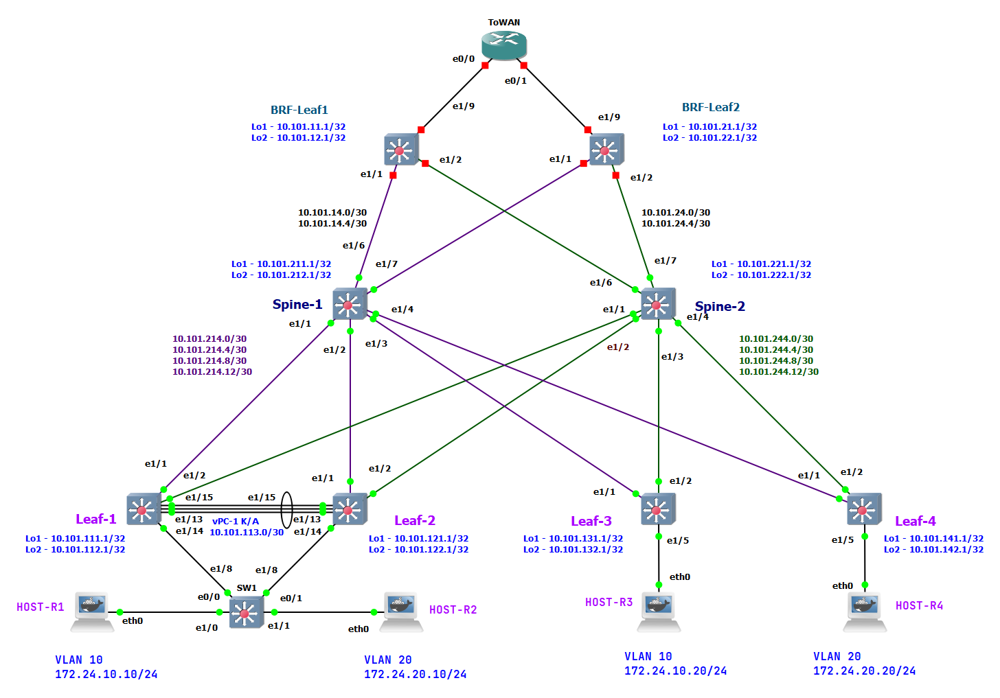

# Lab-6

## VxLAN L3 VNI

(Механошин Алексей и Подлеснов Александр)

---

Схема подключения опорной сети осталась прежняя, как в LAB-3 на IS-IS протоколе.


Как и план адрессного пространства.

<details>
 <summary>План адрессного пространства</summary>

Общая сеть для всех ЦОД-ов (для трех): ```10.100.0.0/14```

- (Диапазон хостов 10.100.0.1 - 10.103.255.254 )

1) Сеть 10.100.0.0/16 Оставим в резерве.
2) Для первого ЦОД-а суммарное: ```10.101.0.0/16``` ( 10.101.0.1 - 10.101.255.254 )
3) Для второго ЦОД-а суммарное: ```10.102.0.0/16``` ( 10.102.0.1 - 10.102.255.254 )

Таким образом план нумерации будет следуюший

IP = 10.10**D**.**S**xy.**M**zz

Где:

- D = номер ЦОД-а
- S = номер leaf/spine (**1** - leaf, **2**- spine)
- Mzz - значения по порядку

В ```x``` третьего октета кодируем номер Leaf или Spine

- с **1** по **5**
- 0 - для Border Leaf

В ```y``` третьего октета кодируем:

- 1 - Loopback 1 для UNDERLAY
- 2 - Loopback 2 для OVERLAY
- 3 - резерв, напрмер дял vPC keep-alive
- 4 - p2p линк
- 5 - сервисы

Loopack-s:

- ```10.101.111.1/32``` - ЦОД-1, Leaf-1,  Loopack - 1
- ```10.101.112.1/32``` - ЦОД-1, Leaf-1,  Loopack - 2
- ```10.101.121.1/32``` - ЦОД-1, Leaf-2,  Loopack - 1
- ```10.101.122.1/32``` - ЦОД-1, Leaf-2,  Loopack - 2
- ```10.101.131.1/32``` - ЦОД-1, Leaf-3,  Loopack - 1
- ```10.101.132.1/32``` - ЦОД-1, Leaf-3,  Loopack - 2
- ```10.101.141.1/32``` - ЦОД-1, Leaf-4,  Loopack - 1
- ```10.101.142.1/32``` - ЦОД-1, Leaf-4,  Loopack - 2
- ```10.101.211.1/32``` - ЦОД-1, Spine-1, Loopack - 1
- ```10.101.212.1/32``` - ЦОД-1, Spine-1, Loopack - 2
- ```10.101.221.1/32``` - ЦОД-1, Spine-2, Loopack - 1
- ```10.101.222.1/32``` - ЦОД-1, Spine-2, Loopack - 2

Border Leaf Loopacks:

- ```10.101.11.1``` - ЦОД-1, BRD-Leaf-1 Loopack-1
- ```10.101.12.1``` - ЦОД-1, BRD-Leaf-1 Loopack-2
- ```10.101.21.1``` - ЦОД-1, BRD-Leaf-2 Loopack-1
- ```10.101.22.1``` - ЦОД-1, BRD-Leaf-2 Loopack-2

Примеры сетей для vPC:

- ```10.101.113.0/30``` - vPC ЦОД-1, Leaf-1 to Leaf-2 (10.101.113.1 - 10.101.113.2)
- ```10.101.133.0/30``` - vPC ЦОД-1, Leaf-3 to Leaf-4 (10.101.133.1 - 10.101.133.2)

Cети P2P пиров, как и нумерация в октете идёт со стороны Spine:

- ```10.101.214.0/30``` - сеть в ЦОД-1, Spine-1 до Leaf-1 (10.101.214.1  - 10.101.214.2)
- ```10.101.214.4/30``` - сеть в ЦОД-1, Spine-1 до Leaf-2 (10.101.214.5  - 10.101.214.6)
- ```10.101.214.8/30``` - сеть в ЦОД-1, Spine-1 до Leaf-3 (10.101.214.9  - 10.101.214.10)
- ```10.101.214.12/30```- сеть в ЦОД-1, Spine-1 до Leaf-4 (10.101.214.13 - 10.101.214.14)
- ```10.101.224.0/30``` - сеть в ЦОД-1, Spine-2 до Leaf-1 (10.101.224.1  - 10.101.224.2)
- ```10.101.224.4/30``` - сеть в ЦОД-1, Spine-2 до Leaf-2 (10.101.224.5  - 10.101.224.6)
- ```10.101.224.8/30``` - сеть в ЦОД-1, Spine-2 до Leaf-3 (10.101.224.9  - 10.101.224.10)
- ```10.101.224.12/30```- сеть в ЦОД-1, Spine-2 до Leaf-4 (10.101.224.13 - 10.101.224.14)

Или в обратную сторону:

- ```10.101.214.0/30``` - сеть в ЦОД-1, Leaf-1 до Spine-1
- ```10.101.224.0/30``` - сеть в ЦОД-1, Leaf-1 до Spine-2
- ```10.101.214.4/30``` - сеть в ЦОД-1, Leaf-2 до Spine-1
- ```10.101.224.4/30``` - сеть в ЦОД-1, Leaf-2 до Spine-2
- ```10.101.214.8/30``` - сеть в ЦОД-1, Leaf-3 до Spine-1
- ```10.101.224.8/30``` - сеть в ЦОД-1, Leaf-3 до Spine-2
- ```10.101.214.12/30```- сеть в ЦОД-1, Leaf-4 до Spine-1
- ```10.101.224.12/30```- сеть в ЦОД-1, Leaf-4 до Spine-2

---
Сети BRD Leaf-Spine:

- ```10.101.14.0/30```  - сеть в ЦОД-1, Spine-1 до BRD-Leaf-1 (10.101.14.1 - 10.101.14.2)
- ```10.101.14.4/30```  - сеть в ЦОД-1, Spine-1 до BRD-Leaf-2 (10.101.14.5 - 10.101.14.6)
- ```10.101.24.0/30```  - сеть в ЦОД-1, Spine-2 до BRD-Leaf-1 (10.101.24.1 - 10.101.24.2)
- ```10.101.24.4/30```  - сеть в ЦОД-1, Spine-2 до BRD-Leaf-2 (10.101.24.5 - 10.101.24.6)

IP установлены следующим образом

Leaf-R1# sh ip int br

```text
Interface            IP Address
Lo1                  10.101.111.1
Lo2                  10.101.112.1
Eth1/1               10.101.214.2
Eth1/2               10.101.224.2
Eth1/15              10.101.113.1
```

Leaf-R2# sh ip int br

```text
Interface            IP Address
Lo1                  10.101.121.1
Lo2                  10.101.122.1
Eth1/1               10.101.214.6
Eth1/2               10.101.224.6
Eth1/15              10.101.113.2
```

Leaf-R3# sh ip int br

```text
Interface            IP Address
Lo1                  10.101.131.1
Lo2                  10.101.132.1
Eth1/1               10.101.214.10
Eth1/2               10.101.224.10
```

Leaf-R4# sh ip int br

```text
Interface            IP Address
Lo1                  10.101.141.1
Lo2                  10.101.142.1
Eth1/1               10.101.214.14
Eth1/2               10.101.224.14
```

Spine-R1# sh ip int br

```text
Interface            IP Address
Lo1                  10.101.211.1
Lo2                  10.101.212.1
Eth1/1               10.101.214.1
Eth1/2               10.101.214.5
Eth1/3               10.101.214.9
Eth1/4               10.101.214.13
Eth1/6               10.101.14.1
Eth1/7               10.101.14.5
```

Spine-R2# sh ip int br

```text
Interface            IP Address
Lo1                  10.101.221.1
Lo2                  10.101.222.1
Eth1/1               10.101.224.1
Eth1/2               10.101.224.5
Eth1/3               10.101.224.9
Eth1/4               10.101.224.13
Eth1/6               10.101.24.1
Eth1/7               10.101.24.5
```

BRF-Leaf-R1# sh ip int br

```text
Interface            IP Address
Lo1                  10.101.11.1
Lo2                  10.101.12.1
Eth1/1               10.101.14.2
Eth1/2               10.101.24.2
```

BRD-Leaf-R2# sh ip int br

```text
Interface            IP Address
Lo1                  10.101.21.1
Lo2                  10.101.22.1
Eth1/1               10.101.14.6
Eth1/2               10.101.24.6
```

</details>

Основные понятия:

1. Netwotk Virtualization Overlay (NVO) - оверлейная сеть
2. VXLAN Tunnel End Point (VTEP) - само устройство которое занимается инкапсуляцией/декапсуляцией VxLAN фреймов
3. Network Virtualization Edge (NVE) - туннельный интерфейс инкапсуляцией/декапсуляцией VxLAN фреймов.
 Можно сравнить в транком до сотальных VTEP-ов, или как GRE туннель.
4. Virtual Network Identifier (VNI) - метка VxLAN инкапсуляции, определяющая Layer-2 домен в оверлейной сети.
 Должна быть одинакова на всех VTEP-ах куда нам необходимо соеденить наш L2 домен.
5. MAC-VRF - воспринимаем как EVPN-instanc, как VLAN примапленный к NVI и учавствующий в VxLAN инкапсуляции/декапсуляции.
 (Можно представить типа как "L2-роутинг" между VTEP-ами).
 В Общем сколько у нас будет VLAN-ов с VNI - столько у нас будет и MAC-VRF-ов,
 поскольку у каждого MAC-VRF будет свой Route-Target (RT) и свой Route Destingisher (RD) - типа L2-VRF такие.
6. IP-VRF - Обычный L3 VRF, который и собирает в себе MAC-VRF-ы

---

### Цель: L3 связность между хостами HOST-Rx подключенных к разным VLAN-ам

Примечание: В этой схеме задействован Leaf-4 настройка на котором ничем не принципиально отличается Leaf-3, только вместо VLAN-10 мы хост подключим по VLAN-20.

<details>
<summary>Настройки и проверки хостов</summary>

```text
HOST-R1:~#ifconfig 
eth0      Link encap:Ethernet  HWaddr 02:42:97:89:E2:00  
          inet addr:172.24.10.10  Bcast:172.24.10.255  Mask:255.255.255.0
```

```text
HOST-R2:~#ifconfig 
eth0      Link encap:Ethernet  HWaddr 02:42:DD:79:F5:00  
          inet addr:172.24.20.10  Bcast:172.24.20.255  Mask:255.255.255.0
```

```text
HOST-R3:/#ifconfig 
eth0      Link encap:Ethernet  HWaddr 02:42:AF:A7:01:00  
          inet addr:172.24.10.20  Bcast:172.24.10.255  Mask:255.255.255.0
```

```text
HOST-R4:/#ifconfig 
eth0      Link encap:Ethernet  HWaddr 02:42:BE:17:BD:00  
          inet addr:172.24.20.20  Bcast:172.24.20.255  Mask:255.255.255.0
```

Проверим что HOST-1 может пинговать HOST-3, а HOST-2 может пинговать HOST-4

```text
HOST-R1:~#ping -c 2 172.24.10.20 
PING 172.24.10.20 (172.24.10.20) 56(84) bytes of data.
64 bytes from 172.24.10.20: icmp_seq=1 ttl=64 time=24.5 ms
64 bytes from 172.24.10.20: icmp_seq=2 ttl=64 time=14.8 ms

--- 172.24.10.20 ping statistics ---
2 packets transmitted, 2 received, 0% packet loss, time 1002ms
rtt min/avg/max/mdev = 14.786/19.657/24.528/4.871 ms
HOST-R1:~#
```

```text
HOST-R2:~#ping -c 2 172.24.20.20
PING 172.24.20.20 (172.24.20.20) 56(84) bytes of data.
64 bytes from 172.24.20.20: icmp_seq=1 ttl=64 time=14.3 ms
64 bytes from 172.24.20.20: icmp_seq=2 ttl=64 time=11.3 ms

--- 172.24.20.20 ping statistics ---
2 packets transmitted, 2 received, 0% packet loss, time 1001ms
rtt min/avg/max/mdev = 11.316/12.796/14.276/1.480 ms
HOST-R2:~#
```

</details><br>

Первым делом добавим которые будут нам нужны **на всех** лифах:

```text
feature interface-vlan
```


Полные настройки коммутаторов:

<details>
<summary>Leaf-1</summary>

```text
Leaf-R1# sh run

Leaf-R1#
```

</details>

<details>
<summary>Leaf-2</summary>

```text
Leaf-R2# sh run

Leaf-R2# 
```

</details>

<details>
<summary>Leaf-3</summary>

```text
Leaf-R3# sh run

Leaf-R3#
```

</details>

<details>
<summary>SW-1</summary>

```text
SW1#sh run br

end

```

</details>

<details>
<summary>Leaf-4</summary>

```text
Leaf-R4# sh run

Leaf-R4# 
```

</details>

<details>
<summary>Spine-1</summary>

```text
Spine-R1# sh run

Spine-R1# 
```

</details>

<details>
<summary>Spine-2</summary>

```text
Spine-R2# sh run

Spine-R2#
```

</details>

<details>
<summary>BRF-Leaf-1</summary>

```text
BRF-Leaf-R1# sh run

!Command: show running-config
!Running configuration last done at: Mon Dec  9 00:32:20 2024
!Time: Mon Dec  9 02:15:52 2024

version 9.3(8) Bios:version  
hostname BRF-Leaf-R1
vdc BRF-Leaf-R1 id 1
  limit-resource vlan minimum 16 maximum 4094
  limit-resource vrf minimum 2 maximum 4096
  limit-resource port-channel minimum 0 maximum 511
  limit-resource u4route-mem minimum 248 maximum 248
  limit-resource u6route-mem minimum 96 maximum 96
  limit-resource m4route-mem minimum 58 maximum 58
  limit-resource m6route-mem minimum 8 maximum 8

feature isis
clock timezone PRM 5 0

no password strength-check
username admin password 5 $5$MIDGHI$2nFpqu8C1skfYJz.nfv1.xMRxcwGOkEBjf3WOrg50kB  role network-admin
no ip domain-lookup
copp profile strict
snmp-server user admin auth md5 3763E49E7388DDE1EE6ED8E11043B7613B48 priv 3239A4DB7EDE89AAAA62D4BD1817E56D6717 localizedV2key engineID 128:0:0:9:3:12:205:0:0:27:1
rmon event 1 log trap public description FATAL(1) owner PMON@FATAL
rmon event 2 log trap public description CRITICAL(2) owner PMON@CRITICAL
rmon event 3 log trap public description ERROR(3) owner PMON@ERROR
rmon event 4 log trap public description WARNING(4) owner PMON@WARNING
rmon event 5 log trap public description INFORMATION(5) owner PMON@INFO

vlan 1

key chain ISIS
  key 1
    key-string 7 070c285f4d064b0916100a
    cryptographic-algorithm MD5
vrf context management


interface Ethernet1/1
  description to_spine-1
  no switchport
  ip address 10.101.14.2/30
  isis network point-to-point
  ip router isis UNDERLAY
  no isis passive-interface level-1-2
  no shutdown

interface Ethernet1/2
  description to_spine-2
  no switchport
  ip address 10.101.24.2/30
  isis network point-to-point
  ip router isis UNDERLAY
  no isis passive-interface level-1-2
  no shutdown

interface Ethernet1/3
  shutdown

interface Ethernet1/4
  shutdown

interface Ethernet1/5
  shutdown

interface Ethernet1/6
  shutdown

interface Ethernet1/7
  shutdown

interface Ethernet1/8
  shutdown

interface Ethernet1/9
  description to_wan
  no switchport
  speed 1000
  duplex full
  ip address 172.24.1.1/30
  isis network point-to-point
  ip router isis UNDERLAY
  no isis passive-interface level-1-2
  no shutdown

interface Ethernet1/10

interface Ethernet1/11

interface Ethernet1/12

interface Ethernet1/13

interface Ethernet1/14

interface Ethernet1/15

interface Ethernet1/16

interface Ethernet1/17

interface Ethernet1/18

interface Ethernet1/19

interface Ethernet1/20

interface Ethernet1/21

interface Ethernet1/22

interface Ethernet1/23

interface Ethernet1/24

interface Ethernet1/25

interface Ethernet1/26

interface Ethernet1/27

interface Ethernet1/28

interface Ethernet1/29

interface Ethernet1/30

interface Ethernet1/31

interface Ethernet1/32

interface Ethernet1/33

interface Ethernet1/34

interface Ethernet1/35

interface Ethernet1/36

interface Ethernet1/37

interface Ethernet1/38

interface Ethernet1/39

interface Ethernet1/40

interface Ethernet1/41

interface Ethernet1/42

interface Ethernet1/43

interface Ethernet1/44

interface Ethernet1/45

interface Ethernet1/46

interface Ethernet1/47

interface Ethernet1/48

interface Ethernet1/49

interface Ethernet1/50

interface Ethernet1/51

interface Ethernet1/52

interface Ethernet1/53

interface Ethernet1/54

interface Ethernet1/55

interface Ethernet1/56

interface Ethernet1/57

interface Ethernet1/58

interface Ethernet1/59

interface Ethernet1/60

interface Ethernet1/61

interface Ethernet1/62

interface Ethernet1/63

interface Ethernet1/64

interface mgmt0
  vrf member management

interface loopback1
  description # Router ID
  ip address 10.101.11.1/32
  ip router isis UNDERLAY

interface loopback2
  description # VTEP-ID
  ip address 10.101.12.1/32
icam monitor scale

cli alias name wr copy run start
cli alias name c conf term
cli alias name sir show ip route
cli alias name srr sh run | sec router
line console
  exec-timeout 0
  terminal length 48
  terminal width  186
line vty
boot nxos bootflash:/nxos.9.3.8.bin sup-1
router isis UNDERLAY
  net 49.0001.0101.0101.1001.00
  log-adjacency-changes
  authentication-type md5 level-1
  authentication-type md5 level-2
  authentication key-chain ISIS level-1
  authentication key-chain ISIS level-2
  address-family ipv4 unicast
    maximum-paths 2
    router-id loopback1
  passive-interface default level-1-2


BRF-Leaf-R1#
```

</details>

<details>
<summary>BRF-Leaf-2</summary>

```text
BRD-Leaf-R2# sh run

!Command: show running-config
!Running configuration last done at: Mon Dec  9 00:31:38 2024
!Time: Mon Dec  9 02:15:44 2024

version 9.3(8) Bios:version  
hostname BRD-Leaf-R2
vdc BRD-Leaf-R2 id 1
  limit-resource vlan minimum 16 maximum 4094
  limit-resource vrf minimum 2 maximum 4096
  limit-resource port-channel minimum 0 maximum 511
  limit-resource u4route-mem minimum 248 maximum 248
  limit-resource u6route-mem minimum 96 maximum 96
  limit-resource m4route-mem minimum 58 maximum 58
  limit-resource m6route-mem minimum 8 maximum 8

feature isis
clock timezone PRM 5 0

no password strength-check
username admin password 5 $5$ACNBEF$17/UC5AByWpXNbBSvnuvJloYBoV9atZRzW.oDYLwnr5  role network-admin
no ip domain-lookup
copp profile strict
snmp-server user admin auth md5 3752D36F5DECF4F5D19CE99D2745ADFDA765 priv 3756B50865C39086B7F9D2F641D5132E760C localizedV2key engineID 128:0:0:9:3:12:33:0:0:27:1
rmon event 1 log trap public description FATAL(1) owner PMON@FATAL
rmon event 2 log trap public description CRITICAL(2) owner PMON@CRITICAL
rmon event 3 log trap public description ERROR(3) owner PMON@ERROR
rmon event 4 log trap public description WARNING(4) owner PMON@WARNING
rmon event 5 log trap public description INFORMATION(5) owner PMON@INFO

vlan 1

key chain ISIS
  key 1
    key-string 7 070c285f4d064b0916100a
vrf context management


interface Ethernet1/1
  description to_spine-1
  no switchport
  ip address 10.101.14.6/30
  isis network point-to-point
  ip router isis UNDERLAY
  no isis passive-interface level-1-2
  no shutdown

interface Ethernet1/2
  description to_spine-2
  no switchport
  ip address 10.101.24.6/30
  isis network point-to-point
  ip router isis UNDERLAY
  no isis passive-interface level-1-2
  no shutdown

interface Ethernet1/3
  shutdown

interface Ethernet1/4
  shutdown

interface Ethernet1/5
  shutdown

interface Ethernet1/6
  shutdown

interface Ethernet1/7
  shutdown

interface Ethernet1/8
  shutdown

interface Ethernet1/9
  description to_wan
  no switchport
  speed 1000
  duplex full
  ip address 172.24.2.1/30
  isis network point-to-point
  ip router isis UNDERLAY
  no isis passive-interface level-1-2
  no shutdown

interface Ethernet1/10

interface Ethernet1/11

interface Ethernet1/12

interface Ethernet1/13

interface Ethernet1/14

interface Ethernet1/15

interface Ethernet1/16

interface Ethernet1/17

interface Ethernet1/18

interface Ethernet1/19

interface Ethernet1/20

interface Ethernet1/21

interface Ethernet1/22

interface Ethernet1/23

interface Ethernet1/24

interface Ethernet1/25

interface Ethernet1/26

interface Ethernet1/27

interface Ethernet1/28

interface Ethernet1/29

interface Ethernet1/30

interface Ethernet1/31

interface Ethernet1/32

interface Ethernet1/33

interface Ethernet1/34

interface Ethernet1/35

interface Ethernet1/36

interface Ethernet1/37

interface Ethernet1/38

interface Ethernet1/39

interface Ethernet1/40

interface Ethernet1/41

interface Ethernet1/42

interface Ethernet1/43

interface Ethernet1/44

interface Ethernet1/45

interface Ethernet1/46

interface Ethernet1/47

interface Ethernet1/48

interface Ethernet1/49

interface Ethernet1/50

interface Ethernet1/51

interface Ethernet1/52

interface Ethernet1/53

interface Ethernet1/54

interface Ethernet1/55

interface Ethernet1/56

interface Ethernet1/57

interface Ethernet1/58

interface Ethernet1/59

interface Ethernet1/60

interface Ethernet1/61

interface Ethernet1/62

interface Ethernet1/63

interface Ethernet1/64

interface mgmt0
  vrf member management

interface loopback1
  description # Router ID
  ip address 10.101.21.1/32
  ip router isis UNDERLAY

interface loopback2
  description # VTEP-ID
  ip address 10.101.22.1/32
icam monitor scale

cli alias name wr copy run start
cli alias name c conf term
cli alias name sir show ip route
cli alias name srr sh run | sec router
line console
  exec-timeout 0
  terminal length 48
  terminal width  186
line vty
boot nxos bootflash:/nxos.9.3.8.bin sup-1
router isis UNDERLAY
  net 49.0001.0101.0102.1001.00
  log-adjacency-changes
  authentication-type md5 level-1
  authentication-type md5 level-2
  authentication key-chain ISIS level-1
  authentication key-chain ISIS level-2
  address-family ipv4 unicast
    maximum-paths 2
    router-id loopback1
  passive-interface default level-1-2


BRD-Leaf-R2#
```

</details>

<details>
<summary>ToWan</summary>

```text
ToWAN#sh run brief 
Building configuration...

Current configuration : 2550 bytes
!
! Last configuration change at 02:44:23 PRM Mon Dec 9 2024
!
version 17.12
service timestamps debug datetime msec
service timestamps log datetime msec
!
hostname ToWAN
!
boot-start-marker
boot-end-marker
!
!
logging console warnings
no aaa new-model
!
!
!
clock timezone PRM 5 0
no ip icmp rate-limit unreachable
!
!         
!
!
!
!
!
!
!
!
no ip domain lookup
ip cef
login on-success log
no ipv6 cef
!
!
!
!
!
!
!
!
multilink bundle-name authenticated
!
!         
key chain ISIS
 key 1
  key-string cisco2laba
  cryptographic-algorithm md5
!
crypto pki trustpoint TP-self-signed-2043905
 enrollment selfsigned
 subject-name cn=IOS-Self-Signed-Certificate-2043905
 revocation-check none
 rsakeypair TP-self-signed-2043905
 hash sha256
!
!
crypto pki certificate chain TP-self-signed-2043905
 certificate self-signed 01
!
!
memory free low-watermark processor 55011
!
!
spanning-tree mode rapid-pvst
!
!         
!
!
!
!
!
! 
!
!
!
!
!
!
!
!
!
!
!
!
!
!
!
interface Loopback1
 description Router-ID
 ip address 172.24.200.1 255.255.255.255
!
interface Ethernet0/0
 description to_brd_leaf_1
 ip address 172.24.1.2 255.255.255.252
 ip router isis UNDERLAY
 isis network point-to-point 
 isis metric 40 level-1
 isis metric 40 level-2
!
interface Ethernet0/1
 description to_brd_leaf_2
 ip address 172.24.2.2 255.255.255.252
 ip router isis UNDERLAY
 isis network point-to-point 
 isis metric 40 level-1
 isis metric 40 level-2
!
interface Ethernet0/2
 no ip address
 shutdown
!
interface Ethernet0/3
 no ip address
 shutdown
!
interface Ethernet1/0
 no ip address
 shutdown
!
interface Ethernet1/1
 ip address 192.168.100.2 255.255.255.252
 no ip redirects
 shutdown
!
interface Ethernet1/2
 no ip address
 shutdown
!
interface Ethernet1/3
 no ip address
 shutdown
!
router isis UNDERLAY
 net 49.0002.1720.2420.0001.00
 router-id Loopback1
 authentication mode md5 level-1
 authentication mode md5 level-2
 authentication key-chain ISIS level-1
 authentication key-chain ISIS level-2
 metric-style wide
 log-adjacency-changes
 passive-interface default
 no passive-interface Ethernet0/0
 no passive-interface Ethernet0/1
!
ip forward-protocol nd
!
ip tcp synwait-time 5
!
ip http server
ip http secure-server
ip route 0.0.0.0 0.0.0.0 Null0
ip ssh bulk-mode 131072
!
!
!
!
!         
control-plane
!
!
alias exec c conf t
alias exec sir show ip route
alias exec srr show run br | s router
!
line con 0
 exec-timeout 0 0
 privilege level 15
 logging synchronous
line aux 0
 exec-timeout 0 0
 privilege level 15
 logging synchronous
line vty 0 4
 login
 transport input ssh
!
!
!
!
end       

ToWAN# 
```

</details>
