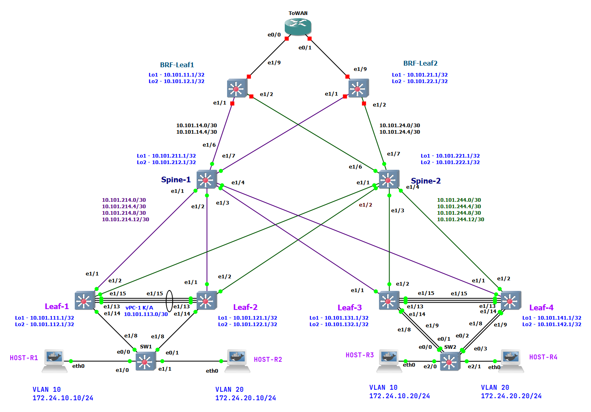
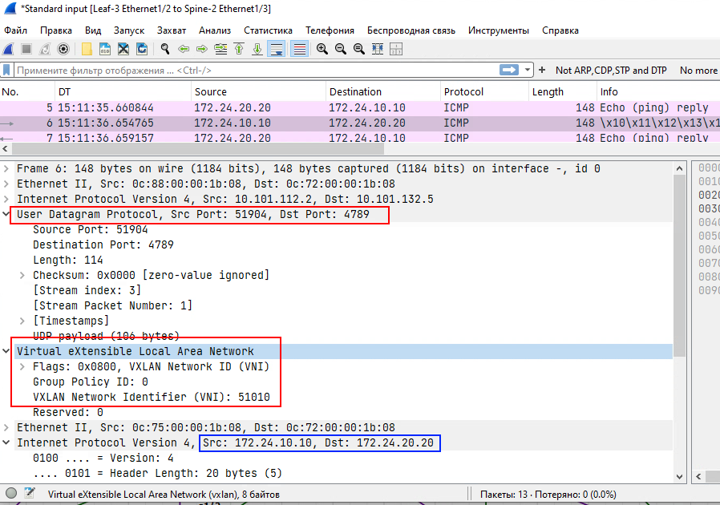

# Lab-7

## VXLAN. Multihoming

(Механошин Алексей и Подлеснов Александр)

---

Схема подключения опорной сети осталась прежняя, как в LAB-3 на IS-IS протоколе.


Как и план адрессного пространства.

<details>
 <summary>План адрессного пространства</summary>

Общая сеть для всех ЦОД-ов (для трех): ```10.100.0.0/14```

- (Диапазон хостов 10.100.0.1 - 10.103.255.254 )

1) Сеть 10.100.0.0/16 Оставим в резерве.
2) Для первого ЦОД-а суммарное: ```10.101.0.0/16``` ( 10.101.0.1 - 10.101.255.254 )
3) Для второго ЦОД-а суммарное: ```10.102.0.0/16``` ( 10.102.0.1 - 10.102.255.254 )

Таким образом план нумерации будет следуюший

IP = 10.10**D**.**S**xy.**M**zz

Где:

- D = номер ЦОД-а
- S = номер leaf/spine (**1** - leaf, **2**- spine)
- Mzz - значения по порядку

В ```x``` третьего октета кодируем номер Leaf или Spine

- с **1** по **5**
- 0 - для Border Leaf

В ```y``` третьего октета кодируем:

- 1 - Loopback 1 для UNDERLAY
- 2 - Loopback 2 для OVERLAY
- 3 - резерв, напрмер дял vPC keep-alive
- 4 - p2p линк
- 5 - сервисы

Loopack-s:

- ```10.101.111.1/32``` - ЦОД-1, Leaf-1,  Loopack - 1
- ```10.101.112.1/32``` - ЦОД-1, Leaf-1,  Loopack - 2
- ```10.101.121.1/32``` - ЦОД-1, Leaf-2,  Loopack - 1
- ```10.101.122.1/32``` - ЦОД-1, Leaf-2,  Loopack - 2
- ```10.101.131.1/32``` - ЦОД-1, Leaf-3,  Loopack - 1
- ```10.101.132.1/32``` - ЦОД-1, Leaf-3,  Loopack - 2
- ```10.101.141.1/32``` - ЦОД-1, Leaf-4,  Loopack - 1
- ```10.101.142.1/32``` - ЦОД-1, Leaf-4,  Loopack - 2
- ```10.101.211.1/32``` - ЦОД-1, Spine-1, Loopack - 1
- ```10.101.212.1/32``` - ЦОД-1, Spine-1, Loopack - 2
- ```10.101.221.1/32``` - ЦОД-1, Spine-2, Loopack - 1
- ```10.101.222.1/32``` - ЦОД-1, Spine-2, Loopack - 2

Border Leaf Loopacks:

- ```10.101.11.1``` - ЦОД-1, BRD-Leaf-1 Loopack-1
- ```10.101.12.1``` - ЦОД-1, BRD-Leaf-1 Loopack-2
- ```10.101.21.1``` - ЦОД-1, BRD-Leaf-2 Loopack-1
- ```10.101.22.1``` - ЦОД-1, BRD-Leaf-2 Loopack-2

Примеры сетей для vPC:

- ```10.101.113.0/30``` - vPC ЦОД-1, Leaf-1 to Leaf-2 (10.101.113.1 - 10.101.113.2)
- ```10.101.133.0/30``` - vPC ЦОД-1, Leaf-3 to Leaf-4 (10.101.133.1 - 10.101.133.2)

Cети P2P пиров, как и нумерация в октете идёт со стороны Spine:

- ```10.101.214.0/30``` - сеть в ЦОД-1, Spine-1 до Leaf-1 (10.101.214.1  - 10.101.214.2)
- ```10.101.214.4/30``` - сеть в ЦОД-1, Spine-1 до Leaf-2 (10.101.214.5  - 10.101.214.6)
- ```10.101.214.8/30``` - сеть в ЦОД-1, Spine-1 до Leaf-3 (10.101.214.9  - 10.101.214.10)
- ```10.101.214.12/30```- сеть в ЦОД-1, Spine-1 до Leaf-4 (10.101.214.13 - 10.101.214.14)
- ```10.101.224.0/30``` - сеть в ЦОД-1, Spine-2 до Leaf-1 (10.101.224.1  - 10.101.224.2)
- ```10.101.224.4/30``` - сеть в ЦОД-1, Spine-2 до Leaf-2 (10.101.224.5  - 10.101.224.6)
- ```10.101.224.8/30``` - сеть в ЦОД-1, Spine-2 до Leaf-3 (10.101.224.9  - 10.101.224.10)
- ```10.101.224.12/30```- сеть в ЦОД-1, Spine-2 до Leaf-4 (10.101.224.13 - 10.101.224.14)

Или в обратную сторону:

- ```10.101.214.0/30``` - сеть в ЦОД-1, Leaf-1 до Spine-1
- ```10.101.224.0/30``` - сеть в ЦОД-1, Leaf-1 до Spine-2
- ```10.101.214.4/30``` - сеть в ЦОД-1, Leaf-2 до Spine-1
- ```10.101.224.4/30``` - сеть в ЦОД-1, Leaf-2 до Spine-2
- ```10.101.214.8/30``` - сеть в ЦОД-1, Leaf-3 до Spine-1
- ```10.101.224.8/30``` - сеть в ЦОД-1, Leaf-3 до Spine-2
- ```10.101.214.12/30```- сеть в ЦОД-1, Leaf-4 до Spine-1
- ```10.101.224.12/30```- сеть в ЦОД-1, Leaf-4 до Spine-2

---
Сети BRD Leaf-Spine:

- ```10.101.14.0/30```  - сеть в ЦОД-1, Spine-1 до BRD-Leaf-1 (10.101.14.1 - 10.101.14.2)
- ```10.101.14.4/30```  - сеть в ЦОД-1, Spine-1 до BRD-Leaf-2 (10.101.14.5 - 10.101.14.6)
- ```10.101.24.0/30```  - сеть в ЦОД-1, Spine-2 до BRD-Leaf-1 (10.101.24.1 - 10.101.24.2)
- ```10.101.24.4/30```  - сеть в ЦОД-1, Spine-2 до BRD-Leaf-2 (10.101.24.5 - 10.101.24.6)

IP установлены следующим образом

Leaf-R1# sh ip int br

```text
Interface            IP Address
Lo1                  10.101.111.1
Lo2                  10.101.112.1
Eth1/1               10.101.214.2
Eth1/2               10.101.224.2
Eth1/15              10.101.113.1
```

Leaf-R2# sh ip int br

```text
Interface            IP Address
Lo1                  10.101.121.1
Lo2                  10.101.122.1
Eth1/1               10.101.214.6
Eth1/2               10.101.224.6
Eth1/15              10.101.113.2
```

Leaf-R3# sh ip int br

```text
Interface            IP Address
Lo1                  10.101.131.1
Lo2                  10.101.132.1
Eth1/1               10.101.214.10
Eth1/2               10.101.224.10
Eth1/15              10.101.133.1
```

Leaf-R4# sh ip int br

```text
Interface            IP Address
Lo1                  10.101.141.1
Lo2                  10.101.142.1
Eth1/1               10.101.214.14
Eth1/2               10.101.224.14
Eth1/15              10.101.133.2
```

Spine-R1# sh ip int br

```text
Interface            IP Address
Lo1                  10.101.211.1
Lo2                  10.101.212.1
Eth1/1               10.101.214.1
Eth1/2               10.101.214.5
Eth1/3               10.101.214.9
Eth1/4               10.101.214.13
Eth1/6               10.101.14.1
Eth1/7               10.101.14.5
```

Spine-R2# sh ip int br

```text
Interface            IP Address
Lo1                  10.101.221.1
Lo2                  10.101.222.1
Eth1/1               10.101.224.1
Eth1/2               10.101.224.5
Eth1/3               10.101.224.9
Eth1/4               10.101.224.13
Eth1/6               10.101.24.1
Eth1/7               10.101.24.5
```

BRF-Leaf-R1# sh ip int br

```text
Interface            IP Address
Lo1                  10.101.11.1
Lo2                  10.101.12.1
Eth1/1               10.101.14.2
Eth1/2               10.101.24.2
```

BRD-Leaf-R2# sh ip int br

```text
Interface            IP Address
Lo1                  10.101.21.1
Lo2                  10.101.22.1
Eth1/1               10.101.14.6
Eth1/2               10.101.24.6
```

</details>

Основные понятия:

1. Netwotk Virtualization Overlay (NVO) - оверлейная сеть
2. VXLAN Tunnel End Point (VTEP) - само устройство которое занимается инкапсуляцией/декапсуляцией VxLAN фреймов
3. Network Virtualization Edge (NVE) - туннельный интерфейс инкапсуляцией/декапсуляцией VxLAN фреймов.
 Можно сравнить в транком до сотальных VTEP-ов, или как GRE туннель.
4. Virtual Network Identifier (VNI) - метка VxLAN инкапсуляции, определяющая Layer-2 домен в оверлейной сети.
 Должна быть одинакова на всех VTEP-ах куда нам необходимо соеденить наш L2 домен.
5. MAC-VRF - воспринимаем как EVPN-instanc, как VLAN примапленный к NVI и учавствующий в VxLAN инкапсуляции/декапсуляции.
 (Можно представить типа как "L2-роутинг" между VTEP-ами).
 В Общем сколько у нас будет VLAN-ов с VNI - столько у нас будет и MAC-VRF-ов,
 поскольку у каждого MAC-VRF будет свой Route-Target (RT) и свой Route Destingisher (RD) - типа L2-VRF такие.
6. IP-VRF - Обычный L3 VRF, который и собирает в себе MAC-VRF-ы

---

### Цель: Настроить отказоустойчивое подключение клиентов с использованием EVPN Multihoming

#### Настроим vPC между Leaf-3 и Leaf-4

Первым делом на Laaf-3/4 добавим нужные фичи:

```text
Leaf-R3# c
Enter configuration commands, one per line. End with CNTL/Z.
Leaf-R3(config)# feature vpc
Leaf-R3(config)# feature lacp 
Leaf-R3(config)# 
```

**Важно: vPC нужно настраивать в строго определенном порядке:**

1. Настройка vPC домена
2. Настройка vPC Peer Keepalive, убедиться что "peer is alive"
3. Настройка vPC Peer Link
4. Настройка vPC Member Ports

Для vPC Keep-Alive создадим отдельный VRF:

```text
Leaf-R3# conf t
Enter configuration commands, one per line. End with CNTL/Z.
Leaf-R3(config)# vrf context VRF_VPC-KEEPALIVE
Leaf-R3(config-vrf)# address-family ipv4 unicast
Leaf-R3(config-vrf-af-ipv4)# exit
Leaf-R3(config-vrf)# exit
Leaf-R3(config)#
```

И настроим отдельный L3 линк между лифами, например на 15 порту:

```text
Leaf-R3(config)# interface Ethernet1/15
Leaf-R3(config-if)#  description vPC K/A to_leaf-4
Leaf-R3(config-if)# no switchport
Leaf-R3(config-if)# vrf member VRF_VPC-KEEPALIVE
Leaf-R3(config-if)# ip address 10.101.133.1/30
Leaf-R3(config-if)# no shutdown
Leaf-R3(config-if)# exit
Leaf-R3(config)#
```

После аналогичной настройки на Leaf-4 проверяем что всё пингуется:

```text
Leaf-R3(config)# ping 10.101.133.2 count 2 vrf VRF_VPC-KEEPALIVE
PING 10.101.133.2 (10.101.133.2): 56 data bytes
64 bytes from 10.101.133.2: icmp_seq=0 ttl=254 time=7.457 ms
64 bytes from 10.101.133.2: icmp_seq=1 ttl=254 time=7.083 ms
```

Отлично, начинаем настраивать vPC, но сначала установим приоритет VLAN-ов для STP а так-же настроим единый secondary IP на Loopack-2 для поддержки VxLAN VTEP:

```text
Leaf-R4(config)# spanning-tree vlan 1-3967 priority 4096
Leaf-R4(config)# 
Leaf-R3(config)# vpc domain 2
Leaf-R3(config-vpc-domain)#   peer-switch
Leaf-R3(config-vpc-domain)#   role priority 1000
Leaf-R3(config-vpc-domain)# peer-keepalive destination 10.101.133.2 source 10.101.133.1 vrf VRF_VPC-KEEPALIVE
Leaf-R3(config-vpc-domain)# auto-recovery
Leaf-R3(config-vpc-domain)# exit
Leaf-R3(config)# 
```

Проверям статус keepalive

```text
Leaf-R3(config)# show vpc peer-keepalive

vPC keep-alive status             : peer is alive 
...
```

Настроим Loopack2 c одинаковым **secondary** IP на обоих лифах:
**Внимание:** необходимо предварительно остановить NVE интерфейс!

```text
Leaf-R3(config)# int nve1
Leaf-R3(config-if-nve)# shut
Leaf-R3(config-if-nve)# exit
Leaf-R3(config)# 
Leaf-R3(config)# interface loopback2
Leaf-R3(config-if)# ip address 10.101.132.5/32 secondary
Leaf-R3(config-if)# exit
Leaf-R3(config)# int nve1
Leaf-R3(config-if-nve)# no shut
Leaf-R3(config-if-nve)# exit
Leaf-R3(config)# 

```

Отлично, переходим к настройке vPC Peer Link, но желательно предварительно убедится что все настройки VLAN-оы на Leaf-3 и Leaf-4 совпадают.

```text
Leaf-R3(config)# interface Ethernet1/13, ethernet 1/14
Leaf-R3(config-if-range)# description *** VPC PEER LINKS ***
Leaf-R3(config-if-range)# switchport mode trunk
Leaf-R3(config-if-range)# channel-group 100 mode active
Leaf-R3(config-if-range)# exit
Leaf-R3(config)# int Po100
Leaf-R3(config-if)# description *** VPC PEER LINKS ***
Leaf-R3(config-if)# switchport mode trunk
Leaf-R3(config-if)# spanning-tree port type network
Leaf-R3(config-if)# vpc peer-link
Warning: Bridge Assurance MUST be enabled at the remotely connected interface
Leaf-R3(config-if)# exit
Leaf-R3(config)# 
```

Для работы полезной STP функции ```Bridge Assurance``` мы включили настройку ```spanning-tree port type network``` которая крайне рекомендуется на vpc Peer-Link-е для предотвращения STP петель. Это фича STP а не vPC. Строго говоря vPC сам эту функцию включает, о чем и предупржает варнингом, чт она другой стороне она так-же должна быть включена.

Если все настроено успешно и прошли все проверки, то вывод будет примерно такой:

```text
Leaf-R3(config)# sh vpc 
Legend:
                (*) - local vPC is down, forwarding via vPC peer-link

vPC domain id                     : 2   
Peer status                       : peer adjacency formed ok      
vPC keep-alive status             : peer is alive                 
Configuration consistency status  : success 
Per-vlan consistency status       : success                       
Type-2 consistency status         : success 
vPC role                          : primary                       
Number of vPCs configured         : 0   
Peer Gateway                      : Disabled
Dual-active excluded VLANs        : -
Graceful Consistency Check        : Enabled
Auto-recovery status              : Enabled, timer is off.(timeout = 240s)
Delay-restore status              : Timer is off.(timeout = 30s)
Delay-restore SVI status          : Timer is off.(timeout = 10s)
Operational Layer3 Peer-router    : Disabled
Virtual-peerlink mode             : Disabled

vPC Peer-link status
---------------------------------------------------------------------
id    Port   Status Active vlans    
--    ----   ------ -------------------------------------------------
1     Po100  up     1,10,20,1010                                                         
Leaf-R3(config)#
```

#### Переходим к настройке `vPC Member Ports`

```text
Leaf-R3# c
Enter configuration commands, one per line. End with CNTL/Z.
Leaf-R3(config)# int ethernet 1/8, ethernet 1/9
Leaf-R3(config-if-range)# description *** vPC Member Ports ***
Leaf-R3(config-if-range)# shut
Leaf-R3(config-if-range)# channel-group 10 mode active
Leaf-R3(config-if-range)# no shut
Leaf-R3(config-if-range)# exit
Leaf-R3(config)#  int Po10
Leaf-R3(config-if)# switchport mode trunk
Leaf-R3(config-if)# vpc 10
Leaf-R3(config-if)# description *** vPC Member Ports ***
Leaf-R3(config-if)# exit

```

```text
SW2#conf term
SW2(config)#int range ethernet 0/0-3
description *** Member Po1 ***
SW2(config-if-range)#channel-group 1 mode active 
Creating a port-channel interface Port-channel 1

SW2(config-if-range)#exit
SW2(config)#int Po1
SW2(config-if)#description *** vPC Client ***
SW2(config-if)#switchport trunk encapsulation dot1q
SW2(config-if)#switchport mode trunk
```

Проверим состояние:

```text
SW2#sh etherchannel 1 summary
...
Number of channel-groups in use: 1
Number of aggregators:           1

Group  Port-channel  Protocol    Ports
------+-------------+-----------+-----------------------------------------------
1      Po1(SU)         LACP      Et0/0(P)    Et0/1(P)    Et0/2(P)    
                                 Et0/3(P)    
          
SW2#
```

Вернемся на Leaf-3 и проверим состояние vPC:

```text
Leaf-R3# 
Leaf-R3# sh vpc
Legend:
                (*) - local vPC is down, forwarding via vPC peer-link

vPC domain id                     : 2   
Peer status                       : peer adjacency formed ok      
vPC keep-alive status             : peer is alive                 
Configuration consistency status  : success 
Per-vlan consistency status       : success                       
Type-2 consistency status         : success 
vPC role                          : primary                       
Number of vPCs configured         : 1   
Peer Gateway                      : Disabled
Dual-active excluded VLANs        : -
Graceful Consistency Check        : Enabled
Auto-recovery status              : Enabled, timer is off.(timeout = 240s)
Delay-restore status              : Timer is off.(timeout = 30s)
Delay-restore SVI status          : Timer is off.(timeout = 10s)
Operational Layer3 Peer-router    : Disabled
Virtual-peerlink mode             : Disabled

vPC Peer-link status
---------------------------------------------------------------------
id    Port   Status Active vlans    
--    ----   ------ -------------------------------------------------
1     Po100  up     1,10,20,1010                                                         

vPC status
----------------------------------------------------------------------------
Id    Port          Status Consistency Reason                Active vlans
--    ------------  ------ ----------- ------                ---------------
10    Po10          up     success     success               1,10,20,1010                
                                                                                         

Please check "show vpc consistency-parameters vpc <vpc-num>" for the 
consistency reason of down vpc and for type-2 consistency reasons for 
any vpc.

Leaf-R3#
```

Все выгляит в порядке.
Перенесем хосты из предыдущей лабы, которые были подключены к своим отдельным лифам, и проверим как всё пингуется.

```text
HOST-R3:/#ping -c 3 172.24.20.20
PING 172.24.20.20 (172.24.20.20) 56(84) bytes of data.
64 bytes from 172.24.20.20: icmp_seq=1 ttl=63 time=4.82 ms
64 bytes from 172.24.20.20: icmp_seq=2 ttl=63 time=6.92 ms
64 bytes from 172.24.20.20: icmp_seq=3 ttl=63 time=6.81 ms
```

Тут они собственно даже и не выходяят в VxLAN ибо роутятся на vPC в Leaf-3/4

Попробуем со стороны Leaf-1, c хоста HOST-R1 тогда:

```text
HOST-R1:/#ping -c 4 172.24.20.20
PING 172.24.20.20 (172.24.20.20) 56(84) bytes of data.
64 bytes from 172.24.20.20: icmp_seq=1 ttl=62 time=20.4 ms
64 bytes from 172.24.20.20: icmp_seq=2 ttl=62 time=17.2 ms
64 bytes from 172.24.20.20: icmp_seq=3 ttl=62 time=14.8 ms
64 bytes from 172.24.20.20: icmp_seq=4 ttl=62 time=24.9 ms
```



Все успешно - задача выполнена.

Как мы видим сейчас маршруты в BGP:

```text
Leaf-R3# 
Leaf-R3# sh bgp l2vpn evpn
BGP routing table information for VRF default, address family L2VPN EVPN
BGP table version is 155, Local Router ID is 10.101.132.1
Status: s-suppressed, x-deleted, S-stale, d-dampened, h-history, *-valid, >-best
Path type: i-internal, e-external, c-confed, l-local, a-aggregate, r-redist, I-injected
Origin codes: i - IGP, e - EGP, ? - incomplete, | - multipath, & - backup, 2 - best2

   Network            Next Hop            Metric     LocPrf     Weight Path
Route Distinguisher: 10.101.112.1:32777
* i[2]:[0]:[0]:[48]:[0242.9789.e200]:[0]:[0.0.0.0]/216
                      10.101.112.2                      100          0 i
*>i                   10.101.112.2                      100          0 i
* i[2]:[0]:[0]:[48]:[0242.9789.e200]:[32]:[172.24.10.10]/272
                      10.101.112.2                      100          0 i
*>i                   10.101.112.2                      100          0 i
* i[3]:[0]:[32]:[10.101.112.2]/88
                      10.101.112.2                      100          0 i
*>i                   10.101.112.2                      100          0 i

Route Distinguisher: 10.101.112.1:32787
* i[2]:[0]:[0]:[48]:[0242.dd79.f500]:[0]:[0.0.0.0]/216
                      10.101.112.2                      100          0 i
*>i                   10.101.112.2                      100          0 i
*>i[3]:[0]:[32]:[10.101.112.2]/88
                      10.101.112.2                      100          0 i
* i                   10.101.112.2                      100          0 i

Route Distinguisher: 10.101.122.1:32777
* i[2]:[0]:[0]:[48]:[0242.9789.e200]:[0]:[0.0.0.0]/216
                      10.101.112.2                      100          0 i
*>i                   10.101.112.2                      100          0 i
* i[2]:[0]:[0]:[48]:[0242.9789.e200]:[32]:[172.24.10.10]/272
                      10.101.112.2                      100          0 i
*>i                   10.101.112.2                      100          0 i
* i[3]:[0]:[32]:[10.101.112.2]/88
                      10.101.112.2                      100          0 i
*>i                   10.101.112.2                      100          0 i

Route Distinguisher: 10.101.122.1:32787
* i[2]:[0]:[0]:[48]:[0242.dd79.f500]:[0]:[0.0.0.0]/216
                      10.101.112.2                      100          0 i
*>i                   10.101.112.2                      100          0 i
*>i[3]:[0]:[32]:[10.101.112.2]/88
                      10.101.112.2                      100          0 i
* i                   10.101.112.2                      100          0 i

Route Distinguisher: 10.101.132.1:32777    (L2VNI 10000010)
* i[2]:[0]:[0]:[48]:[0242.9789.e200]:[0]:[0.0.0.0]/216
                      10.101.112.2                      100          0 i
*>i                   10.101.112.2                      100          0 i
*>l[2]:[0]:[0]:[48]:[0242.afa7.0100]:[0]:[0.0.0.0]/216
                      10.101.132.5                      100      32768 i
*>i[2]:[0]:[0]:[48]:[0242.9789.e200]:[32]:[172.24.10.10]/272
                      10.101.112.2                      100          0 i
* i                   10.101.112.2                      100          0 i
*>l[2]:[0]:[0]:[48]:[0242.afa7.0100]:[32]:[172.24.10.20]/272
                      10.101.132.5                      100      32768 i
*>i[3]:[0]:[32]:[10.101.112.2]/88
                      10.101.112.2                      100          0 i
* i                   10.101.112.2                      100          0 i
*>l[3]:[0]:[32]:[10.101.132.5]/88
                      10.101.132.5                      100      32768 i

Route Distinguisher: 10.101.132.1:32787    (L2VNI 10000020)
*>l[2]:[0]:[0]:[48]:[0242.be17.bd00]:[0]:[0.0.0.0]/216
                      10.101.132.5                      100      32768 i
* i[2]:[0]:[0]:[48]:[0242.dd79.f500]:[0]:[0.0.0.0]/216
                      10.101.112.2                      100          0 i
*>i                   10.101.112.2                      100          0 i
*>l[2]:[0]:[0]:[48]:[0242.be17.bd00]:[32]:[172.24.20.20]/272
                      10.101.132.5                      100      32768 i
*>i[3]:[0]:[32]:[10.101.112.2]/88
                      10.101.112.2                      100          0 i
* i                   10.101.112.2                      100          0 i
*>l[3]:[0]:[32]:[10.101.132.5]/88
                      10.101.132.5                      100      32768 i

Route Distinguisher: 10.101.132.1:3    (L3VNI 51010)
*>i[2]:[0]:[0]:[48]:[0242.9789.e200]:[32]:[172.24.10.10]/272
                      10.101.112.2                      100          0 i
* i                   10.101.112.2                      100          0 i

Leaf-R3# 
```

---

Полные настройки коммутаторов:

<details>
<summary>Leaf-1</summary>

```text
Leaf-R1# sh run

!Command: show running-config
!Running configuration last done at: Mon Jan 27 16:52:23 2025
!Time: Mon Jan 27 17:58:31 2025

version 9.3(8) Bios:version  
hostname Leaf-R1
vdc Leaf-R1 id 1
  limit-resource vlan minimum 16 maximum 4094
  limit-resource vrf minimum 2 maximum 4096
  limit-resource port-channel minimum 0 maximum 511
  limit-resource u4route-mem minimum 248 maximum 248
  limit-resource u6route-mem minimum 96 maximum 96
  limit-resource m4route-mem minimum 58 maximum 58
  limit-resource m6route-mem minimum 8 maximum 8

cfs eth distribute
nv overlay evpn
feature bgp
feature isis
feature fabric forwarding
feature interface-vlan
feature vn-segment-vlan-based
feature lacp
feature vpc
feature bfd
clock timezone PRM 5 0
feature nv overlay

no password strength-check
username admin password 5 $5$HIMIJM$qT5AXQEfCx.kdpdUF8dRHjlsjyL3TdgR9BhmK9uAYx7  role network-admin
no ip domain-lookup
copp profile strict
snmp-server user admin auth md5 0153448F0CDEAA7AC3D8A6E1207E29746751 priv 204F64F031BBA129B39DABB42F633F6C6872 localizedV2key engineID 128:0:0:9:3:12:159:0:0:27:1
rmon event 1 log trap public description FATAL(1) owner PMON@FATAL
rmon event 2 log trap public description CRITICAL(2) owner PMON@CRITICAL
rmon event 3 log trap public description ERROR(3) owner PMON@ERROR
rmon event 4 log trap public description WARNING(4) owner PMON@WARNING
rmon event 5 log trap public description INFORMATION(5) owner PMON@INFO

fabric forwarding anycast-gateway-mac 0001.0001.0001
vlan 1,10,20,1010
vlan 10
  name EndPoint-1
  vn-segment 10000010
vlan 20
  vn-segment 10000020
vlan 1010
  vn-segment 51010

spanning-tree vlan 1-3967 priority 4096
key chain ISIS
  key 1
    key-string 7 070c285f4d064b0916100a
vrf context LABA
  vni 51010
  rd auto
  address-family ipv4 unicast
    route-target both auto
    route-target both auto evpn
vrf context VRF_VPC-KEEPALIVE
  address-family ipv4 unicast
vrf context management
hardware access-list tcam region racl 256
hardware access-list tcam region e-racl 0
hardware access-list tcam region arp-ether 256
vpc domain 1
  peer-switch
  role priority 1000
  peer-keepalive destination 10.101.113.2 source 10.101.113.1 vrf VRF_VPC-KEEPALIVE
  auto-recovery


interface Vlan1

interface Vlan10
  no shutdown
  vrf member LABA
  ip address 172.24.10.1/24
  fabric forwarding mode anycast-gateway

interface Vlan20
  no shutdown
  vrf member LABA
  ip address 172.24.20.1/24
  fabric forwarding mode anycast-gateway

interface Vlan1010
  no shutdown
  vrf member LABA
  ip forward

interface port-channel15
  description *** SW-1 ***
  switchport mode trunk
  switchport access vlan 10
  switchport trunk allowed vlan 10,20
  speed 1000
  vpc 15

interface port-channel100
  description *** VPC PEER LINKS ***
  switchport mode trunk
  spanning-tree port type network
  vpc peer-link

interface nve1
  no shutdown
  host-reachability protocol bgp
  source-interface loopback2
  member vni 51010 associate-vrf
  member vni 10000010
    ingress-replication protocol bgp
  member vni 10000020
    ingress-replication protocol bgp

interface Ethernet1/1
  description to_spine_1
  no switchport
  bfd interval 999 min_rx 999 multiplier 3
  bfd authentication Keyed-SHA1 key-id 1 hex-key 636973636F326C616261
  no ip redirects
  ip address 10.101.214.2/30
  no ipv6 redirects
  isis metric 100 level-1
  isis metric 100 level-2
  isis network point-to-point
  ip router isis UNDERLAY
  no isis passive-interface level-1-2
  isis bfd disable
  no shutdown

interface Ethernet1/2
  description to_spine_2
  no switchport
  no ip redirects
  ip address 10.101.224.2/30
  no ipv6 redirects
  isis metric 100 level-1
  isis metric 100 level-2
  isis network point-to-point
  ip router isis UNDERLAY
  no isis passive-interface level-1-2
  no shutdown

interface Ethernet1/3
  shutdown

interface Ethernet1/4
  shutdown

interface Ethernet1/5
  shutdown

interface Ethernet1/6
  shutdown

interface Ethernet1/7
  shutdown

interface Ethernet1/8
  description *** SW-1 ***
  switchport mode trunk
  switchport access vlan 10
  switchport trunk allowed vlan 10,20
  speed 1000
  channel-group 15

interface Ethernet1/9
  shutdown

interface Ethernet1/10
  shutdown

interface Ethernet1/11
  shutdown

interface Ethernet1/12
  shutdown

interface Ethernet1/13
  description *** VPC PEER LINKS ***
  switchport mode trunk
  channel-group 100 mode active

interface Ethernet1/14
  description *** VPC PEER LINKS ***
  switchport mode trunk
  channel-group 100 mode active

interface Ethernet1/15
  description vPC K/A to_leaf-2
  no switchport
  vrf member VRF_VPC-KEEPALIVE
  ip address 10.101.113.1/30
  no shutdown

interface Ethernet1/16

interface Ethernet1/17

interface Ethernet1/18

interface Ethernet1/19

interface Ethernet1/20

interface Ethernet1/21

interface Ethernet1/22

interface Ethernet1/23

interface Ethernet1/24

interface Ethernet1/25

interface Ethernet1/26

interface Ethernet1/27

interface Ethernet1/28

interface Ethernet1/29

interface Ethernet1/30

interface Ethernet1/31

interface Ethernet1/32

interface Ethernet1/33

interface Ethernet1/34

interface Ethernet1/35

interface Ethernet1/36

interface Ethernet1/37

interface Ethernet1/38

interface Ethernet1/39

interface Ethernet1/40

interface Ethernet1/41

interface Ethernet1/42

interface Ethernet1/43

interface Ethernet1/44

interface Ethernet1/45

interface Ethernet1/46

interface Ethernet1/47

interface Ethernet1/48

interface Ethernet1/49

interface Ethernet1/50

interface Ethernet1/51

interface Ethernet1/52

interface Ethernet1/53

interface Ethernet1/54

interface Ethernet1/55

interface Ethernet1/56

interface Ethernet1/57

interface Ethernet1/58

interface Ethernet1/59

interface Ethernet1/60

interface Ethernet1/61

interface Ethernet1/62

interface Ethernet1/63

interface Ethernet1/64

interface mgmt0
  vrf member management

interface loopback1
  description # Router ID
  ip address 10.101.111.1/32
  ip router isis UNDERLAY

interface loopback2
  description # VTEP-ID
  ip address 10.101.112.1/32
  ip address 10.101.112.2/32 secondary
  ip router isis UNDERLAY
icam monitor scale

cli alias name wr copy run start
cli alias name c conf term
cli alias name sir show ip route
cli alias name cef show forwarding ipv4 
cli alias name adj show ip adj
cli alias name srr sh run | sec router
line console
  exec-timeout 0
  terminal length 48
  terminal width  186
line vty
boot nxos bootflash:/nxos.9.3.8.bin sup-1
router isis UNDERLAY
  net 49.0001.0101.0111.1001.00
  is-type level-1
  log-adjacency-changes
  authentication-type md5 level-1
  authentication-type md5 level-2
  authentication key-chain ISIS level-1
  authentication key-chain ISIS level-2
  address-family ipv4 unicast
    maximum-paths 2
    router-id loopback1
  passive-interface default level-1-2
router bgp 65010
  router-id 10.101.112.1
  template peer SPINES
    remote-as 65010
    update-source loopback2
    address-family l2vpn evpn
      send-community
      send-community extended
  neighbor 10.101.212.1
    inherit peer SPINES
    description Spine-1
  neighbor 10.101.222.1
    inherit peer SPINES
    description Spine-2


Leaf-R1#
```

</details>

<details>
<summary>Leaf-2</summary>

```text
Leaf-R2# sh run

!Command: show running-config
!Running configuration last done at: Mon Jan 27 16:53:20 2025
!Time: Mon Jan 27 17:59:18 2025

version 9.3(8) Bios:version  
hostname Leaf-R2
vdc Leaf-R2 id 1
  limit-resource vlan minimum 16 maximum 4094
  limit-resource vrf minimum 2 maximum 4096
  limit-resource port-channel minimum 0 maximum 511
  limit-resource u4route-mem minimum 248 maximum 248
  limit-resource u6route-mem minimum 96 maximum 96
  limit-resource m4route-mem minimum 58 maximum 58
  limit-resource m6route-mem minimum 8 maximum 8

cfs eth distribute
nv overlay evpn
feature bgp
feature isis
feature fabric forwarding
feature interface-vlan
feature vn-segment-vlan-based
feature lacp
feature vpc
clock timezone PRM 5 0
feature nv overlay

no password strength-check
username admin password 5 $5$GILIBL$I50uIEZ2.Id5WPuEW2/kF2LnprBS1fD4bK7PLYdXCs4  role network-admin
no ip domain-lookup
copp profile strict
snmp-server user admin auth md5 042F0B626D2474725C91211D7B2226CDBDEA priv 040F77425611450B4490383F363A768CEBA9 localizedV2key engineID 128:0:0:9:3:12:22:0:0:27:1
rmon event 1 log trap public description FATAL(1) owner PMON@FATAL
rmon event 2 log trap public description CRITICAL(2) owner PMON@CRITICAL
rmon event 3 log trap public description ERROR(3) owner PMON@ERROR
rmon event 4 log trap public description WARNING(4) owner PMON@WARNING
rmon event 5 log trap public description INFORMATION(5) owner PMON@INFO

fabric forwarding anycast-gateway-mac 0001.0001.0001
vlan 1,10,20,1010
vlan 10
  name EndPoint-1
  vn-segment 10000010
vlan 20
  vn-segment 10000020
vlan 1010
  vn-segment 51010

spanning-tree vlan 1-3967 priority 4096
key chain ISIS
  key 1
    key-string 7 070c285f4d064b0916100a
vrf context LABA
  vni 51010
  rd auto
  address-family ipv4 unicast
    route-target both auto
    route-target both auto evpn
vrf context VRF_VPC-KEEPALIVE
  address-family ipv4 unicast
vrf context management
hardware access-list tcam region racl 256
hardware access-list tcam region e-racl 0
hardware access-list tcam region arp-ether 256
vpc domain 1
  peer-switch
  role priority 2000
  peer-keepalive destination 10.101.113.1 source 10.101.113.2 vrf VRF_VPC-KEEPALIVE
  auto-recovery


interface Vlan1

interface Vlan10
  no shutdown
  vrf member LABA
  ip address 172.24.10.1/24
  fabric forwarding mode anycast-gateway

interface Vlan20
  no shutdown
  vrf member LABA
  ip address 172.24.20.1/24
  fabric forwarding mode anycast-gateway

interface Vlan1010
  no shutdown
  vrf member LABA
  ip forward

interface port-channel15
  description *** SW-1 ***
  switchport mode trunk
  switchport trunk allowed vlan 10,20
  speed 1000
  vpc 15

interface port-channel100
  description *** VPC PEER LINKS ***
  switchport mode trunk
  spanning-tree port type network
  vpc peer-link

interface nve1
  no shutdown
  host-reachability protocol bgp
  source-interface loopback2
  member vni 51010 associate-vrf
  member vni 10000010
    ingress-replication protocol bgp
  member vni 10000020
    ingress-replication protocol bgp

interface Ethernet1/1
  description to_spine_1
  no switchport
  ip address 10.101.214.6/30
  isis metric 100 level-1
  isis metric 100 level-2
  isis network point-to-point
  ip router isis UNDERLAY
  no isis passive-interface level-1-2
  no shutdown

interface Ethernet1/2
  description to_spine_2
  no switchport
  ip address 10.101.224.6/30
  isis metric 100 level-1
  isis metric 100 level-2
  isis network point-to-point
  ip router isis UNDERLAY
  no isis passive-interface level-1-2
  no shutdown

interface Ethernet1/3
  shutdown

interface Ethernet1/4
  shutdown

interface Ethernet1/5

interface Ethernet1/6
  shutdown

interface Ethernet1/7
  shutdown

interface Ethernet1/8
  description *** SW-1 ***
  switchport mode trunk
  switchport trunk allowed vlan 10,20
  speed 1000
  channel-group 15

interface Ethernet1/9
  shutdown

interface Ethernet1/10

interface Ethernet1/11
  shutdown

interface Ethernet1/12
  shutdown

interface Ethernet1/13
  description *** VPC PEER LINKS ***
  switchport mode trunk
  channel-group 100 mode active

interface Ethernet1/14
  description *** VPC PEER LINKS ***
  switchport mode trunk
  channel-group 100 mode active

interface Ethernet1/15
  description vPC K/A to_leaf-1
  no switchport
  vrf member VRF_VPC-KEEPALIVE
  ip address 10.101.113.2/30
  no shutdown

interface Ethernet1/16

interface Ethernet1/17

interface Ethernet1/18

interface Ethernet1/19

interface Ethernet1/20

interface Ethernet1/21

interface Ethernet1/22

interface Ethernet1/23

interface Ethernet1/24

interface Ethernet1/25

interface Ethernet1/26

interface Ethernet1/27

interface Ethernet1/28

interface Ethernet1/29

interface Ethernet1/30

interface Ethernet1/31

interface Ethernet1/32

interface Ethernet1/33

interface Ethernet1/34

interface Ethernet1/35

interface Ethernet1/36

interface Ethernet1/37

interface Ethernet1/38

interface Ethernet1/39

interface Ethernet1/40

interface Ethernet1/41

interface Ethernet1/42

interface Ethernet1/43

interface Ethernet1/44

interface Ethernet1/45

interface Ethernet1/46

interface Ethernet1/47

interface Ethernet1/48

interface Ethernet1/49

interface Ethernet1/50

interface Ethernet1/51

interface Ethernet1/52

interface Ethernet1/53

interface Ethernet1/54

interface Ethernet1/55

interface Ethernet1/56

interface Ethernet1/57

interface Ethernet1/58

interface Ethernet1/59

interface Ethernet1/60

interface Ethernet1/61

interface Ethernet1/62

interface Ethernet1/63

interface Ethernet1/64

interface mgmt0
  vrf member management

interface loopback1
  description # Router ID
  ip address 10.101.121.1/32
  ip router isis UNDERLAY

interface loopback2
  description # VTEP-ID
  ip address 10.101.122.1/32
  ip address 10.101.112.2/32 secondary
  ip router isis UNDERLAY
icam monitor scale

cli alias name wr copy run start
cli alias name c conf term
cli alias name sir show ip route
cli alias name srr sh run | sec router
line console
  exec-timeout 0
  terminal length 48
  terminal width  186
line vty
boot nxos bootflash:/nxos.9.3.8.bin sup-1
router isis UNDERLAY
  net 49.0001.0101.0112.1001.00
  log-adjacency-changes
  authentication-type md5 level-1
  authentication-type md5 level-2
  authentication key-chain ISIS level-1
  authentication key-chain ISIS level-2
  address-family ipv4 unicast
    maximum-paths 2
    router-id loopback1
  passive-interface default level-1-2
router bgp 65010
  router-id 10.101.122.1
  template peer SPINES
    remote-as 65010
    update-source loopback2
    address-family l2vpn evpn
      send-community
      send-community extended
  neighbor 10.101.212.1
    inherit peer SPINES
    description Spine-1
  neighbor 10.101.222.1
    inherit peer SPINES
    description Spine-2


Leaf-R2# 
```

</details>

<details>
<summary>Leaf-3</summary>

```text
Leaf-R3# sh run

!Command: show running-config
!Running configuration last done at: Mon Jan 27 20:18:18 2025
!Time: Mon Jan 27 20:18:59 2025

version 9.3(8) Bios:version  
hostname Leaf-R3
vdc Leaf-R3 id 1
  limit-resource vlan minimum 16 maximum 4094
  limit-resource vrf minimum 2 maximum 4096
  limit-resource port-channel minimum 0 maximum 511
  limit-resource u4route-mem minimum 248 maximum 248
  limit-resource u6route-mem minimum 96 maximum 96
  limit-resource m4route-mem minimum 58 maximum 58
  limit-resource m6route-mem minimum 8 maximum 8

cfs eth distribute
nv overlay evpn
feature bgp
feature isis
feature fabric forwarding
feature interface-vlan
feature vn-segment-vlan-based
feature lacp
feature vpc
clock timezone PRM 5 0
feature nv overlay

no password strength-check
username admin password 5 $5$MLCBMA$/FmotzYqQwdMEJQGtVLJtp3JkUAzX/Me2FliX2AYk38  role network-admin
ip domain-lookup
copp profile strict
snmp-server user admin auth md5 0071FC9DD80C21F0E05AEDD7D7A8ADA024A4 priv 3209C8E6BC345CF9ED32FE94D0BCAA9125B4 localizedV2key engineID 128:0:0:9:3:12:56:0:0:27:1
rmon event 1 log trap public description FATAL(1) owner PMON@FATAL
rmon event 2 log trap public description CRITICAL(2) owner PMON@CRITICAL
rmon event 3 log trap public description ERROR(3) owner PMON@ERROR
rmon event 4 log trap public description WARNING(4) owner PMON@WARNING
rmon event 5 log trap public description INFORMATION(5) owner PMON@INFO

fabric forwarding anycast-gateway-mac 0001.0001.0001
vlan 1,10,20,1010
vlan 10
  vn-segment 10000010
vlan 20
  vn-segment 10000020
vlan 1010
  vn-segment 51010

spanning-tree vlan 1-3967 priority 4096
key chain ISIS
  key 1
    key-string 7 070c285f4d064b0916100a
vrf context LABA
  vni 51010
  rd auto
  address-family ipv4 unicast
    route-target both auto
    route-target both auto evpn
vrf context VRF_VPC-KEEPALIVE
  address-family ipv4 unicast
vrf context management
vpc domain 2
  peer-switch
  role priority 1000
  peer-keepalive destination 10.101.133.2 source 10.101.133.1 vrf VRF_VPC-KEEPALIVE
  auto-recovery


interface Vlan1

interface Vlan10
  no shutdown
  vrf member LABA
  ip address 172.24.10.1/24
  fabric forwarding mode anycast-gateway

interface Vlan20
  no shutdown
  vrf member LABA
  ip address 172.24.20.1/24
  fabric forwarding mode anycast-gateway

interface Vlan1010
  no shutdown
  vrf member LABA
  ip forward

interface port-channel10
  description *** vPC Member Ports ***
  switchport mode trunk
  vpc 10

interface port-channel100
  description *** VPC PEER LINKS ***
  switchport mode trunk
  spanning-tree port type network
  vpc peer-link

interface nve1
  no shutdown
  host-reachability protocol bgp
  source-interface loopback2
  member vni 51010 associate-vrf
  member vni 10000010
    ingress-replication protocol bgp
  member vni 10000020
    ingress-replication protocol bgp

interface Ethernet1/1
  description to_spine_1
  no switchport
  ip address 10.101.214.10/30
  isis metric 100 level-1
  isis metric 100 level-2
  isis network point-to-point
  ip router isis UNDERLAY
  no isis passive-interface level-1-2
  no shutdown

interface Ethernet1/2
  description to_spine_2
  no switchport
  ip address 10.101.224.10/30
  isis metric 100 level-1
  isis metric 100 level-2
  isis network point-to-point
  ip router isis UNDERLAY
  no isis passive-interface level-1-2
  no shutdown

interface Ethernet1/3
  shutdown

interface Ethernet1/4
  shutdown

interface Ethernet1/5
  shutdown

interface Ethernet1/6
  shutdown

interface Ethernet1/7
  shutdown

interface Ethernet1/8
  description *** vPC Member Ports ***
  switchport mode trunk
  channel-group 10 mode active

interface Ethernet1/9
  description *** vPC Member Ports ***
  switchport mode trunk
  channel-group 10 mode active

interface Ethernet1/10
  shutdown

interface Ethernet1/11
  shutdown

interface Ethernet1/12
  shutdown

interface Ethernet1/13
  description *** VPC PEER LINKS ***
  switchport mode trunk
  channel-group 100 mode active

interface Ethernet1/14
  description *** VPC PEER LINKS ***
  switchport mode trunk
  channel-group 100 mode active

interface Ethernet1/15
  description vPC K/A to_leaf-4
  no switchport
  vrf member VRF_VPC-KEEPALIVE
  ip address 10.101.133.1/30
  no shutdown

interface Ethernet1/16
  shutdown

interface Ethernet1/17
  shutdown

interface Ethernet1/18
  shutdown

interface Ethernet1/19
  shutdown

interface Ethernet1/20
  shutdown

interface Ethernet1/21
  shutdown

interface Ethernet1/22
  shutdown

interface Ethernet1/23
  shutdown

interface Ethernet1/24
  shutdown

interface Ethernet1/25
  shutdown

interface Ethernet1/26
  shutdown

interface Ethernet1/27
  shutdown

interface Ethernet1/28
  shutdown

interface Ethernet1/29
  shutdown

interface Ethernet1/30
  shutdown

interface Ethernet1/31
  shutdown

interface Ethernet1/32
  shutdown

interface Ethernet1/33
  shutdown

interface Ethernet1/34
  shutdown

interface Ethernet1/35
  shutdown

interface Ethernet1/36
  shutdown

interface Ethernet1/37
  shutdown

interface Ethernet1/38
  shutdown

interface Ethernet1/39
  shutdown

interface Ethernet1/40
  shutdown

interface Ethernet1/41
  shutdown

interface Ethernet1/42
  shutdown

interface Ethernet1/43
  shutdown

interface Ethernet1/44
  shutdown

interface Ethernet1/45
  shutdown

interface Ethernet1/46
  shutdown

interface Ethernet1/47
  shutdown

interface Ethernet1/48
  shutdown

interface Ethernet1/49
  shutdown

interface Ethernet1/50
  shutdown

interface Ethernet1/51
  shutdown

interface Ethernet1/52
  shutdown

interface Ethernet1/53
  shutdown

interface Ethernet1/54
  shutdown

interface Ethernet1/55
  shutdown

interface Ethernet1/56
  shutdown

interface Ethernet1/57
  shutdown

interface Ethernet1/58
  shutdown

interface Ethernet1/59
  shutdown

interface Ethernet1/60
  shutdown

interface Ethernet1/61
  shutdown

interface Ethernet1/62
  shutdown

interface Ethernet1/63
  shutdown

interface Ethernet1/64
  shutdown

interface mgmt0
  vrf member management

interface loopback1
  description # Router-ID
  ip address 10.101.131.1/32
  ip router isis UNDERLAY

interface loopback2
  description # VTEP-ID
  ip address 10.101.132.1/32
  ip address 10.101.132.5/32 secondary
  ip router isis UNDERLAY
icam monitor scale

cli alias name wr copy run start
cli alias name c conf term
cli alias name sir show ip route
cli alias name srr sh run | sec router
line console
  exec-timeout 0
  terminal length 48
  terminal width  186
line vty
boot nxos bootflash:/nxos.9.3.8.bin sup-1
router isis UNDERLAY
  net 49.0001.0101.0113.1001.00
  log-adjacency-changes
  authentication-type md5 level-1
  authentication-type md5 level-2
  authentication key-chain ISIS level-1
  authentication key-chain ISIS level-2
  address-family ipv4 unicast
    maximum-paths 2
    router-id loopback1
  passive-interface default level-1-2
router bgp 65010
  router-id 10.101.132.1
  template peer SPINES
    remote-as 65010
    update-source loopback2
    address-family l2vpn evpn
      send-community
      send-community extended
  neighbor 10.101.212.1
    inherit peer SPINES
    description Spne-1
  neighbor 10.101.222.1
    inherit peer SPINES
    description Spne-2


Leaf-R3#
```

</details>

<details>
<summary>Leaf-4</summary>

```text
Leaf-R4# sh run

!Command: show running-config
!Running configuration last done at: Mon Jan 27 20:18:47 2025
!Time: Mon Jan 27 20:19:54 2025

version 9.3(8) Bios:version  
hostname Leaf-R4
vdc Leaf-R4 id 1
  limit-resource vlan minimum 16 maximum 4094
  limit-resource vrf minimum 2 maximum 4096
  limit-resource port-channel minimum 0 maximum 511
  limit-resource u4route-mem minimum 248 maximum 248
  limit-resource u6route-mem minimum 96 maximum 96
  limit-resource m4route-mem minimum 58 maximum 58
  limit-resource m6route-mem minimum 8 maximum 8

cfs eth distribute
nv overlay evpn
feature bgp
feature isis
feature fabric forwarding
feature interface-vlan
feature vn-segment-vlan-based
feature lacp
feature vpc
clock timezone PRM 5 0
feature nv overlay

no password strength-check
username admin password 5 $5$BDBCEE$74zNdCRevQ.jaXtPvMgU3sqqUKyzxCYbO8iNikWmj9D  role network-admin
ip domain-lookup
copp profile strict
snmp-server user admin auth md5 494710BA78F370F1A7A09EC13507B82FC249 priv 1748459848CB1184D7D38CC22B7CFB659E0B localizedV2key engineID 128:0:0:9:3:12:37:0:0:27:1
rmon event 1 log trap public description FATAL(1) owner PMON@FATAL
rmon event 2 log trap public description CRITICAL(2) owner PMON@CRITICAL
rmon event 3 log trap public description ERROR(3) owner PMON@ERROR
rmon event 4 log trap public description WARNING(4) owner PMON@WARNING
rmon event 5 log trap public description INFORMATION(5) owner PMON@INFO

fabric forwarding anycast-gateway-mac 0001.0001.0001
vlan 1,10,20,1010
vlan 10
  vn-segment 10000010
vlan 20
  vn-segment 10000020
vlan 1010
  vn-segment 51010

spanning-tree vlan 1-3967 priority 4096
key chain ISIS
  key 1
    key-string 7 070c285f4d064b0916100a
vrf context LABA
  vni 51010
  rd auto
  address-family ipv4 unicast
    route-target both auto
    route-target both auto evpn
vrf context VRF_VPC-KEEPALIVE
vrf context management
vpc domain 2
  peer-switch
  role priority 2000
  peer-keepalive destination 10.101.133.1 source 10.101.133.2 vrf VRF_VPC-KEEPALIVE
  auto-recovery


interface Vlan1

interface Vlan10
  no shutdown
  vrf member LABA
  ip address 172.24.10.1/24
  fabric forwarding mode anycast-gateway

interface Vlan20
  no shutdown
  vrf member LABA
  ip address 172.24.20.1/24
  fabric forwarding mode anycast-gateway

interface Vlan1010
  no shutdown
  vrf member LABA
  ip forward

interface port-channel10
  description *** vPC Member Ports ***
  switchport mode trunk
  vpc 10

interface port-channel100
  description *** VPC PEER LINKS ***
  switchport mode trunk
  spanning-tree port type network
  vpc peer-link

interface nve1
  no shutdown
  host-reachability protocol bgp
  source-interface loopback2
  member vni 51010 associate-vrf
  member vni 10000010
    ingress-replication protocol bgp
  member vni 10000020
    ingress-replication protocol bgp

interface Ethernet1/1
  description to_spine_1
  no switchport
  ip address 10.101.214.14/30
  isis metric 100 level-1
  isis metric 100 level-2
  isis network point-to-point
  ip router isis UNDERLAY
  no isis passive-interface level-1-2
  no shutdown

interface Ethernet1/2
  description to_spine_2
  no switchport
  ip address 10.101.224.14/30
  isis metric 100 level-1
  isis metric 100 level-2
  isis network point-to-point
  ip router isis UNDERLAY
  no isis passive-interface level-1-2
  no shutdown

interface Ethernet1/3
  shutdown

interface Ethernet1/4
  shutdown

interface Ethernet1/5
  shutdown

interface Ethernet1/6
  shutdown

interface Ethernet1/7
  shutdown

interface Ethernet1/8
  description *** vPC Member Ports ***
  switchport mode trunk
  channel-group 10 mode active

interface Ethernet1/9
  description *** vPC Member Ports ***
  switchport mode trunk
  channel-group 10 mode active

interface Ethernet1/10
  shutdown

interface Ethernet1/11
  shutdown

interface Ethernet1/12
  shutdown

interface Ethernet1/13
  description *** VPC PEER LINKS ***
  switchport mode trunk
  channel-group 100 mode active

interface Ethernet1/14
  description *** VPC PEER LINKS ***
  switchport mode trunk
  channel-group 100 mode active

interface Ethernet1/15
  description vPC K/A to_leaf-3
  no switchport
  vrf member VRF_VPC-KEEPALIVE
  ip address 10.101.133.2/30
  no shutdown

interface Ethernet1/16
  shutdown

interface Ethernet1/17
  shutdown

interface Ethernet1/18
  shutdown

interface Ethernet1/19
  shutdown

interface Ethernet1/20
  shutdown

interface Ethernet1/21
  shutdown

interface Ethernet1/22
  shutdown

interface Ethernet1/23
  shutdown

interface Ethernet1/24
  shutdown

interface Ethernet1/25
  shutdown

interface Ethernet1/26
  shutdown

interface Ethernet1/27
  shutdown

interface Ethernet1/28
  shutdown

interface Ethernet1/29
  shutdown

interface Ethernet1/30
  shutdown

interface Ethernet1/31
  shutdown

interface Ethernet1/32
  shutdown

interface Ethernet1/33
  shutdown

interface Ethernet1/34
  shutdown

interface Ethernet1/35
  shutdown

interface Ethernet1/36
  shutdown

interface Ethernet1/37
  shutdown

interface Ethernet1/38
  shutdown

interface Ethernet1/39
  shutdown

interface Ethernet1/40
  shutdown

interface Ethernet1/41
  shutdown

interface Ethernet1/42
  shutdown

interface Ethernet1/43
  shutdown

interface Ethernet1/44
  shutdown

interface Ethernet1/45
  shutdown

interface Ethernet1/46
  shutdown

interface Ethernet1/47
  shutdown

interface Ethernet1/48
  shutdown

interface Ethernet1/49
  shutdown

interface Ethernet1/50
  shutdown

interface Ethernet1/51
  shutdown

interface Ethernet1/52
  shutdown

interface Ethernet1/53
  shutdown

interface Ethernet1/54
  shutdown

interface Ethernet1/55
  shutdown

interface Ethernet1/56
  shutdown

interface Ethernet1/57
  shutdown

interface Ethernet1/58
  shutdown

interface Ethernet1/59
  shutdown

interface Ethernet1/60
  shutdown

interface Ethernet1/61
  shutdown

interface Ethernet1/62
  shutdown

interface Ethernet1/63
  shutdown

interface Ethernet1/64
  shutdown

interface mgmt0
  vrf member management

interface loopback1
  description # Router-ID
  ip address 10.101.141.1/32
  ip router isis UNDERLAY

interface loopback2
  description # VTEP-ID
  ip address 10.101.142.1/32
  ip address 10.101.132.5/32 secondary
  ip router isis UNDERLAY
icam monitor scale

cli alias name wr copy run start
cli alias name c conf term
cli alias name sir show ip route
cli alias name srr sh run | sec router
line console
  exec-timeout 0
  terminal length 48
  terminal width  186
line vty
boot nxos bootflash:/nxos.9.3.8.bin sup-1
router isis UNDERLAY
  net 49.0001.0101.0114.1001.00
  log-adjacency-changes
  authentication-type md5 level-1
  authentication-type md5 level-2
  authentication key-chain ISIS level-1
  authentication key-chain ISIS level-2
  address-family ipv4 unicast
    maximum-paths 2
    router-id loopback1
  passive-interface default level-1-2
router bgp 65010
  router-id 10.101.142.1
  template peer SPINES
    remote-as 65010
    update-source loopback2
    address-family l2vpn evpn
      send-community
      send-community extended
  neighbor 10.101.212.1
    inherit peer SPINES
    description Spne-1
  neighbor 10.101.222.1
    inherit peer SPINES
    description Spne-2


Leaf-R4# 
```

</details>

<details>
<summary>Spine-1</summary>

```text
Spine-R1# sh run

!Command: show running-config
!Running configuration last done at: Mon Jan 27 16:16:11 2025
!Time: Mon Jan 27 18:02:32 2025

version 9.3(8) Bios:version  
hostname Spine-R1
vdc Spine-R1 id 1
  limit-resource vlan minimum 16 maximum 4094
  limit-resource vrf minimum 2 maximum 4096
  limit-resource port-channel minimum 0 maximum 511
  limit-resource u4route-mem minimum 248 maximum 248
  limit-resource u6route-mem minimum 96 maximum 96
  limit-resource m4route-mem minimum 58 maximum 58
  limit-resource m6route-mem minimum 8 maximum 8

nv overlay evpn
feature bgp
feature isis
feature bfd
clock timezone PRM 5 0

no password strength-check
username admin password 5 $5$OIECKA$eCLImHYIAUQ9wzeor80qlwAVQYm/.ZlN27uAmI7/1IB  role network-admin
no ip domain-lookup
copp profile strict
snmp-server user admin auth md5 055F766176D1E6DAD4EE126B80F38ACA8E66 priv 483F7A661AC389D78EE04856D6ACADB9EA76 localizedV2key engineID 128:0:0:9:3:12:216:0:0:27:1
rmon event 1 log trap public description FATAL(1) owner PMON@FATAL
rmon event 2 log trap public description CRITICAL(2) owner PMON@CRITICAL
rmon event 3 log trap public description ERROR(3) owner PMON@ERROR
rmon event 4 log trap public description WARNING(4) owner PMON@WARNING
rmon event 5 log trap public description INFORMATION(5) owner PMON@INFO

vlan 1

key chain ISIS
  key 1
    key-string 7 070c285f4d064b0916100a
vrf context management


interface Ethernet1/1
  description to_leaf_1
  no cdp enable
  no switchport
  bfd interval 999 min_rx 999 multiplier 3
  bfd authentication Keyed-SHA1 key-id 1 hex-key 636973636F326C616261
  no ip redirects
  ip address 10.101.214.1/30
  no ipv6 redirects
  isis metric 100 level-1
  isis metric 100 level-2
  isis network point-to-point
  ip router isis UNDERLAY
  no isis passive-interface level-1-2
  isis bfd disable
  no shutdown

interface Ethernet1/2
  description to_leaf_2
  no switchport
  ip address 10.101.214.5/30
  isis metric 100 level-1
  isis metric 100 level-2
  isis network point-to-point
  ip router isis UNDERLAY
  no isis passive-interface level-1-2
  no shutdown

interface Ethernet1/3
  description to_leaf_3
  no switchport
  ip address 10.101.214.9/30
  isis metric 100 level-1
  isis metric 100 level-2
  isis network point-to-point
  ip router isis UNDERLAY
  no isis passive-interface level-1-2
  no shutdown

interface Ethernet1/4
  description to_leaf_4
  no switchport
  ip address 10.101.214.13/30
  isis metric 100 level-1
  isis metric 100 level-2
  isis network point-to-point
  ip router isis UNDERLAY
  no isis passive-interface level-1-2
  no shutdown

interface Ethernet1/5
  shutdown

interface Ethernet1/6
  description to_brdleaf-1
  no switchport
  ip address 10.101.14.1/30
  isis network point-to-point
  ip router isis UNDERLAY
  no isis passive-interface level-1-2
  no shutdown

interface Ethernet1/7
  description to_brdleaf-2
  no switchport
  ip address 10.101.14.5/30
  isis network point-to-point
  ip router isis UNDERLAY
  no isis passive-interface level-1-2
  no shutdown

interface Ethernet1/8
  shutdown

interface Ethernet1/9
  shutdown

interface Ethernet1/10

interface Ethernet1/11

interface Ethernet1/12

interface Ethernet1/13

interface Ethernet1/14

interface Ethernet1/15

interface Ethernet1/16

interface Ethernet1/17

interface Ethernet1/18

interface Ethernet1/19

interface Ethernet1/20

interface Ethernet1/21

interface Ethernet1/22

interface Ethernet1/23

interface Ethernet1/24

interface Ethernet1/25

interface Ethernet1/26

interface Ethernet1/27

interface Ethernet1/28

interface Ethernet1/29

interface Ethernet1/30

interface Ethernet1/31

interface Ethernet1/32

interface Ethernet1/33

interface Ethernet1/34

interface Ethernet1/35

interface Ethernet1/36

interface Ethernet1/37

interface Ethernet1/38

interface Ethernet1/39

interface Ethernet1/40

interface Ethernet1/41

interface Ethernet1/42

interface Ethernet1/43

interface Ethernet1/44

interface Ethernet1/45

interface Ethernet1/46

interface Ethernet1/47

interface Ethernet1/48

interface Ethernet1/49

interface Ethernet1/50

interface Ethernet1/51

interface Ethernet1/52

interface Ethernet1/53

interface Ethernet1/54

interface Ethernet1/55

interface Ethernet1/56

interface Ethernet1/57

interface Ethernet1/58

interface Ethernet1/59

interface Ethernet1/60

interface Ethernet1/61

interface Ethernet1/62

interface Ethernet1/63

interface Ethernet1/64

interface mgmt0
  vrf member management

interface loopback1
  description # Router ID
  ip address 10.101.211.1/32
  ip router isis UNDERLAY

interface loopback2
  description # VTEP-ID
  ip address 10.101.212.1/32
  ip router isis UNDERLAY
icam monitor scale

cli alias name wr copy run start
cli alias name c conf term
cli alias name sir show ip route
cli alias name cef show forwarding ipv4 
cli alias name adj show ip adj
cli alias name hash show routing hash
cli alias name fadj show forwarding adjacency
cli alias name srr sh run | sec router
line console
  exec-timeout 0
  terminal length 48
  terminal width  186
line vty
boot nxos bootflash:/nxos.9.3.8.bin sup-1
router isis UNDERLAY
  net 49.0001.0101.0121.1001.00
  set-overload-bit on-startup 20
  log-adjacency-changes
  authentication-type md5 level-1
  authentication-type md5 level-2
  authentication key-chain ISIS level-1
  authentication key-chain ISIS level-2
  address-family ipv4 unicast
    maximum-paths 2
    router-id loopback1
  passive-interface default level-1-2
router bgp 65010
  router-id 10.101.212.1
  template peer LEAFS
    remote-as 65010
    update-source loopback2
    address-family l2vpn evpn
      send-community
      send-community extended
      route-reflector-client
  neighbor 10.101.112.1
    inherit peer LEAFS
    description Leaf-1
  neighbor 10.101.122.1
    inherit peer LEAFS
    description Leaf-2
  neighbor 10.101.132.1
    inherit peer LEAFS
    description Leaf-3
  neighbor 10.101.142.1
    inherit peer LEAFS
    description Leaf-4


Spine-R1# 
```

</details>

<details>
<summary>Spine-2</summary>

```text
Spine-R2# sh run

!Command: show running-config
!Running configuration last done at: Mon Jan 27 11:17:29 2025
!Time: Mon Jan 27 13:03:03 2025

version 9.3(8) Bios:version  
hostname Spine-R2
vdc Spine-R2 id 1
  limit-resource vlan minimum 16 maximum 4094
  limit-resource vrf minimum 2 maximum 4096
  limit-resource port-channel minimum 0 maximum 511
  limit-resource u4route-mem minimum 248 maximum 248
  limit-resource u6route-mem minimum 96 maximum 96
  limit-resource m4route-mem minimum 58 maximum 58
  limit-resource m6route-mem minimum 8 maximum 8

nv overlay evpn
feature bgp
feature isis

no password strength-check
username admin password 5 $5$PEIEFP$MPKQtVARlyYowD1AGfD7kttGnjbI5D92bO1H5HAKt4C  role network-admin
ip domain-lookup
copp profile strict
snmp-server user admin auth md5 1779710CBD3CD4D9906FA7637BD9A4AAC204 priv 4973727EC11CEFECA116BF6262FBE9B29245 localizedV2key engineID 128:0:0:9:3:12:251:0:0:27:1
rmon event 1 log trap public description FATAL(1) owner PMON@FATAL
rmon event 2 log trap public description CRITICAL(2) owner PMON@CRITICAL
rmon event 3 log trap public description ERROR(3) owner PMON@ERROR
rmon event 4 log trap public description WARNING(4) owner PMON@WARNING
rmon event 5 log trap public description INFORMATION(5) owner PMON@INFO

vlan 1

key chain ISIS
  key 1
    key-string 7 070c285f4d064b0916100a
vrf context management


interface Ethernet1/1
  description to_leaf_1
  no switchport
  ip address 10.101.224.1/30
  isis metric 100 level-1
  isis metric 100 level-2
  isis network point-to-point
  ip router isis UNDERLAY
  no isis passive-interface level-1-2
  no shutdown

interface Ethernet1/2
  description to_leaf_2
  no switchport
  ip address 10.101.224.5/30
  isis metric 100 level-1
  isis metric 100 level-2
  isis network point-to-point
  ip router isis UNDERLAY
  no isis passive-interface level-1-2
  no shutdown

interface Ethernet1/3
  description to_leaf_3
  no switchport
  ip address 10.101.224.9/30
  isis metric 100 level-1
  isis metric 100 level-2
  isis network point-to-point
  ip router isis UNDERLAY
  no isis passive-interface level-1-2
  no shutdown

interface Ethernet1/4
  description to_leaf_4
  no switchport
  ip address 10.101.224.13/30
  isis metric 100 level-1
  isis metric 100 level-2
  isis network point-to-point
  ip router isis UNDERLAY
  no isis passive-interface level-1-2
  no shutdown

interface Ethernet1/5
  shutdown

interface Ethernet1/6
  description to_brdleaf-1
  no switchport
  ip address 10.101.24.1/30
  isis network point-to-point
  ip router isis UNDERLAY
  no isis passive-interface level-1-2
  no shutdown

interface Ethernet1/7
  description to_brdleaf-2
  no switchport
  ip address 10.101.24.5/30
  isis network point-to-point
  ip router isis UNDERLAY
  no isis passive-interface level-1-2
  no shutdown

interface Ethernet1/8
  shutdown

interface Ethernet1/9
  shutdown

interface Ethernet1/10

interface Ethernet1/11

interface Ethernet1/12

interface Ethernet1/13

interface Ethernet1/14

interface Ethernet1/15

interface Ethernet1/16

interface Ethernet1/17

interface Ethernet1/18

interface Ethernet1/19

interface Ethernet1/20

interface Ethernet1/21

interface Ethernet1/22

interface Ethernet1/23

interface Ethernet1/24

interface Ethernet1/25

interface Ethernet1/26

interface Ethernet1/27

interface Ethernet1/28

interface Ethernet1/29

interface Ethernet1/30

interface Ethernet1/31

interface Ethernet1/32

interface Ethernet1/33

interface Ethernet1/34

interface Ethernet1/35

interface Ethernet1/36

interface Ethernet1/37

interface Ethernet1/38

interface Ethernet1/39

interface Ethernet1/40

interface Ethernet1/41

interface Ethernet1/42

interface Ethernet1/43

interface Ethernet1/44

interface Ethernet1/45

interface Ethernet1/46

interface Ethernet1/47

interface Ethernet1/48

interface Ethernet1/49

interface Ethernet1/50

interface Ethernet1/51

interface Ethernet1/52

interface Ethernet1/53

interface Ethernet1/54

interface Ethernet1/55

interface Ethernet1/56

interface Ethernet1/57

interface Ethernet1/58

interface Ethernet1/59

interface Ethernet1/60

interface Ethernet1/61

interface Ethernet1/62

interface Ethernet1/63

interface Ethernet1/64

interface mgmt0
  vrf member management

interface loopback1
  description # Router ID
  ip address 10.101.221.1/32
  ip router isis UNDERLAY

interface loopback2
  description # VTEP-ID
  ip address 10.101.222.1/32
  ip router isis UNDERLAY
icam monitor scale

cli alias name wr copy run start
cli alias name c conf term
cli alias name sir show ip route
cli alias name cef show forwarding ipv4 
cli alias name adj show ip adj
cli alias name hash show routing hash
cli alias name fadj show forwarding adjacency
cli alias name srr sh run | sec route
line console
  exec-timeout 0
  terminal length 48
  terminal width  186
line vty
boot nxos bootflash:/nxos.9.3.8.bin sup-1
router isis UNDERLAY
  net 49.0001.0101.0122.1001.00
  set-overload-bit on-startup 20
  log-adjacency-changes
  authentication-type md5 level-1
  authentication-type md5 level-2
  authentication key-chain ISIS level-1
  authentication key-chain ISIS level-2
  address-family ipv4 unicast
    maximum-paths 2
    router-id loopback1
  passive-interface default level-1-2
router bgp 65010
  router-id 10.101.222.1
  template peer LEAFS
    remote-as 65010
    update-source loopback2
    address-family l2vpn evpn
      send-community
      send-community extended
      route-reflector-client
  neighbor 10.101.112.1
    inherit peer LEAFS
    description Leaf-1
  neighbor 10.101.122.1
    inherit peer LEAFS
    description Leaf-2
  neighbor 10.101.132.1
    inherit peer LEAFS
    description Leaf-3
  neighbor 10.101.142.1
    inherit peer LEAFS
    description Leaf-4


Spine-R2#
```

</details>

<details>
<summary>BRF-Leaf-1</summary>

```text
BRF-Leaf-R1# sh run

!Command: show running-config
!Running configuration last done at: Mon Dec  9 00:32:20 2024
!Time: Mon Dec  9 02:15:52 2024

version 9.3(8) Bios:version  
hostname BRF-Leaf-R1
vdc BRF-Leaf-R1 id 1
  limit-resource vlan minimum 16 maximum 4094
  limit-resource vrf minimum 2 maximum 4096
  limit-resource port-channel minimum 0 maximum 511
  limit-resource u4route-mem minimum 248 maximum 248
  limit-resource u6route-mem minimum 96 maximum 96
  limit-resource m4route-mem minimum 58 maximum 58
  limit-resource m6route-mem minimum 8 maximum 8

feature isis
clock timezone PRM 5 0

no password strength-check
username admin password 5 $5$MIDGHI$2nFpqu8C1skfYJz.nfv1.xMRxcwGOkEBjf3WOrg50kB  role network-admin
no ip domain-lookup
copp profile strict
snmp-server user admin auth md5 3763E49E7388DDE1EE6ED8E11043B7613B48 priv 3239A4DB7EDE89AAAA62D4BD1817E56D6717 localizedV2key engineID 128:0:0:9:3:12:205:0:0:27:1
rmon event 1 log trap public description FATAL(1) owner PMON@FATAL
rmon event 2 log trap public description CRITICAL(2) owner PMON@CRITICAL
rmon event 3 log trap public description ERROR(3) owner PMON@ERROR
rmon event 4 log trap public description WARNING(4) owner PMON@WARNING
rmon event 5 log trap public description INFORMATION(5) owner PMON@INFO

vlan 1

key chain ISIS
  key 1
    key-string 7 070c285f4d064b0916100a
    cryptographic-algorithm MD5
vrf context management


interface Ethernet1/1
  description to_spine-1
  no switchport
  ip address 10.101.14.2/30
  isis network point-to-point
  ip router isis UNDERLAY
  no isis passive-interface level-1-2
  no shutdown

interface Ethernet1/2
  description to_spine-2
  no switchport
  ip address 10.101.24.2/30
  isis network point-to-point
  ip router isis UNDERLAY
  no isis passive-interface level-1-2
  no shutdown

interface Ethernet1/3
  shutdown

interface Ethernet1/4
  shutdown

interface Ethernet1/5
  shutdown

interface Ethernet1/6
  shutdown

interface Ethernet1/7
  shutdown

interface Ethernet1/8
  shutdown

interface Ethernet1/9
  description to_wan
  no switchport
  speed 1000
  duplex full
  ip address 172.24.1.1/30
  isis network point-to-point
  ip router isis UNDERLAY
  no isis passive-interface level-1-2
  no shutdown

interface Ethernet1/10

interface Ethernet1/11

interface Ethernet1/12

interface Ethernet1/13

interface Ethernet1/14

interface Ethernet1/15

interface Ethernet1/16

interface Ethernet1/17

interface Ethernet1/18

interface Ethernet1/19

interface Ethernet1/20

interface Ethernet1/21

interface Ethernet1/22

interface Ethernet1/23

interface Ethernet1/24

interface Ethernet1/25

interface Ethernet1/26

interface Ethernet1/27

interface Ethernet1/28

interface Ethernet1/29

interface Ethernet1/30

interface Ethernet1/31

interface Ethernet1/32

interface Ethernet1/33

interface Ethernet1/34

interface Ethernet1/35

interface Ethernet1/36

interface Ethernet1/37

interface Ethernet1/38

interface Ethernet1/39

interface Ethernet1/40

interface Ethernet1/41

interface Ethernet1/42

interface Ethernet1/43

interface Ethernet1/44

interface Ethernet1/45

interface Ethernet1/46

interface Ethernet1/47

interface Ethernet1/48

interface Ethernet1/49

interface Ethernet1/50

interface Ethernet1/51

interface Ethernet1/52

interface Ethernet1/53

interface Ethernet1/54

interface Ethernet1/55

interface Ethernet1/56

interface Ethernet1/57

interface Ethernet1/58

interface Ethernet1/59

interface Ethernet1/60

interface Ethernet1/61

interface Ethernet1/62

interface Ethernet1/63

interface Ethernet1/64

interface mgmt0
  vrf member management

interface loopback1
  description # Router ID
  ip address 10.101.11.1/32
  ip router isis UNDERLAY

interface loopback2
  description # VTEP-ID
  ip address 10.101.12.1/32
icam monitor scale

cli alias name wr copy run start
cli alias name c conf term
cli alias name sir show ip route
cli alias name srr sh run | sec router
line console
  exec-timeout 0
  terminal length 48
  terminal width  186
line vty
boot nxos bootflash:/nxos.9.3.8.bin sup-1
router isis UNDERLAY
  net 49.0001.0101.0101.1001.00
  log-adjacency-changes
  authentication-type md5 level-1
  authentication-type md5 level-2
  authentication key-chain ISIS level-1
  authentication key-chain ISIS level-2
  address-family ipv4 unicast
    maximum-paths 2
    router-id loopback1
  passive-interface default level-1-2


BRF-Leaf-R1#
```

</details>

<details>
<summary>BRF-Leaf-2</summary>

```text
BRD-Leaf-R2# sh run

!Command: show running-config
!Running configuration last done at: Mon Dec  9 00:31:38 2024
!Time: Mon Dec  9 02:15:44 2024

version 9.3(8) Bios:version  
hostname BRD-Leaf-R2
vdc BRD-Leaf-R2 id 1
  limit-resource vlan minimum 16 maximum 4094
  limit-resource vrf minimum 2 maximum 4096
  limit-resource port-channel minimum 0 maximum 511
  limit-resource u4route-mem minimum 248 maximum 248
  limit-resource u6route-mem minimum 96 maximum 96
  limit-resource m4route-mem minimum 58 maximum 58
  limit-resource m6route-mem minimum 8 maximum 8

feature isis
clock timezone PRM 5 0

no password strength-check
username admin password 5 $5$ACNBEF$17/UC5AByWpXNbBSvnuvJloYBoV9atZRzW.oDYLwnr5  role network-admin
no ip domain-lookup
copp profile strict
snmp-server user admin auth md5 3752D36F5DECF4F5D19CE99D2745ADFDA765 priv 3756B50865C39086B7F9D2F641D5132E760C localizedV2key engineID 128:0:0:9:3:12:33:0:0:27:1
rmon event 1 log trap public description FATAL(1) owner PMON@FATAL
rmon event 2 log trap public description CRITICAL(2) owner PMON@CRITICAL
rmon event 3 log trap public description ERROR(3) owner PMON@ERROR
rmon event 4 log trap public description WARNING(4) owner PMON@WARNING
rmon event 5 log trap public description INFORMATION(5) owner PMON@INFO

vlan 1

key chain ISIS
  key 1
    key-string 7 070c285f4d064b0916100a
vrf context management


interface Ethernet1/1
  description to_spine-1
  no switchport
  ip address 10.101.14.6/30
  isis network point-to-point
  ip router isis UNDERLAY
  no isis passive-interface level-1-2
  no shutdown

interface Ethernet1/2
  description to_spine-2
  no switchport
  ip address 10.101.24.6/30
  isis network point-to-point
  ip router isis UNDERLAY
  no isis passive-interface level-1-2
  no shutdown

interface Ethernet1/3
  shutdown

interface Ethernet1/4
  shutdown

interface Ethernet1/5
  shutdown

interface Ethernet1/6
  shutdown

interface Ethernet1/7
  shutdown

interface Ethernet1/8
  shutdown

interface Ethernet1/9
  description to_wan
  no switchport
  speed 1000
  duplex full
  ip address 172.24.2.1/30
  isis network point-to-point
  ip router isis UNDERLAY
  no isis passive-interface level-1-2
  no shutdown

interface Ethernet1/10

interface Ethernet1/11

interface Ethernet1/12

interface Ethernet1/13

interface Ethernet1/14

interface Ethernet1/15

interface Ethernet1/16

interface Ethernet1/17

interface Ethernet1/18

interface Ethernet1/19

interface Ethernet1/20

interface Ethernet1/21

interface Ethernet1/22

interface Ethernet1/23

interface Ethernet1/24

interface Ethernet1/25

interface Ethernet1/26

interface Ethernet1/27

interface Ethernet1/28

interface Ethernet1/29

interface Ethernet1/30

interface Ethernet1/31

interface Ethernet1/32

interface Ethernet1/33

interface Ethernet1/34

interface Ethernet1/35

interface Ethernet1/36

interface Ethernet1/37

interface Ethernet1/38

interface Ethernet1/39

interface Ethernet1/40

interface Ethernet1/41

interface Ethernet1/42

interface Ethernet1/43

interface Ethernet1/44

interface Ethernet1/45

interface Ethernet1/46

interface Ethernet1/47

interface Ethernet1/48

interface Ethernet1/49

interface Ethernet1/50

interface Ethernet1/51

interface Ethernet1/52

interface Ethernet1/53

interface Ethernet1/54

interface Ethernet1/55

interface Ethernet1/56

interface Ethernet1/57

interface Ethernet1/58

interface Ethernet1/59

interface Ethernet1/60

interface Ethernet1/61

interface Ethernet1/62

interface Ethernet1/63

interface Ethernet1/64

interface mgmt0
  vrf member management

interface loopback1
  description # Router ID
  ip address 10.101.21.1/32
  ip router isis UNDERLAY

interface loopback2
  description # VTEP-ID
  ip address 10.101.22.1/32
icam monitor scale

cli alias name wr copy run start
cli alias name c conf term
cli alias name sir show ip route
cli alias name srr sh run | sec router
line console
  exec-timeout 0
  terminal length 48
  terminal width  186
line vty
boot nxos bootflash:/nxos.9.3.8.bin sup-1
router isis UNDERLAY
  net 49.0001.0101.0102.1001.00
  log-adjacency-changes
  authentication-type md5 level-1
  authentication-type md5 level-2
  authentication key-chain ISIS level-1
  authentication key-chain ISIS level-2
  address-family ipv4 unicast
    maximum-paths 2
    router-id loopback1
  passive-interface default level-1-2


BRD-Leaf-R2#
```

</details>

<details>
<summary>ToWan</summary>

```text
ToWAN#sh run brief 
Building configuration...

Current configuration : 2550 bytes
!
! Last configuration change at 02:44:23 PRM Mon Dec 9 2024
!
version 17.12
service timestamps debug datetime msec
service timestamps log datetime msec
!
hostname ToWAN
!
boot-start-marker
boot-end-marker
!
!
logging console warnings
no aaa new-model
!
!
!
clock timezone PRM 5 0
no ip icmp rate-limit unreachable
!
!         
!
!
!
!
!
!
!
!
no ip domain lookup
ip cef
login on-success log
no ipv6 cef
!
!
!
!
!
!
!
!
multilink bundle-name authenticated
!
!         
key chain ISIS
 key 1
  key-string cisco2laba
  cryptographic-algorithm md5
!
crypto pki trustpoint TP-self-signed-2043905
 enrollment selfsigned
 subject-name cn=IOS-Self-Signed-Certificate-2043905
 revocation-check none
 rsakeypair TP-self-signed-2043905
 hash sha256
!
!
crypto pki certificate chain TP-self-signed-2043905
 certificate self-signed 01
!
!
memory free low-watermark processor 55011
!
!
spanning-tree mode rapid-pvst
!
!         
!
!
!
!
!
! 
!
!
!
!
!
!
!
!
!
!
!
!
!
!
!
interface Loopback1
 description Router-ID
 ip address 172.24.200.1 255.255.255.255
!
interface Ethernet0/0
 description to_brd_leaf_1
 ip address 172.24.1.2 255.255.255.252
 ip router isis UNDERLAY
 isis network point-to-point 
 isis metric 40 level-1
 isis metric 40 level-2
!
interface Ethernet0/1
 description to_brd_leaf_2
 ip address 172.24.2.2 255.255.255.252
 ip router isis UNDERLAY
 isis network point-to-point 
 isis metric 40 level-1
 isis metric 40 level-2
!
interface Ethernet0/2
 no ip address
 shutdown
!
interface Ethernet0/3
 no ip address
 shutdown
!
interface Ethernet1/0
 no ip address
 shutdown
!
interface Ethernet1/1
 ip address 192.168.100.2 255.255.255.252
 no ip redirects
 shutdown
!
interface Ethernet1/2
 no ip address
 shutdown
!
interface Ethernet1/3
 no ip address
 shutdown
!
router isis UNDERLAY
 net 49.0002.1720.2420.0001.00
 router-id Loopback1
 authentication mode md5 level-1
 authentication mode md5 level-2
 authentication key-chain ISIS level-1
 authentication key-chain ISIS level-2
 metric-style wide
 log-adjacency-changes
 passive-interface default
 no passive-interface Ethernet0/0
 no passive-interface Ethernet0/1
!
ip forward-protocol nd
!
ip tcp synwait-time 5
!
ip http server
ip http secure-server
ip route 0.0.0.0 0.0.0.0 Null0
ip ssh bulk-mode 131072
!
!
!
!
!         
control-plane
!
!
alias exec c conf t
alias exec sir show ip route
alias exec srr show run br | s router
!
line con 0
 exec-timeout 0 0
 privilege level 15
 logging synchronous
line aux 0
 exec-timeout 0 0
 privilege level 15
 logging synchronous
line vty 0 4
 login
 transport input ssh
!
!
!
!
end       

ToWAN# 
```

</details>

<details>
<summary>SW-1</summary>

```text
SW1#sh run br
Building configuration...

Current configuration : 1931 bytes
!
! Last configuration change at 14:31:50 MSK Mon Jan 27 2025
!
version 15.2
service timestamps debug datetime msec
service timestamps log datetime msec
no service password-encryption
service compress-config
!
hostname SW1
!
boot-start-marker
boot-end-marker
!
!
logging discriminator EXCESS severity drops 6 msg-body drops EXCESSCOLL 
logging buffered 50000
logging console discriminator EXCESS
!
no aaa new-model
clock timezone MSK 3 0
!         
!
!
!
!
no ip icmp rate-limit unreachable
!
!
!
no ip domain-lookup
no ip cef
no ipv6 cef
!
!
!
spanning-tree mode pvst
spanning-tree extend system-id
!
!
! 
!
!
!
!         
!
!
!
!
!
!
!
!
interface Port-channel1
 description *** to_vPC Leaf-1 and Leaf-2 ***
 switchport trunk allowed vlan 10,20
 switchport trunk encapsulation dot1q
 switchport mode trunk
!
interface Ethernet0/0
 description # Member Po1
 switchport trunk allowed vlan 10,20
 switchport trunk encapsulation dot1q
 switchport mode trunk
 channel-group 1 mode on
!
interface Ethernet0/1
 description # Member Po1
 switchport trunk allowed vlan 10,20
 switchport trunk encapsulation dot1q
 switchport mode trunk
 channel-group 1 mode on
!
interface Ethernet0/2
!
interface Ethernet0/3
!
interface Ethernet1/0
 description #VL10 to_HOST-R1
 switchport access vlan 10
 switchport mode access
!
interface Ethernet1/1
 description #VL20 to_HOST-R2
 switchport access vlan 20
 switchport mode access
!
interface Ethernet1/2
!
interface Ethernet1/3
!         
interface Vlan1
 no ip address
 shutdown
!
ip forward-protocol nd
!
ip tcp synwait-time 5
ip http server
ip http secure-server
!
ip ssh server algorithm encryption aes128-ctr aes192-ctr aes256-ctr
ip ssh client algorithm encryption aes128-ctr aes192-ctr aes256-ctr
!
!
!
!
!
control-plane
!
alias exec c conf term
!
line con 0
 exec-timeout 0 0
 privilege level 15
 logging synchronous
line aux 0
 exec-timeout 0 0
 privilege level 15
 logging synchronous
line vty 0 4
 login
!
!
!
end

SW1# 
```

</details>

<details>
<summary>SW-2</summary>

```text
SW2#sh run br
Building configuration...

Current configuration : 2354 bytes
!
! Last configuration change at 18:04:08 MSK Mon Jan 27 2025
!
version 15.2
service timestamps debug datetime msec
service timestamps log datetime msec
no service password-encryption
service compress-config
!
hostname SW2
!
boot-start-marker
boot-end-marker
!
!
logging discriminator EXCESS severity drops 6 msg-body drops EXCESSCOLL 
logging buffered 50000
logging console discriminator EXCESS
!
no aaa new-model
clock timezone MSK 3 0
!         
!
!
!
!
no ip icmp rate-limit unreachable
!
!
!
no ip domain-lookup
no ip cef
no ipv6 cef
!
!
!
spanning-tree mode pvst
spanning-tree extend system-id
!
!
! 
!
!
!
!         
!
!
!
!
!
!
!
!
interface Port-channel1
 description *** vPC Client ***
 switchport trunk encapsulation dot1q
 switchport mode trunk
!
interface Ethernet0/0
 description *** Member Po1 ***
 switchport trunk encapsulation dot1q
 switchport mode trunk
 channel-group 1 mode active
!
interface Ethernet0/1
 description *** Member Po1 ***
 switchport trunk encapsulation dot1q
 switchport mode trunk
 channel-group 1 mode active
!
interface Ethernet0/2
 description *** Member Po1 ***
 switchport trunk encapsulation dot1q
 switchport mode trunk
 channel-group 1 mode active
!
interface Ethernet0/3
 description *** Member Po1 ***
 switchport trunk encapsulation dot1q
 switchport mode trunk
 channel-group 1 mode active
!
interface Ethernet1/0
 shutdown
!
interface Ethernet1/1
 shutdown
!
interface Ethernet1/2
 shutdown
!         
interface Ethernet1/3
 shutdown
!
interface Ethernet2/0
 description # to_HOST-R3
 switchport access vlan 10
 switchport mode access
!
interface Ethernet2/1
 description # to_HOST-R4
 switchport access vlan 20
 switchport mode access
!
interface Ethernet2/2
 shutdown
!
interface Ethernet2/3
 shutdown
!
interface Ethernet3/0
 shutdown
!
interface Ethernet3/1
 shutdown
!
interface Ethernet3/2
 shutdown
!
interface Ethernet3/3
 shutdown
!
interface Vlan1
 no ip address
 shutdown
!
ip forward-protocol nd
!
ip tcp synwait-time 5
ip http server
ip http secure-server
!
ip ssh server algorithm encryption aes128-ctr aes192-ctr aes256-ctr
ip ssh client algorithm encryption aes128-ctr aes192-ctr aes256-ctr
!
!
!         
!
!
control-plane
!
alias exec c conf term
!
line con 0
 exec-timeout 0 0
 privilege level 15
 logging synchronous
line aux 0
 exec-timeout 0 0
 privilege level 15
 logging synchronous
line vty 0 4
 login
!
!
!
end

SW2#
```

</details>