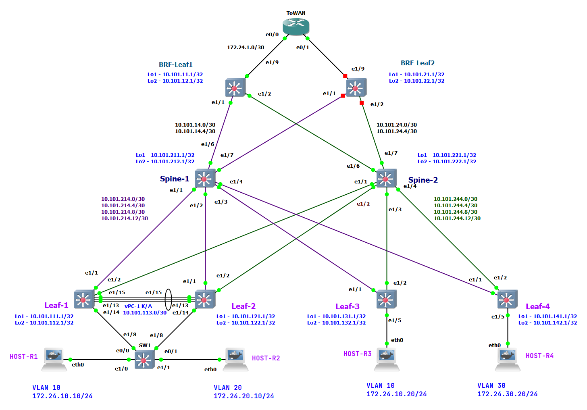
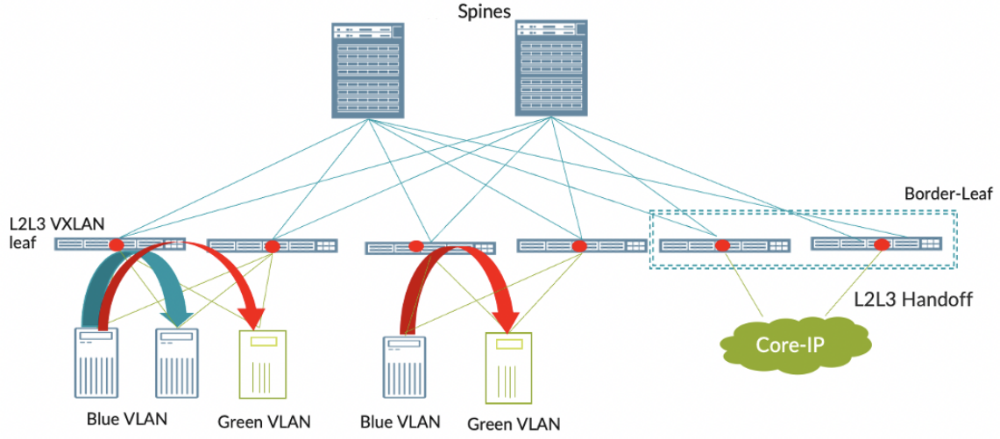
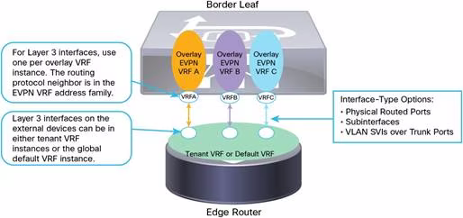
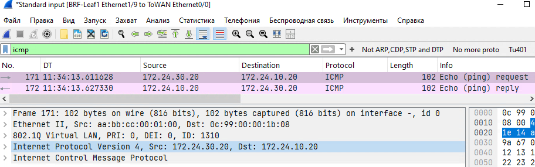
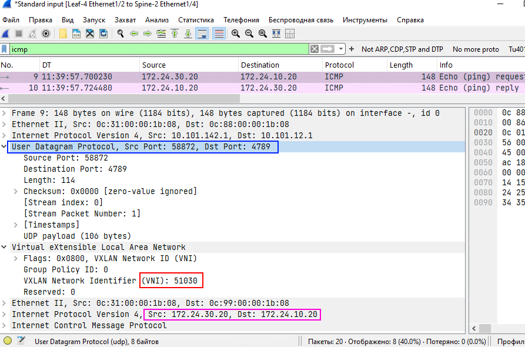
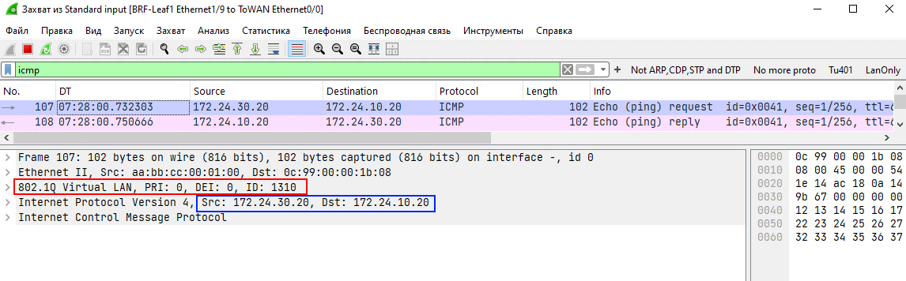
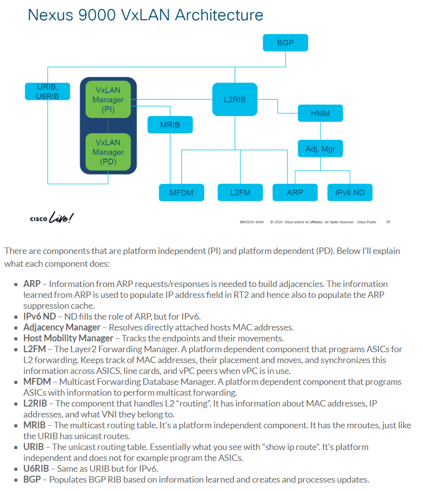
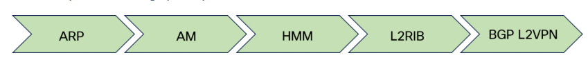

# Lab-8

## VxLAN. Routing

(Механошин Алексей и Подлеснов Александр)

---

Схема подключения опорной сети осталась прежняя, как в LAB-3 на IS-IS протоколе.



Как и план адрессного пространства.

<details>
 <summary>План адрессного пространства</summary>

Общая сеть для всех ЦОД-ов (для трех): ```10.100.0.0/14```

- (Диапазон хостов 10.100.0.1 - 10.103.255.254 )

1) Сеть 10.100.0.0/16 Оставим в резерве.
2) Для первого ЦОД-а суммарное: ```10.101.0.0/16``` ( 10.101.0.1 - 10.101.255.254 )
3) Для второго ЦОД-а суммарное: ```10.102.0.0/16``` ( 10.102.0.1 - 10.102.255.254 )

Таким образом план нумерации будет следуюший

IP = 10.10**D**.**S**xy.**M**zz

Где:

- D = номер ЦОД-а
- S = номер leaf/spine (**1** - leaf, **2**- spine)
- Mzz - значения по порядку

В ```x``` третьего октета кодируем номер Leaf или Spine

- с **1** по **5**
- 0 - для Border Leaf

В ```y``` третьего октета кодируем:

- 1 - Loopback 1 для UNDERLAY
- 2 - Loopback 2 для OVERLAY
- 3 - резерв, напрмер дял vPC keep-alive
- 4 - p2p линк
- 5 - сервисы

Loopack-s:

- ```10.101.111.1/32``` - ЦОД-1, Leaf-1,  Loopack - 1
- ```10.101.112.1/32``` - ЦОД-1, Leaf-1,  Loopack - 2
- ```10.101.121.1/32``` - ЦОД-1, Leaf-2,  Loopack - 1
- ```10.101.122.1/32``` - ЦОД-1, Leaf-2,  Loopack - 2
- ```10.101.131.1/32``` - ЦОД-1, Leaf-3,  Loopack - 1
- ```10.101.132.1/32``` - ЦОД-1, Leaf-3,  Loopack - 2
- ```10.101.141.1/32``` - ЦОД-1, Leaf-4,  Loopack - 1
- ```10.101.142.1/32``` - ЦОД-1, Leaf-4,  Loopack - 2
- ```10.101.211.1/32``` - ЦОД-1, Spine-1, Loopack - 1
- ```10.101.212.1/32``` - ЦОД-1, Spine-1, Loopack - 2
- ```10.101.221.1/32``` - ЦОД-1, Spine-2, Loopack - 1
- ```10.101.222.1/32``` - ЦОД-1, Spine-2, Loopack - 2

Border Leaf Loopacks:

- ```10.101.11.1``` - ЦОД-1, BRD-Leaf-1 Loopack-1
- ```10.101.12.1``` - ЦОД-1, BRD-Leaf-1 Loopack-2
- ```10.101.21.1``` - ЦОД-1, BRD-Leaf-2 Loopack-1
- ```10.101.22.1``` - ЦОД-1, BRD-Leaf-2 Loopack-2

Примеры сетей для vPC:

- ```10.101.113.0/30``` - vPC ЦОД-1, Leaf-1 to Leaf-2 (10.101.113.1 - 10.101.113.2)
- ```10.101.133.0/30``` - vPC ЦОД-1, Leaf-3 to Leaf-4 (10.101.133.1 - 10.101.133.2)

Cети P2P пиров, как и нумерация в октете идёт со стороны Spine:

- ```10.101.214.0/30``` - сеть в ЦОД-1, Spine-1 до Leaf-1 (10.101.214.1  - 10.101.214.2)
- ```10.101.214.4/30``` - сеть в ЦОД-1, Spine-1 до Leaf-2 (10.101.214.5  - 10.101.214.6)
- ```10.101.214.8/30``` - сеть в ЦОД-1, Spine-1 до Leaf-3 (10.101.214.9  - 10.101.214.10)
- ```10.101.214.12/30```- сеть в ЦОД-1, Spine-1 до Leaf-4 (10.101.214.13 - 10.101.214.14)
- ```10.101.224.0/30``` - сеть в ЦОД-1, Spine-2 до Leaf-1 (10.101.224.1  - 10.101.224.2)
- ```10.101.224.4/30``` - сеть в ЦОД-1, Spine-2 до Leaf-2 (10.101.224.5  - 10.101.224.6)
- ```10.101.224.8/30``` - сеть в ЦОД-1, Spine-2 до Leaf-3 (10.101.224.9  - 10.101.224.10)
- ```10.101.224.12/30```- сеть в ЦОД-1, Spine-2 до Leaf-4 (10.101.224.13 - 10.101.224.14)

Или в обратную сторону:

- ```10.101.214.0/30``` - сеть в ЦОД-1, Leaf-1 до Spine-1
- ```10.101.224.0/30``` - сеть в ЦОД-1, Leaf-1 до Spine-2
- ```10.101.214.4/30``` - сеть в ЦОД-1, Leaf-2 до Spine-1
- ```10.101.224.4/30``` - сеть в ЦОД-1, Leaf-2 до Spine-2
- ```10.101.214.8/30``` - сеть в ЦОД-1, Leaf-3 до Spine-1
- ```10.101.224.8/30``` - сеть в ЦОД-1, Leaf-3 до Spine-2
- ```10.101.214.12/30```- сеть в ЦОД-1, Leaf-4 до Spine-1
- ```10.101.224.12/30```- сеть в ЦОД-1, Leaf-4 до Spine-2

---
Сети BRD Leaf-Spine:

- ```10.101.14.0/30```  - сеть в ЦОД-1, Spine-1 до BRD-Leaf-1 (10.101.14.1 - 10.101.14.2)
- ```10.101.14.4/30```  - сеть в ЦОД-1, Spine-1 до BRD-Leaf-2 (10.101.14.5 - 10.101.14.6)
- ```10.101.24.0/30```  - сеть в ЦОД-1, Spine-2 до BRD-Leaf-1 (10.101.24.1 - 10.101.24.2)
- ```10.101.24.4/30```  - сеть в ЦОД-1, Spine-2 до BRD-Leaf-2 (10.101.24.5 - 10.101.24.6)

IP установлены следующим образом

Leaf-R1# sh ip int br

```text
Interface            IP Address
Lo1                  10.101.111.1
Lo2                  10.101.112.1
Eth1/1               10.101.214.2
Eth1/2               10.101.224.2
Eth1/15              10.101.113.1
```

Leaf-R2# sh ip int br

```text
Interface            IP Address
Lo1                  10.101.121.1
Lo2                  10.101.122.1
Eth1/1               10.101.214.6
Eth1/2               10.101.224.6
Eth1/15              10.101.113.2
```

Leaf-R3# sh ip int br

```text
Interface            IP Address
Lo1                  10.101.131.1
Lo2                  10.101.132.1
Eth1/1               10.101.214.10
Eth1/2               10.101.224.10
Eth1/15              10.101.133.1
```

Leaf-R4# sh ip int br

```text
Interface            IP Address
Lo1                  10.101.141.1
Lo2                  10.101.142.1
Eth1/1               10.101.214.14
Eth1/2               10.101.224.14
Eth1/15              10.101.133.2
```

Spine-R1# sh ip int br

```text
Interface            IP Address
Lo1                  10.101.211.1
Lo2                  10.101.212.1
Eth1/1               10.101.214.1
Eth1/2               10.101.214.5
Eth1/3               10.101.214.9
Eth1/4               10.101.214.13
Eth1/6               10.101.14.1
Eth1/7               10.101.14.5
```

Spine-R2# sh ip int br

```text
Interface            IP Address
Lo1                  10.101.221.1
Lo2                  10.101.222.1
Eth1/1               10.101.224.1
Eth1/2               10.101.224.5
Eth1/3               10.101.224.9
Eth1/4               10.101.224.13
Eth1/6               10.101.24.1
Eth1/7               10.101.24.5
```

BRF-Leaf-R1# sh ip int br

```text
Interface            IP Address
Lo1                  10.101.11.1
Lo2                  10.101.12.1
Eth1/1               10.101.14.2
Eth1/2               10.101.24.2
```

BRD-Leaf-R2# sh ip int br

```text
Interface            IP Address
Lo1                  10.101.21.1
Lo2                  10.101.22.1
Eth1/1               10.101.14.6
Eth1/2               10.101.24.6
```

</details>

Основные понятия:

1. Netwotk Virtualization Overlay (NVO) - оверлейная сеть
2. VXLAN Tunnel End Point (VTEP) - само устройство которое занимается инкапсуляцией/декапсуляцией VxLAN фреймов
3. Network Virtualization Edge (NVE) - туннельный интерфейс инкапсуляцией/декапсуляцией VxLAN фреймов.
 Можно сравнить в транком до сотальных VTEP-ов, или как GRE туннель.
4. Virtual Network Identifier (VNI) - метка VxLAN инкапсуляции, определяющая Layer-2 домен в оверлейной сети.
 Должна быть одинакова на всех VTEP-ах куда нам необходимо соеденить наш L2 домен.
5. MAC-VRF - воспринимаем как EVPN-instanc, как VLAN примапленный к NVI и учавствующий в VxLAN инкапсуляции/декапсуляции.
 (Можно представить типа как "L2-роутинг" между VTEP-ами).
 В Общем сколько у нас будет VLAN-ов с VNI - столько у нас будет и MAC-VRF-ов,
 поскольку у каждого MAC-VRF будет свой Route-Target (RT) и свой Route Destingisher (RD) - типа L2-VRF такие.
6. IP-VRF - Обычный L3 VRF, который и собирает в себе MAC-VRF-ы

---

### Цель: Реализовать маршрутизацию между "клиентами" через EVPN route-type 5

Задачи:

1. Разместите двух "клиентов" в разных VRF в рамках одной фабрики.
2. Настроите маршрутизацию между клиентами через внешнее устройство (граничный роутер\фаерволл\etc)

Настраивать мы будем по типу `Edge-Routed Bridging`



Первым делом на Leaf-4 (и на бордер-лифе `BRF-Leaf-R1`) заведем два новых VLAN-а:

1. VLAN 30   - L2VNI c номером МТШ 10000030 для подключения хоста и 'L2-роутинга',
2. VLAN 1030 - L3VNI c номером VNI 51030 для L3 ротуннга между VTEP-ами.

Так-же добавим ещё один VRF для изоляции, как от опорной сети, так и для изоляции от VLAN-10/20 что находятся в своем VRF.

Собственно задача будет и настроить L3 маршрутизацию между двумя VRF-ами, используя внешнее устройство подключенное к бордеру



Картинка взята из гайда на сайте [cisco](https://www.cisco.com/c/en/us/products/collateral/switches/nexus-9000-series-switches/guide-c07-734107.html#_Toc444553379)

```text
Leaf-R4# c
Enter configuration commands, one per line. End with CNTL/Z.
Leaf-R4(config)# vlan 30
Leaf-R4(config-vlan)# vn-segment 10000030
Leaf-R4(config-vlan)# exit
Leaf-R4(config)# 
Leaf-R4(config)# vlan 1030
Leaf-R4(config-vlan)# vn-segment 51030
Leaf-R4(config-vlan)# exit
Leaf-R4(config)# 
Leaf-R4(config)# vrf context DEMO
Leaf-R4(config-vrf)# vni 51030
Leaf-R4(config-vrf)# rd auto
Leaf-R4(config-vrf)# address-family ipv4 unicast
Leaf-R4(config-vrf-af-ipv4)# route-target both auto
Leaf-R4(config-vrf-af-ipv4)# route-target both auto evpn
Leaf-R4(config-vrf-af-ipv4)# exit
Leaf-R4(config-vrf)# exit
Leaf-R4(config)# 
Leaf-R4(config)# interface Vlan30
Leaf-R4(config-if)# no shutdown
Leaf-R4(config-if)# description # Member vrf DEMO #
Leaf-R4(config-if)# vrf member DEMO
Leaf-R4(config-if)# ip address 172.24.30.1/24
Leaf-R4(config-if)# fabric forwarding mode anycast-gateway
Leaf-R4(config-if)# exit
Leaf-R4(config)# 
```

Так-же не забываем прописать наш L2/L3 VNI в NVE интерфейс

```text
Leaf-R4(config)# interface nve1
Leaf-R4(config-if-nve)# member vni 51030 associate-vrf
Leaf-R4(config-if-nve-vni)# exit
Leaf-R4(config-if-nve)# member vni 10000030
Leaf-R4(config-if-nve-vni)# ingress-replication protocol bgp
Leaf-R4(config-if-nve-vni)# exit
Leaf-R4(config-if-nve)# exit
Leaf-R4(config)# 
```

И последний штрих - создадим SVI для L3 роутинга:

Leaf-R4(config)# interface Vlan1030
Leaf-R4(config-if)# no shutdown
Leaf-R4(config-if)# vrf member DEMO
Warning: Deleted all L3 config on interface Vlan1030
Leaf-R4(config-if)# ip forward
Leaf-R4(config-if)# exit
Leaf-R4(config)#

Подключаем хост и проверив настройки пропингуем шлюз:

```text
HOST-R4:/#ifconfig 
eth0      Link encap:Ethernet  HWaddr 02:42:BE:17:BD:00  
          inet addr:172.24.30.20  Bcast:172.24.30.255  Mask:255.255.255.0
          ...
HOST-R4:/#ping 172.24.30.1
PING 172.24.30.1 (172.24.30.1) 56(84) bytes of data.
64 bytes from 172.24.30.1: icmp_seq=2 ttl=255 time=2.61 ms
64 bytes from 172.24.30.1: icmp_seq=3 ttl=255 time=3.11 ms
```

Проверим что L2/L3 данные появилися в BGP:

```text
Leaf-R4# sh bgp l2vpn evpn
...
Route Distinguisher: 10.101.142.1:32797    (L2VNI 10000030)
*>l[2]:[0]:[0]:[48]:[0242.be17.bd00]:[0]:[0.0.0.0]/216
                      10.101.142.1                      100      32768 i
*>l[2]:[0]:[0]:[48]:[0242.be17.bd00]:[32]:[172.24.30.20]/272
                      10.101.142.1                      100      32768 i
...                      
```

<details>
<summary>Полный вывод `sh bgp bgp l2vpn evpn` на Leaf-4 </summary>

```text
Leaf-R4# 
Leaf-R4# sh bgp l2vpn evpn
BGP routing table information for VRF default, address family L2VPN EVPN
BGP table version is 2297, Local Router ID is 10.101.142.1
Status: s-suppressed, x-deleted, S-stale, d-dampened, h-history, *-valid, >-best
Path type: i-internal, e-external, c-confed, l-local, a-aggregate, r-redist, I-injected
Origin codes: i - IGP, e - EGP, ? - incomplete, | - multipath, & - backup, 2 - best2

   Network            Next Hop            Metric     LocPrf     Weight Path
Route Distinguisher: 10.101.12.1:32777
* i[3]:[0]:[32]:[10.101.12.1]/88
                      10.101.12.1                       100          0 i
*>i                   10.101.12.1                       100          0 i

Route Distinguisher: 10.101.12.1:32787
* i[3]:[0]:[32]:[10.101.12.1]/88
                      10.101.12.1                       100          0 i
*>i                   10.101.12.1                       100          0 i

Route Distinguisher: 10.101.12.1:32797
* i[3]:[0]:[32]:[10.101.12.1]/88
                      10.101.12.1                       100          0 i
*>i                   10.101.12.1                       100          0 i

Route Distinguisher: 10.101.112.1:32777
*>i[2]:[0]:[0]:[48]:[0242.9789.e200]:[0]:[0.0.0.0]/216
                      10.101.112.2                      100          0 i
* i                   10.101.112.2                      100          0 i
*>i[2]:[0]:[0]:[48]:[0242.9789.e200]:[32]:[172.24.10.10]/272
                      10.101.112.2                      100          0 i
* i                   10.101.112.2                      100          0 i
*>i[3]:[0]:[32]:[10.101.112.2]/88
                      10.101.112.2                      100          0 i
* i                   10.101.112.2                      100          0 i

Route Distinguisher: 10.101.112.1:32787
* i[2]:[0]:[0]:[48]:[0242.dd79.f500]:[0]:[0.0.0.0]/216
                      10.101.112.2                      100          0 i
*>i                   10.101.112.2                      100          0 i
* i[2]:[0]:[0]:[48]:[0242.dd79.f500]:[32]:[172.24.20.10]/272
                      10.101.112.2                      100          0 i
*>i                   10.101.112.2                      100          0 i
*>i[3]:[0]:[32]:[10.101.112.2]/88
                      10.101.112.2                      100          0 i
* i                   10.101.112.2                      100          0 i

Route Distinguisher: 10.101.122.1:32777
* i[2]:[0]:[0]:[48]:[0242.9789.e200]:[0]:[0.0.0.0]/216
                      10.101.112.2                      100          0 i
*>i                   10.101.112.2                      100          0 i
*>i[2]:[0]:[0]:[48]:[0242.9789.e200]:[32]:[172.24.10.10]/272
                      10.101.112.2                      100          0 i
* i                   10.101.112.2                      100          0 i
*>i[3]:[0]:[32]:[10.101.112.2]/88
                      10.101.112.2                      100          0 i
* i                   10.101.112.2                      100          0 i

Route Distinguisher: 10.101.122.1:32787
* i[2]:[0]:[0]:[48]:[0242.dd79.f500]:[0]:[0.0.0.0]/216
                      10.101.112.2                      100          0 i
*>i                   10.101.112.2                      100          0 i
* i[2]:[0]:[0]:[48]:[0242.dd79.f500]:[32]:[172.24.20.10]/272
                      10.101.112.2                      100          0 i
*>i                   10.101.112.2                      100          0 i
*>i[3]:[0]:[32]:[10.101.112.2]/88
                      10.101.112.2                      100          0 i
* i                   10.101.112.2                      100          0 i

Route Distinguisher: 10.101.132.1:32777
* i[2]:[0]:[0]:[48]:[0242.afa7.0100]:[0]:[0.0.0.0]/216
                      10.101.132.1                      100          0 i
*>i                   10.101.132.1                      100          0 i
* i[2]:[0]:[0]:[48]:[0242.afa7.0100]:[32]:[172.24.10.20]/272
                      10.101.132.1                      100          0 i
*>i                   10.101.132.1                      100          0 i
* i[3]:[0]:[32]:[10.101.132.1]/88
                      10.101.132.1                      100          0 i
*>i                   10.101.132.1                      100          0 i

Route Distinguisher: 10.101.132.1:32787
* i[3]:[0]:[32]:[10.101.132.1]/88
                      10.101.132.1                      100          0 i
*>i                   10.101.132.1                      100          0 i

Route Distinguisher: 10.101.142.1:32777    (L2VNI 10000010)
* i[2]:[0]:[0]:[48]:[0242.9789.e200]:[0]:[0.0.0.0]/216
                      10.101.112.2                      100          0 i
*>i                   10.101.112.2                      100          0 i
*>i[2]:[0]:[0]:[48]:[0242.afa7.0100]:[0]:[0.0.0.0]/216
                      10.101.132.1                      100          0 i
*>i[2]:[0]:[0]:[48]:[0242.9789.e200]:[32]:[172.24.10.10]/272
                      10.101.112.2                      100          0 i
* i                   10.101.112.2                      100          0 i
*>i[2]:[0]:[0]:[48]:[0242.afa7.0100]:[32]:[172.24.10.20]/272
                      10.101.132.1                      100          0 i
*>i[3]:[0]:[32]:[10.101.12.1]/88
                      10.101.12.1                       100          0 i
*>i[3]:[0]:[32]:[10.101.112.2]/88
                      10.101.112.2                      100          0 i
* i                   10.101.112.2                      100          0 i
*>i[3]:[0]:[32]:[10.101.132.1]/88
                      10.101.132.1                      100          0 i
*>l[3]:[0]:[32]:[10.101.142.1]/88
                      10.101.142.1                      100      32768 i

Route Distinguisher: 10.101.142.1:32787    (L2VNI 10000020)
* i[2]:[0]:[0]:[48]:[0242.dd79.f500]:[0]:[0.0.0.0]/216
                      10.101.112.2                      100          0 i
*>i                   10.101.112.2                      100          0 i
* i[2]:[0]:[0]:[48]:[0242.dd79.f500]:[32]:[172.24.20.10]/272
                      10.101.112.2                      100          0 i
*>i                   10.101.112.2                      100          0 i
*>i[3]:[0]:[32]:[10.101.12.1]/88
                      10.101.12.1                       100          0 i
*>i[3]:[0]:[32]:[10.101.112.2]/88
                      10.101.112.2                      100          0 i
* i                   10.101.112.2                      100          0 i
*>i[3]:[0]:[32]:[10.101.132.1]/88
                      10.101.132.1                      100          0 i
*>l[3]:[0]:[32]:[10.101.142.1]/88
                      10.101.142.1                      100      32768 i

Route Distinguisher: 10.101.142.1:32797    (L2VNI 10000030)
*>l[2]:[0]:[0]:[48]:[0242.be17.bd00]:[0]:[0.0.0.0]/216
                      10.101.142.1                      100      32768 i
*>l[2]:[0]:[0]:[48]:[0242.be17.bd00]:[32]:[172.24.30.20]/272
                      10.101.142.1                      100      32768 i
*>i[3]:[0]:[32]:[10.101.12.1]/88
                      10.101.12.1                       100          0 i
*>l[3]:[0]:[32]:[10.101.142.1]/88
                      10.101.142.1                      100      32768 i

Route Distinguisher: 10.101.142.1:3    (L3VNI 51010)
*>i[2]:[0]:[0]:[48]:[0242.9789.e200]:[32]:[172.24.10.10]/272
                      10.101.112.2                      100          0 i
* i                   10.101.112.2                      100          0 i
*>i[2]:[0]:[0]:[48]:[0242.afa7.0100]:[32]:[172.24.10.20]/272
                      10.101.132.1                      100          0 i
* i[2]:[0]:[0]:[48]:[0242.dd79.f500]:[32]:[172.24.20.10]/272
                      10.101.112.2                      100          0 i
*>i                   10.101.112.2                      100          0 i

Leaf-R4# 
```

</details>

<details>
<summary>Фрагмент BGP на бордере - IP хостов мы тут тоже видим</summary>

```text
BRF-Leaf-R1# sh bgp l2vpn evpn 
[skip]
Route Distinguisher: 10.101.12.1:3    (L3VNI 51030)
*>i[2]:[0]:[0]:[48]:[0242.be17.bd00]:[32]:[172.24.30.20]/272
                      10.101.142.1                      100          0 i

Route Distinguisher: 10.101.12.1:4    (L3VNI 51010)
*>i[2]:[0]:[0]:[48]:[0242.9789.e200]:[32]:[172.24.10.10]/272
                      10.101.112.2                      100          0 i
* i                   10.101.112.2                      100          0 i
*>i[2]:[0]:[0]:[48]:[0242.afa7.0100]:[32]:[172.24.10.20]/272
                      10.101.132.1                      100          0 i
* i[2]:[0]:[0]:[48]:[0242.dd79.f500]:[32]:[172.24.20.10]/272

BRF-Leaf-R1#  
```

</details>

Далее переходим на бордер-лиф и создадим пару локальных VLAN-ов и SVI для связи c роутером, в своих VRF-ах.

```text
BRF-Leaf-R1# c
Enter configuration commands, one per line. End with CNTL/Z.
BRF-Leaf-R1(config)# 
BRF-Leaf-R1(config)# vlan 1310
BRF-Leaf-R1(config-vlan)# name VL10TOROUTER
BRF-Leaf-R1(config-vlan)# exit
BRF-Leaf-R1(config)# vlan 1330
BRF-Leaf-R1(config-vlan)# name VL30TOROUTER
BRF-Leaf-R1(config-vlan)# exit
BRF-Leaf-R1(config)# 
BRF-Leaf-R1(config)# interface Vlan1310
BRF-Leaf-R1(config-if)# no shutdown
BRF-Leaf-R1(config-if)# vrf member LABA
BRF-Leaf-R1(config-if)# no ip redirects
BRF-Leaf-R1(config-if)# ip address 172.24.1.1/30
BRF-Leaf-R1(config-if)# exit
BRF-Leaf-R1(config)# 
BRF-Leaf-R1(config)# interface Vlan1330
BRF-Leaf-R1(config-if)# no shutdown
BRF-Leaf-R1(config-if)# vrf member DEMO
BRF-Leaf-R1(config-if)# no ip redirects
BRF-Leaf-R1(config-if)# ip address 172.24.1.5/30
BRF-Leaf-R1(config-if)# exit
BRF-Leaf-R1(config)# 
BRF-Leaf-R1(config)# 
```

Переходим на роутер и настраиваем транк

```text
ToWAN#c
Enter configuration commands, one per line.  End with CNTL/Z.
ToWAN(config)#interface Ethernet0/0
ToWAN(config-if)#des
ToWAN(config-if)#description # Trunk to_BRF-Leaf-R1
ToWAN(config-if)#no ip address
ToWAN(config-if)#exit
ToWAN(config)#interface Ethernet0/0.10
ToWAN(config-subif)#encapsulation dot1Q 1310
ToWAN(config-subif)#ip address 172.24.1.2 255.255.255.252
ToWAN(config-subif)#no ip redirects
ToWAN(config-subif)#exit
ToWAN(config)#interface Ethernet0/0.30
ToWAN(config-subif)#encapsulation dot1Q 1330
ToWAN(config-subif)#ip address 172.24.1.6 255.255.255.252
ToWAN(config-subif)#no ip redirects
ToWAN(config-subif)#exit
ToWAN(config)#
```

Проверим что бордер пингуется

```text
ToWAN#ping 172.24.1.2 repeat 2
Type escape sequence to abort.
Sending 2, 100-byte ICMP Echos to 172.24.1.2, timeout is 2 seconds:
!!
Success rate is 100 percent (2/2), round-trip min/avg/max = 1/1/1 ms
ToWAN#ping 172.24.1.5 repeat 2
Type escape sequence to abort.
Sending 2, 100-byte ICMP Echos to 172.24.1.5, timeout is 2 seconds:
!!
Success rate is 100 percent (2/2), round-trip min/avg/max = 1/2/3 ms
ToWAN#
```

Теперь настроим eBGP пиринг между роутром и бордером. Начнем с бордера.

Важное примечание: каждый наш IP VRF должен представлятся своей AS, иначе BGP увидит что у него на обоих пирах одинаковая AS и не будет между ними передавать префиксы. Поэтому по мы будем прикидываться в кадом VRF выдуманным номером AS командой `local-as`, причем именно на весь(!) VRF:

```text
BRF-Leaf-R1# c
Enter configuration commands, one per line. End with CNTL/Z.
BRF-Leaf-R1(config)# route-map RM-BGP-DIRECT permit 10
BRF-Leaf-R1(config-route-map)# exit
BRF-Leaf-R1(config)#
BRF-Leaf-R1(config)# router bgp 65010
BRF-Leaf-R1(config-router)# vrf LABA
BRF-Leaf-R1(config-router-vrf)# local-as 65011
BRF-Leaf-R1(config-router-vrf)# router-id 172.24.1.1
BRF-Leaf-R1(config-router-vrf)# neighbor 172.24.1.2
BRF-Leaf-R1(config-router-vrf-neighbor)# remote-as 1111
BRF-Leaf-R1(config-router-vrf-neighbor)# address-family ipv4 unicast
BRF-Leaf-R1(config-router-vrf-neighbor-af)# exit
BRF-Leaf-R1(config-router-vrf-neighbor)# exit
BRF-Leaf-R1(config-router-vrf)# exit
BRF-Leaf-R1(config-router)# vrf DEMO
BRF-Leaf-R1(config-router-vrf)# local-as 65012
BRF-Leaf-R1(config-router-vrf)# router-id 172.24.1.5
BRF-Leaf-R1(config-router-vrf)# neighbor 172.24.1.6
BRF-Leaf-R1(config-router-vrf-neighbor)# remote-as 1111
BRF-Leaf-R1(config-router-vrf-neighbor)# address-family ipv4 unicast
BRF-Leaf-R1(config-router-vrf-neighbor-af)# exit
BRF-Leaf-R1(config-router-vrf-neighbor)# exit
BRF-Leaf-R1(config-router-vrf)# exit
BRF-Leaf-R1(config-router)# exit
BRF-Leaf-R1(config)# 
BRF-Leaf-R1(config)#
```

На роутере настройка очень простая:

```text
ToWAN#c
Enter configuration commands, one per line.  End with CNTL/Z.
ToWAN(config)#router bgp 1111
ToWAN(config-router)#bgp log-neighbor-changes
ToWAN(config-router)#neighbor 172.24.1.1 remote-as 65011
ToWAN(config-router)#neighbor 172.24.1.5 remote-as 65012
ToWAN(config-router)#end
ToWAN#
ToWAN#sh ip bgp summary 
...

Neighbor        V           AS MsgRcvd MsgSent   TblVer  InQ OutQ Up/Down  State/PfxRcd
172.24.1.1      4        65011       7       5        5    0    0 00:00:49        3
172.24.1.5      4        65012       5       6        5    0    0 00:00:37        1
```

Проверим маршруты выученные BGP:

```text
ToWAN#sh ip bgp | b Network
     Network          Next Hop            Metric LocPrf Weight Path
 *>   172.24.10.10/32  172.24.1.1                             0 65011 i
 *>   172.24.10.20/32  172.24.1.1                             0 65011 i
 *>   172.24.20.10/32  172.24.1.1                             0 65011 i
 *>   172.24.30.20/32  172.24.1.5                             0 65012 i
ToWAN#
```

У нас появилист IP хостов.

Теперь у нас должны появится Type-5 маршруты и на лифах.

L3VNI 51010 для VLAN 10 и 20, на лиф-3:

```text
Leaf-R3# sh bgp l2vpn evpn vni-id 51010 | b Network
   Network            Next Hop            Metric     LocPrf     Weight Path
Route Distinguisher: 10.101.132.1:3    (L3VNI 51010)
*>i[2]:[0]:[0]:[48]:[0242.9789.e200]:[32]:[172.24.10.10]/272
                      10.101.112.2                      100          0 i
* i                   10.101.112.2                      100          0 i
* i[2]:[0]:[0]:[48]:[0242.dd79.f500]:[32]:[172.24.20.10]/272
                      10.101.112.2                      100          0 i
*>i                   10.101.112.2                      100          0 i
*>i[5]:[0]:[0]:[32]:[172.24.30.20]/224
                      10.101.12.1                       100          0 1111 65012 i

Leaf-R3# 
```

Примечание: 172.24.10.10 и 172.24.20.10 ми тут видим поскольку они на Leaf-1/2 находтся, но маршрут у них **второго** типа, т.е. внутренний!

и L3VNI 51030  для VLAN30 на лиф-4:

```text
Leaf-R4# sh bgp l2vpn evpn vni-id 51030 | b Network
   Network            Next Hop            Metric     LocPrf     Weight Path
Route Distinguisher: 10.101.142.1:5    (L3VNI 51030)
*>i[5]:[0]:[0]:[32]:[172.24.10.10]/224
                      10.101.12.1                       100          0 1111 65011 i
*>i[5]:[0]:[0]:[32]:[172.24.10.20]/224
                      10.101.12.1                       100          0 1111 65011 i
*>i[5]:[0]:[0]:[32]:[172.24.20.10]/224
                      10.101.12.1                       100          0 1111 65011 i

Leaf-R4# 
```

Отлично, для хоста 4-го, подключенного к своему VRF, хосты из соседнего VRF видны через Type-5 маршруты, - через роутер.

Проверим связность, c 4-го хоста пропингуем 3-тий и первый:

```text
rtt min/avg/max/mdev = 39.169/40.316/41.463/1.147 ms
HOST-R4:/#ping -c 3 172.24.10.20 
PING 172.24.10.20 (172.24.10.20) 56(84) bytes of data.
64 bytes from 172.24.10.20: icmp_seq=1 ttl=59 time=29.7 ms
64 bytes from 172.24.10.20: icmp_seq=2 ttl=59 time=34.8 ms
64 bytes from 172.24.10.20: icmp_seq=3 ttl=59 time=22.0 ms

--- 172.24.10.20 ping statistics ---
3 packets transmitted, 3 received, 0% packet loss, time 2004ms
rtt min/avg/max/mdev = 22.024/28.823/34.750/5.231 ms
HOST-R4:/#ping -c 3 172.24.10.10 
PING 172.24.10.10 (172.24.10.10) 56(84) bytes of data.
64 bytes from 172.24.10.10: icmp_seq=1 ttl=59 time=36.4 ms
64 bytes from 172.24.10.10: icmp_seq=2 ttl=59 time=37.5 ms
64 bytes from 172.24.10.10: icmp_seq=3 ttl=59 time=36.5 ms

--- 172.24.10.10 ping statistics ---
3 packets transmitted, 3 received, 0% packet loss, time 2001ms
rtt min/avg/max/mdev = 36.416/36.783/37.457/0.477 ms
HOST-R4:/#
```

Захват между бордером и роутером:



И между 4-ым лифом и спайном:



---

Вернемся к eBGP, - есть более элегантный способ который позволит нам обойти правило eBGP: если видим номер своей автономки,
 то отбрвсываем такой маршрут.
Сейчас мы на лифах видим эти фейковые AS в анонсах BGP, пример вот этот 65012:

```text
*>i[5]:[0]:[0]:[32]:[172.24.30.20]/224
                      10.101.12.1                       100          0 1111 65012 i
```

Удалим сначала на роутуре:

```text
ToWAN#conf term
Enter configuration commands, one per line.  End with CNTL/Z.
ToWAN(config)#router bgp 1111
ToWAN(config-router)#no neighbor 172.24.1.1 remote-as 65011
ToWAN(config-router)#
*Jan 30 07:11:25.845: %BGP-3-NOTIFICATION: sent to neighbor 172.24.1.1 6/3 (Peer De-configured) 0 bytes 
ToWAN(config-router)#no neighbor 172.24.1.5 remote-as 65012
ToWAN(config-router)#
*Jan 30 07:11:32.413: %BGP-3-NOTIFICATION: sent to neighbor 172.24.1.5 6/3 (Peer De-configured) 0 bytes 
ToWAN(config-router)#
```

И переделаем на бордере:

```text
BRF-Leaf-R1# conf term
Enter configuration commands, one per line. End with CNTL/Z.
BRF-Leaf-R1(config)# router bgp 65010
BRF-Leaf-R1(config-router)# vrf LABA
BRF-Leaf-R1(config-router-vrf)# no local-as 65011
BRF-Leaf-R1(config-router-vrf)# exit
BRF-Leaf-R1(config-router)# vrf DEMO
BRF-Leaf-R1(config-router-vrf)# no local-as 65012
BRF-Leaf-R1(config-router-vrf)# exit
BRF-Leaf-R1(config-router)# 
BRF-Leaf-R1(config-router)# exit
BRF-Leaf-R1(config)# 
```

Теперь вернемся на роутер и тут наобходимо перезаписать номер AS у пиров командой .

```text
ToWAN(config-router)#neighbor 172.24.1.1 remote-as 65010
ToWAN(config-router)#neighbor 172.24.1.1 timers 7 21
ToWAN(config-router)#neighbor 172.24.1.1 as         
ToWAN(config-router)#neighbor 172.24.1.1 as-override 
ToWAN(config-router)#neighbor 172.24.1.5 remote-as 65010
ToWAN(config-router)#neighbor 172.24.1.5 timers 7 21
ToWAN(config-router)#neighbor 172.24.1.5 as
ToWAN(config-router)#neighbor 172.24.1.5 as-override 
ToWAN(config-router)#end
ToWAN#
```

<details>
<summary>Итоговый BGP на бордере</summary>

```text
router bgp 65010
  router-id 10.101.12.1
  address-family l2vpn evpn
  template peer SPINES
    remote-as 65010
    update-source loopback2
    address-family l2vpn evpn
      send-community extended
  neighbor 10.101.212.1
    inherit peer SPINES
    description Spne-1
  neighbor 10.101.222.1
    inherit peer SPINES
    description Spne-2
  vrf DEMO
    router-id 172.24.1.5
    neighbor 172.24.1.6
      remote-as 1111
      timers 7 21
      address-family ipv4 unicast
  vrf LABA
    router-id 172.24.1.1
    neighbor 172.24.1.2
      remote-as 1111
      timers 7 21
      address-family ipv4 unicast
```

</details>

<details>
<summary>Итоговый BGP на роутере</summary>

```text
router bgp 1111
 bgp log-neighbor-changes
 neighbor 172.24.1.1 remote-as 65010
 neighbor 172.24.1.1 timers 7 21
 neighbor 172.24.1.1 as-override
 neighbor 172.24.1.5 remote-as 65010
 neighbor 172.24.1.5 timers 7 21
 neighbor 172.24.1.5 as-override
```

</details>

Таким образом маршрут приходящий от AS65010 будет перезаписываться как AS 1111 что позволит ему принятся на бордере в другом там VRF.

Проверим как сейчас выглядят наши префиксы c Type-5:

```text
...
*>i[5]:[0]:[0]:[32]:[172.24.30.20]/224
                      10.101.12.1                       100          0 1111 1111 i
...
```

Стало гораздо лучше и понятнее.

Проверим как работает пинг мнжду VRF-ами:

```text
HOST-R4:/#ping -c 4 172.24.10.20 
PING 172.24.10.20 (172.24.10.20) 56(84) bytes of data.
64 bytes from 172.24.10.20: icmp_seq=1 ttl=59 time=26.7 ms
64 bytes from 172.24.10.20: icmp_seq=2 ttl=59 time=22.9 ms
64 bytes from 172.24.10.20: icmp_seq=3 ttl=59 time=23.4 ms
64 bytes from 172.24.10.20: icmp_seq=4 ttl=59 time=23.3 ms

--- 172.24.10.20 ping statistics ---
4 packets transmitted, 4 received, 0% packet loss, time 3004ms
rtt min/avg/max/mdev = 22.908/24.071/26.658/1.506 ms
HOST-R4:/#
```



И для окончательного контроля трейс:

```text
HOST-R4:/#traceroute -n 172.24.10.20
traceroute to 172.24.10.20 (172.24.10.20), 30 hops max, 46 byte packets
 1  172.24.30.1  4.030 ms  1.499 ms  2.567 ms
 2  172.24.1.5  12.551 ms  8.230 ms  7.980 ms
 3  172.24.1.6  7.731 ms  7.639 ms  7.764 ms
 4  172.24.1.1  10.019 ms  8.844 ms  11.017 ms
 5  172.24.10.1  20.154 ms  17.172 ms  19.093 ms
 6  172.24.10.20  23.451 ms  29.493 ms  32.515 ms
HOST-R4:/#
```

#### Оптимизация маршрутов

Самая первая очевидная проблема это что маршруты начинают дублироваться по сути - все IP хостов появлятся как на роутере, в общей куче, так еще и перетекают в другие VRF-ы. Одно из решений - суммаризация маршрутов.
Оптимально это просуммировать всё что находится в VRF одним префиксом (при соответствующем планировании сети).
Как вариант - передавать на роутер не сами IP хостов, и только префиксы, в которых эти хосты находятся.

Настроим на всех обычных лифах редистрибуцию connected (direct) префиксов по каждому VRF в BGP, и префиксы Host-Mobility (HMM),
 но для этого нам надо создать сначала пустой ```route-map`` поскольку BGP на нексусах требует его наличия.
 
```text
Leaf-R4# conf term
Enter configuration commands, one per line. End with CNTL/Z.
Leaf-R4(config)# route-map RM_PERMIT_IPv4 permit 10
Leaf-R4(config-route-map)# exit
Leaf-R4(config)# router bgp 65010
Leaf-R4(config-router)# vrf LABA
Leaf-R4(config-router-vrf)# address-family ipv4 unicast
Leaf-R4(config-router-vrf-af)# redistribute direct route-map RM_PERMIT_IPv4
Leaf-R4(config-router-vrf-af)# redistribute hmm route-map RM_PERMIT_IPv4
Leaf-R4(config-router-vrf-af)# exit
Leaf-R4(config-router-vrf)# exit
Leaf-R4(config-router)# 
Leaf-R4(config-router)# vrf DEMO
Leaf-R4(config-router-vrf)# address-family ipv4 unicast
Leaf-R4(config-router-vrf-af)# redistribute direct route-map RM_PERMIT_IPv4
Leaf-R4(config-router-vrf-af)# redistribute hmm route-map RM_PERMIT_IPv4
Leaf-R4(config-router-vrf-af)# exit
Leaf-R4(config-router-vrf)# end
Leaf-R4# 
```

Таким образом мы проанонсировали префиксы ```/24``` в VxLAN фабрику, и в дальнейшем мы их профильтруем на бордере,
 для отправки в сторону роутера только самих префиксов наших сетей.

Примечание: любая редистрибуция обозначает появление Type-5 маршрутов.

<details>
<summary>HMM - Host Mobility Manager</summary>

Примечание: `hmm` (Host Mobility Manager) это фича которая самостоятельно включается когда мы используем фичу `feature fabric forwarding`,
и это [один из шагов](https://lostintransit.se/2024/01/31/nx-os-forwarding-constructs-for-vxlan-evpn/) перед импортом в L2RIB.





</details>

Теперь просто, через префикс-лист, запретим передавать хосто-роуты в сторону роутера, в обоих VRF-ах.

```text
BRF-Leaf-R1# c
Enter configuration commands, one per line. End with CNTL/Z.
BRF-Leaf-R1(config)# ip prefix-list outbound-no-host description Allow only CIDR prefix send to router
BRF-Leaf-R1(config)# ip prefix-list outbound-no-host seq 10 deny 0.0.0.0/0 eq 32
BRF-Leaf-R1(config)# ip prefix-list outbound-no-host seq 20 permit 0.0.0.0/0 le 32
BRF-Leaf-R1(config)# 
BRF-Leaf-R1(config)# router bgp 65010
BRF-Leaf-R1(config-router)# vrf LABA
BRF-Leaf-R1(config-router-vrf)# neighbor 172.24.1.2
BRF-Leaf-R1(config-router-vrf-neighbor)# address-family ipv4 unicast
BRF-Leaf-R1(config-router-vrf-neighbor-af)# prefix-list outbound-no-host out 
BRF-Leaf-R1(config-router-vrf-neighbor-af)# exit
BRF-Leaf-R1(config-router-vrf-neighbor)# exit
BRF-Leaf-R1(config-router-vrf)# exit
BRF-Leaf-R1(config-router)# vrf DEMO
BRF-Leaf-R1(config-router-vrf)# neighbor 172.24.1.6
BRF-Leaf-R1(config-router-vrf-neighbor)# address-family ipv4 unicast
BRF-Leaf-R1(config-router-vrf-neighbor-af)# prefix-list outbound-no-host out
BRF-Leaf-R1(config-router-vrf-neighbor-af)# end
BRF-Leaf-R1# 
```

Проверим как сейчас выглядят машруты на роутере:

```text
ToWAN#sh ip bgp | b Network
     Network          Next Hop            Metric LocPrf Weight Path
 *>   172.24.10.0/24   172.24.1.1                             0 65010 ?
 *>   172.24.20.0/24   172.24.1.1                             0 65010 ?
 *>   172.24.30.0/24   172.24.1.5                             0 65010 ?
ToWAN#
```

Стало гораздо аккуратнее выглядеть. Теперь проверим какие есть маршруты в VRF LABA на Leaf-3 например.

```text
Leaf-R3# sh ip route bgp vrf LABA
IP Route Table for VRF "LABA"
'*' denotes best ucast next-hop
'**' denotes best mcast next-hop
'[x/y]' denotes [preference/metric]
'%<string>' in via output denotes VRF <string>

172.24.10.10/32, ubest/mbest: 1/0
    *via 10.101.112.2%default, [200/0], 2d16h, bgp-65010, internal, tag 65010, segid: 51010 tunnelid: 0xa657002 encap: VXLAN
 
172.24.20.10/32, ubest/mbest: 1/0
    *via 10.101.112.2%default, [200/0], 1d20h, bgp-65010, internal, tag 65010, segid: 51010 tunnelid: 0xa657002 encap: VXLAN
 
172.24.30.0/24, ubest/mbest: 1/0
    *via 10.101.12.1%default, [200/0], 01:46:22, bgp-65010, internal, tag 1111, segid: 51010 tunnelid: 0xa650c01 encap: VXLAN
 

Leaf-R3# 
```

Тут можно заметить что остался только префикс ```172.24.30.0/24``` и у него свой выделяющийся ```tag 1111```

<details>
<summary>Полный вывод что теперь в BGP на Leaf-3</summary>

```text
Leaf-R3# sh bgp l2vpn evpn 
BGP routing table information for VRF default, address family L2VPN EVPN
BGP table version is 2410, Local Router ID is 10.101.132.1
Status: s-suppressed, x-deleted, S-stale, d-dampened, h-history, *-valid, >-best
Path type: i-internal, e-external, c-confed, l-local, a-aggregate, r-redist, I-injected
Origin codes: i - IGP, e - EGP, ? - incomplete, | - multipath, & - backup, 2 - best2

   Network            Next Hop            Metric     LocPrf     Weight Path
Route Distinguisher: 10.101.12.1:4
* i[5]:[0]:[0]:[24]:[172.24.30.0]/224
                      10.101.12.1                       100          0 1111 1111 ?
*>i                   10.101.12.1                       100          0 1111 1111 ?

Route Distinguisher: 10.101.12.1:32777
* i[3]:[0]:[32]:[10.101.12.1]/88
                      10.101.12.1                       100          0 i
*>i                   10.101.12.1                       100          0 i

Route Distinguisher: 10.101.12.1:32787
* i[3]:[0]:[32]:[10.101.12.1]/88
                      10.101.12.1                       100          0 i
*>i                   10.101.12.1                       100          0 i

Route Distinguisher: 10.101.112.1:32777
* i[2]:[0]:[0]:[48]:[0242.9789.e200]:[0]:[0.0.0.0]/216
                      10.101.112.2                      100          0 i
*>i                   10.101.112.2                      100          0 i
* i[2]:[0]:[0]:[48]:[0242.9789.e200]:[32]:[172.24.10.10]/272
                      10.101.112.2                      100          0 i
*>i                   10.101.112.2                      100          0 i
* i[3]:[0]:[32]:[10.101.112.2]/88
                      10.101.112.2                      100          0 i
*>i                   10.101.112.2                      100          0 i

Route Distinguisher: 10.101.112.1:32787
* i[2]:[0]:[0]:[48]:[0242.dd79.f500]:[0]:[0.0.0.0]/216
                      10.101.112.2                      100          0 i
*>i                   10.101.112.2                      100          0 i
* i[2]:[0]:[0]:[48]:[0242.dd79.f500]:[32]:[172.24.20.10]/272
                      10.101.112.2                      100          0 i
*>i                   10.101.112.2                      100          0 i
* i[3]:[0]:[32]:[10.101.112.2]/88
                      10.101.112.2                      100          0 i
*>i                   10.101.112.2                      100          0 i

Route Distinguisher: 10.101.122.1:32777
* i[2]:[0]:[0]:[48]:[0242.9789.e200]:[0]:[0.0.0.0]/216
                      10.101.112.2                      100          0 i
*>i                   10.101.112.2                      100          0 i
* i[2]:[0]:[0]:[48]:[0242.9789.e200]:[32]:[172.24.10.10]/272
                      10.101.112.2                      100          0 i
*>i                   10.101.112.2                      100          0 i
* i[3]:[0]:[32]:[10.101.112.2]/88
                      10.101.112.2                      100          0 i
*>i                   10.101.112.2                      100          0 i

Route Distinguisher: 10.101.122.1:32787
* i[2]:[0]:[0]:[48]:[0242.dd79.f500]:[0]:[0.0.0.0]/216
                      10.101.112.2                      100          0 i
*>i                   10.101.112.2                      100          0 i
* i[2]:[0]:[0]:[48]:[0242.dd79.f500]:[32]:[172.24.20.10]/272
                      10.101.112.2                      100          0 i
*>i                   10.101.112.2                      100          0 i
* i[3]:[0]:[32]:[10.101.112.2]/88
                      10.101.112.2                      100          0 i
*>i                   10.101.112.2                      100          0 i

Route Distinguisher: 10.101.132.1:32777    (L2VNI 10000010)
* i[2]:[0]:[0]:[48]:[0242.9789.e200]:[0]:[0.0.0.0]/216
                      10.101.112.2                      100          0 i
*>i                   10.101.112.2                      100          0 i
*>l[2]:[0]:[0]:[48]:[0242.afa7.0100]:[0]:[0.0.0.0]/216
                      10.101.132.1                      100      32768 i
*>i[2]:[0]:[0]:[48]:[0242.9789.e200]:[32]:[172.24.10.10]/272
                      10.101.112.2                      100          0 i
* i                   10.101.112.2                      100          0 i
*>l[2]:[0]:[0]:[48]:[0242.afa7.0100]:[32]:[172.24.10.20]/272
                      10.101.132.1                      100      32768 i
*>i[3]:[0]:[32]:[10.101.12.1]/88
                      10.101.12.1                       100          0 i
*>i[3]:[0]:[32]:[10.101.112.2]/88
                      10.101.112.2                      100          0 i
* i                   10.101.112.2                      100          0 i
*>l[3]:[0]:[32]:[10.101.132.1]/88
                      10.101.132.1                      100      32768 i
*>i[3]:[0]:[32]:[10.101.142.1]/88
                      10.101.142.1                      100          0 i

Route Distinguisher: 10.101.132.1:32787    (L2VNI 10000020)
* i[2]:[0]:[0]:[48]:[0242.dd79.f500]:[0]:[0.0.0.0]/216
                      10.101.112.2                      100          0 i
*>i                   10.101.112.2                      100          0 i
* i[2]:[0]:[0]:[48]:[0242.dd79.f500]:[32]:[172.24.20.10]/272
                      10.101.112.2                      100          0 i
*>i                   10.101.112.2                      100          0 i
*>i[3]:[0]:[32]:[10.101.12.1]/88
                      10.101.12.1                       100          0 i
*>i[3]:[0]:[32]:[10.101.112.2]/88
                      10.101.112.2                      100          0 i
* i                   10.101.112.2                      100          0 i
*>l[3]:[0]:[32]:[10.101.132.1]/88
                      10.101.132.1                      100      32768 i
*>i[3]:[0]:[32]:[10.101.142.1]/88
                      10.101.142.1                      100          0 i

Route Distinguisher: 10.101.142.1:3
*>i[5]:[0]:[0]:[24]:[172.24.10.0]/224
                      10.101.142.1             0        100          0 ?
* i                   10.101.142.1             0        100          0 ?
*>i[5]:[0]:[0]:[24]:[172.24.20.0]/224
                      10.101.142.1             0        100          0 ?
* i                   10.101.142.1             0        100          0 ?

Route Distinguisher: 10.101.142.1:32777
* i[3]:[0]:[32]:[10.101.142.1]/88
                      10.101.142.1                      100          0 i
*>i                   10.101.142.1                      100          0 i

Route Distinguisher: 10.101.142.1:32787
* i[3]:[0]:[32]:[10.101.142.1]/88
                      10.101.142.1                      100          0 i
*>i                   10.101.142.1                      100          0 i

Route Distinguisher: 10.101.132.1:3    (L3VNI 51010)
*>i[2]:[0]:[0]:[48]:[0242.9789.e200]:[32]:[172.24.10.10]/272
                      10.101.112.2                      100          0 i
* i                   10.101.112.2                      100          0 i
* i[2]:[0]:[0]:[48]:[0242.dd79.f500]:[32]:[172.24.20.10]/272
                      10.101.112.2                      100          0 i
*>i                   10.101.112.2                      100          0 i
*>i[5]:[0]:[0]:[24]:[172.24.10.0]/224
                      10.101.142.1             0        100          0 ?
*>i[5]:[0]:[0]:[24]:[172.24.20.0]/224
                      10.101.142.1             0        100          0 ?
*>i[5]:[0]:[0]:[24]:[172.24.30.0]/224
                      10.101.12.1                       100          0 1111 1111 ?

Leaf-R3#
```

<details>

Собственно все цели достигнуты.

---

В качестве дополнения настроим VRF-Leaking, для быстрого обхода маршрута через роутер.
Для этого добавим к Leaf-3 и Leaf-4 еще по одному хосту в VLAN 30 и VLAN20.

Схема тогда будет такая:


```text
HOST-R31:/#ifconfig 
eth0      Link encap:Ethernet  HWaddr 02:42:56:04:2E:00  
          inet addr:172.24.30.25  Bcast:172.24.30.255  Mask:255.255.255.0
```

```text
HOST-R41:/#ifconfig 
eth0      Link encap:Ethernet  HWaddr 02:42:E5:32:5A:00  
          inet addr:172.24.20.25  Bcast:172.24.20.255  Mask:255.255.255.0
```

Проверим маршруты:

```text
Leaf-R3# sh bgp ipv4 unicast vrf DEMO
BGP routing table information for VRF DEMO, address family IPv4 Unicast
BGP table version is 14, Local Router ID is 172.24.30.1
Status: s-suppressed, x-deleted, S-stale, d-dampened, h-history, *-valid, >-best
Path type: i-internal, e-external, c-confed, l-local, a-aggregate, r-redist, I-injected
Origin codes: i - IGP, e - EGP, ? - incomplete, | - multipath, & - backup, 2 - best2

   Network            Next Hop            Metric     LocPrf     Weight Path
*>i172.24.10.0/24     10.101.12.1                       100          0 1111 1111 ?
*>i172.24.20.0/24     10.101.12.1                       100          0 1111 1111 ?
*>i172.24.30.0/24     10.101.142.1             0        100          0 ?
* i172.24.30.20/32    10.101.142.1             0        100          0 ?
*>i                   10.101.142.1                      100          0 i

Leaf-R3# sh bgp ipv4 unicast vrf LABA
BGP routing table information for VRF LABA, address family IPv4 Unicast
BGP table version is 112, Local Router ID is 172.24.10.1
Status: s-suppressed, x-deleted, S-stale, d-dampened, h-history, *-valid, >-best
Path type: i-internal, e-external, c-confed, l-local, a-aggregate, r-redist, I-injected
Origin codes: i - IGP, e - EGP, ? - incomplete, | - multipath, & - backup, 2 - best2

   Network            Next Hop            Metric     LocPrf     Weight Path
*>i172.24.10.0/24     10.101.142.1             0        100          0 ?
*>i172.24.10.10/32    10.101.112.2                      100          0 i
* i                   10.101.112.2                      100          0 i
*>i172.24.20.0/24     10.101.142.1             0        100          0 ?
* i172.24.20.10/32    10.101.112.2                      100          0 i
*>i                   10.101.112.2                      100          0 i
* i172.24.20.25/32    10.101.142.1             0        100          0 ?
*>i                   10.101.142.1                      100          0 i
*>i172.24.30.0/24     10.101.12.1                       100          0 1111 1111 ?

Leaf-R3# 
```

```text
Leaf-R4# sh bgp ipv4 unicast vrf DEMO
BGP routing table information for VRF DEMO, address family IPv4 Unicast
BGP table version is 204, Local Router ID is 172.24.30.1
Status: s-suppressed, x-deleted, S-stale, d-dampened, h-history, *-valid, >-best
Path type: i-internal, e-external, c-confed, l-local, a-aggregate, r-redist, I-injected
Origin codes: i - IGP, e - EGP, ? - incomplete, | - multipath, & - backup, 2 - best2

   Network            Next Hop            Metric     LocPrf     Weight Path
*>i172.24.10.0/24     10.101.12.1                       100          0 1111 1111 ?
*>i172.24.20.0/24     10.101.12.1                       100          0 1111 1111 ?
*>r172.24.30.0/24     0.0.0.0                  0        100      32768 ?
*>r172.24.30.20/32    0.0.0.0                  0        100      32768 ?
*>i172.24.30.25/32    10.101.132.1                      100          0 i

Leaf-R4# sh bgp ipv4 unicast vrf LABA
BGP routing table information for VRF LABA, address family IPv4 Unicast
BGP table version is 131, Local Router ID is 172.24.20.1
Status: s-suppressed, x-deleted, S-stale, d-dampened, h-history, *-valid, >-best
Path type: i-internal, e-external, c-confed, l-local, a-aggregate, r-redist, I-injected
Origin codes: i - IGP, e - EGP, ? - incomplete, | - multipath, & - backup, 2 - best2

   Network            Next Hop            Metric     LocPrf     Weight Path
*>r172.24.10.0/24     0.0.0.0                  0        100      32768 ?
*>i172.24.10.10/32    10.101.112.2                      100          0 i
* i                   10.101.112.2                      100          0 i
*>i172.24.10.20/32    10.101.132.1                      100          0 i
*>r172.24.20.0/24     0.0.0.0                  0        100      32768 ?
* i172.24.20.10/32    10.101.112.2                      100          0 i
*>i                   10.101.112.2                      100          0 i
*>r172.24.20.25/32    0.0.0.0                  0        100      32768 ?
*>i172.24.30.0/24     10.101.12.1                       100          0 1111 1111 ?

Leaf-R4#
```

Проверим маршрут до ```HOST-R41```

```text
HOST-R31:/#traceroute -n 172.24.20.25
traceroute to 172.24.20.25 (172.24.20.25), 30 hops max, 46 byte packets
 1  172.24.30.1  7.077 ms  4.625 ms  2.203 ms
 2  172.24.1.5  13.910 ms  11.233 ms  10.744 ms
 3  172.24.1.6  10.993 ms  11.167 ms  14.594 ms
 4  172.24.1.1  20.343 ms  16.488 ms  14.347 ms
 5  172.24.10.1  20.632 ms  19.171 ms  19.761 ms
 6  172.24.20.25  27.486 ms  22.340 ms  23.717 ms
HOST-R31:/#
```

Всё ожидаемо так-же ходит через роутер.

Далее настроим на Leaf-4 vrf route-leaking (необходимо настроить на всех лифах ):

```text
Leaf-R4# c
Enter configuration commands, one per line. End with CNTL/Z.
Leaf-R4(config)# vrf context DEMO
Leaf-R4(config-vrf)# address-family ipv4 unicast
Leaf-R4(config-vrf-af-ipv4)# route-target export 65010:51030
Leaf-R4(config-vrf-af-ipv4)# route-target import 65010:51010 evpn
Leaf-R4(config-vrf-af-ipv4)# route-target import 65010:51010
Leaf-R4(config-vrf-af-ipv4)# route-target export 65010:51030 evpn
Leaf-R4(config-vrf-af-ipv4)# exit
Leaf-R4(config-vrf)# exit
Leaf-R4(config)# vrf context LABA
Leaf-R4(config-vrf)#  address-family ipv4 unicast
Leaf-R4(config-vrf-af-ipv4)# route-target export 65010:51010
Leaf-R4(config-vrf-af-ipv4)# route-target import 65010:51030 evpn
Leaf-R4(config-vrf-af-ipv4)# route-target import 65010:51030
Leaf-R4(config-vrf-af-ipv4)# route-target export 65010:51010 evpn
Leaf-R4(config-vrf-af-ipv4)# exit
Leaf-R4(config-vrf)# end
Leaf-R4# 
```

Теперь внутри Leaf-4 между VRF DEMO и LABA пакеты идут напрямую (HOST-R4 до HOST-R41):

```text
HOST-R4:/#traceroute -n 172.24.20.25
traceroute to 172.24.20.25 (172.24.20.25), 30 hops max, 46 byte packets
 1  172.24.30.1  3.419 ms  1.230 ms  1.144 ms
 2  172.24.20.25  2.455 ms  2.141 ms  2.056 ms
HOST-R4:/#
```

До остальных хостов в другом VRF (LABA) пакет сразу перемещается в VRF LABA, далее у нас уже IP на Leaf-1/2 и к хосту.

```text
HOST-R4:/#traceroute -n 172.24.10.20
traceroute to 172.24.10.20 (172.24.10.20), 30 hops max, 46 byte packets
 1  172.24.30.1  6.431 ms  2.936 ms  3.563 ms
 2  172.24.10.1  31.550 ms  22.085 ms  20.637 ms
 3  172.24.10.20  23.369 ms  24.164 ms  27.706 ms
HOST-R4:/#
```

Теперь посмотрим как идет трафик в этом-же VRF DEMO но уже c хоста HOST-R31 который подключен к Leaf-R3:

```text
HOST-R31:/#traceroute -n 172.24.20.25
traceroute to 172.24.20.25 (172.24.20.25), 30 hops max, 46 byte packets
 1  172.24.30.1  5.221 ms  1.767 ms  1.885 ms
 2  172.24.1.5  15.152 ms  8.434 ms  9.204 ms
 3  172.24.1.6  11.747 ms  9.797 ms  13.352 ms
 4  172.24.1.1  14.077 ms  12.301 ms  16.769 ms
 5  172.24.10.1  21.544 ms  17.864 ms  17.194 ms
 6  172.24.20.25  20.346 ms  18.157 ms  19.804 ms
HOST-R31:/#
```

```text
HOST-R31:/#traceroute -n 172.24.10.10
traceroute to 172.24.10.10 (172.24.10.10), 30 hops max, 46 byte packets
 1  172.24.30.1  4.861 ms  2.271 ms  2.634 ms
 2  172.24.1.5  15.534 ms  12.765 ms  11.080 ms
 3  172.24.1.6  17.163 ms  18.804 ms  19.120 ms
 4  172.24.1.1  19.465 ms  16.113 ms  15.837 ms
 5  172.24.10.1  26.732 ms  24.436 ms  28.164 ms
 6  172.24.10.10  28.816 ms  28.320 ms  27.010 ms
HOST-R31:/#
HOST-R31:/#traceroute -n 172.24.10.20
traceroute to 172.24.10.20 (172.24.10.20), 30 hops max, 46 byte packets
 1  172.24.30.1  1.768 ms  1.225 ms  1.020 ms
 2  172.24.1.5  8.813 ms  6.267 ms  6.909 ms
 3  172.24.1.6  12.475 ms  7.699 ms  7.256 ms
 4  172.24.1.1  9.029 ms  9.983 ms  11.238 ms
 5  172.24.10.1  19.522 ms  17.392 ms  13.786 ms
 6  172.24.10.20  15.529 ms  14.756 ms  14.673 ms
HOST-R31:/#
```

Как мы можем видеть это никак не повлияло на маршрутизацию на данном хосте.

Таким образом если необходимо оставить Route-Leak внутри одного VTEP-а Leaf-4, то оставляем как есть,
но если нам нужно полностью обойти роутер, то мы можем данную конфигурацию прописать и на остальных обычных лифах.

---

Полные настройки коммутаторов:

<details>
<summary>Leaf-1</summary>

```text
Leaf-R1# sh run


!Command: show running-config
!Running configuration last done at: Thu Jan 30 13:35:36 2025
!Time: Thu Jan 30 16:21:07 2025

version 9.3(8) Bios:version  
hostname Leaf-R1
vdc Leaf-R1 id 1
  limit-resource vlan minimum 16 maximum 4094
  limit-resource vrf minimum 2 maximum 4096
  limit-resource port-channel minimum 0 maximum 511
  limit-resource u4route-mem minimum 248 maximum 248
  limit-resource u6route-mem minimum 96 maximum 96
  limit-resource m4route-mem minimum 58 maximum 58
  limit-resource m6route-mem minimum 8 maximum 8

cfs eth distribute
nv overlay evpn
feature bgp
feature isis
feature fabric forwarding
feature interface-vlan
feature vn-segment-vlan-based
feature lacp
feature vpc
feature bfd
clock timezone PRM 5 0
feature nv overlay

no password strength-check
username admin password 5 $5$HIMIJM$qT5AXQEfCx.kdpdUF8dRHjlsjyL3TdgR9BhmK9uAYx7  role network-admin
no ip domain-lookup
copp profile strict
snmp-server user admin auth md5 0153448F0CDEAA7AC3D8A6E1207E29746751 priv 204F64F031BBA129B39DABB42F633F6C6872 localizedV2key engineID 128:0:0:9:3:12:159:0:0:27:1
rmon event 1 log trap public description FATAL(1) owner PMON@FATAL
rmon event 2 log trap public description CRITICAL(2) owner PMON@CRITICAL
rmon event 3 log trap public description ERROR(3) owner PMON@ERROR
rmon event 4 log trap public description WARNING(4) owner PMON@WARNING
rmon event 5 log trap public description INFORMATION(5) owner PMON@INFO

fabric forwarding anycast-gateway-mac 0001.0001.0001
vlan 1,10,20,1010
vlan 10
  name EndPoint-1
  vn-segment 10000010
vlan 20
  vn-segment 10000020
vlan 1010
  vn-segment 51010

spanning-tree vlan 1-3967 priority 4096
key chain ISIS
  key 1
    key-string 7 070c285f4d064b0916100a
vrf context LABA
  vni 51010
  rd auto
  address-family ipv4 unicast
    route-target both auto
    route-target both auto evpn
vrf context VRF_VPC-KEEPALIVE
  address-family ipv4 unicast
vrf context management
hardware access-list tcam region racl 256
hardware access-list tcam region e-racl 0
hardware access-list tcam region arp-ether 256
vpc domain 1
  peer-switch
  role priority 1000
  peer-keepalive destination 10.101.113.2 source 10.101.113.1 vrf VRF_VPC-KEEPALIVE
  auto-recovery
  ip arp synchronize


interface Vlan1

interface Vlan10
  no shutdown
  vrf member LABA
  ip address 172.24.10.1/24
  fabric forwarding mode anycast-gateway

interface Vlan20
  no shutdown
  vrf member LABA
  ip address 172.24.20.1/24
  fabric forwarding mode anycast-gateway

interface Vlan1010
  no shutdown
  vrf member LABA
  ip forward

interface port-channel15
  description *** SW-1 ***
  switchport mode trunk
  switchport access vlan 10
  switchport trunk allowed vlan 10,20
  speed 1000
  vpc 15

interface port-channel100
  description *** VPC PEER LINKS ***
  switchport mode trunk
  spanning-tree port type network
  vpc peer-link

interface nve1
  no shutdown
  host-reachability protocol bgp
  source-interface loopback2
  member vni 51010 associate-vrf
  member vni 10000010
    ingress-replication protocol bgp
  member vni 10000020
    ingress-replication protocol bgp

interface Ethernet1/1
  description to_spine_1
  no switchport
  bfd interval 999 min_rx 999 multiplier 3
  bfd authentication Keyed-SHA1 key-id 1 hex-key 636973636F326C616261
  no ip redirects
  ip address 10.101.214.2/30
  no ipv6 redirects
  isis metric 100 level-1
  isis metric 100 level-2
  isis network point-to-point
  ip router isis UNDERLAY
  no isis passive-interface level-1-2
  isis bfd disable
  no shutdown

interface Ethernet1/2
  description to_spine_2
  no switchport
  no ip redirects
  ip address 10.101.224.2/30
  no ipv6 redirects
  isis metric 100 level-1
  isis metric 100 level-2
  isis network point-to-point
  ip router isis UNDERLAY
  no isis passive-interface level-1-2
  no shutdown

interface Ethernet1/3
  shutdown

interface Ethernet1/4
  shutdown

interface Ethernet1/5
  shutdown

interface Ethernet1/6
  shutdown

interface Ethernet1/7
  shutdown

interface Ethernet1/8
  description *** SW-1 ***
  switchport mode trunk
  switchport access vlan 10
  switchport trunk allowed vlan 10,20
  speed 1000
  channel-group 15

interface Ethernet1/9
  shutdown

interface Ethernet1/10
  shutdown

interface Ethernet1/11
  shutdown

interface Ethernet1/12
  shutdown

interface Ethernet1/13
  description *** VPC PEER LINKS ***
  switchport mode trunk
  channel-group 100 mode active

interface Ethernet1/14
  description *** VPC PEER LINKS ***
  switchport mode trunk
  channel-group 100 mode active

interface Ethernet1/15
  description vPC K/A to_leaf-2
  no switchport
  vrf member VRF_VPC-KEEPALIVE
  ip address 10.101.113.1/30
  no shutdown

interface Ethernet1/16

interface Ethernet1/17

interface Ethernet1/18

interface Ethernet1/19

interface Ethernet1/20

interface Ethernet1/21

interface Ethernet1/22

interface Ethernet1/23

interface Ethernet1/24

interface Ethernet1/25

interface Ethernet1/26

interface Ethernet1/27

interface Ethernet1/28

interface Ethernet1/29

interface Ethernet1/30

interface Ethernet1/31

interface Ethernet1/32

interface Ethernet1/33

interface Ethernet1/34

interface Ethernet1/35

interface Ethernet1/36

interface Ethernet1/37

interface Ethernet1/38

interface Ethernet1/39

interface Ethernet1/40

interface Ethernet1/41

interface Ethernet1/42

interface Ethernet1/43

interface Ethernet1/44

interface Ethernet1/45

interface Ethernet1/46

interface Ethernet1/47

interface Ethernet1/48

interface Ethernet1/49

interface Ethernet1/50

interface Ethernet1/51

interface Ethernet1/52

interface Ethernet1/53

interface Ethernet1/54

interface Ethernet1/55

interface Ethernet1/56

interface Ethernet1/57

interface Ethernet1/58

interface Ethernet1/59

interface Ethernet1/60

interface Ethernet1/61

interface Ethernet1/62

interface Ethernet1/63

interface Ethernet1/64

interface mgmt0
  vrf member management

interface loopback1
  description # Router ID
  ip address 10.101.111.1/32
  ip router isis UNDERLAY

interface loopback2
  description # VTEP-ID
  ip address 10.101.112.1/32
  ip address 10.101.112.2/32 secondary
  ip router isis UNDERLAY
icam monitor scale

cli alias name wr copy run start
cli alias name c conf term
cli alias name sir show ip route
cli alias name cef show forwarding ipv4 
cli alias name adj show ip adj
cli alias name srr sh run | sec router
cli alias name hi sh cli history unformatted 
line console
  exec-timeout 0
  terminal length 48
  terminal width  186
line vty
boot nxos bootflash:/nxos.9.3.8.bin sup-1
router isis UNDERLAY
  net 49.0001.0101.0111.1001.00
  is-type level-1
  log-adjacency-changes
  authentication-type md5 level-1
  authentication-type md5 level-2
  authentication key-chain ISIS level-1
  authentication key-chain ISIS level-2
  address-family ipv4 unicast
    maximum-paths 2
    router-id loopback1
  passive-interface default level-1-2
router bgp 65010
  router-id 10.101.112.1
  template peer SPINES
    remote-as 65010
    update-source loopback2
    address-family l2vpn evpn
      send-community
      send-community extended
  neighbor 10.101.212.1
    inherit peer SPINES
    description Spine-1
  neighbor 10.101.222.1
    inherit peer SPINES
    description Spine-2
  vrf DEMO
    address-family ipv4 unicast
      redistribute direct route-map RM_PERMIT_IPv4
      redistribute hmm route-map RM_PERMIT_IPv4
  vrf LABA
    address-family ipv4 unicast
      redistribute direct route-map RM_PERMIT_IPv4
      redistribute hmm route-map RM_PERMIT_IPv4


Leaf-R1#
```

</details>

<details>
<summary>Leaf-2</summary>

```text
Leaf-R2# sh run

!Command: show running-config
!Running configuration last done at: Thu Jan 30 13:35:32 2025
!Time: Thu Jan 30 16:21:45 2025

version 9.3(8) Bios:version  
hostname Leaf-R2
vdc Leaf-R2 id 1
  limit-resource vlan minimum 16 maximum 4094
  limit-resource vrf minimum 2 maximum 4096
  limit-resource port-channel minimum 0 maximum 511
  limit-resource u4route-mem minimum 248 maximum 248
  limit-resource u6route-mem minimum 96 maximum 96
  limit-resource m4route-mem minimum 58 maximum 58
  limit-resource m6route-mem minimum 8 maximum 8

cfs eth distribute
nv overlay evpn
feature bgp
feature isis
feature fabric forwarding
feature interface-vlan
feature vn-segment-vlan-based
feature lacp
feature vpc
clock timezone PRM 5 0
feature nv overlay

no password strength-check
username admin password 5 $5$GILIBL$I50uIEZ2.Id5WPuEW2/kF2LnprBS1fD4bK7PLYdXCs4  role network-admin
no ip domain-lookup
copp profile strict
snmp-server user admin auth md5 042F0B626D2474725C91211D7B2226CDBDEA priv 040F77425611450B4490383F363A768CEBA9 localizedV2key engineID 128:0:0:9:3:12:22:0:0:27:1
rmon event 1 log trap public description FATAL(1) owner PMON@FATAL
rmon event 2 log trap public description CRITICAL(2) owner PMON@CRITICAL
rmon event 3 log trap public description ERROR(3) owner PMON@ERROR
rmon event 4 log trap public description WARNING(4) owner PMON@WARNING
rmon event 5 log trap public description INFORMATION(5) owner PMON@INFO

fabric forwarding anycast-gateway-mac 0001.0001.0001
vlan 1,10,20,1010
vlan 10
  name EndPoint-1
  vn-segment 10000010
vlan 20
  vn-segment 10000020
vlan 1010
  vn-segment 51010

spanning-tree vlan 1-3967 priority 4096
key chain ISIS
  key 1
    key-string 7 070c285f4d064b0916100a
vrf context LABA
  vni 51010
  rd auto
  address-family ipv4 unicast
    route-target both auto
    route-target both auto evpn
vrf context VRF_VPC-KEEPALIVE
  address-family ipv4 unicast
vrf context management
hardware access-list tcam region racl 256
hardware access-list tcam region e-racl 0
hardware access-list tcam region arp-ether 256
vpc domain 1
  peer-switch
  role priority 2000
  peer-keepalive destination 10.101.113.1 source 10.101.113.2 vrf VRF_VPC-KEEPALIVE
  auto-recovery
  ip arp synchronize


interface Vlan1

interface Vlan10
  no shutdown
  vrf member LABA
  ip address 172.24.10.1/24
  fabric forwarding mode anycast-gateway

interface Vlan20
  no shutdown
  vrf member LABA
  ip address 172.24.20.1/24
  fabric forwarding mode anycast-gateway

interface Vlan1010
  no shutdown
  vrf member LABA
  ip forward

interface port-channel15
  description *** SW-1 ***
  switchport mode trunk
  switchport trunk allowed vlan 10,20
  speed 1000
  vpc 15

interface port-channel100
  description *** VPC PEER LINKS ***
  switchport mode trunk
  spanning-tree port type network
  vpc peer-link

interface nve1
  no shutdown
  host-reachability protocol bgp
  source-interface loopback2
  member vni 51010 associate-vrf
  member vni 10000010
    ingress-replication protocol bgp
  member vni 10000020
    ingress-replication protocol bgp

interface Ethernet1/1
  description to_spine_1
  no switchport
  ip address 10.101.214.6/30
  isis metric 100 level-1
  isis metric 100 level-2
  isis network point-to-point
  ip router isis UNDERLAY
  no isis passive-interface level-1-2
  no shutdown

interface Ethernet1/2
  description to_spine_2
  no switchport
  ip address 10.101.224.6/30
  isis metric 100 level-1
  isis metric 100 level-2
  isis network point-to-point
  ip router isis UNDERLAY
  no isis passive-interface level-1-2
  no shutdown

interface Ethernet1/3
  shutdown

interface Ethernet1/4
  shutdown

interface Ethernet1/5

interface Ethernet1/6
  shutdown

interface Ethernet1/7
  shutdown

interface Ethernet1/8
  description *** SW-1 ***
  switchport mode trunk
  switchport trunk allowed vlan 10,20
  speed 1000
  channel-group 15

interface Ethernet1/9
  shutdown

interface Ethernet1/10

interface Ethernet1/11
  shutdown

interface Ethernet1/12
  shutdown

interface Ethernet1/13
  description *** VPC PEER LINKS ***
  switchport mode trunk
  channel-group 100 mode active

interface Ethernet1/14
  description *** VPC PEER LINKS ***
  switchport mode trunk
  channel-group 100 mode active

interface Ethernet1/15
  description vPC K/A to_leaf-1
  no switchport
  vrf member VRF_VPC-KEEPALIVE
  ip address 10.101.113.2/30
  no shutdown

interface Ethernet1/16

interface Ethernet1/17

interface Ethernet1/18

interface Ethernet1/19

interface Ethernet1/20

interface Ethernet1/21

interface Ethernet1/22

interface Ethernet1/23

interface Ethernet1/24

interface Ethernet1/25

interface Ethernet1/26

interface Ethernet1/27

interface Ethernet1/28

interface Ethernet1/29

interface Ethernet1/30

interface Ethernet1/31

interface Ethernet1/32

interface Ethernet1/33

interface Ethernet1/34

interface Ethernet1/35

interface Ethernet1/36

interface Ethernet1/37

interface Ethernet1/38

interface Ethernet1/39

interface Ethernet1/40

interface Ethernet1/41

interface Ethernet1/42

interface Ethernet1/43

interface Ethernet1/44

interface Ethernet1/45

interface Ethernet1/46

interface Ethernet1/47

interface Ethernet1/48

interface Ethernet1/49

interface Ethernet1/50

interface Ethernet1/51

interface Ethernet1/52

interface Ethernet1/53

interface Ethernet1/54

interface Ethernet1/55

interface Ethernet1/56

interface Ethernet1/57

interface Ethernet1/58

interface Ethernet1/59

interface Ethernet1/60

interface Ethernet1/61

interface Ethernet1/62

interface Ethernet1/63

interface Ethernet1/64

interface mgmt0
  vrf member management

interface loopback1
  description # Router ID
  ip address 10.101.121.1/32
  ip router isis UNDERLAY

interface loopback2
  description # VTEP-ID
  ip address 10.101.122.1/32
  ip address 10.101.112.2/32 secondary
  ip router isis UNDERLAY
icam monitor scale

cli alias name wr copy run start
cli alias name c conf term
cli alias name sir show ip route
cli alias name srr sh run | sec router
cli alias name hi sh cli history unformatted
line console
  exec-timeout 0
  terminal length 48
  terminal width  186
line vty
boot nxos bootflash:/nxos.9.3.8.bin sup-1
router isis UNDERLAY
  net 49.0001.0101.0112.1001.00
  log-adjacency-changes
  authentication-type md5 level-1
  authentication-type md5 level-2
  authentication key-chain ISIS level-1
  authentication key-chain ISIS level-2
  address-family ipv4 unicast
    maximum-paths 2
    router-id loopback1
  passive-interface default level-1-2
router bgp 65010
  router-id 10.101.122.1
  template peer SPINES
    remote-as 65010
    update-source loopback2
    address-family l2vpn evpn
      send-community
      send-community extended
  neighbor 10.101.212.1
    inherit peer SPINES
    description Spine-1
  neighbor 10.101.222.1
    inherit peer SPINES
    description Spine-2
  vrf DEMO
    address-family ipv4 unicast
      redistribute direct route-map RM_PERMIT_IPv4
      redistribute hmm route-map RM_PERMIT_IPv4
  vrf LABA
    address-family ipv4 unicast
      redistribute direct route-map RM_PERMIT_IPv4
      redistribute hmm route-map RM_PERMIT_IPv4


Leaf-R2# 
```

</details>

<details>
<summary>Leaf-3</summary>

```text
Leaf-R3# sh run

!Command: show running-config
!Running configuration last done at: Thu Jan 30 15:18:35 2025
!Time: Thu Jan 30 16:22:35 2025

version 9.3(8) Bios:version  
hostname Leaf-R3
vdc Leaf-R3 id 1
  limit-resource vlan minimum 16 maximum 4094
  limit-resource vrf minimum 2 maximum 4096
  limit-resource port-channel minimum 0 maximum 511
  limit-resource u4route-mem minimum 248 maximum 248
  limit-resource u6route-mem minimum 96 maximum 96
  limit-resource m4route-mem minimum 58 maximum 58
  limit-resource m6route-mem minimum 8 maximum 8

cfs eth distribute
nv overlay evpn
feature bgp
feature isis
feature fabric forwarding
feature interface-vlan
feature vn-segment-vlan-based
clock timezone PRM 5 0
feature nv overlay

no password strength-check
username admin password 5 $5$MLCBMA$/FmotzYqQwdMEJQGtVLJtp3JkUAzX/Me2FliX2AYk38  role network-admin
ip domain-lookup
copp profile strict
snmp-server user admin auth md5 0071FC9DD80C21F0E05AEDD7D7A8ADA024A4 priv 3209C8E6BC345CF9ED32FE94D0BCAA9125B4 localizedV2key engineID 128:0:0:9:3:12:56:0:0:27:1
rmon event 1 log trap public description FATAL(1) owner PMON@FATAL
rmon event 2 log trap public description CRITICAL(2) owner PMON@CRITICAL
rmon event 3 log trap public description ERROR(3) owner PMON@ERROR
rmon event 4 log trap public description WARNING(4) owner PMON@WARNING
rmon event 5 log trap public description INFORMATION(5) owner PMON@INFO

fabric forwarding anycast-gateway-mac 0001.0001.0001
vlan 1,10,20,30,1010,1030
vlan 10
  vn-segment 10000010
vlan 20
  vn-segment 10000020
vlan 30
  vn-segment 10000030
vlan 1010
  vn-segment 51010
vlan 1030
  vn-segment 51030

key chain ISIS
  key 1
    key-string 7 070c285f4d064b0916100a
vrf context DEMO
  vni 51030
  rd auto
  address-family ipv4 unicast
    route-target both auto
    route-target both auto evpn
vrf context LABA
  vni 51010
  rd auto
  address-family ipv4 unicast
    route-target both auto
    route-target both auto evpn
vrf context VRF_VPC-KEEPALIVE
  address-family ipv4 unicast
vrf context management


interface Vlan1

interface Vlan10
  no shutdown
  vrf member LABA
  ip address 172.24.10.1/24
  fabric forwarding mode anycast-gateway

interface Vlan20
  no shutdown
  vrf member LABA
  ip address 172.24.20.1/24
  fabric forwarding mode anycast-gateway

interface Vlan30
  description # Member vrf DEMO #
  no shutdown
  vrf member DEMO
  ip address 172.24.30.1/24
  fabric forwarding mode anycast-gateway

interface Vlan1010
  no shutdown
  vrf member LABA
  ip forward

interface Vlan1030
  no shutdown
  vrf member DEMO
  ip forward

interface nve1
  no shutdown
  host-reachability protocol bgp
  source-interface loopback2
  member vni 51010 associate-vrf
  member vni 51030 associate-vrf
  member vni 10000010
    ingress-replication protocol bgp
  member vni 10000020
    ingress-replication protocol bgp
  member vni 10000030
    ingress-replication protocol bgp

interface Ethernet1/1
  description to_spine_1
  no switchport
  ip address 10.101.214.10/30
  isis metric 100 level-1
  isis metric 100 level-2
  isis network point-to-point
  ip router isis UNDERLAY
  no isis passive-interface level-1-2
  no shutdown

interface Ethernet1/2
  description to_spine_2
  no switchport
  ip address 10.101.224.10/30
  isis metric 100 level-1
  isis metric 100 level-2
  isis network point-to-point
  ip router isis UNDERLAY
  no isis passive-interface level-1-2
  no shutdown

interface Ethernet1/3
  shutdown

interface Ethernet1/4
  shutdown

interface Ethernet1/5
  description *** to_HOST-R3 ***
  switchport access vlan 10

interface Ethernet1/6
  description *** to_HOST-R31 ***
  switchport access vlan 30

interface Ethernet1/7
  shutdown

interface Ethernet1/8
  shutdown

interface Ethernet1/9
  shutdown

interface Ethernet1/10
  shutdown

interface Ethernet1/11
  shutdown

interface Ethernet1/12
  shutdown

interface Ethernet1/13
  shutdown

interface Ethernet1/14
  shutdown

interface Ethernet1/15
  shutdown

interface Ethernet1/16
  shutdown

interface Ethernet1/17
  shutdown

interface Ethernet1/18
  shutdown

interface Ethernet1/19
  shutdown

interface Ethernet1/20
  shutdown

interface Ethernet1/21
  shutdown

interface Ethernet1/22
  shutdown

interface Ethernet1/23
  shutdown

interface Ethernet1/24
  shutdown

interface Ethernet1/25
  shutdown

interface Ethernet1/26
  shutdown

interface Ethernet1/27
  shutdown

interface Ethernet1/28
  shutdown

interface Ethernet1/29
  shutdown

interface Ethernet1/30
  shutdown

interface Ethernet1/31
  shutdown

interface Ethernet1/32
  shutdown

interface Ethernet1/33
  shutdown

interface Ethernet1/34
  shutdown

interface Ethernet1/35
  shutdown

interface Ethernet1/36
  shutdown

interface Ethernet1/37
  shutdown

interface Ethernet1/38
  shutdown

interface Ethernet1/39
  shutdown

interface Ethernet1/40
  shutdown

interface Ethernet1/41
  shutdown

interface Ethernet1/42
  shutdown

interface Ethernet1/43
  shutdown

interface Ethernet1/44
  shutdown

interface Ethernet1/45
  shutdown

interface Ethernet1/46
  shutdown

interface Ethernet1/47
  shutdown

interface Ethernet1/48
  shutdown

interface Ethernet1/49
  shutdown

interface Ethernet1/50
  shutdown

interface Ethernet1/51
  shutdown

interface Ethernet1/52
  shutdown

interface Ethernet1/53
  shutdown

interface Ethernet1/54
  shutdown

interface Ethernet1/55
  shutdown

interface Ethernet1/56
  shutdown

interface Ethernet1/57
  shutdown

interface Ethernet1/58
  shutdown

interface Ethernet1/59
  shutdown

interface Ethernet1/60
  shutdown

interface Ethernet1/61
  shutdown

interface Ethernet1/62
  shutdown

interface Ethernet1/63
  shutdown

interface Ethernet1/64
  shutdown

interface mgmt0
  vrf member management

interface loopback1
  description # Router-ID
  ip address 10.101.131.1/32
  ip router isis UNDERLAY

interface loopback2
  description # VTEP-ID
  ip address 10.101.132.1/32
  ip router isis UNDERLAY
icam monitor scale

cli alias name wr copy run start
cli alias name c conf term
cli alias name sir show ip route
cli alias name srr sh run | sec router
cli alias name hi sh cli history unformatted
line console
  exec-timeout 0
  terminal length 48
  terminal width  186
line vty
boot nxos bootflash:/nxos.9.3.8.bin sup-1
router isis UNDERLAY
  net 49.0001.0101.0113.1001.00
  log-adjacency-changes
  authentication-type md5 level-1
  authentication-type md5 level-2
  authentication key-chain ISIS level-1
  authentication key-chain ISIS level-2
  address-family ipv4 unicast
    maximum-paths 2
    router-id loopback1
  passive-interface default level-1-2
router bgp 65010
  router-id 10.101.132.1
  template peer SPINES
    remote-as 65010
    update-source loopback2
    address-family l2vpn evpn
      send-community
      send-community extended
  neighbor 10.101.212.1
    inherit peer SPINES
    description Spne-1
  neighbor 10.101.222.1
    inherit peer SPINES
    description Spne-2
  vrf DEMO
    address-family ipv4 unicast
      redistribute direct route-map RM_PERMIT_IPv4
      redistribute hmm route-map RM_PERMIT_IPv4
  vrf LABA
    address-family ipv4 unicast
      redistribute direct route-map RM_PERMIT_IPv4
      redistribute hmm route-map RM_PERMIT_IPv4


Leaf-R3#
```

</details>

<details>
<summary>Leaf-4</summary>

```text
Leaf-R4# sh run

!Command: show running-config
!Running configuration last done at: Thu Jan 30 15:50:46 2025
!Time: Thu Jan 30 16:22:36 2025

version 9.3(8) Bios:version  
hostname Leaf-R4
vdc Leaf-R4 id 1
  limit-resource vlan minimum 16 maximum 4094
  limit-resource vrf minimum 2 maximum 4096
  limit-resource port-channel minimum 0 maximum 511
  limit-resource u4route-mem minimum 248 maximum 248
  limit-resource u6route-mem minimum 96 maximum 96
  limit-resource m4route-mem minimum 58 maximum 58
  limit-resource m6route-mem minimum 8 maximum 8

cfs eth distribute
nv overlay evpn
feature bgp
feature isis
feature fabric forwarding
feature interface-vlan
feature vn-segment-vlan-based
clock timezone PRM 5 0
feature nv overlay

no password strength-check
username admin password 5 $5$BDBCEE$74zNdCRevQ.jaXtPvMgU3sqqUKyzxCYbO8iNikWmj9D  role network-admin
ip domain-lookup
copp profile strict
snmp-server user admin auth md5 494710BA78F370F1A7A09EC13507B82FC249 priv 1748459848CB1184D7D38CC22B7CFB659E0B localizedV2key engineID 128:0:0:9:3:12:37:0:0:27:1
rmon event 1 log trap public description FATAL(1) owner PMON@FATAL
rmon event 2 log trap public description CRITICAL(2) owner PMON@CRITICAL
rmon event 3 log trap public description ERROR(3) owner PMON@ERROR
rmon event 4 log trap public description WARNING(4) owner PMON@WARNING
rmon event 5 log trap public description INFORMATION(5) owner PMON@INFO

fabric forwarding anycast-gateway-mac 0001.0001.0001
vlan 1,10,20,30,1010,1030
vlan 10
  vn-segment 10000010
vlan 20
  vn-segment 10000020
vlan 30
  vn-segment 10000030
vlan 1010
  vn-segment 51010
vlan 1030
  vn-segment 51030

route-map RM_PERMIT_IPv4 permit 10
key chain ISIS
  key 1
    key-string 7 070c285f4d064b0916100a
vrf context DEMO
  vni 51030
  rd auto
  address-family ipv4 unicast
    route-target both auto
    route-target both auto evpn
    route-target import 65010:51010
    route-target import 65010:51010 evpn
    route-target export 65010:51030
    route-target export 65010:51030 evpn
vrf context LABA
  vni 51010
  rd auto
  address-family ipv4 unicast
    route-target both auto
    route-target both auto evpn
    route-target import 65010:51030
    route-target import 65010:51030 evpn
    route-target export 65010:51010
    route-target export 65010:51010 evpn
vrf context VRF_VPC-KEEPALIVE
vrf context management


interface Vlan1

interface Vlan10
  description # Member vrf LABA #
  no shutdown
  vrf member LABA
  ip address 172.24.10.1/24
  fabric forwarding mode anycast-gateway

interface Vlan20
  description # Member vrf LABA #
  no shutdown
  vrf member LABA
  ip address 172.24.20.1/24
  fabric forwarding mode anycast-gateway

interface Vlan30
  description # Member vrf DEMO #
  no shutdown
  vrf member DEMO
  ip address 172.24.30.1/24
  fabric forwarding mode anycast-gateway

interface Vlan1010
  no shutdown
  vrf member LABA
  ip forward

interface Vlan1030
  no shutdown
  vrf member DEMO
  ip forward

interface nve1
  no shutdown
  host-reachability protocol bgp
  source-interface loopback2
  member vni 51010 associate-vrf
  member vni 51030 associate-vrf
  member vni 10000010
    ingress-replication protocol bgp
  member vni 10000020
    ingress-replication protocol bgp
  member vni 10000030
    ingress-replication protocol bgp

interface Ethernet1/1
  description to_spine_1
  no switchport
  ip address 10.101.214.14/30
  isis metric 100 level-1
  isis metric 100 level-2
  isis network point-to-point
  ip router isis UNDERLAY
  no isis passive-interface level-1-2
  no shutdown

interface Ethernet1/2
  description to_spine_2
  no switchport
  ip address 10.101.224.14/30
  isis metric 100 level-1
  isis metric 100 level-2
  isis network point-to-point
  ip router isis UNDERLAY
  no isis passive-interface level-1-2
  no shutdown

interface Ethernet1/3
  shutdown

interface Ethernet1/4
  shutdown

interface Ethernet1/5
  description *** to_HOST-R4 ***
  switchport access vlan 30

interface Ethernet1/6
  description *** to_HOST-R5 ***
  switchport access vlan 20

interface Ethernet1/7
  shutdown

interface Ethernet1/8
  shutdown

interface Ethernet1/9
  shutdown

interface Ethernet1/10
  shutdown

interface Ethernet1/11
  shutdown

interface Ethernet1/12
  shutdown

interface Ethernet1/13
  shutdown

interface Ethernet1/14
  shutdown

interface Ethernet1/15
  shutdown

interface Ethernet1/16
  shutdown

interface Ethernet1/17
  shutdown

interface Ethernet1/18
  shutdown

interface Ethernet1/19
  shutdown

interface Ethernet1/20
  shutdown

interface Ethernet1/21
  shutdown

interface Ethernet1/22
  shutdown

interface Ethernet1/23
  shutdown

interface Ethernet1/24
  shutdown

interface Ethernet1/25
  shutdown

interface Ethernet1/26
  shutdown

interface Ethernet1/27
  shutdown

interface Ethernet1/28
  shutdown

interface Ethernet1/29
  shutdown

interface Ethernet1/30
  shutdown

interface Ethernet1/31
  shutdown

interface Ethernet1/32
  shutdown

interface Ethernet1/33
  shutdown

interface Ethernet1/34
  shutdown

interface Ethernet1/35
  shutdown

interface Ethernet1/36
  shutdown

interface Ethernet1/37
  shutdown

interface Ethernet1/38
  shutdown

interface Ethernet1/39
  shutdown

interface Ethernet1/40
  shutdown

interface Ethernet1/41
  shutdown

interface Ethernet1/42
  shutdown

interface Ethernet1/43
  shutdown

interface Ethernet1/44
  shutdown

interface Ethernet1/45
  shutdown

interface Ethernet1/46
  shutdown

interface Ethernet1/47
  shutdown

interface Ethernet1/48
  shutdown

interface Ethernet1/49
  shutdown

interface Ethernet1/50
  shutdown

interface Ethernet1/51
  shutdown

interface Ethernet1/52
  shutdown

interface Ethernet1/53
  shutdown

interface Ethernet1/54
  shutdown

interface Ethernet1/55
  shutdown

interface Ethernet1/56
  shutdown

interface Ethernet1/57
  shutdown

interface Ethernet1/58
  shutdown

interface Ethernet1/59
  shutdown

interface Ethernet1/60
  shutdown

interface Ethernet1/61
  shutdown

interface Ethernet1/62
  shutdown

interface Ethernet1/63
  shutdown

interface Ethernet1/64
  shutdown

interface mgmt0
  vrf member management

interface loopback1
  description # Router-ID
  ip address 10.101.141.1/32
  ip router isis UNDERLAY

interface loopback2
  description # VTEP-ID
  ip address 10.101.142.1/32
  ip router isis UNDERLAY
icam monitor scale

cli alias name wr copy run start
cli alias name c conf term
cli alias name sir show ip route
cli alias name srr sh run | sec router
cli alias name hi sh cli history unformatted
line console
  exec-timeout 0
  terminal length 48
  terminal width  186
line vty
boot nxos bootflash:/nxos.9.3.8.bin sup-1
router isis UNDERLAY
  net 49.0001.0101.0114.1001.00
  log-adjacency-changes
  authentication-type md5 level-1
  authentication-type md5 level-2
  authentication key-chain ISIS level-1
  authentication key-chain ISIS level-2
  address-family ipv4 unicast
    maximum-paths 2
    router-id loopback1
  passive-interface default level-1-2
router bgp 65010
  router-id 10.101.142.1
  template peer SPINES
    remote-as 65010
    update-source loopback2
    address-family l2vpn evpn
      send-community
      send-community extended
  neighbor 10.101.212.1
    inherit peer SPINES
    description Spne-1
  neighbor 10.101.222.1
    inherit peer SPINES
    description Spne-2
  vrf DEMO
    address-family ipv4 unicast
      redistribute direct route-map RM_PERMIT_IPv4
      redistribute hmm route-map RM_PERMIT_IPv4
  vrf LABA
    address-family ipv4 unicast
      redistribute direct route-map RM_PERMIT_IPv4
      redistribute hmm route-map RM_PERMIT_IPv4


Leaf-R4# 
```

</details>

<details>
<summary>Spine-1</summary>

```text
Spine-R1# sh run

!Command: show running-config
!Running configuration last done at: Mon Jan 27 21:21:22 2025
!Time: Thu Jan 30 16:23:31 2025

version 9.3(8) Bios:version  
hostname Spine-R1
vdc Spine-R1 id 1
  limit-resource vlan minimum 16 maximum 4094
  limit-resource vrf minimum 2 maximum 4096
  limit-resource port-channel minimum 0 maximum 511
  limit-resource u4route-mem minimum 248 maximum 248
  limit-resource u6route-mem minimum 96 maximum 96
  limit-resource m4route-mem minimum 58 maximum 58
  limit-resource m6route-mem minimum 8 maximum 8

nv overlay evpn
feature bgp
feature isis
feature bfd
clock timezone PRM 5 0

no password strength-check
username admin password 5 $5$OIECKA$eCLImHYIAUQ9wzeor80qlwAVQYm/.ZlN27uAmI7/1IB  role network-admin
no ip domain-lookup
copp profile strict
snmp-server user admin auth md5 055F766176D1E6DAD4EE126B80F38ACA8E66 priv 483F7A661AC389D78EE04856D6ACADB9EA76 localizedV2key engineID 128:0:0:9:3:12:216:0:0:27:1
rmon event 1 log trap public description FATAL(1) owner PMON@FATAL
rmon event 2 log trap public description CRITICAL(2) owner PMON@CRITICAL
rmon event 3 log trap public description ERROR(3) owner PMON@ERROR
rmon event 4 log trap public description WARNING(4) owner PMON@WARNING
rmon event 5 log trap public description INFORMATION(5) owner PMON@INFO

vlan 1

key chain ISIS
  key 1
    key-string 7 070c285f4d064b0916100a
vrf context management


interface Ethernet1/1
  description to_leaf_1
  no cdp enable
  no switchport
  bfd interval 999 min_rx 999 multiplier 3
  bfd authentication Keyed-SHA1 key-id 1 hex-key 636973636F326C616261
  no ip redirects
  ip address 10.101.214.1/30
  no ipv6 redirects
  isis metric 100 level-1
  isis metric 100 level-2
  isis network point-to-point
  ip router isis UNDERLAY
  no isis passive-interface level-1-2
  isis bfd disable
  no shutdown

interface Ethernet1/2
  description to_leaf_2
  no switchport
  ip address 10.101.214.5/30
  isis metric 100 level-1
  isis metric 100 level-2
  isis network point-to-point
  ip router isis UNDERLAY
  no isis passive-interface level-1-2
  no shutdown

interface Ethernet1/3
  description to_leaf_3
  no switchport
  ip address 10.101.214.9/30
  isis metric 100 level-1
  isis metric 100 level-2
  isis network point-to-point
  ip router isis UNDERLAY
  no isis passive-interface level-1-2
  no shutdown

interface Ethernet1/4
  description to_leaf_4
  no switchport
  ip address 10.101.214.13/30
  isis metric 100 level-1
  isis metric 100 level-2
  isis network point-to-point
  ip router isis UNDERLAY
  no isis passive-interface level-1-2
  no shutdown

interface Ethernet1/5
  shutdown

interface Ethernet1/6
  description to_brdleaf-1
  no switchport
  ip address 10.101.14.1/30
  isis network point-to-point
  ip router isis UNDERLAY
  no isis passive-interface level-1-2
  no shutdown

interface Ethernet1/7
  description to_brdleaf-2
  no switchport
  ip address 10.101.14.5/30
  isis network point-to-point
  ip router isis UNDERLAY
  no isis passive-interface level-1-2
  no shutdown

interface Ethernet1/8
  shutdown

interface Ethernet1/9
  shutdown

interface Ethernet1/10

interface Ethernet1/11

interface Ethernet1/12

interface Ethernet1/13

interface Ethernet1/14

interface Ethernet1/15

interface Ethernet1/16

interface Ethernet1/17

interface Ethernet1/18

interface Ethernet1/19

interface Ethernet1/20

interface Ethernet1/21

interface Ethernet1/22

interface Ethernet1/23

interface Ethernet1/24

interface Ethernet1/25

interface Ethernet1/26

interface Ethernet1/27

interface Ethernet1/28

interface Ethernet1/29

interface Ethernet1/30

interface Ethernet1/31

interface Ethernet1/32

interface Ethernet1/33

interface Ethernet1/34

interface Ethernet1/35

interface Ethernet1/36

interface Ethernet1/37

interface Ethernet1/38

interface Ethernet1/39

interface Ethernet1/40

interface Ethernet1/41

interface Ethernet1/42

interface Ethernet1/43

interface Ethernet1/44

interface Ethernet1/45

interface Ethernet1/46

interface Ethernet1/47

interface Ethernet1/48

interface Ethernet1/49

interface Ethernet1/50

interface Ethernet1/51

interface Ethernet1/52

interface Ethernet1/53

interface Ethernet1/54

interface Ethernet1/55

interface Ethernet1/56

interface Ethernet1/57

interface Ethernet1/58

interface Ethernet1/59

interface Ethernet1/60

interface Ethernet1/61

interface Ethernet1/62

interface Ethernet1/63

interface Ethernet1/64

interface mgmt0
  vrf member management

interface loopback1
  description # Router ID
  ip address 10.101.211.1/32
  ip router isis UNDERLAY

interface loopback2
  description # VTEP-ID
  ip address 10.101.212.1/32
  ip router isis UNDERLAY
icam monitor scale

cli alias name wr copy run start
cli alias name c conf term
cli alias name sir show ip route
cli alias name cef show forwarding ipv4 
cli alias name adj show ip adj
cli alias name hash show routing hash
cli alias name fadj show forwarding adjacency
cli alias name srr sh run | sec router
line console
  exec-timeout 0
  terminal length 48
  terminal width  186
line vty
boot nxos bootflash:/nxos.9.3.8.bin sup-1
router isis UNDERLAY
  net 49.0001.0101.0121.1001.00
  set-overload-bit on-startup 20
  log-adjacency-changes
  authentication-type md5 level-1
  authentication-type md5 level-2
  authentication key-chain ISIS level-1
  authentication key-chain ISIS level-2
  address-family ipv4 unicast
    maximum-paths 2
    router-id loopback1
  passive-interface default level-1-2
router bgp 65010
  router-id 10.101.212.1
  template peer LEAFS
    remote-as 65010
    update-source loopback2
    address-family l2vpn evpn
      send-community
      send-community extended
      route-reflector-client
  neighbor 10.101.12.1
    inherit peer LEAFS
    description BRF-Leaf-R1
  neighbor 10.101.112.1
    inherit peer LEAFS
    description Leaf-1
  neighbor 10.101.122.1
    inherit peer LEAFS
    description Leaf-2
  neighbor 10.101.132.1
    inherit peer LEAFS
    description Leaf-3
  neighbor 10.101.142.1
    inherit peer LEAFS
    description Leaf-4


Spine-R1# 
```

</details>

<details>
<summary>Spine-2</summary>

```text
Spine-R2# sh run

!Command: show running-config
!Running configuration last done at: Mon Jan 27 16:23:27 2025
!Time: Thu Jan 30 11:23:58 2025

version 9.3(8) Bios:version  
hostname Spine-R2
vdc Spine-R2 id 1
  limit-resource vlan minimum 16 maximum 4094
  limit-resource vrf minimum 2 maximum 4096
  limit-resource port-channel minimum 0 maximum 511
  limit-resource u4route-mem minimum 248 maximum 248
  limit-resource u6route-mem minimum 96 maximum 96
  limit-resource m4route-mem minimum 58 maximum 58
  limit-resource m6route-mem minimum 8 maximum 8

nv overlay evpn
feature bgp
feature isis

no password strength-check
username admin password 5 $5$PEIEFP$MPKQtVARlyYowD1AGfD7kttGnjbI5D92bO1H5HAKt4C  role network-admin
ip domain-lookup
copp profile strict
snmp-server user admin auth md5 1779710CBD3CD4D9906FA7637BD9A4AAC204 priv 4973727EC11CEFECA116BF6262FBE9B29245 localizedV2key engineID 128:0:0:9:3:12:251:0:0:27:1
rmon event 1 log trap public description FATAL(1) owner PMON@FATAL
rmon event 2 log trap public description CRITICAL(2) owner PMON@CRITICAL
rmon event 3 log trap public description ERROR(3) owner PMON@ERROR
rmon event 4 log trap public description WARNING(4) owner PMON@WARNING
rmon event 5 log trap public description INFORMATION(5) owner PMON@INFO

vlan 1

key chain ISIS
  key 1
    key-string 7 070c285f4d064b0916100a
vrf context management


interface Ethernet1/1
  description to_leaf_1
  no switchport
  ip address 10.101.224.1/30
  isis metric 100 level-1
  isis metric 100 level-2
  isis network point-to-point
  ip router isis UNDERLAY
  no isis passive-interface level-1-2
  no shutdown

interface Ethernet1/2
  description to_leaf_2
  no switchport
  ip address 10.101.224.5/30
  isis metric 100 level-1
  isis metric 100 level-2
  isis network point-to-point
  ip router isis UNDERLAY
  no isis passive-interface level-1-2
  no shutdown

interface Ethernet1/3
  description to_leaf_3
  no switchport
  ip address 10.101.224.9/30
  isis metric 100 level-1
  isis metric 100 level-2
  isis network point-to-point
  ip router isis UNDERLAY
  no isis passive-interface level-1-2
  no shutdown

interface Ethernet1/4
  description to_leaf_4
  no switchport
  ip address 10.101.224.13/30
  isis metric 100 level-1
  isis metric 100 level-2
  isis network point-to-point
  ip router isis UNDERLAY
  no isis passive-interface level-1-2
  no shutdown

interface Ethernet1/5
  shutdown

interface Ethernet1/6
  description to_brdleaf-1
  no switchport
  ip address 10.101.24.1/30
  isis network point-to-point
  ip router isis UNDERLAY
  no isis passive-interface level-1-2
  no shutdown

interface Ethernet1/7
  description to_brdleaf-2
  no switchport
  ip address 10.101.24.5/30
  isis network point-to-point
  ip router isis UNDERLAY
  no isis passive-interface level-1-2
  no shutdown

interface Ethernet1/8
  shutdown

interface Ethernet1/9
  shutdown

interface Ethernet1/10

interface Ethernet1/11

interface Ethernet1/12

interface Ethernet1/13

interface Ethernet1/14

interface Ethernet1/15

interface Ethernet1/16

interface Ethernet1/17

interface Ethernet1/18

interface Ethernet1/19

interface Ethernet1/20

interface Ethernet1/21

interface Ethernet1/22

interface Ethernet1/23

interface Ethernet1/24

interface Ethernet1/25

interface Ethernet1/26

interface Ethernet1/27

interface Ethernet1/28

interface Ethernet1/29

interface Ethernet1/30

interface Ethernet1/31

interface Ethernet1/32

interface Ethernet1/33

interface Ethernet1/34

interface Ethernet1/35

interface Ethernet1/36

interface Ethernet1/37

interface Ethernet1/38

interface Ethernet1/39

interface Ethernet1/40

interface Ethernet1/41

interface Ethernet1/42

interface Ethernet1/43

interface Ethernet1/44

interface Ethernet1/45

interface Ethernet1/46

interface Ethernet1/47

interface Ethernet1/48

interface Ethernet1/49

interface Ethernet1/50

interface Ethernet1/51

interface Ethernet1/52

interface Ethernet1/53

interface Ethernet1/54

interface Ethernet1/55

interface Ethernet1/56

interface Ethernet1/57

interface Ethernet1/58

interface Ethernet1/59

interface Ethernet1/60

interface Ethernet1/61

interface Ethernet1/62

interface Ethernet1/63

interface Ethernet1/64

interface mgmt0
  vrf member management

interface loopback1
  description # Router ID
  ip address 10.101.221.1/32
  ip router isis UNDERLAY

interface loopback2
  description # VTEP-ID
  ip address 10.101.222.1/32
  ip router isis UNDERLAY
icam monitor scale

cli alias name wr copy run start
cli alias name c conf term
cli alias name sir show ip route
cli alias name cef show forwarding ipv4 
cli alias name adj show ip adj
cli alias name hash show routing hash
cli alias name fadj show forwarding adjacency
cli alias name srr sh run | sec route
line console
  exec-timeout 0
  terminal length 48
  terminal width  186
line vty
boot nxos bootflash:/nxos.9.3.8.bin sup-1
router isis UNDERLAY
  net 49.0001.0101.0122.1001.00
  set-overload-bit on-startup 20
  log-adjacency-changes
  authentication-type md5 level-1
  authentication-type md5 level-2
  authentication key-chain ISIS level-1
  authentication key-chain ISIS level-2
  address-family ipv4 unicast
    maximum-paths 2
    router-id loopback1
  passive-interface default level-1-2
router bgp 65010
  router-id 10.101.222.1
  template peer LEAFS
    remote-as 65010
    update-source loopback2
    address-family l2vpn evpn
      send-community
      send-community extended
      route-reflector-client
  neighbor 10.101.12.1
    inherit peer LEAFS
    description BRF-Leaf-R1
  neighbor 10.101.112.1
    inherit peer LEAFS
    description Leaf-1
  neighbor 10.101.122.1
    inherit peer LEAFS
    description Leaf-2
  neighbor 10.101.132.1
    inherit peer LEAFS
    description Leaf-3
  neighbor 10.101.142.1
    inherit peer LEAFS
    description Leaf-4


Spine-R2#
```

</details>

<details>
<summary>BRF-Leaf-1</summary>

```text
BRF-Leaf-R1# sh run

!Command: show running-config
!Running configuration last done at: Thu Jan 30 13:44:01 2025
!Time: Thu Jan 30 16:29:29 2025

version 9.3(8) Bios:version  
hostname BRF-Leaf-R1
vdc BRF-Leaf-R1 id 1
  limit-resource vlan minimum 16 maximum 4094
  limit-resource vrf minimum 2 maximum 4096
  limit-resource port-channel minimum 0 maximum 511
  limit-resource u4route-mem minimum 248 maximum 248
  limit-resource u6route-mem minimum 96 maximum 96
  limit-resource m4route-mem minimum 58 maximum 58
  limit-resource m6route-mem minimum 8 maximum 8

nv overlay evpn
feature bgp
feature isis
feature fabric forwarding
feature interface-vlan
feature vn-segment-vlan-based
clock timezone PRM 5 0
feature nv overlay

no password strength-check
username admin password 5 $5$MIDGHI$2nFpqu8C1skfYJz.nfv1.xMRxcwGOkEBjf3WOrg50kB  role network-admin
no ip domain-lookup
copp profile strict
snmp-server user admin auth md5 3763E49E7388DDE1EE6ED8E11043B7613B48 priv 3239A4DB7EDE89AAAA62D4BD1817E56D6717 localizedV2key engineID 128:0:0:9:3:12:205:0:0:27:1
rmon event 1 log trap public description FATAL(1) owner PMON@FATAL
rmon event 2 log trap public description CRITICAL(2) owner PMON@CRITICAL
rmon event 3 log trap public description ERROR(3) owner PMON@ERROR
rmon event 4 log trap public description WARNING(4) owner PMON@WARNING
rmon event 5 log trap public description INFORMATION(5) owner PMON@INFO

fabric forwarding anycast-gateway-mac 0001.0001.0000
ip route 0.0.0.0/0 172.24.2.2 tag 12
vlan 1,10,20,30,1010,1030,1310,1330
vlan 10
  vn-segment 10000010
vlan 20
  vn-segment 10000020
vlan 30
  vn-segment 10000030
vlan 1010
  vn-segment 51010
vlan 1030
  vn-segment 51030
vlan 1310
  name VL10TOROUTER
vlan 1330
  name VL30TOROUTER

ip prefix-list default seq 5 permit 0.0.0.0/0 
ip prefix-list outbound-no-host description Allow only CIDR prefix send to router
ip prefix-list outbound-no-host seq 10 deny 0.0.0.0/0 eq 32 
ip prefix-list outbound-no-host seq 20 permit 0.0.0.0/0 le 32 
route-map RM-BGP-DIRECT permit 10
route-map default permit 10
  match ip address prefix-list default 
  match tag 12 
key chain ISIS
  key 1
    key-string 7 070c285f4d064b0916100a
    cryptographic-algorithm MD5
vrf context DEMO
  vni 51030
  rd auto
  address-family ipv4 unicast
    route-target both auto
    route-target both auto evpn
vrf context LABA
  vni 51010
  rd auto
  address-family ipv4 unicast
    route-target both auto
    route-target both auto evpn
vrf context management
hardware access-list tcam region e-racl 0
hardware access-list tcam region span 0
hardware access-list tcam region rp-qos 0
hardware access-list tcam region rp-ipv6-qos 0
hardware access-list tcam region rp-mac-qos 0
hardware access-list tcam region e-ipv6-qos 256
hardware access-list tcam region e-qos-lite 256
hardware access-list tcam region arp-ether 256


interface Vlan1

interface Vlan10
  no shutdown
  vrf member LABA
  ip address 172.24.10.1/24
  fabric forwarding mode anycast-gateway

interface Vlan20
  no shutdown
  vrf member LABA
  ip address 172.24.20.1/24
  fabric forwarding mode anycast-gateway

interface Vlan30
  description # Member vrf DEMO #
  no shutdown
  vrf member DEMO
  ip address 172.24.30.1/24
  fabric forwarding mode anycast-gateway

interface Vlan1010
  no shutdown
  vrf member LABA
  ip forward

interface Vlan1030
  no shutdown
  vrf member DEMO
  ip forward

interface Vlan1310
  no shutdown
  vrf member LABA
  no ip redirects
  ip address 172.24.1.1/30

interface Vlan1330
  no shutdown
  vrf member DEMO
  no ip redirects
  ip address 172.24.1.5/30

interface nve1
  no shutdown
  host-reachability protocol bgp
  source-interface loopback2
  member vni 51010 associate-vrf
  member vni 51030 associate-vrf
  member vni 10000010
    ingress-replication protocol bgp
  member vni 10000020
    ingress-replication protocol bgp
  member vni 10000030
    ingress-replication protocol bgp

interface Ethernet1/1
  description to_spine-1
  no switchport
  ip address 10.101.14.2/30
  isis network point-to-point
  ip router isis UNDERLAY
  no isis passive-interface level-1-2
  no shutdown

interface Ethernet1/2
  description to_spine-2
  no switchport
  ip address 10.101.24.2/30
  isis network point-to-point
  ip router isis UNDERLAY
  no isis passive-interface level-1-2
  no shutdown

interface Ethernet1/3
  shutdown

interface Ethernet1/4
  shutdown

interface Ethernet1/5
  shutdown

interface Ethernet1/6
  shutdown

interface Ethernet1/7
  shutdown

interface Ethernet1/8
  shutdown

interface Ethernet1/9
  description to_wan
  switchport mode trunk
  speed 1000
  duplex full

interface Ethernet1/10

interface Ethernet1/11

interface Ethernet1/12

interface Ethernet1/13

interface Ethernet1/14

interface Ethernet1/15

interface Ethernet1/16

interface Ethernet1/17

interface Ethernet1/18

interface Ethernet1/19

interface Ethernet1/20

interface Ethernet1/21

interface Ethernet1/22

interface Ethernet1/23

interface Ethernet1/24

interface Ethernet1/25

interface Ethernet1/26

interface Ethernet1/27

interface Ethernet1/28

interface Ethernet1/29

interface Ethernet1/30

interface Ethernet1/31

interface Ethernet1/32

interface Ethernet1/33

interface Ethernet1/34

interface Ethernet1/35

interface Ethernet1/36

interface Ethernet1/37

interface Ethernet1/38

interface Ethernet1/39

interface Ethernet1/40

interface Ethernet1/41

interface Ethernet1/42

interface Ethernet1/43

interface Ethernet1/44

interface Ethernet1/45

interface Ethernet1/46

interface Ethernet1/47

interface Ethernet1/48

interface Ethernet1/49

interface Ethernet1/50

interface Ethernet1/51

interface Ethernet1/52

interface Ethernet1/53

interface Ethernet1/54

interface Ethernet1/55

interface Ethernet1/56

interface Ethernet1/57

interface Ethernet1/58

interface Ethernet1/59

interface Ethernet1/60

interface Ethernet1/61

interface Ethernet1/62

interface Ethernet1/63

interface Ethernet1/64

interface mgmt0
  vrf member management

interface loopback1
  description # Router ID
  ip address 10.101.11.1/32
  ip router isis UNDERLAY

interface loopback2
  description # VTEP-ID
  ip address 10.101.12.1/32
  ip router isis UNDERLAY
icam monitor scale

cli alias name wr copy run start
cli alias name c conf term
cli alias name sir show ip route
cli alias name srr sh run | sec router
cli alias name stcam show hardware access-list tcam region 
cli alias name hi sh cli history unformatted
line console
  exec-timeout 0
  terminal length 48
  terminal width  186
line vty
boot nxos bootflash:/nxos.9.3.8.bin sup-1
router isis UNDERLAY
  net 49.0001.0101.0101.1001.00
  log-adjacency-changes
  authentication-type md5 level-1
  authentication-type md5 level-2
  authentication key-chain ISIS level-1
  authentication key-chain ISIS level-2
  address-family ipv4 unicast
    maximum-paths 2
    redistribute static route-map default
    router-id loopback1
  vrf DEMO
  vrf LABA
  passive-interface default level-1-2
router bgp 65010
  router-id 10.101.12.1
  address-family l2vpn evpn
  template peer SPINES
    remote-as 65010
    update-source loopback2
    address-family l2vpn evpn
      send-community extended
  neighbor 10.101.212.1
    inherit peer SPINES
    description Spne-1
  neighbor 10.101.222.1
    inherit peer SPINES
    description Spne-2
  vrf DEMO
    router-id 172.24.1.5
    neighbor 172.24.1.6
      remote-as 1111
      timers 7 21
      address-family ipv4 unicast
        prefix-list outbound-no-host out
  vrf LABA
    router-id 172.24.1.1
    neighbor 172.24.1.2
      remote-as 1111
      timers 7 21
      address-family ipv4 unicast
        prefix-list outbound-no-host out


BRF-Leaf-R1#
```

</details>

<details>
<summary>BRF-Leaf-2</summary>

```text
BRD-Leaf-R2# sh run

!Command: show running-config
!Running configuration last done at: Mon Dec  9 00:31:38 2024
!Time: Mon Dec  9 02:15:44 2024

version 9.3(8) Bios:version  
hostname BRD-Leaf-R2
vdc BRD-Leaf-R2 id 1
  limit-resource vlan minimum 16 maximum 4094
  limit-resource vrf minimum 2 maximum 4096
  limit-resource port-channel minimum 0 maximum 511
  limit-resource u4route-mem minimum 248 maximum 248
  limit-resource u6route-mem minimum 96 maximum 96
  limit-resource m4route-mem minimum 58 maximum 58
  limit-resource m6route-mem minimum 8 maximum 8

feature isis
clock timezone PRM 5 0

no password strength-check
username admin password 5 $5$ACNBEF$17/UC5AByWpXNbBSvnuvJloYBoV9atZRzW.oDYLwnr5  role network-admin
no ip domain-lookup
copp profile strict
snmp-server user admin auth md5 3752D36F5DECF4F5D19CE99D2745ADFDA765 priv 3756B50865C39086B7F9D2F641D5132E760C localizedV2key engineID 128:0:0:9:3:12:33:0:0:27:1
rmon event 1 log trap public description FATAL(1) owner PMON@FATAL
rmon event 2 log trap public description CRITICAL(2) owner PMON@CRITICAL
rmon event 3 log trap public description ERROR(3) owner PMON@ERROR
rmon event 4 log trap public description WARNING(4) owner PMON@WARNING
rmon event 5 log trap public description INFORMATION(5) owner PMON@INFO

vlan 1

key chain ISIS
  key 1
    key-string 7 070c285f4d064b0916100a
vrf context management


interface Ethernet1/1
  description to_spine-1
  no switchport
  ip address 10.101.14.6/30
  isis network point-to-point
  ip router isis UNDERLAY
  no isis passive-interface level-1-2
  no shutdown

interface Ethernet1/2
  description to_spine-2
  no switchport
  ip address 10.101.24.6/30
  isis network point-to-point
  ip router isis UNDERLAY
  no isis passive-interface level-1-2
  no shutdown

interface Ethernet1/3
  shutdown

interface Ethernet1/4
  shutdown

interface Ethernet1/5
  shutdown

interface Ethernet1/6
  shutdown

interface Ethernet1/7
  shutdown

interface Ethernet1/8
  shutdown

interface Ethernet1/9
  description to_wan
  no switchport
  speed 1000
  duplex full
  ip address 172.24.2.1/30
  isis network point-to-point
  ip router isis UNDERLAY
  no isis passive-interface level-1-2
  no shutdown

interface Ethernet1/10

interface Ethernet1/11

interface Ethernet1/12

interface Ethernet1/13

interface Ethernet1/14

interface Ethernet1/15

interface Ethernet1/16

interface Ethernet1/17

interface Ethernet1/18

interface Ethernet1/19

interface Ethernet1/20

interface Ethernet1/21

interface Ethernet1/22

interface Ethernet1/23

interface Ethernet1/24

interface Ethernet1/25

interface Ethernet1/26

interface Ethernet1/27

interface Ethernet1/28

interface Ethernet1/29

interface Ethernet1/30

interface Ethernet1/31

interface Ethernet1/32

interface Ethernet1/33

interface Ethernet1/34

interface Ethernet1/35

interface Ethernet1/36

interface Ethernet1/37

interface Ethernet1/38

interface Ethernet1/39

interface Ethernet1/40

interface Ethernet1/41

interface Ethernet1/42

interface Ethernet1/43

interface Ethernet1/44

interface Ethernet1/45

interface Ethernet1/46

interface Ethernet1/47

interface Ethernet1/48

interface Ethernet1/49

interface Ethernet1/50

interface Ethernet1/51

interface Ethernet1/52

interface Ethernet1/53

interface Ethernet1/54

interface Ethernet1/55

interface Ethernet1/56

interface Ethernet1/57

interface Ethernet1/58

interface Ethernet1/59

interface Ethernet1/60

interface Ethernet1/61

interface Ethernet1/62

interface Ethernet1/63

interface Ethernet1/64

interface mgmt0
  vrf member management

interface loopback1
  description # Router ID
  ip address 10.101.21.1/32
  ip router isis UNDERLAY

interface loopback2
  description # VTEP-ID
  ip address 10.101.22.1/32
icam monitor scale

cli alias name wr copy run start
cli alias name c conf term
cli alias name sir show ip route
cli alias name srr sh run | sec router
line console
  exec-timeout 0
  terminal length 48
  terminal width  186
line vty
boot nxos bootflash:/nxos.9.3.8.bin sup-1
router isis UNDERLAY
  net 49.0001.0101.0102.1001.00
  log-adjacency-changes
  authentication-type md5 level-1
  authentication-type md5 level-2
  authentication key-chain ISIS level-1
  authentication key-chain ISIS level-2
  address-family ipv4 unicast
    maximum-paths 2
    router-id loopback1
  passive-interface default level-1-2


BRD-Leaf-R2#
```

</details>

<details>
<summary>ToWan</summary>

```text
ToWAN#sh run brief 
Building configuration...

Current configuration : 2983 bytes
!
! Last configuration change at 12:17:56 PRM Thu Jan 30 2025
!
version 17.12
service timestamps debug datetime msec
service timestamps log datetime msec
!
hostname ToWAN
!
boot-start-marker
boot-end-marker
!
!
logging console warnings
no aaa new-model
!
!
!
clock timezone PRM 5 0
no ip icmp rate-limit unreachable
!
!         
!
!
!
!
!
!
!
!
no ip domain lookup
ip cef
login on-success log
no ipv6 cef
!
!
!
!
!
!
!
!
multilink bundle-name authenticated
!
!         
key chain ISIS
 key 1
  key-string cisco2laba
  cryptographic-algorithm md5
!
crypto pki trustpoint TP-self-signed-2043905
 enrollment selfsigned
 subject-name cn=IOS-Self-Signed-Certificate-2043905
 revocation-check none
 rsakeypair TP-self-signed-2043905
 hash sha256
!
!
crypto pki certificate chain TP-self-signed-2043905
 certificate self-signed 01
!
!
memory free low-watermark processor 55011
!
!
spanning-tree mode rapid-pvst
!
!         
!
!
!
!
!
! 
!
!
!
!
!
!
!
!
!
!
!
!
!
!
!
interface Loopback1
 description Router-ID
 ip address 172.24.200.1 255.255.255.255
!
interface Ethernet0/0
 description # Trunk to_BRF-Leaf-R1
 no ip address
!
interface Ethernet0/0.10
 encapsulation dot1Q 1310
 ip address 172.24.1.2 255.255.255.252
 no ip redirects
!
interface Ethernet0/0.30
 encapsulation dot1Q 1330
 ip address 172.24.1.6 255.255.255.252
 no ip redirects
!
interface Ethernet0/1
 description to_brd_leaf_2
 ip address 172.24.2.2 255.255.255.252
 isis network point-to-point 
 isis metric 40 level-1
 isis metric 40 level-2
!         
interface Ethernet0/2
 no ip address
 shutdown
!
interface Ethernet0/3
 no ip address
 shutdown
!
interface Ethernet1/0
 no ip address
 shutdown
!
interface Ethernet1/1
 ip address 192.168.100.2 255.255.255.252
 no ip redirects
 shutdown
!
interface Ethernet1/2
 no ip address
 shutdown
!
interface Ethernet1/3
 no ip address
 shutdown
!
router isis UNDERLAY
 net 49.0002.1720.2420.0001.00
 router-id Loopback1
 authentication mode md5 level-1
 authentication mode md5 level-2
 authentication key-chain ISIS level-1
 authentication key-chain ISIS level-2
 metric-style wide
 log-adjacency-changes
 passive-interface default
!
router bgp 1111
 bgp log-neighbor-changes
 neighbor 172.24.1.1 remote-as 65010
 neighbor 172.24.1.1 timers 7 21
 neighbor 172.24.1.1 as-override
 neighbor 172.24.1.5 remote-as 65010
 neighbor 172.24.1.5 timers 7 21
 neighbor 172.24.1.5 as-override
!
ip forward-protocol nd
!
ip tcp synwait-time 5
!
ip http server
ip http secure-server
ip route 0.0.0.0 0.0.0.0 Null0 240 tag 100 name FakeDefaultRoute
ip ssh bulk-mode 131072
!
!
ip prefix-list default_route description Default Route
!
route-map bgp_networks_wan permit 10 
 match ip address prefix-list default_route
!
!
!
!
control-plane
!
!
alias exec c conf t
alias exec sir show ip route
alias exec srr show run br | s router
!
line con 0
 exec-timeout 0 0
 privilege level 15
 logging synchronous
line aux 0
 exec-timeout 0 0
 privilege level 15
 logging synchronous
line vty 0 4
 login
 transport input ssh
!
!
!
!
end

ToWAN# 
```

</details>

<details>
<summary>SW-1</summary>

```text
SW1#sh run br
Building configuration...

Current configuration : 1931 bytes
!
! Last configuration change at 14:31:50 MSK Mon Jan 27 2025
!
version 15.2
service timestamps debug datetime msec
service timestamps log datetime msec
no service password-encryption
service compress-config
!
hostname SW1
!
boot-start-marker
boot-end-marker
!
!
logging discriminator EXCESS severity drops 6 msg-body drops EXCESSCOLL 
logging buffered 50000
logging console discriminator EXCESS
!
no aaa new-model
clock timezone MSK 3 0
!         
!
!
!
!
no ip icmp rate-limit unreachable
!
!
!
no ip domain-lookup
no ip cef
no ipv6 cef
!
!
!
spanning-tree mode pvst
spanning-tree extend system-id
!
!
! 
!
!
!
!         
!
!
!
!
!
!
!
!
interface Port-channel1
 description *** to_vPC Leaf-1 and Leaf-2 ***
 switchport trunk allowed vlan 10,20
 switchport trunk encapsulation dot1q
 switchport mode trunk
!
interface Ethernet0/0
 description # Member Po1
 switchport trunk allowed vlan 10,20
 switchport trunk encapsulation dot1q
 switchport mode trunk
 channel-group 1 mode on
!
interface Ethernet0/1
 description # Member Po1
 switchport trunk allowed vlan 10,20
 switchport trunk encapsulation dot1q
 switchport mode trunk
 channel-group 1 mode on
!
interface Ethernet0/2
!
interface Ethernet0/3
!
interface Ethernet1/0
 description #VL10 to_HOST-R1
 switchport access vlan 10
 switchport mode access
!
interface Ethernet1/1
 description #VL20 to_HOST-R2
 switchport access vlan 20
 switchport mode access
!
interface Ethernet1/2
!
interface Ethernet1/3
!         
interface Vlan1
 no ip address
 shutdown
!
ip forward-protocol nd
!
ip tcp synwait-time 5
ip http server
ip http secure-server
!
ip ssh server algorithm encryption aes128-ctr aes192-ctr aes256-ctr
ip ssh client algorithm encryption aes128-ctr aes192-ctr aes256-ctr
!
!
!
!
!
control-plane
!
alias exec c conf term
!
line con 0
 exec-timeout 0 0
 privilege level 15
 logging synchronous
line aux 0
 exec-timeout 0 0
 privilege level 15
 logging synchronous
line vty 0 4
 login
!
!
!
end

SW1# 
```

</details>
